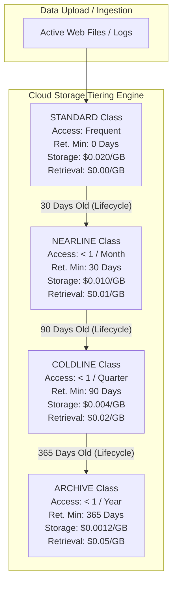

# Topic 49: Storage Classes

---

## 1. What Is It?

Google Cloud Storage offers four distinct **Storage Classes** designed to optimize data storage costs based on access frequency, retention duration, and retrieval performance:

1. **Standard Storage**: Designed for frequently accessed "hot" data (images, web assets, active database backups). Zero retrieval fee; highest monthly storage cost.
2. **Nearline Storage**: Designed for infrequently accessed data (read less than once every 30 days, e.g., monthly reports). Minimum 30-day billing retention; lower storage cost + small retrieval fee.
3. **Coldline Storage**: Designed for rarely accessed data (read less than once every 90 days, e.g., quarterly audit logs). Minimum 90-day billing retention; lower storage cost + moderate retrieval fee.
4. **Archive Storage**: Designed for long-term compliance archiving (read less than once per year, e.g., 7-year legal backups). Minimum 365-day billing retention; lowest monthly storage cost + highest retrieval fee.

Crucially, **all storage classes deliver identical sub-millisecond retrieval latency** (time-to-first-byte) and 99.999999999% (11 9's) durability. Unlike other cloud providers where cold archives take hours to restore, Cloud Archive data can be accessed instantly via standard APIs.

### Real-World Analogy
Think of Storage Classes like renting different types of physical storage units:
- **Standard**: Premium desk drawer right next to your computer. High monthly rent, but you can reach in 100 times a day for free.
- **Nearline**: Filing cabinet in the office basement. Cheaper rent, but you pay a small fee every time you walk down to open a drawer.
- **Coldline**: Off-site storage warehouse across town. Very cheap rent, but a moderate retrieval fee when you request a box.
- **Archive**: Underground salt mine vault. Microscopic monthly rent, but accessing a box incurs a heavy retrieval processing fee.

---

## 2. Where Does It Fit?

Storage Classes are configured as a bucket default setting or set on individual objects, driving cost optimization engines across the storage lifecycle.



---

## 3. Core Concepts

| Storage Class | Minimum Retention | Storage Cost / GB / Mo (US) | Retrieval Cost / GB | Typical Use Case |
|---|---|---|---|---|
| **`STANDARD`** | 0 Days | ~$0.020 | **$0.00** | Web content, streaming media, active data lake files. |
| **`NEARLINE`** | 30 Days | ~$0.010 (50% savings) | ~$0.01 | Monthly backups, disaster recovery, 30-day logs. |
| **`COLDLINE`** | 90 Days | ~$0.004 (80% savings) | ~$0.02 | Quarterly financial reports, historical backups. |
| **`ARCHIVE`** | 365 Days | ~$0.0012 (94% savings) | ~$0.05 | 7-year regulatory compliance archives (HIPAA/SEC). |

---

## 4. How It Works

Billing calculations and early deletion penalties operate dynamically:

```text
User uploads 100 GB file to NEARLINE Storage Class (Min Retention: 30 Days)
              ↓
File accessed 5 times on Day 10 -> Incurs Retrieval Fee: 100 GB * $0.01 * 5 = $5.00
              ↓
User DELETES the file on Day 15 (15 days before minimum retention period ends)
              ↓
GCP charges Early Deletion Fee: Billed for remaining 15 days of storage capacity!
```

1. **Sub-Millisecond Millisecond Access**: All storage classes (including Archive) return data in milliseconds via standard `gcloud storage cp` or HTTP GET calls.
2. **Early Deletion Penalty**: Deleting or overwriting an object before its class minimum retention period (30/90/365 days) incurs a prorated early deletion charge.

---

## 5. Production Scenario

### Lifecycle-Driven Enterprise Log Archiving Pipeline

```text
Requirement: Store 500 TB of application logs. Logs are queried heavily during the first week, occasionally queried during month 1, and retained for 7 years for compliance.
    ↓
Architecture: Object Lifecycle Management policy automatically transitioning storage classes.
    ↓
Lifecycle Execution:
  - Day 0 to Day 30: **`STANDARD` Class** (Zero retrieval cost during heavy debugging).
  - Day 31 to Day 90: Transition to **`NEARLINE` Class** (Saves 50% storage cost).
  - Day 91 to Day 365: Transition to **`COLDLINE` Class** (Saves 80% storage cost).
  - Day 366 to Day 2,555: Transition to **`ARCHIVE` Class** (Saves 94% storage cost).
    ↓
Financial Impact: Total 7-year storage cost reduced from $840,000 (if kept in Standard) down to ~$65,000.
    ↓
Monitoring: Cloud Storage Billing Reports tracking data retrieval vs storage capacity charges.
```

*Why Selected*: Combining all four storage classes using automated lifecycle rules optimizes performance during active debugging while maximizing long-term compliance storage savings.

---

## 6. Hands-On Lab

### Prerequisites
- Active GCP Project with a Cloud Storage bucket created.
- Cloud Shell or `gcloud` CLI.
- IAM permissions: `roles/storage.admin`.

### Console Method
1. Log into [Google Cloud Console](https://console.cloud.google.com/).
2. Navigate to **Cloud Storage** → **Buckets** → Select your bucket.
3. Upload a sample file `test_archive.txt` (Default class: `STANDARD`).
4. Select the checkbox next to `test_archive.txt` → Click **EDIT STORAGE CLASS**.
5. Select **Archive** → Click **CHANGE STORAGE CLASS**.
6. View the object details page to confirm the updated storage class (`ARCHIVE`).

### CLI Method
Create objects directly in specific storage classes and rewrite class properties using `gcloud`:

```bash
# Set variables
PROJECT_ID="your-gcp-project-id"
BUCKET_NAME="demo-datalake-${PROJECT_ID}"

# 1. Create a local sample file
echo "Quarterly Financial Audit Report 2026" > audit_q3.pdf

# 2. Upload file directly with the ARCHIVE storage class
gcloud storage cp audit_q3.pdf gs://$BUCKET_NAME/compliance/audit_q3.pdf \
    --default-storage-class=ARCHIVE

# 3. Inspect object storage class and retention settings
gcloud storage objects describe gs://$BUCKET_NAME/compliance/audit_q3.pdf

# 4. Change (rewrite) an existing object's storage class from ARCHIVE to COLDLINE
gcloud storage objects update gs://$BUCKET_NAME/compliance/audit_q3.pdf \
    --storage-class=COLDLINE
```

### Verification
*Expected Result*: Output from `gcloud storage objects describe` confirms `storageClass: COLDLINE`.

### Cleanup
Delete object:

```bash
gcloud storage rm gs://$BUCKET_NAME/compliance/audit_q3.pdf --quiet
rm audit_q3.pdf
```

---

## 7. Security

### Integrity & Retrieval Security
- **Sub-Second Emergency Access**: Because Archive Storage is accessible in milliseconds, emergency security incident response teams can query archived logs immediately without waiting hours for tape restoration.
- **WORM Retention Compatibility**: Storage Classes work seamlessly with Bucket Retention Policies, ensuring archived compliance data cannot be tampered with.

```text
BAD PRACTICE:
Writing short-lived temporary files (files deleted every 5 days) directly to Archive or Coldline Storage Classes.
Risk: Paying high Early Deletion Penalty charges (billed for full 365 or 90 days) on files deleted after 5 days.

PRODUCTION PRACTICE:
Write short-lived or volatile files strictly to `STANDARD` Storage Class. Use `NEARLINE` or `COLDLINE` only when data is retained longer than minimum thresholds.
```

---

## 8. Scaling & High Availability

Performance Consistency across Classes:

```text
STANDARD Class (Sub-millisecond Time-to-First-Byte - High Read Frequency)
   ↓ (Identical Performance SLA)
ARCHIVE Class (Sub-millisecond Time-to-First-Byte - Low Read Frequency)
```

- **Zero Performance Degradation**: Cloud Storage does NOT use tape drives for Archive Storage. The API response time, throughput, and Anycast routing performance are 100% identical across all four storage classes.

---

## 9. Cost

### Trade-Off Matrix: Storage vs. Retrieval

| Pattern | High Storage Cost / Zero Retrieval | Low Storage Cost / High Retrieval | Optimal Class |
|---|---|---|---|
| Active Web Images (Read 1,000x / day) | Yes ($0.020/GB) | No ($0.00 Retrieval) | **`STANDARD`** |
| Monthly Backup (Read 1x / month) | Medium ($0.010/GB) | Low ($0.01 Retrieval) | **`NEARLINE`** |
| 7-Year Compliance Archive (Read 0x / year) | Lowest ($0.0012/GB) | High ($0.05 Retrieval) | **`ARCHIVE`** |

---

## 10. Monitoring & Troubleshooting

### Storage Class Observability Tools
- **GCS Storage Insights**: Generate automated inventory reports analyzing storage class breakdown across petabyte buckets.
- **Cloud Billing Reports**: Group billing costs by SKU to compare storage capacity fees vs. data retrieval fees.

### Troubleshooting Matrix

| Symptom | Possible Cause | What to Check | Fix |
|---|---|---|---|
| Unexpected high storage bill after deleting files | **Early Deletion Penalty** billed for remaining days of Nearline/Coldline/Archive retention | Billing SKU details for early deletion | Retain data in Standard class if lifecycle is shorter than minimum retention. |
| High retrieval cost on Archive bucket | Frequent analytical queries run against Coldline/Archive data | Cloud Logging Data Access read logs | Move frequently queried data back to `STANDARD` storage class. |
| Object storage class failed to change automatically | Lifecycle policy syntax error or condition age threshold not reached | Bucket lifecycle JSON configuration | Verify `age` condition and `SetStorageClass` action in lifecycle rules. |

---

## 11. Common Mistakes

```text
Mistake: Writing daily scratch files or temporary ETL data directly into Coldline or Archive storage classes.
Why: Attempting to save money on storage fees for all data indiscriminately.
Impact: Incurring massive Early Deletion Fees when temporary files are deleted 24 hours later.
Correct approach: Keep volatile, short-lived temporary data in the `STANDARD` storage class.

Mistake: Believing GCP Archive Storage takes hours or days to retrieve data (confusing GCP Archive with AWS Glacier tape delays).
Why: Carrying over legacy multi-hour tape restoration concepts from competitor clouds.
Impact: Over-architecting complex pre-retrieval jobs when standard APIs fetch Archive data in milliseconds.
Correct approach: Access Archive objects instantly via standard HTTP GET or `gcloud storage cp` commands.
```

---

## 12. Production Best Practices

- [ ] Use **`STANDARD`** storage class for active web assets, streaming media, and volatile data.
- [ ] Use **Object Lifecycle Management** to transition data automatically between storage classes over time.
- [ ] Ensure data lives in **`NEARLINE`** for at least 30 days, **`COLDLINE`** for 90 days, and **`ARCHIVE`** for 365 days to avoid Early Deletion penalties.
- [ ] Use **`ARCHIVE`** class for long-term compliance records retained >1 year.
- [ ] Monitor retrieval charges in Cloud Billing to detect if cold data is being queried too frequently.
- [ ] Automate default bucket storage classes and lifecycle rules using Infrastructure as Code (Terraform).

---

## 13. Hyperscaler / Enterprise Perspective

```text
Personal / Learning
  All data in Standard Class → No lifecycle rules → Manual class overrides
        ↓
Small Production
  Manual Nearline transition → Basic bucket default class configuration
        ↓
Enterprise Environment
  Automated Lifecycle Policies (Standard -> Nearline -> Coldline -> Archive) → CMEK Encryption
        ↓
Hyperscaler Environment
  Petabyte Storage Insights Analytics → Automated FinOps Class Optimization → Real-time Early Deletion Prevention Sinks
```

In a hyperscaler environment, enterprise FinOps teams monitor petabytes of object storage. Automated **Storage Insights** jobs analyze access logs across thousands of buckets. If data in an Archive bucket is accessed frequently, automated bots generate tickets recommending a transition back to Standard class to minimize retrieval fees, while idle data in Standard buckets is automatically scheduled for Archive lifecycle migration.

---

## 14. Real Project Questions

### Q1: What is the primary performance advantage of GCP Archive Storage over competitor cloud cold archive tiers (like AWS Glacier)?
**Answer:** GCP Archive Storage delivers **sub-millisecond retrieval latency** (time-to-first-byte), identical to Standard Storage. Unlike competitor cold archive services that require multi-hour or multi-day tape restoration jobs, GCP Archive data can be accessed instantly via standard HTTP GET APIs without pre-retrieval wait times.

### Q2: What is an Early Deletion Penalty in Cloud Storage, and how do you avoid it?
**Answer:** Nearline, Coldline, and Archive storage classes require minimum billing retention periods (30, 90, and 365 days, respectively). If an object is deleted or overwritten before its minimum retention period expires, GCP charges an **Early Deletion Fee** for the remaining unfulfilled days. It is avoided by keeping short-lived data in the `STANDARD` storage class.

### Q3: How do operational costs differ between `STANDARD` and `ARCHIVE` storage classes?
**Answer:** `STANDARD` storage has the highest monthly capacity cost (~$0.020/GB/month) but **zero data retrieval fees** ($0.00/GB). `ARCHIVE` storage has the lowest monthly capacity cost (~$0.0012/GB/month - 94% savings) but incurs a **data retrieval fee** (~$0.05/GB) whenever data is read.

---

## 15. Quick Decision Guide

| Requirement | Recommended Approach | Reason |
|---|---|---|
| E-commerce product images served to 1,000,000 web users daily | **`STANDARD` Storage Class** | Zero data retrieval fees; optimal for high-frequency access. |
| Monthly system database backups accessed only during disaster recovery | **`NEARLINE` Storage Class** | 50% storage cost savings; matches 30-day access pattern. |
| 7-year HIPAA medical records retained for legal compliance | **`ARCHIVE` Storage Class** | 94% storage cost savings for long-term retention; instant sub-second retrieval when audited. |

### When should I use it?
- Essential feature for optimizing Cloud Storage billing costs based on data access patterns.

### When should I NOT use it?
- Do not use Coldline or Archive classes for short-lived temporary files deleted in less than 30 days.

---

## 16. Related Services

```text
               [49. Storage Classes]
              /          |          \
      Lifecycle      Cloud Billing   Storage Insights
      Management       SKU Tags       (Analytics)
          |              |                |
      Automated        Cost          Access Pattern
      Tiering        Tracking          Auditing
```

- **Object Lifecycle Management**: Automates transitions between storage classes.
- **Cloud Billing**: Tracks capacity fees vs retrieval costs per class.
- **Storage Insights**: Analyzes object age and access frequency across buckets.

---

## 17. Cheat Sheet

### Storage Class Comparison
- **`STANDARD`** : Hot data, $0 retrieval, 0-day min retention.
- **`NEARLINE`** : Read <1x/month, 30-day min retention.
- **`COLDLINE`** : Read <1x/quarter, 90-day min retention.
- **`ARCHIVE`** : Read <1x/year, 365-day min retention.

### Useful Commands
```bash
# Upload file with explicit Archive storage class
gcloud storage cp FILE.pdf gs://BUCKET_NAME/PATH/FILE.pdf --default-storage-class=ARCHIVE

# Update an existing object's storage class to Coldline
gcloud storage objects update gs://BUCKET_NAME/PATH/FILE.pdf --storage-class=COLDLINE

# Set default storage class for an entire bucket
gcloud storage buckets update gs://BUCKET_NAME --default-storage-class=NEARLINE
```

---

## 18. Learning Connection

- **Previous Topic**: [48. Objects](../48-objects/README.md)
- **Next Topic**: [50. Lifecycle Policies](../50-lifecycle-policies/README.md)
