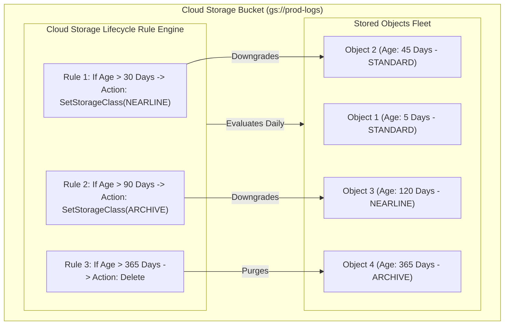

# Topic 50: Lifecycle Policies

---

## 1. What Is It?

**Object Lifecycle Management** in Google Cloud Storage is an automated rule engine configured on a bucket that automatically manages the lifecycle of stored objects based on user-defined conditions.

Lifecycle Policies consist of **Rules**. Each rule contains an **Action** (what to do) and a set of **Conditions** (when to do it).

Supported Lifecycle Actions include:
1. **SetStorageClass**: Automatically downgrades objects to cheaper storage classes (`NEARLINE`, `COLDLINE`, `ARCHIVE`) as data ages.
2. **Delete**: Automatically purges objects or old object versions when they reach a specified age or expiration threshold.
3. **AbortIncompleteMultipartUpload**: Automatically cancels abandoned, incomplete multipart uploads to prevent hidden storage billing leaks.

### Real-World Analogy
Think of a Lifecycle Policy like an automated office archiving system. You place new files in an active desktop tray. A nightly robot (Lifecycle Engine) inspects every file. If a file is 30 days old, the robot moves it to the basement filing cabinet (Nearline). If a file is 90 days old, the robot moves it to the offsite warehouse (Archive). If a file is 7 years old, the robot feeds it into a shredder (Delete)—all without a human manager needing to remember to move or shred a single document manually.

---

## 2. Where Does It Fit?

Lifecycle Policies attach directly to Cloud Storage Buckets, executing daily asynchronous evaluation rules across all stored objects.



---

## 3. Core Concepts

| Rule Component | Parameter | Available Options | Description |
|---|---|---|---|
| **Action** | `type` | `SetStorageClass`, `Delete`, `AbortIncompleteMultipartUpload` | Execution operation performed when conditions are met. |
| **Condition: Age** | `age` | Integer (Days relative to object creation time) | Triggers action when object reaches N days old. |
| **Condition: Created Before** | `createdBefore` | Date string (`YYYY-MM-DD`) | Triggers action on objects created before a specific date. |
| **Condition: Matches Storage Class**| `matchesStorageClass` | Array (`["STANDARD", "NEARLINE"]`) | Filters evaluation strictly to objects in specified classes. |
| **Condition: Number of New Versions**| `numNewerVersions` | Integer (e.g., `3`) | Triggers action on older object versions when N newer versions exist (Requires Versioning). |
| **Condition: Is Live** | `isLive` | Boolean (`true` / `false`) | Evaluates current active live object vs archived historical version. |

---

## 4. How It Works

Lifecycle evaluation runs asynchronously once per day per bucket:

```text
Lifecycle Engine runs daily scan across gs://prod-logs bucket
              ↓
Inspects Object A (Age: 35 days, Storage Class: STANDARD)
              ↓
Matches Rule: Age > 30 AND Class = STANDARD -> Action: SetStorageClass(NEARLINE)
              ↓
GCS automatically transitions Object A to NEARLINE class (No data copy required)
              ↓
Inspects Object B (Age: 366 days, Storage Class: ARCHIVE)
              ↓
Matches Rule: Age > 365 -> Action: Delete
              ↓
GCS permanently purges Object B -> Storage capacity reclaimed
```

1. **24-Hour Evaluation Window**: Lifecycle changes take up to 24 hours to apply after an object meets a condition.
2. **Conflict Resolution**: If multiple rules match an object simultaneously, GCP executes `Delete` before `SetStorageClass`, and transitions to the coldest storage class first.

---

## 5. Production Scenario

### Cost-Optimized Log Archiving & Garbage Collection Policy

```text
Requirement: Manage 1,000,000 daily log files in `gs://enterprise-app-logs`. Logs must stay in Standard for 7 days, transition to Nearline for 30 days, Archive for 365 days, and be permanently deleted after 3 years. Incomplete uploads must be cleaned after 7 days.
    ↓
Architecture: JSON Lifecycle Policy attached to Cloud Storage Bucket.
    ↓
Policy Definition (`lifecycle.json`):
  ```json
  {
    "rule": [
      { "action": { "type": "AbortIncompleteMultipartUpload" }, "condition": { "age": 7 } },
      { "action": { "type": "SetStorageClass", "storageClass": "NEARLINE" }, "condition": { "age": 7, "matchesStorageClass": ["STANDARD"] } },
      { "action": { "type": "SetStorageClass", "storageClass": "ARCHIVE" }, "condition": { "age": 30, "matchesStorageClass": ["NEARLINE"] } },
      { "action": { "type": "Delete" }, "condition": { "age": 1095 } }
    ]
  }
  ```
    ↓
Financial Impact: Cuts bucket storage billing by 85%+ while preventing abandoned upload billing leaks.
    ↓
Monitoring: Cloud Audit Logs recording daily lifecycle execution events.
```

*Why Selected*: Combines automated class tiering, abandoned upload cleanup, and automatic expiration into a single declarative policy, eliminating manual cleanup scripts.

---

## 6. Hands-On Lab

### Prerequisites
- Active GCP Project with a Cloud Storage bucket created (from Topic 47).
- Cloud Shell or `gcloud` CLI.
- IAM permissions: `roles/storage.admin`.

### Console Method
1. Log into [Google Cloud Console](https://console.cloud.google.com/).
2. Navigate to **Cloud Storage** → **Buckets** → Select your bucket.
3. Click **LIFECYCLE** tab at top.
4. Click **ADD A RULE**.
5. Select Action: **Change storage class to Nearline** → Click **CONTINUE**.
6. Select Condition: **Age** → Enter `30` days.
7. Click **CREATE**.
8. Click **ADD A RULE** again:
   - Select Action: **Delete object**.
   - Select Condition: **Age** → Enter `365` days.
   - Click **CREATE**.

### CLI Method
Create and apply a JSON Lifecycle Policy using `gcloud`:

```bash
# Set variables
PROJECT_ID="your-gcp-project-id"
BUCKET_NAME="demo-datalake-${PROJECT_ID}"

# 1. Create a JSON lifecycle policy configuration file
cat <<EOF > lifecycle.json
{
  "rule": [
    {
      "action": {"type": "AbortIncompleteMultipartUpload"},
      "condition": {"age": 7}
    },
    {
      "action": {"type": "SetStorageClass", "storageClass": "NEARLINE"},
      "condition": {"age": 30, "matchesStorageClass": ["STANDARD"]}
    },
    {
      "action": {"type": "Delete"},
      "condition": {"age": 365}
    }
  ]
}
EOF

# 2. Set the lifecycle policy on the bucket
gcloud storage buckets update gs://$BUCKET_NAME --lifecycle-file=lifecycle.json

# 3. View the active lifecycle rules on the bucket
gcloud storage buckets describe gs://$BUCKET_NAME --format="json(lifecycle)"
```

### Verification
*Expected Result*: Output displays 3 active rules in the `lifecycle.rule` JSON array matching your configuration file.

### Cleanup
Clear lifecycle rules from bucket and remove local JSON file:

```bash
gcloud storage buckets update gs://$BUCKET_NAME --clear-lifecycle
rm lifecycle.json
```

---

## 7. Security

### Protection Against Unintended Deletion
- **Bucket Lock Overrides**: If a bucket has a **Locked Retention Policy (WORM)**, a Lifecycle `Delete` rule CANNOT delete an object until its retention period has expired.
- **Test Rules First**: Test new lifecycle deletion rules on a non-production bucket before deploying to enterprise data lakes to prevent accidental mass deletion.
- **Clean Incomplete Uploads**: Always include `AbortIncompleteMultipartUpload` (age: 7 days) to prevent hidden unlinked data chunks from accumulating unnoticed.

```text
BAD PRACTICE:
Setting a Lifecycle `Delete` rule with `age: 1` on a bucket without filtering `matchesStorageClass` or testing path prefixes.
Risk: New files uploaded to the bucket are permanently deleted 24 hours later.

PRODUCTION PRACTICE:
Combine `age` conditions with `matchesStorageClass` or prefix filters. Test rules extensively on dev buckets before deploying to production.
```

---

## 8. Scaling & High Availability

Lifecycle Engine Asynchronous Processing:

```text
10,000,000 Objects reach Age 30 in Bucket
   ↓ (Daily Asynchronous Processing Loop)
GCP Lifecycle Engine processes updates in background batches across global storage nodes
   ↓ (Zero Application Performance Impact)
Objects transitioned to NEARLINE class with zero API downtime or latency impact
```

- **Background Execution**: Lifecycle rule evaluation runs in the background on Google infrastructure, consuming zero compute CPU or network bandwidth from your application workloads.

---

## 9. Cost

### Operational Cost Optimization Rules
- **Abort Incomplete Uploads**: Multi-part uploads that fail halfway through leave unlinked data chunks in the bucket. An `AbortIncompleteMultipartUpload` rule purges these orphan chunks, saving storage costs.
- **Match Minimum Class Retention**: Ensure `SetStorageClass` rules do not transition objects to Nearline/Coldline faster than their minimum retention periods (30/90 days) if objects are frequently overwritten, avoiding Early Deletion charges.

---

## 10. Monitoring & Troubleshooting

### Lifecycle Observability Tools
- **Cloud Audit Logs**: Filter by `protoPayload.authenticationInfo.principalEmail="storage-system@system.gserviceaccount.com"` to track automated system lifecycle events.
- **Storage Insights**: Audit object age distributions to verify if lifecycle rules are executing as expected.

### Troubleshooting Matrix

| Symptom | Possible Cause | What to Check | Fix |
|---|---|---|---|
| Objects reached 30 days but storage class hasn't changed | Evaluation runs asynchronously once every 24 hours | Object creation timestamp & age | Wait up to 24 hours for next daily lifecycle processing loop. |
| Objects not deleted despite matching `Delete` rule | Active **Bucket Retention Policy (WORM)** preventing deletion | Bucket retention policy settings | Objects protected by locked retention policies cannot be deleted until retention expires. |
| Incomplete multipart uploads causing high bill | Failed SDK uploads leaving unlinked byte chunks | Bucket lifecycle configuration | Add rule: Action `AbortIncompleteMultipartUpload` with Condition `age: 7`. |

---

## 11. Common Mistakes

```text
Mistake: Expecting Lifecycle Policy rules to execute instantly down to the exact second when an object reaches N days old.
Why: Misunderstanding that lifecycle evaluation is an asynchronous daily background batch process.
Impact: Assuming lifecycle rules failed because objects were not deleted at 30 days and 1 minute.
Correct approach: Allow up to 24 hours after an object satisfies a condition for the lifecycle engine to process it.

Mistake: Omitting the `AbortIncompleteMultipartUpload` rule from production buckets.
Why: Assuming failed file uploads clean up after themselves automatically.
Impact: Orphaned partial upload chunks accumulate over years, silently inflating monthly storage bills.
Correct approach: Include `AbortIncompleteMultipartUpload` with `age: 7` on 100% of production buckets.
```

---

## 12. Production Best Practices

- [ ] Add **`AbortIncompleteMultipartUpload`** (age: 7 days) to 100% of production buckets.
- [ ] Align `SetStorageClass` age conditions with storage class minimum retention periods (30/90/365 days).
- [ ] Use `matchesStorageClass` filters in rules to prevent unnecessary class rewrite operations.
- [ ] Use `numNewerVersions` conditions on versioned buckets to purge old historical revisions automatically.
- [ ] Test complex lifecycle JSON policies on non-production buckets before applying to production.
- [ ] Automate all bucket lifecycle policy definitions using Infrastructure as Code (Terraform).

---

## 13. Hyperscaler / Enterprise Perspective

```text
Personal / Learning
  No Lifecycle Rules → Manual file deletion → High storage costs
        ↓
Small Production
  Basic Delete rule (Age > 365) → Applied manually via Console
        ↓
Enterprise Environment
  Multi-Tiered Lifecycle Policies (Standard -> Nearline -> Coldline -> Archive -> Delete) → Terraform Management
        ↓
Hyperscaler Environment
  Automated Lifecycle Governance Modules → Storage Insights Integration → Automated Early Deletion Cost Guardrails
```

In a hyperscaler environment, enterprise landing zone templates mandate lifecycle rules on all newly provisioned buckets. Automated Terraform modules attach default rules that purge incomplete multipart uploads after 7 days, transition active logs to Nearline after 30 days, and archive compliance files after 90 days, ensuring consistent cost optimization across thousands of enterprise projects.

---

## 14. Real Project Questions

### Q1: How often does Google Cloud Storage evaluate Object Lifecycle Management rules?
**Answer:** Cloud Storage evaluates Lifecycle Policy rules **asynchronously once per day** for each bucket. When an object satisfies a rule's condition (e.g., reaching 30 days of age), the action (such as changing storage class or deleting the object) is executed during the next daily background processing cycle, taking up to 24 hours to reflect across all storage nodes.

### Q2: Why is the `AbortIncompleteMultipartUpload` lifecycle action considered a mandatory best practice?
**Answer:** When large files are uploaded via multipart or resumable upload APIs and fail mid-transit due to network drops, unlinked data chunks remain stored inside the bucket. Without an `AbortIncompleteMultipartUpload` lifecycle rule (e.g., age 7 days), these hidden incomplete data chunks remain stored indefinitely, silently generating monthly storage charges.

### Q3: What happens if a Lifecycle `Delete` rule attempts to purge an object protected by a Locked Bucket Retention Policy?
**Answer:** The **Locked Bucket Retention Policy (WORM)** takes precedence over the Lifecycle Policy. If a lifecycle rule attempts to delete an object whose retention duration has not yet expired, the Cloud Storage engine rejects the deletion action, keeping the object safely stored until the retention period is satisfied.

---

## 15. Quick Decision Guide

| Requirement | Recommended Approach | Reason |
|---|---|---|
| Automatically cleaning up abandoned multi-part uploads | **Action: `AbortIncompleteMultipartUpload` (Condition: Age 7)** | Purges orphan data chunks left behind by failed network uploads. |
| Automatically moving 30-day-old logs to a cheaper storage class | **Action: `SetStorageClass` (Class: `NEARLINE`, Condition: Age 30)** | Reduces storage costs by 50% while retaining instant sub-second access. |
| Purging old non-current file versions while keeping the 3 newest versions | **Action: `Delete` (Condition: `numNewerVersions: 3`, `isLive: false`)** | Cleans up historical version clutter while keeping recent safety backups. |

### When should I use it?
- Essential feature for automating data retention, storage class tiering, and cloud cost management in GCS.

### When should I NOT use it?
- Do not use short age conditions (<30 days) for transitioning to Nearline/Coldline if data is constantly overwritten (prevents Early Deletion fees).

---

## 16. Related Services

```text
            [50. Lifecycle Policies]
           /           |            \
    Storage Classes   Object      Retention
      (Tiering)     Versioning    Policies
          |             |            |
      Standard ->    Historical    WORM
      Nearline       Versions     Protection
```

- **Storage Classes**: Target tiers (`NEARLINE`, `COLDLINE`, `ARCHIVE`) set by lifecycle actions.
- **Object Versioning**: Interacts with `numNewerVersions` lifecycle conditions.
- **Retention Policies**: WORM compliance rules overriding lifecycle delete actions.

---

## 17. Cheat Sheet

### Core Actions
- `SetStorageClass` : Transition to `NEARLINE`, `COLDLINE`, or `ARCHIVE`.
- `Delete` : Permanently purge object or historical version.
- `AbortIncompleteMultipartUpload` : Clean up failed multi-part upload chunks.

### Useful Commands
```bash
# Set lifecycle policy from a JSON file
gcloud storage buckets update gs://BUCKET_NAME --lifecycle-file=policy.json

# View active lifecycle rules on a bucket
gcloud storage buckets describe gs://BUCKET_NAME --format="json(lifecycle)"

# Clear all lifecycle rules from a bucket
gcloud storage buckets update gs://BUCKET_NAME --clear-lifecycle
```

---

## 18. Learning Connection

- **Previous Topic**: [49. Storage Classes](../49-storage-classes/README.md)
- **Next Topic**: [51. Versioning](../51-versioning/README.md)
