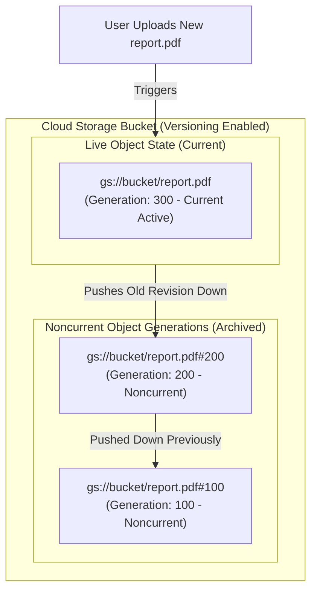

# Topic 51: Versioning

---

## 1. What Is It?

**Object Versioning** in Google Cloud Storage is a bucket-level resilience feature that protects data against accidental deletion or overwriting by retaining historical revisions of objects when they are updated or deleted.

When Object Versioning is enabled on a bucket:
- **Live Version**: The most recent revision of an object, accessible via standard object key requests (e.g., `gs://bucket/file.txt`).
- **Noncurrent Versions**: Older historical revisions of an object, uniquely identified by a 64-bit **Generation Number** (e.g., `gs://bucket/file.txt#1786190000000000`).
- **Deletion Behavior**: Deleting a live object does NOT permanently erase its data; instead, it turns the live version into a noncurrent historical version.

### Real-World Analogy
Think of Object Versioning like the "Track Changes" or "Version History" feature in a collaborative document editor. When you edit and save a document, your changes overwrite the main screen (Live Version). However, if you realize you accidentally deleted an important paragraph from yesterday, you can open the Document History tab (Noncurrent Generations), inspect the version from Tuesday, and restore it to the main screen.

---

## 2. Where Does It Fit?

Object Versioning operates at the bucket level, maintaining a historical timeline of generation-tagged objects in storage.



---

## 3. Core Concepts

| Concept | Description | Example / Syntax | Best Practice |
|---|---|---|---|
| **Live Version** | Current active version returned when requesting object by name. | `gs://bucket/file.txt` | Read/written by standard application code. |
| **Noncurrent Version** | Archived historical version requiring explicit Generation Number to access. | `gs://bucket/file.txt#1786190000000000` | Inspect or restore when recovering from accidental overwrites. |
| **Generation Number** | Unique 64-bit integer assigned to an object payload upon creation. | `1786190000000000` | Use in `gcloud storage cp` to target specific historical versions. |
| **Soft Delete** | Default platform safety net (retains deleted items for 7 days by default). | Soft Delete (Default 7 Days) | Distinct from Versioning; provides baseline disaster recovery. |
| **Permanent Deletion** | Deleting a noncurrent version *with its Generation Number specified*. | `gcloud storage rm gs://bucket/file.txt#GEN` | Permanently purges data from Cloud Storage. |

---

## 4. How It Works

Updating and deleting objects when Versioning is active follows strict state transition rules:

```text
User uploads file.txt -> Live Version (Gen 100) created
              ↓
User uploads updated file.txt -> Live Version updated to Gen 200; Gen 100 becomes Noncurrent
              ↓
User executes `gcloud storage rm gs://bucket/file.txt` (No Generation specified)
              ↓
Live Version (Gen 200) becomes Noncurrent! Bucket now has ZERO Live Version.
              ↓
User requests file.txt -> Returns HTTP 404 Not Found (Though Gen 100 and Gen 200 remain safely stored!)
              ↓
Admin copies Gen 200 back to Live -> `gcloud storage cp gs://bucket/file.txt#200 gs://bucket/file.txt`
              ↓
File fully restored to Live State!
```

1. **Storage Billing for All Versions**: Every noncurrent version incurs standard storage capacity charges for its size and storage class until purged.
2. **Lifecycle Integration**: Use Object Lifecycle Management rules (`numNewerVersions`, `isLive: false`) to auto-delete noncurrent versions after N days to prevent storage bloat.

---

## 5. Production Scenario

### Accidental Overwrite Recovery & Automated Cleanup Pipeline

```text
Requirement: Protect source code release archives (`gs://prod-releases`) against malicious or accidental developer deletion while capping noncurrent version storage costs.
    ↓
Architecture: Object Versioning + Lifecycle Rule for Noncurrent Versions.
    ↓
Configuration:
  - Enable Versioning: `gcloud storage buckets update gs://prod-releases --versioning`.
  - Lifecycle Policy:
    ```json
    {
      "action": { "type": "Delete" },
      "condition": {
        "isLive": false,
        "numNewerVersions": 3,
        "daysSinceNoncurrentTime": 14
      }
    }
    ```
    ↓
Disaster Recovery Incident:
  - Junior developer accidentally executes `gcloud storage rm --recursive gs://prod-releases/v1.0/`.
  - Recovery: DevOps script queries noncurrent generations and restores live versions within 5 minutes.
    ↓
Cost Control: Lifecycle policy automatically deletes noncurrent versions older than 14 days if more than 3 newer versions exist.
```

*Why Selected*: Combines instant data recovery for operational accidents with automated lifecycle rules to prevent noncurrent versions from generating runaway storage bills.

---

## 6. Hands-On Lab

### Prerequisites
- Active GCP Project with a Cloud Storage bucket created (from Topic 47).
- Cloud Shell or `gcloud` CLI.
- IAM permissions: `roles/storage.objectAdmin`.

### Console Method
1. Log into [Google Cloud Console](https://console.cloud.google.com/).
2. Navigate to **Cloud Storage** → **Buckets** → Select your bucket.
3. Click **PROTECTION** tab at top.
4. Under **Object versioning**, click **ENABLE**.
5. Upload a text file `notes.txt` containing text `"Version 1"`.
6. Edit local file to `"Version 2"` and upload again to the same bucket.
7. Click **OBJECTS** tab → Toggle **SHOW DELETED/NONCURRENT DATA** switch to **On**.
8. Observe both the Live version and the Noncurrent historical generation listed.

### CLI Method
Enable versioning, update objects, list generations, and restore a noncurrent version using `gcloud`:

```bash
# Set variables
PROJECT_ID="your-gcp-project-id"
BUCKET_NAME="demo-datalake-${PROJECT_ID}"

# 1. Enable Object Versioning on the bucket
gcloud storage buckets update gs://$BUCKET_NAME --versioning

# 2. Upload initial version of a file
echo "Database Config Version 1" > config.env
gcloud storage cp config.env gs://$BUCKET_NAME/config.env

# 3. Overwrite the file with Version 2
echo "Database Config Version 2" > config.env
gcloud storage cp config.env gs://$BUCKET_NAME/config.env

# 4. List all versions (generations) of the object
gcloud storage ls --long --all-versions gs://$BUCKET_NAME/config.env

# 5. Fetch Generation ID of Version 1 and restore it to Live Status
GEN_1=$(gcloud storage ls --all-versions gs://$BUCKET_NAME/config.env | head -n 1 | awk '{print $1}')
gcloud storage cp $GEN_1 gs://$BUCKET_NAME/config.env
```

### Verification
*Expected Result*: Downloading `gs://$BUCKET_NAME/config.env` returns `"Database Config Version 1"`, confirming successful restoration from historical generation.

### Cleanup
Delete all versions and disable versioning:

```bash
gcloud storage rm --all-versions gs://$BUCKET_NAME/config.env --quiet
gcloud storage buckets update gs://$BUCKET_NAME --no-versioning
rm config.env
```

---

## 7. Security

### Ransomware Resilience & Deletion Safety
- **Ransomware Defense**: If malware overwrites objects with encrypted payloads, Object Versioning preserves the unencrypted historical generations, allowing full system recovery.
- **Permanent Deletion Controls**: Restrict `roles/storage.objectAdmin` permissions. Permanently purging a noncurrent generation requires explicit permission to delete specific generation numbers.
- **Soft Delete vs Versioning**: Soft Delete (enabled by default on GCP buckets) retains deleted objects for 7 days even if Object Versioning is turned off.

```text
BAD PRACTICE:
Enabling Object Versioning on high-churn buckets (e.g., streaming log buckets updated 1,000x/hour) without a Lifecycle Policy to prune noncurrent versions.
Risk: Retaining 100,000 noncurrent object versions rapidly inflates storage costs by 1,000%.

PRODUCTION PRACTICE:
Enable Object Versioning on critical data buckets. Always attach a Lifecycle Policy with `numNewerVersions` or `daysSinceNoncurrentTime` to auto-delete old noncurrent versions.
```

---

## 8. Scaling & High Availability

Version Management & Lifecycle Integration:

```text
Live Object Overwritten -> Generates Noncurrent Generation Tag
   ↓ (Accumulation of Historical Generations)
Lifecycle Rule: `isLive: false` AND `numNewerVersions: 2`
   ↓ (Automated Archiving / Cleanup)
Noncurrent versions beyond 2 newest versions automatically deleted (Zero app overhead)
```

- **Unlimited Generations**: GCS supports an unlimited number of noncurrent generations per object name.

---

## 9. Cost

### Versioning Storage Billing Rules
- **Full Storage Charges for All Generations**: Every noncurrent object generation consumes physical storage space and is billed at the standard rate for its assigned storage class.
- **Noncurrent Version Lifecycle Tiering**: Use Lifecycle Policies to transition noncurrent object versions to `NEARLINE` or `COLDLINE` storage classes to reduce historical retention costs.

---

## 10. Monitoring & Troubleshooting

### Versioning Observability Tools
- **GCS Storage Insights**: Audit total noncurrent object count and capacity consumed by noncurrent versions across buckets.
- **Cloud Audit Logs**: Filter by `protoPayload.request.generation` to audit specific historical version requests.

### Troubleshooting Matrix

| Symptom | Possible Cause | What to Check | Fix |
|---|---|---|---|
| Object appears missing after `gcloud storage rm` | Object was deleted, moving live version to noncurrent | `gcloud storage ls --all-versions` | Query noncurrent versions and copy the target generation back to live status. |
| High bucket storage bill after enabling versioning | Accumulation of thousands of un-pruned noncurrent generations | GCS Storage Insights report | Add Lifecycle Policy rule with `numNewerVersions` and `daysSinceNoncurrentTime` conditions. |
| Cannot restore noncurrent version | Generation ID string truncated or missing `#` delimiter | Command syntax | Use full URI format: `gs://bucket/object.txt#GENERATION_NUMBER`. |

---

## 11. Common Mistakes

```text
Mistake: Running `gcloud storage rm gs://bucket/file.txt` assuming it permanently erases the data when Versioning is enabled.
Why: Misunderstanding that standard delete commands only remove the *live* version tag.
Impact: Sensitive or confidential files remain safely stored in noncurrent generations, continuing to generate storage bills.
Correct approach: Pass the specific generation number (`gs://bucket/file.txt#178619...`) to permanently purge an object.

Mistake: Enabling Versioning without attaching a Lifecycle Policy to clean up noncurrent versions.
Why: Focusing on data protection while forgetting long-term cost controls.
Impact: Storage capacity charges scale endlessly as application updates generate thousands of historical versions.
Correct approach: Pair Object Versioning with Lifecycle Policies (`numNewerVersions: 3`) on 100% of buckets.
```

---

## 12. Production Best Practices

- [ ] Enable **Object Versioning** on critical production data lakes and application configuration buckets.
- [ ] Pair Versioning with **Object Lifecycle Management** rules to purge noncurrent versions older than 14–30 days.
- [ ] Use `numNewerVersions` in lifecycle rules to retain a fixed number of historical safety revisions (e.g., keep 3 versions).
- [ ] Transition noncurrent object versions to `NEARLINE` or `COLDLINE` storage classes to save costs.
- [ ] Maintain **Soft Delete** (default 7-day retention) as an additional safety net against accidental bucket operations.
- [ ] Automate versioning activation and lifecycle rules using Infrastructure as Code (Terraform).

---

## 13. Hyperscaler / Enterprise Perspective

```text
Personal / Learning
  Versioning Disabled → Direct file overwrites → Permanent data loss on deletion
        ↓
Small Production
  Versioning Enabled → Manual noncurrent file restoration via Console
        ↓
Enterprise Environment
  Versioning + Lifecycle Rules (`numNewerVersions: 3`) → Soft Delete Retention → CMEK Encryption
        ↓
Hyperscaler Environment
  Automated Version Restoration Scripts → Security Command Center Ransomware Monitoring → Storage Insights Version Auditing
```

In a hyperscaler environment, Object Versioning is a core pillar of **Ransomware and Disaster Recovery** strategy. Security pipelines monitor object overwrites for anomalous volume spikes. If a ransomware script attempts to overwrite production files with encrypted data, automated recovery scripts query noncurrent generation IDs and restore the unencrypted live versions across petabyte buckets in minutes.

---

## 14. Real Project Questions

### Q1: What happens when a user executes a standard delete command (`gcloud storage rm gs://bucket/file.txt`) on a bucket with Object Versioning enabled?
**Answer:** The standard delete command does NOT permanently erase the object's data bytes. Instead, it converts the current **Live Version** into a **Noncurrent Version** (tagged with its 64-bit Generation Number). The bucket now has zero Live Versions for that object name, causing standard requests to return `HTTP 404 Not Found`, but the data remains safely stored and restorable.

### Q2: How do you permanently purge an object from a bucket that has Object Versioning enabled?
**Answer:** To permanently purge an object from a versioned bucket, you must execute a delete command that explicitly specifies the object's 64-bit **Generation Number** (e.g., `gcloud storage rm gs://bucket/file.txt#1786190000000000`). This instructs Cloud Storage to bypass noncurrent archiving and permanently erase the underlying data blocks.

### Q3: Why is it critical to combine Object Versioning with Object Lifecycle Management policies?
**Answer:** Every noncurrent object generation consumes storage space and incurs full storage capacity billing. Without a Lifecycle Policy to automatically prune or delete old noncurrent versions (e.g., using `numNewerVersions` or `daysSinceNoncurrentTime`), frequent application overwrites will cause historical versions to accumulate indefinitely, resulting in massive, uncontrolled storage billing growth.

---

## 15. Quick Decision Guide

| Requirement | Recommended Approach | Reason |
|---|---|---|
| Protecting database backup files against accidental overwrite or ransomware | **Enable Object Versioning + Lifecycle Policy (`numNewerVersions: 3`)** | Retains historical generations for instant recovery while capping storage bloat. |
| Temporary scratch files created and deleted every 5 minutes | **Disable Versioning on Bucket** | Avoids generating unnecessary noncurrent versions for short-lived temporary files. |
| Restoring an object overwritten 2 hours ago | **Copy Noncurrent Generation ID to Live Object** | `gcloud storage cp gs://bucket/file.txt#GEN gs://bucket/file.txt` restores original data. |

### When should I use it?
- Essential feature for operational data protection, ransomware resilience, and accidental overwrite recovery in GCS.

### When should I NOT use it?
- Do not enable versioning on high-volume temporary scratch buckets without automated lifecycle cleanup rules.

---

## 16. Related Services

```text
               [51. Versioning]
              /        |        \
      Lifecycle    Soft Delete  Cloud Audit
       Policies    (Default 7d)    Logs
          |            |            |
      Prune Old     Safety      Generation
      Generations    Net         Tracking
```

- **Lifecycle Policies**: Automatically prunes or transitions old noncurrent versions.
- **Soft Delete**: Built-in 7-day platform protection against bucket/object deletion.
- **Cloud Audit Logs**: Records object generation IDs during upload and delete API calls.

---

## 17. Cheat Sheet

### Core Concepts
- **Live Version**: Current active object (`gs://bucket/file.txt`).
- **Noncurrent Version**: Historical revision (`gs://bucket/file.txt#GENERATION_NUMBER`).
- **Standard Delete**: Converts Live to Noncurrent (Does NOT purge data).
- **Permanent Delete**: Delete with `#GENERATION_NUMBER` specified.

### Useful Commands
```bash
# Enable Object Versioning on a bucket
gcloud storage buckets update gs://BUCKET_NAME --versioning

# List all versions (generations) of an object
gcloud storage ls --long --all-versions gs://BUCKET_NAME/FILE_NAME

# Restore a historical noncurrent version to Live status
gcloud storage cp gs://BUCKET_NAME/FILE_NAME#GEN_NUMBER gs://BUCKET_NAME/FILE_NAME

# Permanently delete a specific noncurrent version
gcloud storage rm gs://BUCKET_NAME/FILE_NAME#GEN_NUMBER
```

---

## 18. Learning Connection

- **Previous Topic**: [50. Lifecycle Policies](../50-lifecycle-policies/README.md)
- **Next Topic**: [52. Encryption](../52-encryption/README.md)
