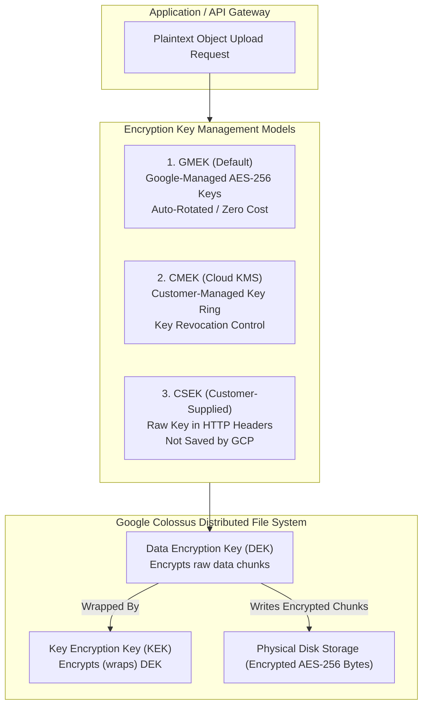

# Topic 52: Encryption

---

## 1. What Is It?

Google Cloud Storage enforces **Encryption at Rest** automatically for 100% of stored data. All object data and metadata written to Cloud Storage is encrypted prior to hitting physical disk media using 256-bit Advanced Encryption Standard (AES-256) algorithms.

GCP provides three distinct encryption key management models:
1. **Google-Managed Encryption Keys (GMEK)**: Default mode. Google automatically generates, manages, and rotates encryption keys at zero extra cost without requiring customer setup.
2. **Customer-Managed Encryption Keys (CMEK)**: Customer controls key creation, rotation schedules, and IAM access permissions using **Google Cloud Key Management Service (Cloud KMS)**.
3. **Customer-Supplied Encryption Keys (CSEK)**: Customer generates and manages raw AES-256 keys on-premises, supplying the raw key string in HTTP request headers for each upload/download API call. (Google does NOT store CSEK keys).

### Real-World Analogy
Think of Encryption options like securing a high-value safety deposit box at a bank:
- **GMEK (Default)**: Bank manages its own internal master keycard system. The bank locks your box automatically when you close it; you don't hold or manage any physical keys.
- **CMEK (KMS)**: Bank provides a special lock box where YOU own the electronic key fob (Cloud KMS). You can press a button on your app to revoke the bank's key fob at any time, instantly blocking access to your box.
- **CSEK**: You bring your own physical padlocks from home. Every time you open or close the box, you must hand the physical key to the guard, and take it home with you when done.

---

## 2. Where Does It Fit?

Encryption operates at the Colossus storage layer between incoming API requests and physical disk media, encrypting data chunks prior to writing.



---

## 3. Core Concepts

| Encryption Model | Key Generator | Key Storage Location | Rotation & Revocation | Compliance Level |
|---|---|---|---|---|
| **GMEK** (Default) | Google Cloud | Internal Google Key Service | Managed 100% by Google | Standard baseline security for all GCP workloads. |
| **CMEK** (Recommended) | Customer (via Cloud KMS) | Cloud KMS (HSM or Software) | Customer controls key rotation & IAM key revocation | Recommended for HIPAA, PCI-DSS, SOC 2, and FISMA. |
| **CSEK** | Customer (On-Premises) | Customer On-Premises | Customer manages raw keys; lost keys = lost data | High operational risk (Lost key = unrecoverable data). |
| **Envelope Encryption** | GCP Architecture | DEK (Local) + KEK (KMS) | Two-tier key hierarchy optimizing performance | Used internally by GMEK and CMEK. |

---

## 4. How It Works

Envelope Encryption separates data encryption from key management:

```text
Upload Request arrives at Cloud Storage Engine
              ↓
GCS generates unique Data Encryption Key (DEK) for the object
              ↓
DEK encrypts raw object chunks using AES-256 -> Written to physical disk
              ↓
GCS queries Cloud KMS to wrap (encrypt) the DEK using Key Encryption Key (KEK)
              ↓
Wrapped DEK stored alongside object metadata
              ↓
(On Read): GCS queries Cloud KMS to unwrap DEK -> DEK decrypts object bytes
```

1. **Envelope Security**: The Key Encryption Key (KEK) never leaves Cloud KMS. If a customer disables or revokes the KEK in Cloud KMS, all objects encrypted under that key become unreadable instantly (Cryptographic Erasure).
2. **Per-Object DEK**: Every single object stored in GCS receives its own unique Data Encryption Key (DEK).

---

## 5. Production Scenario

### Enterprise Regulatory CMEK Key Management & Cryptographic Shredding

```text
Requirement: Encrypt healthcare patient records in `gs://hipaa-records-prod` using customer-controlled keys. If a security breach occurs, security leads must be able to revoke data access instantly across all objects.
    ↓
Architecture: Cloud Storage Bucket with Customer-Managed Encryption Keys (CMEK) via Cloud KMS.
    ↓
Setup Steps:
  - Step 1: Create Key Ring `kr-hipaa-us` and CryptoKey `key-patient-data` in Cloud KMS.
  - Step 2: Grant `roles/cloudkms.cryptoKeyEncrypterDecrypter` on `key-patient-data` to GCS Service Agent (`service-PROJECT_NUMBER@gs-project-accounts.iam.gserviceaccount.com`).
  - Step 3: Create GCS Bucket specifying `--default-kms-key=projects/.../cryptoKeys/key-patient-data`.
    ↓
Emergency Incident Response (Cryptographic Erasure):
  - Security lead disables `key-patient-data` in Cloud KMS.
  - GCS can no longer unwrap DEKs; all 10,000,000 patient objects become instantly unreadable worldwide within seconds.
    ↓
Monitoring: Cloud Audit Logs recording Cloud KMS key decryption requests (`Decrypt`).
```

*Why Selected*: CMEK provides absolute cryptographic authority over enterprise data, allowing security teams to execute instant, irreversible data access revocation without deleting bucket objects.

---

## 6. Hands-On Lab

### Prerequisites
- Active GCP Project.
- Cloud Shell or `gcloud` CLI.
- IAM permissions: `roles/cloudkms.admin` and `roles/storage.admin`.

### Console Method
1. Log into [Google Cloud Console](https://console.cloud.google.com/).
2. Navigate to **Security** → **Key Management**.
3. Click **CREATE KEY RING** → Name: `kr-storage-demo`, Location: `us-central1`.
4. Create Key: Name: `key-bucket-data`, Protection level: **Software**.
5. Click **CREATE**.
6. Copy the Key Resource ID (`projects/.../locations/us-central1/keyRings/kr-storage-demo/cryptoKeys/key-bucket-data`).
7. Navigate to **Cloud Storage** → **Buckets** → Click **CREATE BUCKET**.
8. Name: `cmek-bucket-12345`, Location: `us-central1`.
9. Expand **Encryption**: Select **Customer-managed encryption key (CMEK)** → Select `key-bucket-data`.
10. Click **CREATE** (Grant Cloud KMS permissions when prompted).

### CLI Method
Configure CMEK encryption for a bucket using `gcloud`:

```bash
# Set variables
PROJECT_ID="your-gcp-project-id"
PROJECT_NUMBER=$(gcloud projects describe $PROJECT_ID --format="value(projectNumber)")
LOCATION="us-central1"
KEY_RING="kr-storage-demo"
KEY_NAME="key-bucket-data"
BUCKET_NAME="cmek-bucket-${PROJECT_ID}"

# 1. Create a Cloud KMS Key Ring and CryptoKey
gcloud kms keyrings create $KEY_RING --location=$LOCATION
gcloud kms keys create $KEY_NAME --location=$LOCATION --keyring=$KEY_RING --purpose=encryption

# 2. Fetch GCS Service Agent email and grant KMS Encrypter/Decrypter role
GCS_SA=$(gcloud storage service-agent --project=$PROJECT_ID)
gcloud kms keys add-iam-policy-binding $KEY_NAME \
    --location=$LOCATION \
    --keyring=$KEY_RING \
    --member="serviceAccount:$GCS_SA" \
    --role="roles/cloudkms.cryptoKeyEncrypterDecrypter"

# 3. Create a Cloud Storage Bucket enforced with CMEK Key
KMS_KEY_ID="projects/${PROJECT_ID}/locations/${LOCATION}/keyRings/${KEY_RING}/cryptoKeys/${KEY_NAME}"
gcloud storage buckets create gs://$BUCKET_NAME \
    --location=$LOCATION \
    --default-kms-key=$KMS_KEY_ID \
    --uniform-bucket-level-access
```

### Verification
*Expected Result*: Querying `gcloud storage buckets describe gs://$BUCKET_NAME` displays `encryption.defaultKmsKeyName` matching your Cloud KMS key string.

### Cleanup
Delete bucket, key, and key ring:

```bash
gcloud storage buckets delete gs://$BUCKET_NAME --quiet
gcloud kms keys destroy $KEY_NAME --location=$LOCATION --keyring=$KEY_RING --version=1 --quiet
```

---

## 7. Security

### Key Management Best Practices & Hazards
- **Grant IAM to GCS Service Agent**: Always grant `roles/cloudkms.cryptoKeyEncrypterDecrypter` to the GCS Service Agent (`service-PROJECT_NUMBER@gs-project-accounts...`), NOT to individual end users.
- **KMS Key Location Matching**: Cloud KMS key location MUST match the bucket location (e.g., `us-central1` key for `us-central1` bucket; `us` multi-region key for `us` multi-region bucket).
- **Avoid CSEK in Production**: Customer-Supplied Keys (CSEK) require sending raw key strings in every API call. If a customer loses their CSEK key file, GCP cannot recover the data, causing permanent data loss.

```text
BAD PRACTICE:
Using Customer-Supplied Keys (CSEK) without automated key backup systems on-premises.
Risk: If the on-premises raw key file is lost or corrupted, 100% of encrypted cloud objects are permanently unrecoverable.

PRODUCTION PRACTICE:
Use Customer-Managed Encryption Keys (CMEK) via Cloud KMS. Enable Cloud KMS automatic 90-day key rotation.
```

---

## 8. Scaling & High Availability

Multi-Region CMEK Key Architecture:

```text
Single Region KMS Key (`us-central1` Key Ring -> Single region scope)
   ↓ (Multi-Region Resiliency Upgrade)
Multi-Region KMS Key (`us` Multi-Region Key Ring -> Regional failover resilient)
```

- **Location Alignment**: For Multi-Region buckets (`location: us`), always use a Multi-Regional Cloud KMS key (`location: us`) to maintain multi-datacenter disaster recovery SLAs.

---

## 9. Cost

### Financial Impact of CMEK vs. GMEK
- **GMEK (Default)**: 100% **FREE**. Zero charge for key management or encryption operations.
- **CMEK (Cloud KMS)**:
  - Key Storage: ~$0.06 to $1.00 per key per month (Software vs HSM).
  - Cryptographic Operations: ~$0.03 per 10,000 `Wrap`/`Unwrap` requests processed by Cloud KMS during object uploads and reads.

---

## 10. Monitoring & Troubleshooting

### Encryption Observability Tools
- **Cloud Audit Logs**: Filter by `protoPayload.serviceName="cloudkms.googleapis.com"` to audit key decryption requests.
- **Security Command Center (SCC)**: Audits buckets missing CMEK encryption settings.

### Troubleshooting Matrix

| Symptom | Possible Cause | What to Check | Fix |
|---|---|---|---|
| `403 Access Denied` uploading CMEK object | GCS Service Agent lacks KMS `cryptoKeyEncrypterDecrypter` role | KMS Key IAM policy bindings | Grant `roles/cloudkms.cryptoKeyEncrypterDecrypter` to `service-PROJECT_NUMBER@gs-project-accounts...`. |
| CMEK bucket creation fails: `Location Mismatch` | KMS Key location does not match bucket location | Bucket & KMS Key locations | Ensure KMS key location (e.g., `us-central1`) matches bucket location (`us-central1`). |
| All object reads failing with `Key Disabled` | Cloud KMS CryptoKey was disabled by security admin | Cloud KMS Key status in Console | Re-enable the CryptoKey version in Cloud KMS console. |

---

## 11. Common Mistakes

```text
Mistake: Forgetting to grant the Cloud KMS Encrypter/Decrypter role to the GCS Service Agent (`service-PROJECT_NUMBER@gs-project-accounts.iam.gserviceaccount.com`).
Why: Assuming granting KMS permissions to your personal user account is sufficient.
Impact: Object uploads to CMEK buckets fail with HTTP 403 Forbidden errors.
Correct approach: Always bind `roles/cloudkms.cryptoKeyEncrypterDecrypter` to the GCS Service Agent identity.

Mistake: Creating a Regional KMS Key (e.g., `us-central1`) and attempting to attach it to a Multi-Region Bucket (`us`).
Why: Misunderstanding location alignment requirements.
Impact: Bucket creation fails with location mismatch errors.
Correct approach: Match key locations to bucket locations (Regional Key -> Regional Bucket; Multi-Region Key -> Multi-Region Bucket).
```

---

## 12. Production Best Practices

- [ ] Rely on default **GMEK (Google-Managed Keys)** for general non-sensitive workloads.
- [ ] Use **CMEK (Cloud KMS)** for regulated, HIPAA, PCI-DSS, or high-security data lakes.
- [ ] Grant `roles/cloudkms.cryptoKeyEncrypterDecrypter` directly to the GCS Service Agent.
- [ ] Match Cloud KMS Key location type (Regional vs Multi-Regional) to the target bucket location.
- [ ] Enable **Automatic Key Rotation** (e.g., every 90 days) on Cloud KMS CryptoKeys.
- [ ] Automate all KMS key rings, keys, IAM bindings, and CMEK bucket configurations using Terraform.

---

## 13. Hyperscaler / Enterprise Perspective

```text
Personal / Learning
  Default GMEK Encryption → No KMS keys → Zero encryption setup
        ↓
Small Production
  CMEK Keys via Cloud KMS → Manual Key Ring creation → Basic IAM bindings
        ↓
Enterprise Environment
  Cloud KMS HSM Keys → Automatic 90-day Key Rotation → Org Policy CMEK Enforcement
        ↓
Hyperscaler Environment
  100% Policy-as-Code CMEK Landing Zones → External Key Manager (EKM) Integration → Automated Cryptographic Erasure Incident Response
```

In a hyperscaler environment, enterprise security policies mandate CMEK encryption across all cloud storage. Organization Policy `constraints/gcp.restrictNonCmekServices` blocks creation of any GCS bucket that does not specify a valid Cloud KMS key. Enterprise banks connect Cloud KMS to **External Key Managers (EKM)** located in their private physical datacenters, retaining physical hardware authority over cloud decryption keys.

---

## 14. Real Project Questions

### Q1: What is the technical difference between GMEK, CMEK, and CSEK in Cloud Storage?
**Answer:**
- **GMEK (Google-Managed)**: Google automatically generates, stores, and rotates AES-256 keys at zero cost.
- **CMEK (Customer-Managed)**: Customer controls key creation, 90-day rotation, and IAM revocation using Google Cloud KMS.
- **CSEK (Customer-Supplied)**: Customer generates raw AES-256 keys on-premises, supplying raw key strings in HTTP request headers for each API call (Google never stores CSEK keys).

### Q2: How does Envelope Encryption work in Cloud Storage?
**Answer:** Envelope Encryption uses a two-tier key hierarchy. Raw data chunks are encrypted locally using a unique **Data Encryption Key (DEK)**. The DEK is then encrypted ("wrapped") using a root **Key Encryption Key (KEK)** managed in Cloud KMS. Wrapped DEKs are stored alongside object metadata, ensuring the root KEK never leaves Cloud KMS.

### Q3: What happens to objects in a CMEK-encrypted bucket if a security administrator disables the KMS Key in Cloud KMS?
**Answer:** If the KMS Key is disabled or revoked in Cloud KMS, Cloud Storage can no longer unwrap the object Data Encryption Keys (DEKs). As a result, **100% of objects encrypted under that key become instantly unreadable worldwide** within seconds (Cryptographic Erasure), protecting data during a security breach.

---

## 15. Quick Decision Guide

| Requirement | Recommended Approach | Reason |
|---|---|---|
| Standard web application storing user avatar images | **Google-Managed Encryption Keys (GMEK)** | 100% free, zero maintenance, automatic AES-256 encryption at rest. |
| HIPAA medical records requiring customer key revocation authority | **Customer-Managed Encryption Keys (CMEK)** | Full authority over key rotation, IAM access, and instant cryptographic erasure. |
| Strict regulatory requirement where raw encryption keys cannot exist in cloud RAM | **Customer-Supplied Encryption Keys (CSEK)** | Raw key provided in HTTP headers per API call; never saved by Google. |

### When should I use it?
- Essential security topic for configuring data protection, regulatory compliance, and key management in GCS.

### When should I NOT use it?
- Do not use CSEK unless on-premises regulatory mandates strictly prohibit Cloud KMS usage.

---

## 16. Related Services

```text
                  [52. Encryption]
                 /       |        \
         Cloud KMS   Cloud Audit   Cloud Storage
        (CMEK Keys)     Logs       Service Agent
            |            |               |
        Key Rings     Decrypt       Encrypter /
       & CryptoKeys    Events        Decrypter
```

- **Cloud KMS**: Key Management Service providing CMEK keys.
- **Cloud Audit Logs**: Records Cloud KMS decryption API calls.
- **Cloud Storage Service Agent**: System identity performing CMEK wrap/unwrap requests.

---

## 17. Cheat Sheet

### Key Models
- **GMEK**: Google-managed (Free default).
- **CMEK**: Customer-managed via Cloud KMS (Recommended for Enterprise).
- **CSEK**: Customer-supplied in HTTP headers (High risk).

### Useful Commands
```bash
# Create a KMS Key Ring and Key
gcloud kms keyrings create KEY_RING --location=us-central1
gcloud kms keys create KEY_NAME --location=us-central1 --keyring=KEY_RING --purpose=encryption

# Grant GCS Service Agent access to the KMS Key
gcloud kms keys add-iam-policy-binding KEY_NAME \
    --location=us-central1 --keyring=KEY_RING \
    --member="serviceAccount:service-PROJECT_NUM@gs-project-accounts.iam.gserviceaccount.com" \
    --role="roles/cloudkms.cryptoKeyEncrypterDecrypter"

# Create a bucket with default CMEK Key
gcloud storage buckets create gs://BUCKET_NAME \
    --location=us-central1 --default-kms-key=KEY_RESOURCE_ID
```

---

## 18. Learning Connection

- **Previous Topic**: [51. Versioning](../51-versioning/README.md)
- **Next Topic**: [53. Cloud SQL](../53-cloud-sql/README.md)
