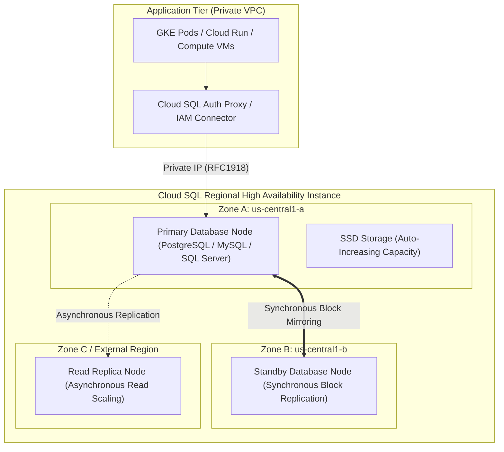

# Topic 53: Cloud SQL

---

## 1. What Is It?

**Google Cloud SQL** is a fully managed relational database service that automates provisioning, storage capacity management, patch updates, automated backups, and high availability for three popular open-source database engines: **PostgreSQL**, **MySQL**, and **SQL Server**.

Cloud SQL offlines database administration toil—including operating system patching, database engine updates, replication setups, and point-in-time recovery (PITR)—allowing database administrators and developers to focus on schema design and query optimization.

Cloud SQL supports **High Availability (HA)** configurations using regional dual-zone synchronous replication, automatic failover, and **Read Replicas** for horizontal read scaling across regions.

### Real-World Analogy
Think of Cloud SQL like renting a fully managed commercial kitchen staffed by a team of master chefs. Instead of buying ovens, scrubbing floors, sharpening knives, and washing dishes yourself (Self-Hosted Database on VM), you simply order specific menu items (SQL Queries). The master chefs handle stove maintenance, food safety compliance, and cleanup automatically behind the scenes.

---

## 2. Where Does It Fit?

Cloud SQL instances reside inside private subnets of a VPC, communicating with application workloads (Compute VMs, GKE, Cloud Run) via Private IP or Cloud SQL Auth Proxy.



---

## 3. Core Concepts

| Concept | Description | Example / Value | Best Practice |
|---|---|---|---|
| **Supported Engines** | Open-source relational engines managed by GCP. | PostgreSQL, MySQL, SQL Server | Choose PostgreSQL for advanced GIS/JSON; MySQL for LAMP apps. |
| **High Availability (HA)** | Regional dual-zone deployment with automatic failover. | Primary (Zone A) + Standby (Zone B) | **Mandatory standard for production** (Delivers 99.95% SLA). |
| **Private IP Access** | Attaches instance directly to your private VPC via Private Services Access. | `10.50.0.5` (Private RFC1918 IP) | **Disable Public IP** on production instances. |
| **Cloud SQL Auth Proxy** | Local proxy establishing secure IAM-authenticated TLS tunnels to DB. | Local port `5432` forwarding | Use Auth Proxy for secure connection management without static passwords. |
| **Point-in-Time Recovery** | Restores database state to any specific second in the past 7 days. | Binary logging / WAL archiving | Enable PITR on all production databases for disaster recovery. |

---

## 4. How It Works

HA Failover and Automatic Storage Increase operate seamlessly:

```text
Primary DB in Zone A experiences hardware failure or zone power outage
              ↓
Cloud SQL Health Checker detects failure (Heartbeat timeout)
              ↓
Automatic Failover triggered: Regional IP failover points to Standby DB in Zone B
              ↓
Standby DB promoted to Primary status -> Applications reconnect within 60 seconds!
              ↓
(Storage Auto-Increase): Disk space reaches 80% capacity -> GCS expands SSD size automatically (+25%)
```

1. **Synchronous Replication**: High Availability instances use regional persistent disk block-level synchronous replication between Zone A and Zone B.
2. **Storage Auto-Increase**: Disks expand automatically when storage capacity hits 80%, eliminating out-of-disk space database crashes.

---

## 5. Production Scenario

### Highly Available PostgreSQL Fleet for E-Commerce Checkout

```text
Requirement: Run a PostgreSQL 15 database processing e-commerce checkout transactions with 99.95% availability SLA, zero public internet exposure, and automated point-in-time recovery.
    ↓
Architecture: Cloud SQL PostgreSQL Regional HA Instance + Read Replica.
    ↓
Instance Specification:
  - Engine: PostgreSQL 15 (`db-custom-8-30720` - 8 vCPU, 30 GB RAM).
  - High Availability: **Regional** (Primary: `us-central1-a`, Standby: `us-central1-b`).
  - Network: **Private IP Only** (VPC: `custom-prod-vpc`, Private Services Access).
  - Backups: Automated daily backups at 02:00 UTC + **Point-in-Time Recovery (PITR)** enabled.
  - Disk: `pd-ssd` with **Storage Auto-Increase** enabled.
    ↓
Security: Connected via Cloud SQL Auth Proxy; IAM-based database authentication enabled.
    ↓
Monitoring: Cloud Monitoring tracking `database/cpu/utilization` and `database/disk/utilization`.
```

*Why Selected*: Provides enterprise-grade HA failover, automatic disk expansion, and secure private IAM connectivity without requiring manual database administration.

---

## 6. Hands-On Lab

### Prerequisites
- Active GCP Project with Custom VPC and Private Services Access configured.
- Cloud Shell or `gcloud` CLI.
- IAM permissions: `roles/cloudsql.admin`.

### Console Method
1. Log into [Google Cloud Console](https://console.cloud.google.com/).
2. Navigate to **Databases** → **Cloud SQL**.
3. Click **CREATE INSTANCE** → Select **Choose PostgreSQL**.
4. Set Instance ID: `prod-db-postgres`, Password: Enter strong admin password.
5. Database version: **PostgreSQL 15**.
6. Configuration options:
   - Presets: Select **Production**.
   - Region: `us-central1` → Availability: **Multiple zones (Highly available)**.
   - Connections: Uncheck Public IP → Check **Private IP** → Select VPC `custom-prod-vpc`.
   - Data protection: Check **Enable point-in-time recovery**.
7. Click **CREATE INSTANCE** (Wait 5–7 minutes for provisioning).

### CLI Method
Create a Regional HA Cloud SQL PostgreSQL instance using `gcloud`:

```bash
# Set project and network variables
PROJECT_ID="your-gcp-project-id"
VPC_NAME="custom-prod-vpc"
INSTANCE_NAME="prod-db-postgres"

# 1. Create a Regional HA Cloud SQL PostgreSQL Instance with Private IP
gcloud sql instances create $INSTANCE_NAME \
    --database-version=POSTGRES_15 \
    --cpu=4 \
    --memory=15360MB \
    --region=us-central1 \
    --availability-type=REGIONAL \
    --network=projects/$PROJECT_ID/global/networks/$VPC_NAME \
    --no-assign-ip \
    --enable-point-in-time-recovery \
    --storage-type=SSD \
    --storage-auto-increase

# 2. Create a production database inside the instance
gcloud sql databases create ecommerce_db --instance=$INSTANCE_NAME

# 3. Create a database user account
gcloud sql users create app_user --instance=$INSTANCE_NAME --password="StrongPassword123!"
```

### Verification
*Expected Result*: Querying `gcloud sql instances describe $INSTANCE_NAME` displays `state: RUNNING`, `availabilityType: REGIONAL`, and `ipAddresses` showing a private RFC1918 IP address.

### Cleanup
Delete Cloud SQL instance:

```bash
gcloud sql instances delete $INSTANCE_NAME --quiet
```

---

## 7. Security

### Cloud SQL Hardening & Connection Security
- **Disable Public IPs**: Always uncheck Public IP assignment on production instances. Use Private IP via Private Services Access.
- **Cloud SQL Auth Proxy**: Use the Cloud SQL Auth Proxy or Language Connectors (Java, Python, Go) to establish secure, IAM-authenticated TLS tunnels without exposing raw database ports.
- **IAM Database Authentication**: Authenticate database users using Cloud IAM accounts instead of managing static database passwords.
- **Customer-Managed Encryption Keys (CMEK)**: Encrypt database storage using Cloud KMS keys for regulatory compliance.

```text
BAD PRACTICE:
Enabling Public IP on Cloud SQL instances and opening `0.0.0.0/0` in authorized networks for remote administration.
Risk: Exposes database login ports directly to automated internet brute-force attacks.

PRODUCTION PRACTICE:
Disable Public IP. Connect strictly via Private IP over VPC or use Cloud SQL Auth Proxy with IAM Database Authentication.
```

---

## 8. Scaling & High Availability

Database Read/Write Scaling Architecture:

```text
Single Database Node (Scaling Limit: Single node vCPU/RAM capacity)
   ↓ (Horizontal Read Scaling)
Primary HA Instance (Writes & Transactions) + 3 Read Replicas (Offloads SELECT queries)
   ↓ (Cross-Region Read Replicas & DR)
Cross-Region Read Replica (Offloads reporting & provides regional disaster recovery)
```

- **Read Replicas**: Create up to 10 Read Replicas across regions to offload heavy read-only analytical queries from the primary transactional database node.

---

## 9. Cost

### Cloud SQL Pricing Factors
- **Instance Sizing**: Charged per vCPU hour and per GB RAM hour based on machine spec (`db-custom` vs `db-f1-micro`).
- **Storage & Backups**: Charged per GB/month for SSD storage and automated backup/PITR storage.
- **HA Double Instance Fee**: Regional HA instances double the compute and storage cost because GCP runs a dedicated Standby node in a second zone.
- **Committed Use Discounts (CUDs)**: Save 33% (1-year) or 52% (3-year) by purchasing Cloud SQL CUDs for baseline database capacity.

---

## 10. Monitoring & Troubleshooting

### Cloud SQL Observability Tools
- **Query Insights**: Built-in APM tool in Console that identifies slow queries, N+1 query patterns, and lock contention.
- **Cloud Monitoring Database Metrics**: Track `database/cpu/utilization`, `database/memory/components/cache`, and `database/disk/utilization`.

### Troubleshooting Matrix

| Symptom | Possible Cause | What to Check | Fix |
|---|---|---|---|
| Application connection timeout to Cloud SQL | Missing Private Services Access peering or missing firewall rule | `gcloud sql instances describe` | Verify VPC Private Services Access connection and Cloud SQL Auth Proxy setup. |
| Database CPU utilization at 100% | Unindexed SQL queries or N+1 query patterns | Console **Query Insights** dashboard | Analyze Query Insights to identify slow queries and add missing database indexes. |
| Automatic failover triggered unexpectedly | Temporary network partition or high memory pressure on Primary node | Cloud Audit Logs & Memory metrics | Scale up instance RAM or optimize memory-heavy queries to prevent OOM kills. |

---

## 11. Common Mistakes

```text
Mistake: Running a single-zone Cloud SQL instance (`availability-type=ZONAL`) for primary production databases.
Why: Attempting to save 50% on database compute costs.
Impact: Zero SLA protection; physical host failure in that zone causes complete database downtime.
Correct approach: Always set `availability-type=REGIONAL` for production database workloads.

Mistake: Leaving Database Storage Auto-Increase disabled.
Why: Over-conserving disk space during initial database creation.
Impact: Database disk fills up to 100%, causing database service crash and data corruption.
Correct approach: Always enable Storage Auto-Increase (`--storage-auto-increase`) on all Cloud SQL instances.
```

---

## 12. Production Best Practices

- [ ] Select **PostgreSQL** or **MySQL** Regional HA (`REGIONAL`) for production workloads.
- [ ] Enforce **Private IP Only**; disable Public IP assignment on production instances.
- [ ] Use **Cloud SQL Auth Proxy** or Language Connectors for secure connection management.
- [ ] Enable **Storage Auto-Increase** to prevent out-of-disk-space database crashes.
- [ ] Enable **Point-in-Time Recovery (PITR)** and automated daily backups.
- [ ] Utilize **Query Insights** to diagnose and optimize slow SQL queries.

---

## 13. Hyperscaler / Enterprise Perspective

```text
Personal / Learning
  Single-Zone `db-f1-micro` → Public IP enabled → Manual password management
        ↓
Small Production
  Regional HA Instance → Private IP Only → Automated Daily Backups
        ↓
Enterprise Environment
  Regional HA + Cross-Region Read Replicas → IAM DB Auth → Query Insights Optimization
        ↓
Hyperscaler Environment
  100% Terraform Managed Database Fleet → CMEK Encryption via Cloud KMS → Automated PITR Disaster Recovery Drills
```

In a hyperscaler environment, database management is fully automated. Enterprise platform teams deploy Cloud SQL instances via Terraform modules enforcing CMEK encryption, Private IP access, and Query Insights telemetry. Application pods connect using **Cloud SQL Auth Proxy** with short-lived IAM credentials, completely eliminating static database passwords from source code and environment variables.

---

## 14. Real Project Questions

### Q1: How does Cloud SQL High Availability (HA) failover work during a zonal datacenter outage?
**Answer:** A Regional HA Cloud SQL instance maintains a Primary node in Zone A and a Standby node in Zone B, linked via synchronous block-level disk replication. If Zone A experiences a failure, Cloud SQL's health checker detects the heartbeat timeout and automatically promotes the Standby node in Zone B to Primary, updating DNS records so applications reconnect within 60 seconds with zero data loss.

### Q2: What is the primary purpose of the Cloud SQL Auth Proxy?
**Answer:** The Cloud SQL Auth Proxy is a local proxy binary that establishes a secure, encrypted 256-bit TLS tunnel between application workloads and the Cloud SQL instance. It authenticates using Google Cloud IAM credentials (or Service Accounts) rather than static IP allow-lists, eliminating the need to expose public IP addresses or manage static database passwords in application code.

### Q3: Why is Point-in-Time Recovery (PITR) essential for database disaster recovery?
**Answer:** Standard daily backups only allow restoring state to the exact moment the backup ran (e.g., 02:00 UTC). **Point-in-Time Recovery (PITR)** streams Write-Ahead Logs (WAL) or binary logs continuously, allowing administrators to restore the database to any exact second in the past 7 days (e.g., 14:23:41 UTC), recovering from accidental table drops or malicious data corruption.

---

## 15. Quick Decision Guide

| Requirement | Recommended Approach | Reason |
|---|---|---|
| Core relational database for an enterprise e-commerce app (PostgreSQL/MySQL) | **Cloud SQL Regional HA Instance (Private IP)** | Fully managed, 99.95% HA SLA, automatic failover, and automated backups. |
| Offloading heavy read-only analytical reporting queries from primary DB | **Cloud SQL Read Replica** | Asynchronously replicates data to secondary nodes to handle SELECT queries. |
| Global multi-region active-active relational database requiring high throughput | **Google Cloud Spanner (NOT Cloud SQL)** | Cloud SQL does not support global multi-region active-active writes—use Cloud Spanner. |

### When should I use it?
- Essential database service for traditional relational PostgreSQL, MySQL, or SQL Server applications.

### When should I NOT use it?
- Do not use Cloud SQL for massive horizontal multi-region write workloads requiring petabyte scale—use Cloud Spanner.

---

## 16. Related Services

```text
                 [53. Cloud SQL]
                /       |       \
        Cloud SQL    Cloud KMS   Cloud Monitoring
        Auth Proxy    (CMEK)     (Query Insights)
            |           |               |
        Secure IAM  Encryption       Slow Query
         Tunnels     at Rest         Diagnostics
```

- **Cloud SQL Auth Proxy**: Provides secure IAM-authenticated database connectivity.
- **Cloud KMS**: Manages Customer-Managed Encryption Keys (CMEK) for database storage.
- **Query Insights**: APM diagnostic tool for identifying slow database queries.

---

## 17. Cheat Sheet

### Core Attributes
- **Supported Engines**: PostgreSQL, MySQL, SQL Server.
- **Availability**: Regional HA (Dual Zone) vs Zonal (Single Zone).
- **Network**: Private IP (Recommended) vs Public IP.
- **SLA**: 99.95% for Regional HA instances.

### Useful Commands
```bash
# Create a Regional HA PostgreSQL instance with Private IP
gcloud sql instances create INSTANCE_NAME \
    --database-version=POSTGRES_15 --cpu=4 --memory=15360MB \
    --region=us-central1 --availability-type=REGIONAL \
    --network=VPC_URI --no-assign-ip --enable-point-in-time-recovery

# Create a database inside the instance
gcloud sql databases create DB_NAME --instance=INSTANCE_NAME

# Connect via Cloud SQL Auth Proxy locally
cloud-sql-proxy INSTANCE_CONNECTION_NAME --port 5432
```

---

## 18. Learning Connection

- **Previous Topic**: [52. Encryption](../52-encryption/README.md)
- **Next Topic**: [54. Firestore](../54-firestore/README.md)
