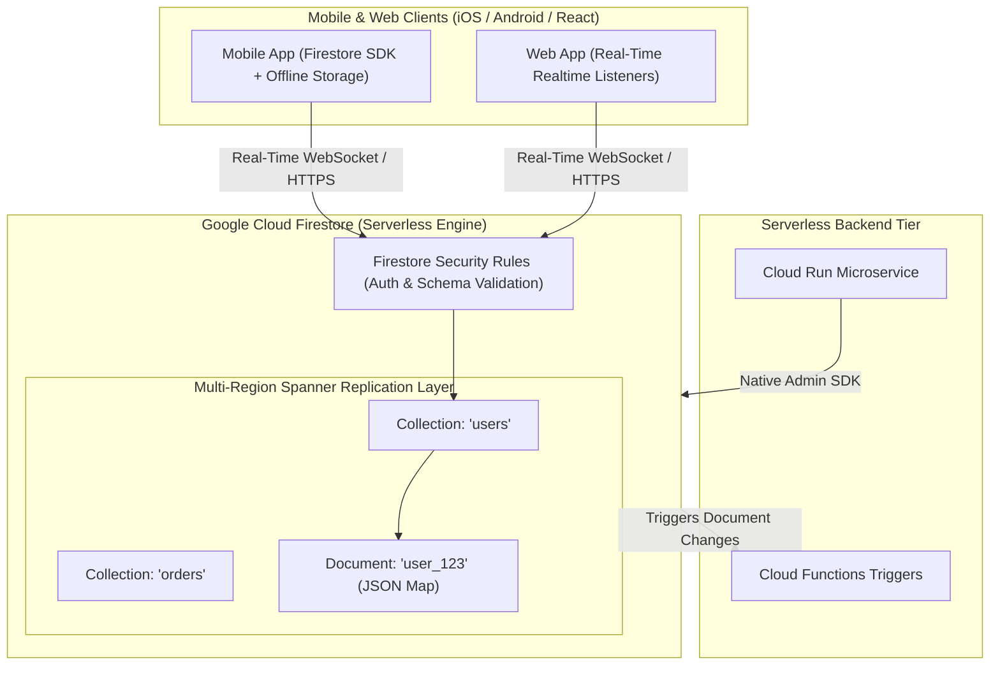

# Topic 54: Firestore

---

## 1. What Is It?

**Google Cloud Firestore** is a fully managed, serverless, highly scalable NoSQL document database designed for web, mobile, and serverless applications.

Firestore organizes data as **Documents** (JSON-like key-value maps) contained within **Collections**. It provides automatic multi-region data replication, strong consistency, expressive querying, real-time client synchronization listeners, and offline data persistence SDKs.

Firestore operates in two distinct modes:
1. **Native Mode (Recommended)**: Offers real-time synchronization, mobile/web client SDKs, offline storage, and fine-grained Security Rules.
2. **Datastore Mode**: Backwards-compatible mode optimized for high-throughput serverless backends and legacy App Engine Datastore workloads.

### Real-World Analogy
Think of Firestore like an automated digital index card filing cabinet for a fast-paced medical clinic. Patient profiles (Documents) are stored inside designated drawers (Collections). When a doctor updates a patient's chart on an iPad in Room 3, the updated chart instantly synchronizes in real time across the iPad screens of the nurse in Room 1 and the pharmacist at the front desk (Real-Time Synchronized Listeners) without any manual page refreshing.

---

## 2. Where Does It Fit?

Firestore serves as the primary NoSQL backend for mobile (iOS/Android), web, and serverless (Cloud Functions, Cloud Run) applications requiring real-time updates and document flexibility.



---

## 3. Core Concepts

| Firestore Concept | Description | Example / Syntax | Best Practice |
|---|---|---|---|
| **Document** | Primary data record containing key-value pairs (supports nested objects/arrays). | `{ "name": "Alice", "balance": 150.00 }` | Max document size: **1 Megabyte**. |
| **Collection** | Container holding multiple related documents. | `/users`, `/orders` | Group documents logically by entity type. |
| **Subcollection** | Collection nested inside a specific document for hierarchical modeling. | `/users/user_123/orders` | Use subcollections to group child records (e.g., user orders). |
| **Real-Time Listener** | Client SDK listener receiving immediate pushes when data changes. | `onSnapshot()` | Ideal for chat apps, live dashboards, and collaborative tools. |
| **Firestore Security Rules** | Declarative security rules controlling client-side read/write access. | `allow read, write: if request.auth != null;` | Enforce user authentication and schema validation rules. |

---

## 4. How It Works

Document reads, real-time listener updates, and atomic writes operate seamlessly:

```text
Client Application attaches Real-Time Listener: db.collection("chats").onSnapshot(...)
              ↓
User posts new message -> Client sends write request to Firestore API
              ↓
Firestore evaluates Firestore Security Rules -> Request Authorized!
              ↓
GCP Storage Layer writes document with Strong Consistency across Multi-Region nodes
              ↓
Firestore Real-Time Engine pushes updated snapshot to ALL connected client WebSockets in <100ms
```

1. **Automatic Indexing**: Firestore automatically indexes every field in a document by default, allowing fast querying without manual index configuration.
2. **Serverless Auto-Scaling**: Scales from 0 to 1,000,000+ concurrent connections automatically with zero server management or provisioned capacity planning.

---

## 5. Production Scenario

### Real-Time E-Commerce Order Tracking & Mobile Notifications

```text
Requirement: Build a real-time order tracking system for a mobile delivery app. Delivery drivers update GPS locations; customers see real-time map updates on their phones.
    ↓
Architecture: Firestore Native Mode + Cloud Functions.
    ↓
Data Model:
  - Collection: `/deliveries`
  - Document: `delivery_99` -> `{ "driver_id": "d_12", "lat": 37.7749, "lng": -122.4194, "status": "IN_TRANSIT" }`
    ↓
Workflow:
  - Driver App updates `lat`/`lng` coordinates via `db.doc("deliveries/delivery_99").update(...)`.
  - Customer App listens to changes using `onSnapshot()`, re-rendering the live map location instantly.
  - When `status` changes to `"DELIVERED"`, a Firestore Cloud Function triggers an FCM Push Notification to the customer.
    ↓
Security: Firestore Security Rules verify `request.auth.uid == resource.data.customer_id`.
    ↓
Monitoring: Cloud Monitoring tracking `document/read_count` and `document/write_count`.
```

*Why Selected*: Combines real-time WebSocket synchronization, mobile offline data caching, and serverless auto-scaling without requiring custom WebSocket servers or complex Redis infrastructure.

---

## 6. Hands-On Lab

### Prerequisites
- Active GCP Project.
- Cloud Shell or `gcloud` CLI.
- IAM permissions: `roles/datastore.owner` or `roles/owner`.

### Console Method
1. Log into [Google Cloud Console](https://console.cloud.google.com/).
2. Navigate to **Databases** → **Firestore**.
3. Click **CREATE DATABASE** → Select **Firestore Native Mode**.
4. Location: Select **nam5 (us-central multi-region)** → Click **CREATE DATABASE**.
5. Click **START COLLECTION**:
   - Collection ID: `customers`.
   - Document ID: `customer_101`.
   - Add Field: `name` (string) = `Alice Smith`.
   - Add Field: `tier` (string) = `GOLD`.
   - Add Field: `points` (number) = `2500`.
6. Click **SAVE**.
7. Navigate to **Rules** tab → View declarative Security Rules.

### CLI Method
Create a Firestore database, write documents, and run queries using `gcloud`:

```bash
# Set project variable
PROJECT_ID="your-gcp-project-id"

# 1. Create a Firestore Native Mode Database in Multi-Region nam5
gcloud firestore databases create \
    --location=nam5 \
    --type=firestore-native \
    --project=$PROJECT_ID

# 2. Insert a document into the 'users' collection using gcloud
gcloud firestore documents create "users/user_201" \
    --database="(default)" \
    --fields="name={stringValue='Bob Jones'},email={stringValue='bob@company.com'},active={booleanValue=true}"

# 3. Read specific document
gcloud firestore documents get "users/user_201" --database="(default)"

# 4. List all documents in the 'users' collection
gcloud firestore documents list "users" --database="(default)"
```

### Verification
*Expected Result*: `gcloud firestore documents get` returns document JSON listing fields `name`, `email`, and `active: true`.

### Cleanup
Delete test document and database:

```bash
gcloud firestore documents delete "users/user_201" --database="(default)" --quiet
```

---

## 7. Security

### Firestore Security Rules & Client Isolation
- **Never Use Permissive Rules in Production**: Avoid `allow read, write: if true;`. This exposes your entire database to unauthorized public editing.
- **Enforce Authentication & Authorization**: Use `request.auth` in Security Rules to restrict document access to logged-in users.
- **Validate Data Types**: Use Security Rules to enforce schema constraints (e.g., `request.resource.data.price is number`).

```text
BAD PRACTICE:
Deploying client-side web applications with permissive Security Rules (`match /{document=**} { allow read, write: if true; }`).
Risk: Anyone on the internet can read, modify, or delete your entire database directly from a browser console.

PRODUCTION PRACTICE:
Enforce strict security rules:
`match /users/{userId} { allow read, write: if request.auth != null && request.auth.uid == userId; }`
```

---

## 8. Scaling & High Availability

Firestore Auto-Scaling & Replication:

```text
Single Document Write Cap (1 write per second per document limit)
   ↓ (Horizontal Document Sharding)
Sharded Collection Architecture (Distribute writes across unique document IDs)
   ↓ (Serverless Scale)
Automatic Multi-Region Spanner Layer (Scales to 1,000,000+ concurrent client connections)
```

- **1 Write / Sec / Document Limit**: To prevent lock contention, avoid updating the *exact same document* more than once per second. Use Distributed Counters or subcollections for high-frequency writes.

---

## 9. Cost

### Firestore Billing Structure
- **Document Reads, Writes, Deletes**: Billed per operation count (e.g., ~$0.06 per 100,000 reads; ~$0.18 per 100,000 writes).
- **Storage Capacity**: Charged per GB per month (~$0.18/GB/month for Multi-Region).
- **Network Bandwidth**: Standard egress rates apply for client data transfers.

```text
FinOps Optimization Tip:
Optimize query filters (`where("status", "==", "active")`) and limit result sets (`limit(20)`). Fetching 1,000 unnecessary documents in a query incurs 1,000 document read charges.
```

---

## 10. Monitoring & Troubleshooting

### Firestore Observability Tools
- **Cloud Monitoring Firestore Metrics**: Metrics `document/read_count`, `document/write_count`, and `document/delete_count`.
- **Firebase Security Rules Simulator**: Test declarative security rules against mock client requests in Console.

### Troubleshooting Matrix

| Symptom | Possible Cause | What to Check | Fix |
|---|---|---|---|
| Client receives `PERMISSION_DENIED` error | Firestore Security Rules blocking request | Console **Rules** tab & simulator | Update Security Rules to allow access for authenticated `request.auth.uid`. |
| Document write latency high / Throttled | Exceeding 1 write/sec on a single document | Cloud Monitoring write metrics | Implement **Distributed Counters** across subcollections to shard write load. |
| Unexpected high read billing charges | Client code executing unbounded queries or real-time loops | App source code (`onSnapshot`) | Add `.limit(N)` clauses to queries; un-subscribe unused `onSnapshot()` listeners. |

---

## 11. Common Mistakes

```text
Mistake: Updating a single document (e.g., `stats/global_views`) thousands of times per second.
Why: Attempting to use a single document as a high-speed global counter.
Impact: Severe contention and write latency degradation due to the 1 write/sec/document soft limit.
Correct approach: Use Distributed Counter patterns across multiple documents to distribute write contention.

Mistake: Leaving Firestore Security Rules open (`allow read, write: if true;`) in production.
Why: Shortcut taken during initial development.
Impact: Total database compromise; malicious actors erase or exfiltrate all collections.
Correct approach: Lock down rules using `request.auth.uid` authentication checks before deploying to production.
```

---

## 12. Production Best Practices

- [ ] Select **Firestore Native Mode** for mobile, web, and serverless applications.
- [ ] Enforce strict **Firestore Security Rules** verifying `request.auth` identities and schema types.
- [ ] Limit query result sets using `.limit(N)` to optimize document read billing.
- [ ] Avoid exceeding 1 write per second on a single document; use **Distributed Counters**.
- [ ] Always unsubscribe real-time `onSnapshot()` listeners when UI components unmount.
- [ ] Automate Security Rules deployment using the Firebase CLI or Terraform (`google_firestore_document`).

---

## 13. Hyperscaler / Enterprise Perspective

```text
Personal / Learning
  Firestore Native Mode → Permissive Rules (`allow true`) → Console manual Document Edits
        ↓
Small Production
  Authenticated Security Rules → Firebase Auth Integration → Basic Cloud Functions Triggers
        ↓
Enterprise Environment
  Multi-Region `nam5` Deployment → Distributed Counter Architecture → Automated Security Rules CI/CD
        ↓
Hyperscaler Environment
  100% Terraform Managed Rules & Indexes → Automated BigQuery Streaming Extensions → Real-time Security Command Center Audit Logging
```

In a hyperscaler environment, Firestore serves as the real-time operational datastore for mobile apps. Data changes in Firestore stream directly into **BigQuery** via automated Firebase Extensions for real-time analytics, while security teams enforce automated CI/CD static analysis rules on `firestore.rules` files to prevent security misconfigurations.

---

## 14. Real Project Questions

### Q1: What is the main architectural difference between Firestore Native Mode and Datastore Mode?
**Answer:** **Firestore Native Mode** supports real-time WebSocket synchronization listeners (`onSnapshot`), offline mobile SDK caching, fine-grained client-side Security Rules, and native subcollections. **Datastore Mode** is optimized for high-throughput serverless backends, providing backwards compatibility with legacy Google Cloud Datastore APIs without real-time client listeners or Security Rules.

### Q2: How do Firestore Security Rules protect databases accessed directly from web or mobile client SDKs?
**Answer:** Firestore Security Rules execute server-side on Google's infrastructure before any read or write operation is committed. They evaluate the client's authentication state (`request.auth`), validate incoming document fields (`request.resource.data`), and compare properties against existing database data (`resource.data`), blocking unauthorized requests directly at the database edge.

### Q3: What is the 1 write per second per document limit in Firestore, and how do you bypass it?
**Answer:** Firestore uses distributed consensus locks to guarantee strong consistency. Updating the *exact same document* more than 1 time per second causes lock contention and write latency degradation. To bypass this limit for high-frequency counters (e.g., global view counts), engineers implement **Distributed Counters**, spreading write operations across a subcollection of 10 or 20 random documents and summing their values on read.

---

## 15. Quick Decision Guide

| Requirement | Recommended Approach | Reason |
|---|---|---|
| Real-time mobile chat app requiring instant message pushes and offline caching | **Firestore Native Mode** | Built-in real-time WebSocket listeners (`onSnapshot`) and offline mobile SDKs. |
| Serverless backend microservice requiring high-throughput NoSQL document storage | **Firestore Datastore Mode** | High-throughput serverless backend scaling for server-side Node.js/Python apps. |
| High-volume IoT sensor telemetry generating 100,000 writes per second | **Cloud Bigtable (NOT Firestore)** | Firestore is not designed for massive high-frequency raw time-series writes—use Bigtable. |

### When should I use it?
- Essential NoSQL database service for web, mobile, and serverless applications requiring JSON document flexibility and real-time client sync.

### When should I NOT use it?
- Do not use Firestore for massive raw time-series ingestion (use Bigtable) or complex multi-table SQL joins (use Cloud SQL or Spanner).

---

## 16. Related Services

```text
                 [54. Firestore]
                /       |       \
        Firebase Auth Cloud     Cloud Functions
         (Identity)   Spanner      (Triggers)
            |            |             |
        Client      Underlying     Event-Driven
        Tokens       Storage         Pipelines
```

- **Firebase Authentication**: Provides identity tokens evaluated in Firestore Security Rules.
- **Cloud Functions**: Triggers automated backend code upon Firestore document changes.
- **Cloud Spanner**: Serves as the underlying distributed storage engine powering Firestore.

---

## 17. Cheat Sheet

### Core Concepts
- **Data Model**: Collections -> Documents (JSON Maps) -> Subcollections.
- **Max Document Size**: 1 Megabyte.
- **Write Limit**: ~1 write / second / single document.
- **Consistency**: Strongly Consistent.

### Useful Commands
```bash
# Create a Firestore Native database
gcloud firestore databases create --location=nam5 --type=firestore-native

# Insert a document into a collection
gcloud firestore documents create "users/user_1" --fields="name={stringValue='Alice'}"

# List documents in a collection
gcloud firestore documents list "users"
```

---

## 18. Learning Connection

- **Previous Topic**: [53. Cloud SQL](../53-cloud-sql/README.md)
- **Next Topic**: [55. Bigtable](../55-bigtable/README.md)
