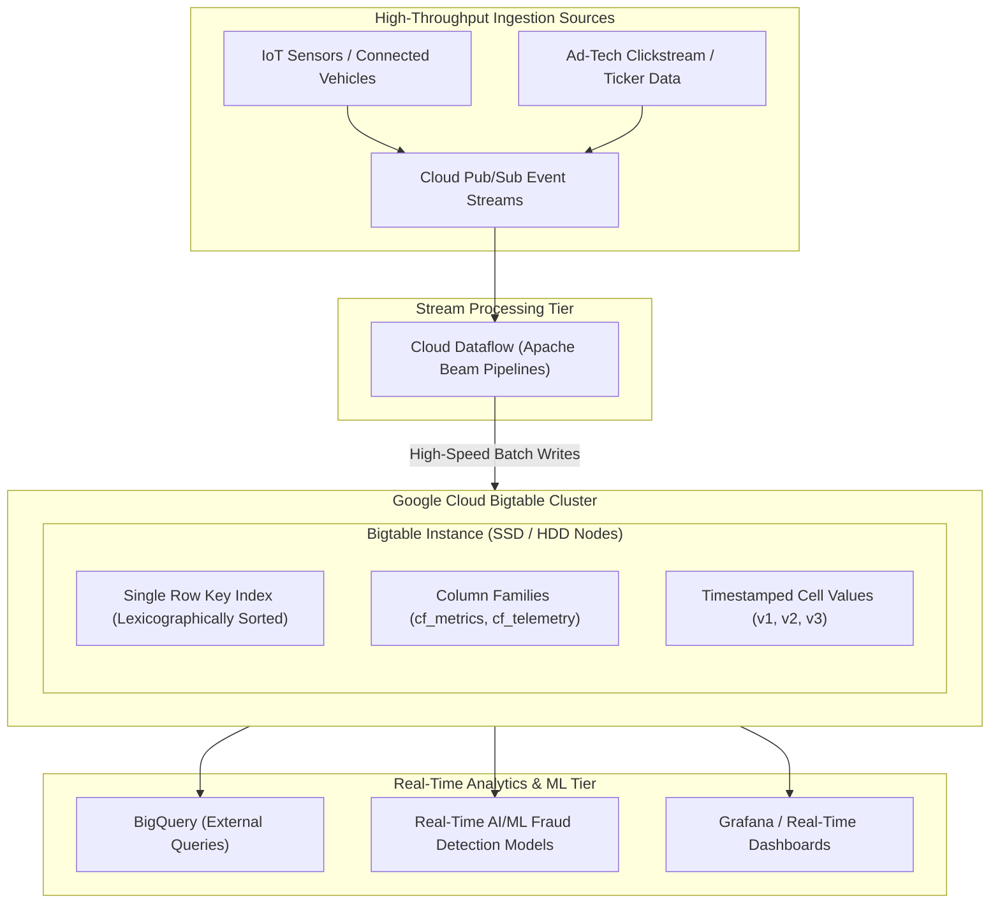

# Topic 55: Bigtable

---

## 1. What Is It?

**Google Cloud Bigtable** is a petabyte-scale, fully managed NoSQL wide-column database service designed for ultra-high-throughput read and write workloads requiring consistent sub-10-millisecond latency.

Bigtable is the exact same proprietary database engine that powers Google's core global services—including Google Search, Google Maps, YouTube, and Google Analytics.

Bigtable organizes data into sparse, multi-dimensional sorted maps indexed by a single **Row Key**, a **Column Family**, a **Column Qualifier**, and a **Timestamp**.

It handles massive analytical and operational workloads—such as IoT sensor streams, financial market ticker data, ad-tech event logs, and time-series telemetry—scaling seamlessly to millions of operations per second.

### Real-World Analogy
Think of Bigtable like a massive, automated high-speed logistics sorting conveyor belt operating inside an international airport cargo hub. Instead of searching through individual filing folders or filing cabinets (Relational DBs), packages (Data Rows) zoom past on the conveyor belt indexed by a barcoded tracking number (Row Key). Robotic arms (Bigtable Nodes) read and write thousands of barcode tags per millisecond without ever slowing down the belt, no matter how many petabytes of cargo pass through.

---

## 2. Where Does It Fit?

Bigtable acts as the high-throughput ingestion and time-series datastore, receiving streaming events from Dataflow/Pub-Sub and serving real-time analytics to BigQuery and machine learning models.



---

## 3. Core Concepts

| Bigtable Concept | Description | Example / Syntax | Best Practice |
|---|---|---|---|
| **Row Key** | Single primary key indexing a row; data is lexicographically sorted by Row Key. | `device_101#20260808T120000` | **Row Key Design is critical**: Avoid sequential keys (prevents hotspotting). |
| **Column Family** | Logical grouping of related columns stored together on disk. | `cf_telemetry` | Keep column families small (<10 per table); set GC garbage collection rules. |
| **Column Qualifier** | Specific column key inside a column family. | `cf_telemetry:temperature` | Can be created dynamically per row. |
| **Cell Timestamp** | Every cell value is versioned by a 64-bit microsecond timestamp. | `1786190000000000` | Enables storing historical value revisions inside a single cell. |
| **Bigtable Node** | Managed compute node managing a subset of table partitions (Tablets). | 3 Nodes = ~30,000 QPS (SSD) | Add nodes to scale IOPS and throughput linearly. |

---

## 4. How It Works

Lexicographical sorting and Tablet partitioning determine performance:

```text
Stream of writes arrives with Row Keys: [A#101, A#102, B#201, C#301]
              ↓
Bigtable sorts rows lexicographically by Row Key:
  Tablet 1 (Range: A#000 to A#999) -> Managed by Node 1
  Tablet 2 (Range: B#000 to C#999) -> Managed by Node 2
              ↓
(Hotspotting Threat): If all keys start with `2026-08-08...` -> ALL writes hit Tablet 1!
              ↓
(Correct Row Key): `hash(device_id)#2026-08-08...` -> Writes distributed evenly across ALL Nodes!
```

1. **Separation of Compute and Storage**: Bigtable nodes manage Tablet routing metadata, while actual data blocks reside in Google's Colossus distributed storage system. Node scaling takes seconds without data movement.
2. **Single-Row Atomicity**: Read and write operations are atomic at the single-row level.

---

## 5. Production Scenario

### Fleet Telemetry & IoT Predictive Maintenance Platform

```text
Requirement: Ingest 500,000 telemetry data points per second from 100,000 connected commercial vehicles with sub-10ms query latency.
    ↓
Architecture: Cloud Bigtable Instance (`bt-fleet-prod`) with SSD storage.
    ↓
Row Key Design Strategy:
  - Format: `reversed_tenant_id#hash(vehicle_id)#timestamp_reversed`
  - Example: `0091#a4f2#9999999999999`
    ↓
Column Families:
  - `cf_engine`: `speed`, `rpm`, `oil_temp`
  - `cf_gps`: `latitude`, `longitude`
    ↓
Scaling Policy: Autoscaling enabled (Min 6 nodes, Max 30 nodes based on 70% CPU target).
    ↓
Garbage Collection: Keep max 3 cell versions or delete cells older than 30 days.
    ↓
Monitoring: Cloud Monitoring tracking `server/latencies` (Target: <10ms) and `cluster/cpu_load`.
```

*Why Selected*: Lexicographically reversed Row Key design prevents hotspotting, while Bigtable's sub-10ms SSD performance processes 500k writes/sec seamlessly.

---

## 6. Hands-On Lab

### Prerequisites
- Active GCP Project.
- Cloud Shell or `gcloud` CLI.
- IAM permissions: `roles/bigtable.admin`.

### Console Method
1. Log into [Google Cloud Console](https://console.cloud.google.com/).
2. Navigate to **Databases** → **Bigtable**.
3. Click **CREATE INSTANCE** at top.
4. Set Instance name: `bt-telemetry-instance`, Instance ID: `bt-telemetry-instance`.
5. Storage type: **SSD**.
6. Cluster Configuration:
   - Cluster ID: `bt-cluster-uscentral1`.
   - Region: `us-central1`, Zone: `us-central1-a`.
   - Scaling mode: **Autoscaling** (Min nodes: `1`, Max nodes: `5`, Target CPU: `70%`).
7. Click **CREATE**.

### CLI Method
Create a Bigtable instance, table, column family, and query data using `cbt` CLI:

```bash
# Set project and instance variables
PROJECT_ID="your-gcp-project-id"
INSTANCE_ID="bt-telemetry-instance"
CLUSTER_ID="bt-cluster-uscentral1"

# 1. Create a Bigtable Instance using gcloud
gcloud bigtable instances create $INSTANCE_ID \
    --cluster=$CLUSTER_ID \
    --cluster-zone=us-central1-a \
    --cluster-num-nodes=1 \
    --display-name="Telemetry Datastore" \
    --storage-type=SSD

# 2. Configure cbt CLI configuration file
echo "project = $PROJECT_ID" > ~/.cbtrc
echo "instance = $INSTANCE_ID" >> ~/.cbtrc

# 3. Create a Bigtable Table named 'sensor_data'
cbt createtable sensor_data

# 4. Create a Column Family named 'cf_metrics'
cbt createfamily sensor_data cf_metrics

# 5. Insert a row into the table (RowKey: dev101#20260808)
cbt set sensor_data dev101#20260808 cf_metrics:temp=24.5 cf_metrics:status=OK

# 6. Read row data
cbt lookup sensor_data dev101#20260808
```

### Verification
*Expected Result*: `cbt lookup` displays row key `dev101#20260808`, column family `cf_metrics:temp`, value `24.5`, and 64-bit microsecond timestamp.

### Cleanup
Delete Bigtable instance:

```bash
gcloud bigtable instances delete $INSTANCE_ID --quiet
rm ~/.cbtrc
```

---

## 7. Security

### Identity & Encryption Safeguards
- **IAM Authorization**: Restrict access using `roles/bigtable.user` (data access) and `roles/bigtable.admin` (instance management).
- **CMEK Key Encryption**: Encrypt Bigtable clusters using Customer-Managed Encryption Keys (CMEK) via Cloud KMS.
- **App Profiles & IAM**: Use Bigtable App Profiles to route traffic safely and isolate analytical read traffic from critical transactional write traffic.

```text
BAD PRACTICE:
Designing Row Keys starting with sequential timestamps (e.g., `2026-08-08T12:00:00#device101`).
Risk: Causes Severe Hotspotting. All incoming writes land on a single Bigtable node while remaining nodes stay 100% idle.

PRODUCTION PRACTICE:
Design Row Keys starting with a hashed or high-cardinality prefix (`hash(device_id)#timestamp`). Ensures writes distribute evenly across all nodes.
```

---

## 8. Scaling & High Availability

Bigtable Cluster Replication & Performance:

```text
Single Cluster Instance (Zonal - 99.9% Availability SLA)
   ↓ (Multi-Cluster Replication Upgrade)
Dual-Cluster Replication (Replicates data asynchronously across Zone A and Zone B - 99.99% SLA)
   ↓ (Multi-Region Replication)
Multi-Cluster Instance (3+ Clusters across US, Europe, and Asia for global sub-10ms reads)
```

- **Linear Node Performance**: Each SSD Bigtable node provides approximately **10,000 QPS** (Read/Write) under typical workloads. Adding nodes scales throughput linearly.

---

## 9. Cost

### Bigtable Cost Structure
- **Node Provisioning Cost**: Charged per node hour (e.g., ~$0.65/node/hour for SSD in US regions).
- **Storage Capacity Charges**: Charged per GB/month for SSD (~$0.17/GB/mo) or HDD (~$0.026/GB/mo).
- **Minimum Instance Size**: A Bigtable cluster requires a minimum of 1 node (production recommended 3 nodes for HA SLA).

```text
FinOps Recommendation:
Use Bigtable Autoscaling (Min 1, Max 10 nodes). Automatically adds nodes during high-volume ingestion streams and scales down during off-peak hours.
```

---

## 10. Monitoring & Troubleshooting

### Bigtable Observability Tools
- **Key Visualizer**: Heatmap tool in Console that visualizes Row Key access patterns over time to identify hotspotting.
- **Cloud Monitoring Metrics**: Monitor `server/latencies` (p95/p99), `cluster/cpu_load`, and `cluster/node_count`.

### Troubleshooting Matrix

| Symptom | Possible Cause | What to Check | Fix |
|---|---|---|---|
| Single node CPU at 100% while other nodes idle | **Row Key Hotspotting** (Sequential timestamp or monotonically increasing keys) | Console **Key Visualizer** Heatmap | Redesign Row Key schema to use hashed or reversed prefixes. |
| Read/Write latency > 20ms | Bigtable cluster CPU load exceeding 70% target | Cloud Monitoring `cluster/cpu_load` | Add more nodes to the cluster or lower target CPU in Autoscaler. |
| High disk billing charges | Unused historical cell versions accumulating | Column Family Garbage Collection rules | Set Garbage Collection policy (`cbt setgc`) to delete old versions. |

---

## 11. Common Mistakes

```text
Mistake: Designing Bigtable Row Keys starting with a timestamp (e.g., `2026-08-08-12-00-00#device1`).
Why: Assuming time-series data should be sorted chronologically by default.
Impact: Creates severe hotspotting; 100% of write traffic hits a single node, causing write timeouts.
Correct approach: Prepend a high-entropy string (e.g., `hash(device_id)#timestamp`) to distribute writes across nodes.

Mistake: Provisioning Bigtable for small datasets (<300 Gigabytes).
Why: Selecting Bigtable for low-volume CRUD applications.
Impact: High minimum monthly cost (~$450+/month for 3 nodes) compared to Cloud SQL or Firestore.
Correct approach: Use Bigtable ONLY for large-scale datasets (>1 TB) or high-throughput streams (>10,000 QPS).
```

---

## 12. Production Best Practices

- [ ] Design **Row Keys** with high-entropy prefixes (hashed or reversed IDs) to prevent hotspotting.
- [ ] Use **Key Visualizer** to audit and validate Row Key access patterns.
- [ ] Enable **Autoscaling** (Target CPU: 70% for single cluster; 60% for multi-cluster).
- [ ] Deploy **Multi-Cluster Replication** across distinct zones for 99.99% availability SLA.
- [ ] Configure **Garbage Collection Policies** on Column Families to prune old cell versions.
- [ ] Use **App Profiles** to separate real-time operational traffic from batch analytical queries.

---

## 13. Hyperscaler / Enterprise Perspective

```text
Personal / Learning
  Single Node Instance → Sequential Row Keys → No Garbage Collection → Manual cbt writes
        ↓
Small Production
  Autoscaled SSD Cluster → Hashed Row Keys → Basic Key Visualizer Auditing
        ↓
Enterprise Environment
  Multi-Cluster Replication (Dual-Region) → Dataflow Pipeline Streaming → CMEK Encryption
        ↓
Hyperscaler Environment
  Petabyte Fleet Architecture → Automated Key Visualizer Anomaly Detection → Dedicated BigQuery External Queries → Chaos Outage Drills
```

In a hyperscaler environment, Bigtable forms the backbone of real-time ad-tech, financial trading, and IoT platforms. Dataflow pipelines stream millions of events per second into multi-cluster Bigtable instances, while automated Key Visualizer telemetry monitors row key distribution, alerting SRE teams instantly if a software deployment introduces key hotspotting.

---

## 14. Real Project Questions

### Q1: What is Row Key Hotspotting in Cloud Bigtable, and how do you prevent it?
**Answer:** Row Key Hotspotting occurs when a sequentially formatted Row Key schema (such as starting keys with a timestamp `2026-08-08...`) forces all incoming write operations onto a single Bigtable Tablet/Node while other nodes remain idle. It is prevented by prepending a high-entropy string or hash (such as `hash(device_id)#timestamp`) to distribute writes evenly across all cluster nodes.

### Q2: Why is Bigtable considered a separation of compute and storage architecture?
**Answer:** Bigtable compute nodes do not store actual data blocks on local physical drives. Nodes manage indexing metadata, routing, and memory caches for a range of Row Keys (Tablets), while the actual data bytes reside in Google's Colossus distributed file system. This allows adding or removing Bigtable nodes in seconds without migrating underlying data blocks.

### Q3: When should a database architect choose Cloud Bigtable over Cloud SQL or Cloud Spanner?
**Answer:** An architect should choose Bigtable for **ultra-high-throughput NoSQL workloads** (10,000 to 1,000,000+ QPS) requiring sub-10ms read/write latency on massive datasets (terabytes to petabytes), such as time-series IoT data, ad-tech clickstreams, or market tickers. Bigtable is NOT suitable for complex multi-table SQL joins or ACID transactions across multiple rows.

---

## 15. Quick Decision Guide

| Requirement | Recommended Approach | Reason |
|---|---|---|
| Ingesting 500,000 IoT sensor readings per second with sub-10ms write latency | **Cloud Bigtable (SSD Cluster + Autoscaling)** | Optimized for massive, high-throughput time-series NoSQL streaming writes. |
| Complex relational e-commerce database requiring SQL joins and ACID transactions | **Cloud SQL or Cloud Spanner (NOT Bigtable)** | Bigtable is NoSQL and does not support SQL joins or multi-row transactions. |
| Analyzing historical Bigtable data using standard ANSI SQL queries | **BigQuery External Table over Bigtable** | Allows running SQL queries directly on Bigtable data without moving files. |

### When should I use it?
- Essential NoSQL service for petabyte-scale, high-throughput time-series, IoT, ad-tech, and real-time analytical workloads.

### When should I NOT use it?
- Do not use Bigtable for small datasets (<300 GB) or applications requiring relational SQL joins.

---

## 16. Related Services

```text
                 [55. Bigtable]
                /       |       \
        Cloud Dataflow BigQuery  Cloud KMS
         (Stream Ingest) (SQL)    (CMEK)
            |           |           |
        High-Speed  Federated   Encryption
         ETL Writes   Queries     at Rest
```

- **Cloud Dataflow**: Primary stream processing engine for writing high-volume data to Bigtable.
- **BigQuery**: Executes federated SQL queries directly against Bigtable tables.
- **Key Visualizer**: Built-in diagnostic tool for auditing Row Key access patterns.

---

## 17. Cheat Sheet

### Core Concepts
- **Data Model**: Sparse, wide-column map sorted lexicographically by Row Key.
- **Latency**: Consistent sub-10ms (SSD).
- **Anti-Pattern**: Sequential Row Keys (Causes Hotspotting).
- **Node Capacity**: ~10,000 QPS per SSD node.

### Useful Commands
```bash
# Create a Bigtable instance with 3 SSD nodes
gcloud bigtable instances create INSTANCE_ID \
    --cluster=CLUSTER_ID --cluster-zone=us-central1-a \
    --cluster-num-nodes=3 --storage-type=SSD

# Create a table using cbt CLI
cbt createtable TABLE_NAME

# Create a column family
cbt createfamily TABLE_NAME FAMILY_NAME

# Read row data
cbt lookup TABLE_NAME ROW_KEY
```

---

## 18. Learning Connection

- **Previous Topic**: [54. Firestore](../54-firestore/README.md)
- **Next Topic**: [56. Spanner](../56-spanner/README.md)
