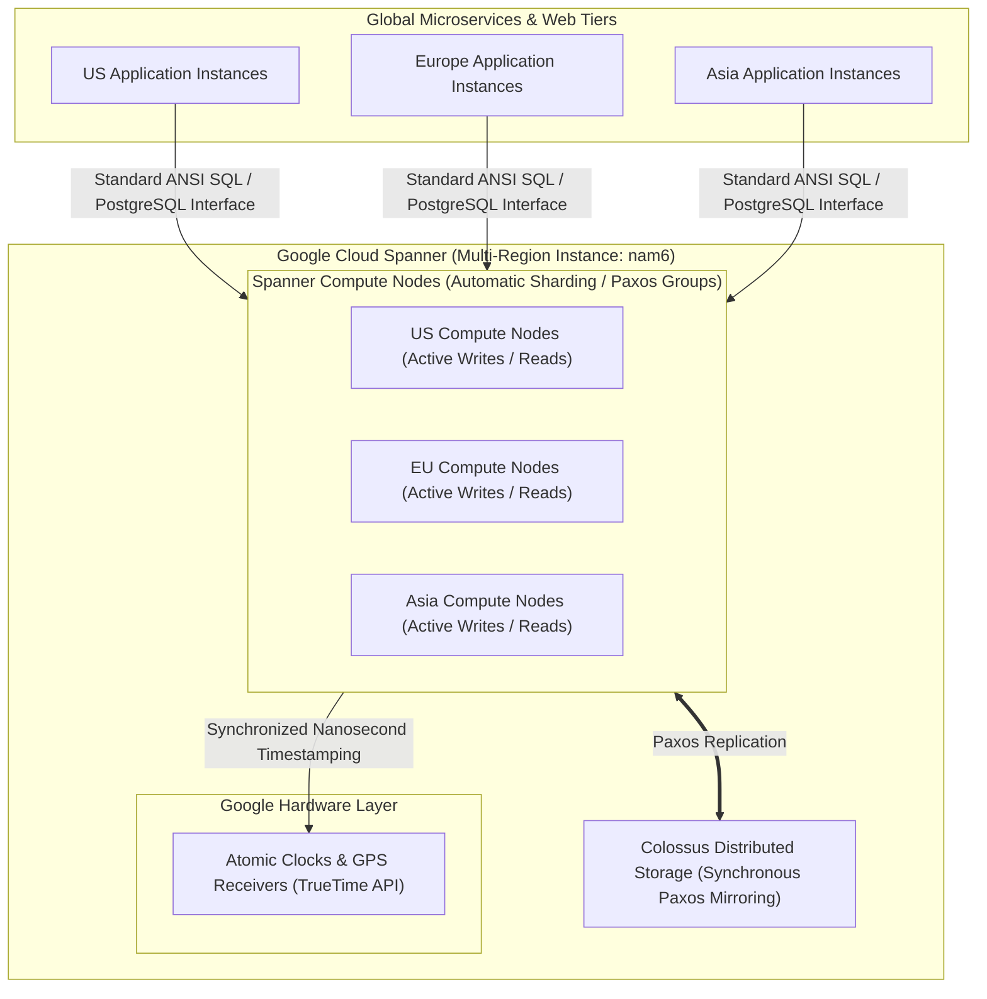

# Topic 56: Spanner

---

## 1. What Is It?

**Google Cloud Spanner** is a fully managed, enterprise-grade, globally distributed SQL database that combines the strict ACID transactional guarantees of traditional relational databases with the infinite horizontal scalability and high availability of NoSQL systems.

Cloud Spanner is the first enterprise database service to break the "CAP Theorem" trade-off in practice, providing **External Consistency** (serializable ACID transactions across regions worldwide) while delivering **99.999% (5 9's) availability SLA** (less than 5 minutes of downtime per year).

Spanner achieves this groundbreaking performance using **TrueTime**, Google's proprietary global hardware clock synchronization system that utilizes atomic clocks and GPS receivers installed across Google's datacenters.

It supports standard **ANSI SQL**, PostgreSQL-compatible interfaces, automatic sharding, schema updates without downtime, and multi-region active-active synchronous replication.

### Real-World Analogy
Think of Cloud Spanner like a global network of synchronized high-precision atomic clocks installed inside international bank vaults across New York, London, and Tokyo. When a customer transfers $100 from London to Tokyo, the atomic clocks (TrueTime) stamp the exact nanosecond time of the transaction. Because every bank vault agrees on the precise global time down to the nanosecond, all branch vaults process transfers simultaneously with zero risk of double-spending, even across continents.

---

## 2. Where Does It Fit?

Cloud Spanner serves as the global transactional core for mission-critical applications (banking, ledger systems, inventory control) requiring multi-region scale with full SQL ACID guarantees.



---

## 3. Core Concepts

| Spanner Concept | Description | Value / Example | Best Practice |
|---|---|---|---|
| **TrueTime API** | Hardware clock synchronization system using atomic clocks + GPS. | Bounded clock uncertainty ($\epsilon$) | Enables external consistency without locking databases globally. |
| **External Consistency** | Strongest transaction guarantee; equivalent to serializability globally. | Strict real-time transaction ordering | Guarantees global ACID transactions without stale reads. |
| **Paxos Consensus** | Distributed consensus protocol replicating write transactions across nodes. | Quorum voting across 3+ regions | Ensures data survival even during total regional outages. |
| **Interleaved Tables** | Physical co-location of child table rows alongside parent table rows on disk. | Parent `Customers` -> Child `Orders` | **Critical for performance**: Pre-joins parent/child data physically. |
| **Spanner Processing Units** | Unit of compute capacity (1,000 Processing Units = 1 Spanner Node). | `100` to `1,000` PUs | Scale compute capacity in increments of 100 PUs for small workloads. |

---

## 4. How It Works

TrueTime and Paxos consensus execute multi-region ACID transactions:

```text
Application initiates multi-region transaction (Update Account A in NY, Account B in London)
              ↓
Spanner Leader Node queries TrueTime API -> Receives nanosecond time window [t_min, t_max]
              ↓
Leader assigns Commit Timestamp (t_commit > t_max) to transaction
              ↓
Paxos Group votes across multi-region nodes -> Quorum reached (Majority vote OK)
              ↓
Transaction committed -> TrueTime waits until t_current > t_commit before returning OK
              ↓
Guarantees any transaction starting AFTER this commit receives a HIGHER timestamp globally!
```

1. **Schema Updates Without Downtime**: Altering database schemas (adding columns, indexes) executes in the background without locking tables or interrupting active transactions.
2. **PostgreSQL Interface**: Developers can interact with Spanner using standard PostgreSQL SQL syntax and drivers.

---

## 5. Production Scenario

### Global Financial Ledger & Real-Time Inventory Control

```text
Requirement: Process global credit card transactions across North America and Europe with 99.999% SLA, strict ACID compliance, and zero risk of double-spending or stale reads.
    ↓
Architecture: Cloud Spanner Multi-Region Instance (`nam6` - Iowa, South Carolina, Northern Virginia, Oregon).
    ↓
Data Model (Interleaved Tables):
  ```sql
  CREATE TABLE Customers (
      CustomerId STRING(36) NOT NULL,
      Name STRING(100),
  ) PRIMARY KEY (CustomerId);

  CREATE TABLE Accounts (
      CustomerId STRING(36) NOT NULL,
      AccountId STRING(36) NOT NULL,
      Balance NUMERIC,
  ) PRIMARY KEY (CustomerId, AccountId),
    INTERLEAVE IN PARENT Customers ON DELETE CASCADE;
  ```
    ↓
Scale & SLA: 5 Spanner Nodes (5,000 Processing Units) providing 99.999% SLA and automatic horizontal sharding.
    ↓
Monitoring: Cloud Monitoring tracking `spanner/cpu/utilization` (Target: <45% for multi-region HA).
```

*Why Selected*: Interleaved tables physically co-locate customer accounts on disk for high performance, while Spanner's TrueTime engine delivers 99.999% multi-region SLA with strict ACID guarantees.

---

## 6. Hands-On Lab

### Prerequisites
- Active GCP Project.
- Cloud Shell or `gcloud` CLI.
- IAM permissions: `roles/spanner.admin`.

### Console Method
1. Log into [Google Cloud Console](https://console.cloud.google.com/).
2. Navigate to **Databases** → **Spanner**.
3. Click **CREATE INSTANCE** at top.
4. Set Instance name: `spanner-ledger-prod`, Instance ID: `spanner-ledger-prod`.
5. Configuration: Select **Regional** → `us-central1` (or **Multi-region** `nam6`).
6. Capacity: Select **Processing units** → Set to `100` PUs (0.1 Node for testing).
7. Click **CREATE**.
8. Click **CREATE DATABASE**:
   - Database name: `finance_db`, Database dialect: **Google Standard SQL**.
   - Click **CREATE**.
9. In the SQL Studio tab, run DDL:
   ```sql
   CREATE TABLE Users (
       UserId STRING(36) NOT NULL,
       Email STRING(100),
   ) PRIMARY KEY (UserId);
   ```

### CLI Method
Create a Cloud Spanner instance, database, table, and execute SQL queries using `gcloud`:

```bash
# Set project and instance variables
PROJECT_ID="your-gcp-project-id"
INSTANCE_ID="spanner-ledger-prod"
DB_NAME="finance_db"

# 1. Create a Spanner Instance with 100 Processing Units (0.1 Node)
gcloud spanner instances create $INSTANCE_ID \
    --config=regional-us-central1 \
    --description="Global Ledger Instance" \
    --processing-units=100

# 2. Create a Database inside the Spanner Instance
gcloud spanner databases create $DB_NAME \
    --instance=$INSTANCE_ID

# 3. Execute DDL to create a table
gcloud spanner databases ddl update $DB_NAME \
    --instance=$INSTANCE_ID \
    --ddl="CREATE TABLE Customers (CustomerId STRING(36) NOT NULL, Name STRING(100)) PRIMARY KEY (CustomerId)"

# 4. Insert data into the table
gcloud spanner databases execute-sql $DB_NAME \
    --instance=$INSTANCE_ID \
    --sql="INSERT INTO Customers (CustomerId, Name) VALUES ('c_101', 'Alice Smith')"

# 5. Query data using ANSI SQL
gcloud spanner databases execute-sql $DB_NAME \
    --instance=$INSTANCE_ID \
    --sql="SELECT * FROM Customers"
```

### Verification
*Expected Result*: `gcloud spanner databases execute-sql` returns query results displaying `CustomerId: c_101` and `Name: Alice Smith`.

### Cleanup
Delete database and Spanner instance:

```bash
gcloud spanner databases delete $DB_NAME --instance=$INSTANCE_ID --quiet
gcloud spanner instances delete $INSTANCE_ID --quiet
```

---

## 7. Security

### Identity, Encryption & Key Isolation
- **Fine-Grained Access Control (FGAC)**: Spanner supports fine-grained database roles, allowing security leads to restrict access to specific tables or columns down to individual IAM principals.
- **Customer-Managed Encryption Keys (CMEK)**: Encrypt Spanner database storage using Cloud KMS keys for enterprise compliance.
- **Data Protection**: Automatic server-side AES-256 encryption at rest; all network traffic between Spanner nodes and client libraries is encrypted via TLS.

```text
BAD PRACTICE:
Designing Spanner Primary Keys using monotonically increasing values (e.g., auto-incrementing integers `1, 2, 3` or sequential timestamps).
Risk: Severe Hotspotting. All new rows are written to a single split/node, crippling Spanner's distributed write throughput.

PRODUCTION PRACTICE:
Use UUID v4 or bit-reversed primary keys (`STRING(36)` UUIDs). Ensures writes distribute evenly across all Spanner split partitions.
```

---

## 8. Scaling & High Availability

Spanner Availability SLAs & Node Scaling:

```text
Regional Spanner Instance (Replicated across 3 Availability Zones -> 99.99% Availability SLA)
   ↓ (Enterprise Global Scale Upgrade)
Multi-Region Spanner Instance (Replicated across 3+ Regions -> 99.999% Availability SLA - <5 mins downtime/year)
```

- **Linear Scaling**: Scaling a Spanner instance from 1 Node to 10 Nodes increases compute throughput, memory cache, and max IOPS linearly without application downtime or downtime maintenance windows.

---

## 9. Cost

### Spanner Pricing Architecture
- **Processing Units (PUs) / Nodes**: Billed hourly per 100 PUs or per Node (100 PUs = ~$0.09/hour; 1 Node = 1,000 PUs = ~$0.90/hour for Regional).
- **Storage Capacity**: Billed per GB/month for database storage (Regional ~$0.30/GB/mo; Multi-Region ~$0.50/GB/mo).
- **Backup Storage**: Charged for automated and manual database backups stored in Cloud Storage.

```text
FinOps Sizing Tip:
Use Processing Units (PUs) for small workloads. Scale from 100 PUs up to 1,000 PUs gradually as database traffic grows, avoiding paying for a full 1-node instance upfront.
```

---

## 10. Monitoring & Troubleshooting

### Spanner Observability Tools
- **Key Visualizer**: Built-in heatmap tool in Console that visualizes primary key access patterns to identify split hotspotting.
- **Lock Insights & Query Insights**: APM diagnostic dashboards in Console for identifying lock contention and slow SQL execution plans.

### Troubleshooting Matrix

| Symptom | Possible Cause | What to Check | Fix |
|---|---|---|---|
| High write latency / Single split CPU high | **Primary Key Hotspotting** (Monotonically increasing keys) | Console **Key Visualizer** Heatmap | Redesign Primary Keys using UUID v4 or bit-reversed hashes. |
| High CPU utilization warning | Spanner instance CPU exceeding 65% (Regional) or 45% (Multi-Region) | Cloud Monitoring `spanner/cpu/utilization` | Increase Processing Units (e.g., from 500 PUs to 1,000 PUs). |
| Query execution slow | Missing index or un-interleaved table scan | Console **Query Insights** query plan | Add secondary indexes or interleave child tables into parent tables. |

---

## 11. Common Mistakes

```text
Mistake: Using auto-incrementing integer IDs or sequential timestamps as Primary Keys in Spanner tables.
Why: Carrying over traditional single-server MySQL/PostgreSQL primary key patterns.
Impact: Severe primary key hotspotting; 100% of write operations hit a single split node, bottlenecking performance.
Correct approach: Use UUID v4 (`STRING(36)`) or bit-reversed integers for all Spanner primary keys.

Mistake: Running Multi-Region Spanner instances at >45% average CPU utilization.
Why: Attempting to maximize compute resource usage to save money.
Impact: Inability to handle automatic regional failover during a major regional datacenter outage.
Correct approach: Keep Multi-Region Spanner CPU utilization under 45% to reserve headroom for regional failover traffic.
```

---

## 12. Production Best Practices

- [ ] Use **UUID v4** or bit-reversed primary keys to prevent split hotspotting.
- [ ] Use **Interleaved Tables** to physically co-locate child rows with parent rows for high-performance joins.
- [ ] Select **Multi-Region instances** (`nam6` or `eur3`) for mission-critical applications requiring 99.999% SLA.
- [ ] Keep average CPU utilization under **65%** for Regional instances and **45%** for Multi-Region instances.
- [ ] Use **Query Insights** and **Lock Insights** to diagnose and optimize slow SQL queries and lock contention.
- [ ] Automate instance, database, DDL schema, and IAM role provisioning using Infrastructure as Code (Terraform).

---

## 13. Hyperscaler / Enterprise Perspective

```text
Personal / Learning
  Regional Instance (100 PUs) → Standard SQL Tables → Sequential Primary Keys
        ↓
Small Production
  Regional HA Instance (1 Node) → Interleaved Tables → UUID Primary Keys
        ↓
Enterprise Environment
  Multi-Region Instance (nam6 - 99.999% SLA) → Fine-Grained Access Control (FGAC) → CMEK Key Encryption
        ↓
Hyperscaler Environment
  Automated Global Ledger Infrastructure → Multi-Region TrueTime Monitoring → Automated CI/CD DDL Schema Migration Pipelines
```

In a hyperscaler environment, Cloud Spanner serves as the global financial core for ledger processing, inventory allocation, and billing systems. Enterprise platform teams manage DDL schema migrations using automated CI/CD pipelines. Databases run across Multi-Region configurations (`nam6`), delivering 99.999% availability SLA with zero-downtime schema evolution.

---

## 14. Real Project Questions

### Q1: How does Google Cloud Spanner break the CAP Theorem trade-off in practice?
**Answer:** The CAP Theorem states a distributed database can guarantee at most two of Consistency, Availability, and Partition Tolerance. Spanner achieves both **External Consistency (Strict ACID)** and **99.999% Availability SLA** by leveraging Google's private subsea network infrastructure and **TrueTime**—a hardware clock synchronization system utilizing atomic clocks and GPS receivers installed across Google datacenters to bound clock uncertainty ($\epsilon$).

### Q2: What are Interleaved Tables in Cloud Spanner, and why do they improve query performance?
**Answer:** Interleaved Tables are a parent-child schema structure where child table rows (e.g., `Orders`) are physically co-located on disk right next to their corresponding parent table row (e.g., `Customers`). This co-location eliminates network hops during JOIN operations, enabling high-performance, single-split reads and writes across related records.

### Q3: Why are auto-incrementing primary keys strictly forbidden in Cloud Spanner schemas?
**Answer:** Spanner automatically partitions data into range-based splits based on Primary Keys. If primary keys are auto-incrementing (1, 2, 3...), every new write operation lands on the exact same end-range split node, causing severe **Hotspotting** and crippling write throughput. Using UUID v4 or bit-reversed keys spreads writes uniformly across all nodes.

---

## 15. Quick Decision Guide

| Requirement | Recommended Approach | Reason |
|---|---|---|
| Global banking ledger requiring 99.999% SLA and multi-region active-active ACID transactions | **Cloud Spanner (Multi-Region `nam6`)** | Delivers external consistency globally with <5 mins downtime/year SLA. |
| Traditional single-region relational application (PostgreSQL/MySQL) with standard traffic | **Cloud SQL (Regional HA)** | Simpler setup, lower base cost, fully managed PostgreSQL/MySQL compatibility. |
| High-throughput NoSQL IoT time-series streaming ingestion (>100,000 writes/sec) | **Cloud Bigtable (NOT Spanner)** | Bigtable is optimized for raw NoSQL time-series streams; Spanner is for relational SQL. |

### When should I use it?
- Essential database service for mission-critical, enterprise, multi-region applications requiring global scale and strict SQL ACID compliance.

### When should I NOT use it?
- Do not use Spanner for small single-region workloads where Cloud SQL provides lower base costs and simpler setup.

---

## 16. Related Services

```text
                  [56. Spanner]
                 /      |      \
        TrueTime API Cloud KMS   Cloud Audit
        (Nanoseconds) (CMEK)     Logs
            |           |          |
        Hardware    Encryption  DDL & SQL
       Sync Clocks   at Rest    Audit Sinks
```

- **TrueTime API**: Hardware clock synchronization system underpinning Spanner's consistency.
- **Cloud KMS**: Manages Customer-Managed Encryption Keys (CMEK) for Spanner storage.
- **Cloud Monitoring**: Tracks CPU utilization, lock contention, and Query Insights.

---

## 17. Cheat Sheet

### Key Metrics & SLAs
- **Availability SLA**: 99.999% (Multi-Region) / 99.99% (Regional).
- **Consistency**: External Consistency (Strict Global ACID).
- **Clock Engine**: TrueTime (Atomic Clocks + GPS).
- **Primary Keys**: UUID v4 (NO auto-incrementing IDs).

### Useful Commands
```bash
# Create a Spanner Instance with 100 Processing Units
gcloud spanner instances create INSTANCE_NAME \
    --config=regional-us-central1 --description="DESCRIPTION" --processing-units=100

# Create a database inside the instance
gcloud spanner databases create DB_NAME --instance=INSTANCE_NAME

# Execute SQL query against a Spanner database
gcloud spanner databases execute-sql DB_NAME --instance=INSTANCE_NAME --sql="SELECT 1"
```

---

## 18. Learning Connection

- **Previous Topic**: [55. Bigtable](../55-bigtable/README.md)
- **Next Topic**: [57. Memorystore](../57-memorystore/README.md)
