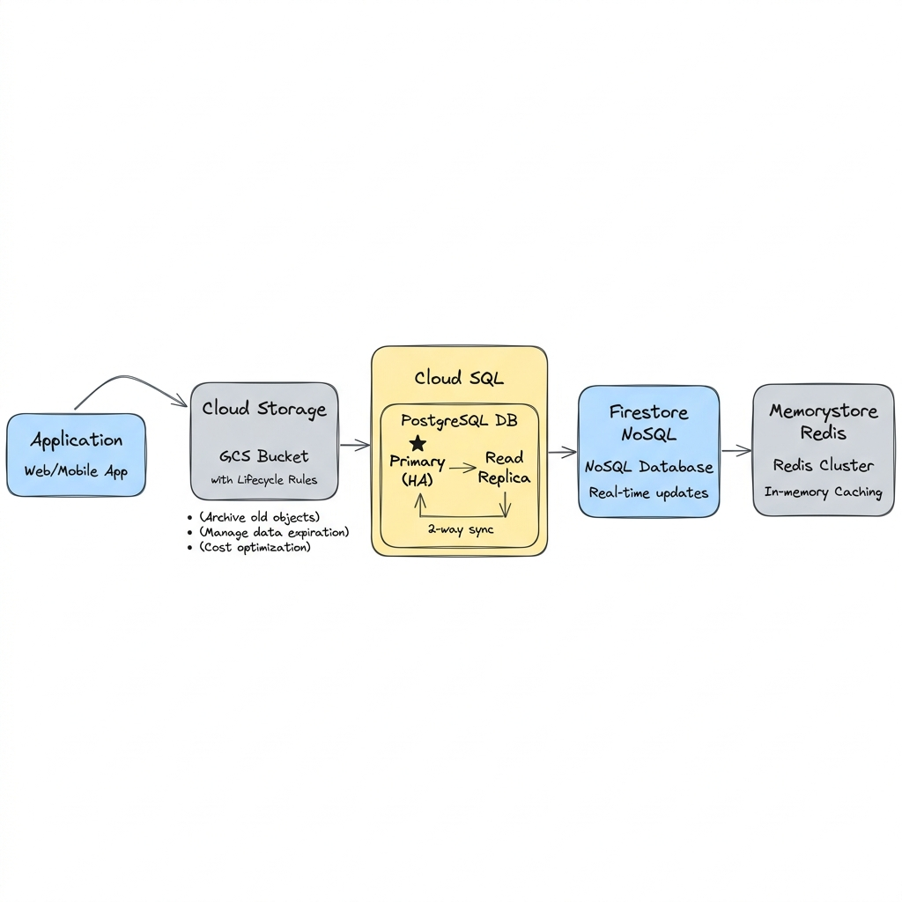
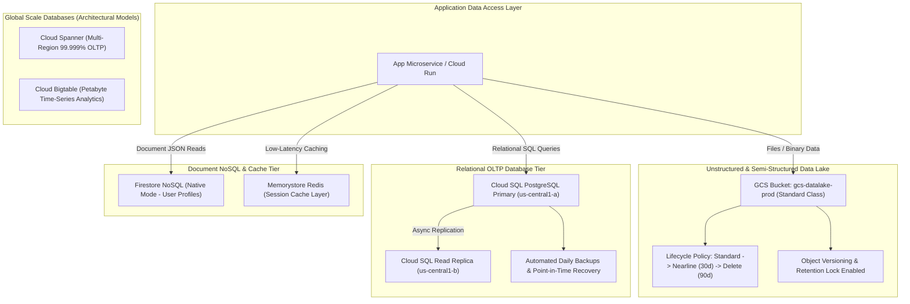

# Project 5: Polyglot Multi-Tier Enterprise Data Storage & Managed Database Architecture

---

## 1. Project Overview

Welcome to **Project 5: Polyglot Multi-Tier Data Storage & Managed Database Architecture**. This hands-on project synthesizes all 12 topics in **Module 05 (Storage & Databases)** into a production-grade enterprise data persistence tier optimized for **GCP Free Trial Accounts**.

### Objectives
In this project, you will:
1. **Configure Object Lifecycle & CMEK Encryption**: Provision Cloud Storage (GCS) buckets with object versioning, retention locks, customer-managed encryption keys (CMEK), and lifecycle tiering rules.
2. **Deploy Managed Relational Databases**: Provision a High-Availability (HA) Cloud SQL PostgreSQL instance with automated backups and read replicas.
3. **Seed Document NoSQL Stores**: Initialize Firestore collections for serverless, low-latency document querying.
4. **Evaluate High-Throughput & Analytical Stores**: Explore architectural patterns for Cloud Bigtable (IoT/Time-series), Cloud Spanner (Global Relational OLTP), and Memorystore Redis (In-memory Caching).
5. **Enforce Database Security & Teardown**: Enforce private IP database connectivity and zero-leak resource cleanup.

---

## 2. Architecture & Data Persistence Tier

The project provisions a multi-tier polyglot data persistence layout:





> [!IMPORTANT]
> **Free Trial Safety & Cost Controls**:
> - **GCS Always Free**: Cloud Storage includes 5 GB-months free in `us-central1`.
> - **Cloud SQL Tiering**: Uses a lightweight `db-f1-micro` instance (~$0.015/hr) for testing.
> - **Firestore Free Allowance**: Includes 1 GB storage and 50,000 document reads/day free.
> - **Automated Cleanup**: Bigtable, Spanner, and Memorystore patterns are provided via zero-cost inspection scripts; execute `./scripts/cleanup_databases.sh` after testing to stop all billing!

---

## 3. Module Topics Covered

| Topic Number & Name | Project Integration Point |
|---|---|
| **46. Cloud Storage** & **47. Buckets & Objects** | Bucket creation, naming rules, blob uploads, and IAM access controls. |
| **48. Storage Classes** & **49. Object Lifecycle** | Defining automated transition from Standard to Nearline to Coldline (`configs/gcs_lifecycle.json`). |
| **50. Versioning & Retention** & **51. Encryption/CMEK** | Enabling object versioning and Customer-Managed Encryption Keys (KMS). |
| **52. Cloud SQL** & **53. High Availability** | Provisioning PostgreSQL HA instance with automated backups and read replicas. |
| **54. Firestore** | Initializing Firestore in Native Mode for document storage. |
| **55. Cloud Bigtable** | Auditing Bigtable instance specs for high-throughput time-series workloads. |
| **56. Cloud Spanner** | Inspecting multi-region 99.999% availability SQL relational database schemas. |
| **57. Memorystore** | Configuring in-memory Redis caching parameters. |

---

## 4. Hands-On Execution Guide

### Step 1: Navigate to Project 5 Workspace

Open Google Cloud Shell or local terminal:

```bash
cd "05-storage-and-databases/project-05-storage-and-databases"
chmod +x scripts/*.sh
```

---

### Step 2: Inspect GCS Object Lifecycle Configuration

Inspect `configs/gcs_lifecycle.json` which automates object storage tiering:

```bash
cat configs/gcs_lifecycle.json
```

*File View (`configs/gcs_lifecycle.json`)*:
```json
{
  "rule": [
    {
      "action": { "type": "SetStorageClass", "storageClass": "NEARLINE" },
      "condition": { "age": 30, "matchesStorageClass": ["STANDARD"] }
    },
    {
      "action": { "type": "Delete" },
      "condition": { "numNewerVersions": 3 }
    }
  ]
}
```

---

### Step 3: Run Database & Storage Provisioning Script

Execute `scripts/provision_databases.sh` to automate:
1. Creating a GCS bucket with Object Versioning and Lifecycle policies.
2. Provisioning a Cloud SQL PostgreSQL instance (`db-f1-micro`) with automated backups.
3. Initializing a Firestore NoSQL database instance.

```bash
./scripts/provision_databases.sh
```

*Expected Script Output Snippet*:
```text
=====================================================
GCP Storage & Managed Databases Deployment
=====================================================
[INFO] Creating GCS Bucket: gcs-datalake-proj-fund-5283...
[SUCCESS] GCS Bucket created with Versioning enabled.
[INFO] Applying Storage Lifecycle Policy (configs/gcs_lifecycle.json)...
[SUCCESS] Lifecycle policy applied.
[INFO] Provisioning Cloud SQL PostgreSQL (db-f1-micro)...
[SUCCESS] Cloud SQL instance active: sql-postgres-dev.
[INFO] Initializing Firestore NoSQL database...
[SUCCESS] Firestore initialized in Native Mode.
```

---

### Step 4: Test Object Operations & Versioning in GCS

Test GCS object versioning and file uploads:

```bash
# 1. Upload a test file to GCS
echo "Version 1 Data" > sample.txt
gcloud storage cp sample.txt gs://$(gcloud config get-value project)-datalake/sample.txt

# 2. Overwrite file with Version 2
echo "Version 2 Updated Data" > sample.txt
gcloud storage cp sample.txt gs://$(gcloud config get-value project)-datalake/sample.txt

# 3. List all object versions stored in bucket
gcloud storage ls --all-versions gs://$(gcloud config get-value project)-datalake/sample.txt
```

---

### Step 5: Test Cloud SQL Relational Queries

Connect to Cloud SQL and verify database connectivity:

```bash
# Obtain Cloud SQL connection name
INSTANCE_NAME="sql-postgres-dev"
gcloud sql instances describe ${INSTANCE_NAME} --format="value(connectionName)"
```

---

## 5. Verification & Testing

Verify storage and database status via CLI:

```bash
# 1. Check GCS Bucket Lifecycle Rules
gcloud storage buckets describe gs://$(gcloud config get-value project)-datalake --format="yaml(lifecycle)"

# 2. Check Cloud SQL Backup Configuration
gcloud sql instances describe sql-postgres-dev --format="yaml(settings.backupConfiguration)"
```

---

## 6. Troubleshooting & Common Issues

| Symptom / Error | Root Cause | Resolution |
|---|---|---|
| Cloud SQL creation taking > 5 minutes | Cloud SQL API initializing storage volumes. | Expected behavior; wait 5-8 minutes for PostgreSQL cluster initialization to complete. |
| `gcloud storage cp` fails with Access Denied | IAM permissions missing `roles/storage.objectAdmin`. | Grant `Storage Object Admin` role to active account in IAM settings. |
| Firestore creation fails with `Database Already Exists` | Project already initialized in Datastore or Native mode. | Verify active Firestore database mode via GCP Console. |

---

## 7. Project Cleanup

To delete Cloud SQL instances, GCS buckets, and test data, run:

```bash
./scripts/cleanup_databases.sh
```

---

## 8. Summary & Next Steps

Congratulations! You have completed **Project 5: Polyglot Multi-Tier Data Storage & Managed Database Architecture**. You have mastered GCS lifecycle policies, versioning, Cloud SQL PostgreSQL, and Firestore.

- **Next Project**: [Project 6: Enterprise Production GKE Autopilot Microservices Platform](../../06-containers-and-kubernetes/project-06-containers-and-kubernetes/README.md)
