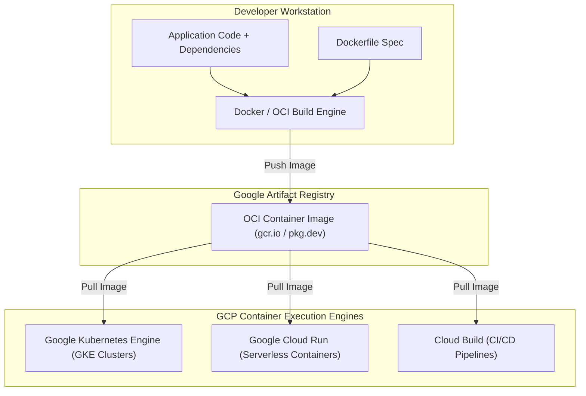

# Topic 58: Container Fundamentals

---

## 1. What Is It?

A **Container** is a lightweight, standalone, executable software package that bundles application source code together with all its necessary runtime dependencies, system libraries, binaries, and configuration files.

Unlike traditional Virtual Machines (VMs) that virtualize physical hardware and run full independent guest operating systems (consuming gigabytes of RAM and taking minutes to boot), containers share the host operating system kernel using Linux kernel namespaces and control groups (cgroups).

This containerization architecture delivers sub-second startup times, minimal memory footprints, high resource density, and complete operational portability across developer laptops, local test servers, Google Cloud Run, and Google Kubernetes Engine (GKE).

### Real-World Analogy
Think of a Container like a standardized ISO intermodal shipping container used on cargo ships. Instead of loading loose furniture, boxes, and machinery directly onto a ship's deck (Virtual Machines), everything is packed into a standardized 40-foot steel container (Docker Image). The crane operator (Container Runtime) doesn't care whether the container holds clothing, electronics, or car parts—the container fits perfectly on any cargo ship, train, or semi-truck in the world (Laptop, On-Prem, or GCP Cloud) without modifications.

---

## 2. Where Does It Fit?

Container fundamentals form the core packaging unit for modern cloud-native deployments across Google Cloud Platform services.



---

## 3. Core Concepts

| Concept | Description | Example / Syntax | Best Practice |
|---|---|---|---|
| **Container Image** | Immutable read-only template containing application code, runtime, and libraries. | `us-docker.pkg.dev/proj/repo/app:v1.0` | Multi-stage builds; keep image sizes under 100 MB. |
| **Container Runtime** | Low-level software executing containers on a host OS (`containerd`, `CRI-O`). | `containerd` (GKE default runtime) | Use OCI-compliant container runtimes. |
| **Namespaces** | Linux kernel feature isolating process trees, network, mounts, and user IDs. | `PID`, `NET`, `MNT`, `IPC`, `UTS` | Do not run container processes as `root`. |
| **Control Groups (cgroups)** | Linux kernel feature limiting hardware resource consumption (CPU, Memory, I/O). | `cpu: 500m`, `memory: 512Mi` | Set explicit memory limits to prevent host OOM crashes. |
| **OCI Standard** | Open Container Initiative open specification for container formats and runtimes. | OCI Image Specification | Ensure built images adhere to OCI specifications. |

---

## 4. How It Works

Container isolation relies on Linux Kernel Cgroups and Namespaces:

```text
Host Operating System Kernel (Linux 6.x)
              ↓
Cgroups allocate CPU / Memory limits (e.g., Max 1 vCPU, 512 MB RAM)
              ↓
Namespaces isolate system visibility:
  - PID Namespace: Container sees only its own processes (PID 1)
  - NET Namespace: Container receives virtual network interface (eth0)
  - MNT Namespace: Container sees isolated root filesystem (OverlayFS)
              ↓
Containerized Process runs directly on Host Kernel at bare-metal execution speed!
```

1. **OverlayFS Layers**: Container images consist of stacked read-only layers. When a container runs, a thin read-write container layer is added to the top of the stack, keeping the base image immutable.
2. **Sub-Second Boot**: Containers execute directly on the host kernel, bypassing OS bootloaders and initialization procedures.

---

## 5. Production Scenario

### Multi-Stage Microservice Container Image Optimization

```text
Requirement: Package a Go web application into an OCI container image for GKE deployment, minimizing image size and eliminating security vulnerabilities.
    ↓
Architecture: Multi-Stage `Dockerfile` building a minimal `distroless` image.
    ↓
Dockerfile Specification:
  ```dockerfile
  # Stage 1: Build binary
  FROM golang:1.22-alpine AS builder
  WORKDIR /app
  COPY . .
  RUN CGO_ENABLED=0 GOOS=linux go build -o server .

  # Stage 2: Minimal runtime image
  FROM gcr.io/distroless/static-debian12
  COPY --from=builder /app/server /server
  USER nonroot:nonroot
  ENTRYPOINT ["/server"]
  ```
    ↓
Result: Image size reduced from 850 MB to 15 MB; shell environments, package managers, and root access completely removed.
    ↓
Security: Scanned by Artifact Registry Vulnerability Scanning with zero High/Critical CVEs.
    ↓
Monitoring: Cloud Monitoring tracking container memory RSS usage inside GKE Pods.
```

*Why Selected*: Multi-stage builds isolate build tools from the final image, drastically reducing attack surfaces and network pull latencies during auto-scaling events.

---

## 6. Hands-On Lab

### Prerequisites
- Active GCP Project with Cloud Shell (Docker pre-installed).
- Cloud Shell or `gcloud` CLI.
- IAM permissions: `roles/artifactregistry.writer`.

### Console Method
1. Log into [Google Cloud Console](https://console.cloud.google.com/).
2. Open **Cloud Shell** (Top right icon).
3. Create a simple Node.js app directory:
   ```bash
   mkdir container-demo && cd container-demo
   echo 'const http = require("http"); http.createServer((req, res) => res.end("Hello Containers")).listen(8080);' > app.js
   ```
4. Create a `Dockerfile`:
   ```dockerfile
   FROM node:18-alpine
   WORKDIR /app
   COPY app.js .
   EXPOSE 8080
   CMD ["node", "app.js"]
   ```
5. Build and test container locally in Cloud Shell:
   ```bash
   docker build -t container-demo:v1 .
   docker run -d -p 8080:8080 container-demo:v1
   curl http://localhost:8080
   ```

### CLI Method
Inspect container processes, layers, and cgroup limits using Docker CLI:

```bash
# 1. Inspect running container instances
docker ps

# 2. View resource utilization of running container (CPU, RAM, Network I/O)
docker stats --no-stream

# 3. Inspect container image layer structure
docker history container-demo:v1

# 4. Stop and remove test container instance
CONTAINER_ID=$(docker ps -q --filter ancestor=container-demo:v1)
docker stop $CONTAINER_ID && docker rm $CONTAINER_ID
```

### Verification
*Expected Result*: `curl http://localhost:8080` returns `Hello Containers`, confirming container execution inside isolated user space.

### Cleanup
Remove local image and demo files:

```bash
docker rmi container-demo:v1 --force
cd .. && rm -rf container-demo
```

---

## 7. Security

### Container Security Hardening Standards
- **Never Run Containers as Root**: Configure `USER nonroot` or specify non-root UIDs in Dockerfiles to prevent container breakout attacks.
- **Use Minimal Base Images**: Avoid heavy OS images (`ubuntu`, `debian`); use Alpine Linux or Google Distroless base images (`gcr.io/distroless/static-debian12`).
- **Read-Only Root Filesystem**: Configure container runtimes to mount the root filesystem as read-only (`readOnlyRootFilesystem: true`), forcing temporary writes into RAM (`tmpfs`).

```text
BAD PRACTICE:
Running containers as the default `root` user with heavy base images containing package managers (`apt`, `yum`) and compilers.
Risk: If an application vulnerability occurs, attackers leverage root access and installed build tools to compromise host nodes.

PRODUCTION PRACTICE:
Use multi-stage Dockerfiles. Build final runtime images on `distroless` base images, enforce `USER nonroot`, and scan images for CVE vulnerabilities.
```

---

## 8. Scaling & High Availability

Container Image Size & Auto-Scaling Speed:

```text
850 MB Monolithic Container Image (Slow Image Pulls -> 2-3 minute auto-scaling delays)
   ↓ (Multi-Stage Image Optimization)
25 MB Distroless Container Image (Fast Image Pulls -> 5-second sub-second auto-scaling)
```

- **Image Pull Latency**: In containerized environments like Cloud Run and GKE, image size directly impacts scaling speed. Small container images pull across internal networks in seconds, enabling rapid scaling during traffic spikes.

---

## 9. Cost

### Containerization Cost Savings
- **High Resource Density**: Packing 50 containerized microservices onto a single VM host saves 70%+ in compute infrastructure costs compared to running 50 standalone VMs.
- **Zero Idle Compute in Serverless**: Deploying containers to Cloud Run scales down to zero instances when idle, incurring $0 in compute charges during quiet periods.

---

## 10. Monitoring & Troubleshooting

### Container Observability Tools
- **cAdvisor (Container Advisor)**: GKE agent streaming per-container CPU, memory, and network metrics to Cloud Monitoring.
- **Container Logging**: Container `stdout` and `stderr` streams are captured automatically by Cloud Logging.

### Troubleshooting Matrix

| Symptom | Possible Cause | What to Check | Fix |
|---|---|---|---|
| Container terminates with `OOMKilled` (Exit Code 137) | Container process exceeded memory limit set by cgroups | Cloud Logging / GKE Pod status | Increase container memory limit or fix application memory leak. |
| Container fails to start (`CrashLoopBackOff`) | Application process crashing immediately on startup (Exit Code 1) | `docker logs <container-id>` | Inspect stdout/stderr logs for missing environment variables or missing files. |
| `Exec format error` on startup | Container built for wrong CPU architecture (e.g., Mac ARM64 vs Linux AMD64) | `docker inspect` architecture field | Build multi-architecture images using `docker buildx` targeting `linux/amd64`. |

---

## 11. Common Mistakes

```text
Mistake: Treating containers like persistent Virtual Machines (storing database files inside container filesystems).
Why: Misunderstanding that container read-write layers are ephemeral.
Impact: When the container restarts or reschedules, all data written inside the container filesystem is permanently lost.
Correct approach: Store persistent data in Cloud Storage, Cloud SQL, or attached Persistent Disks.

Mistake: Building single-stage Dockerfiles that include build tools, compilers, and source code in the final image.
Why: Shortcut taken during initial development.
Impact: Massive image sizes (1 GB+) and high security vulnerability counts (CVEs).
Correct approach: Use multi-stage Dockerfiles to copy only compiled binaries into minimal runtime images.
```

---

## 12. Production Best Practices

- [ ] Use **multi-stage Dockerfiles** to separate build environments from runtime images.
- [ ] Enforce **`USER nonroot`** in Dockerfiles to prevent container breakout vulnerabilities.
- [ ] Base production images on minimal **Distroless** or **Alpine** images.
- [ ] Store static configuration in environment variables; fetch secrets dynamically from Secret Manager.
- [ ] Send application logs to `stdout` and `stderr` for automatic GCP Cloud Logging ingestion.
- [ ] Scan container images for vulnerabilities automatically upon pushing to Artifact Registry.

---

## 13. Hyperscaler / Enterprise Perspective

```text
Personal / Learning
  Single-stage Dockerfile → `root` user execution → Heavy Ubuntu base → Local Docker builds
        ↓
Small Production
  Multi-stage Dockerfile → Alpine base → Push to Artifact Registry → Manual GKE deployment
        ↓
Enterprise Environment
  Distroless Base Images → Automated Artifact Registry Vulnerability Scans → Non-root Enforcement
        ↓
Hyperscaler Environment
  100% Policy-as-Code Enforcement (Binary Authorization) → Signed Container Images → SLSA Level 3 Supply Chain Security
```

In a hyperscaler environment, container images are strictly governed by **Software Supply Chain Security (SLSA Level 3)**. Automated CI/CD pipelines build images using Packer or Cloud Build, generate cryptographic attestations, scan for vulnerabilities, and sign the container images. GKE **Binary Authorization** policies block any unsigned or un-scanned container image from deploying to production.

---

## 14. Real Project Questions

### Q1: What is the primary architectural difference between a Virtual Machine and a Container?
**Answer:** A Virtual Machine virtualizes physical hardware and runs a full, independent guest operating system kernel (consuming gigabytes of memory and requiring minutes to boot). A Container shares the host operating system kernel, utilizing Linux kernel **namespaces** (for process isolation) and **cgroups** (for resource limits) to run application processes in sub-seconds with minimal RAM overhead.

### Q2: Why are multi-stage Dockerfiles considered an essential security and performance best practice?
**Answer:** Multi-stage Dockerfiles allow separating the build environment (compilers, build tools, raw source code) from the final runtime image. By copying only the compiled binary into a minimal runtime base (such as Google Distroless), image sizes drop from ~800 MB to ~15 MB (accelerating container pull speeds) and security vulnerabilities (CVEs) are drastically reduced by removing shells and compilers.

### Q3: What happens when a containerized process exceeds its configured cgroup memory limit?
**Answer:** The Linux kernel's Out-Of-Memory (OOM) killer intervenes and terminates the containerized process immediately. The container exits with **Exit Code 137** (`OOMKilled`). In orchestrators like GKE or Cloud Run, the platform automatically logs the OOM event and restarts the container based on the restart policy.

---

## 15. Quick Decision Guide

| Requirement | Recommended Approach | Reason |
|---|---|---|
| Packaging a Go or Java microservice for GKE with minimum attack surface | **Multi-Stage Dockerfile targeting Distroless** | Strips build tools, shell environments, and package managers from runtime image. |
| Running stateless HTTP APIs with zero idle server costs | **Google Cloud Run (Serverless Container)** | Scales containers from 0 to 1,000s of instances automatically based on incoming HTTP requests. |
| Storing data generated by a containerized application | **Cloud Storage or Persistent Disks (External)** | Container root filesystems are ephemeral; persistent data must reside externally. |

### When should I use it?
- Essential foundation for modern microservices, Cloud Run, GKE, and cloud-native software development.

### When should I NOT use it?
- Do not use containers for legacy monolithic applications that require custom kernel modules or GUI desktop interfaces.

---

## 16. Related Services

```text
            [58. Container Fundamentals]
           /            |            \
    Artifact Registry  Cloud Run      Google Kubernetes
       (Image Repo)    (Serverless)    Engine (GKE)
           |                |                |
        OCI Image       Container        Container
        Storage         Execution       Orchestration
```

- **Artifact Registry**: Stores, manages, and scans OCI container images.
- **Cloud Run**: Managed serverless execution platform for containers.
- **Google Kubernetes Engine (GKE)**: Container orchestration platform for complex microservices.

---

## 17. Cheat Sheet

### Core Concepts
- **Namespaces**: Process, Network, Mount isolation.
- **Cgroups**: CPU, Memory resource limits.
- **Exit Code 137**: `OOMKilled` (Memory limit exceeded).
- **OCI Standard**: Open Container Initiative image format.

### Useful Commands
```bash
# Build a container image
docker build -t IMAGE_NAME:TAG .

# View running container stats (CPU/RAM)
docker stats

# Run a container locally on port 8080
docker run -d -p 8080:8080 --name APP_NAME IMAGE_NAME:TAG

# View container stdout/stderr logs
docker logs APP_NAME
```

---

## 18. Learning Connection

- **Previous Topic**: [57. Memorystore](../../05-storage-and-databases/57-memorystore/README.md)
- **Next Topic**: [59. Artifact Registry](../59-artifact-registry/README.md)
