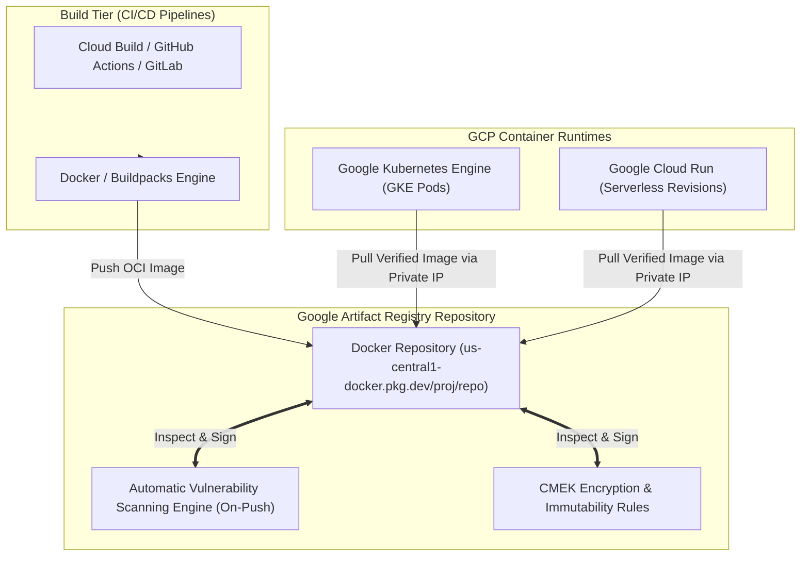

# Topic 59: Artifact Registry

---

## 1. What Is It?

**Google Artifact Registry** is a fully managed, enterprise-grade artifact repository service that allows organizations to store, manage, secure, and deploy OCI container images, Helm charts, and language-specific software packages (Maven, npm, Python, Go, Apt, Yum).

Artifact Registry is the evolution of legacy Container Registry (`gcr.io`), expanding functionality to support fine-grained IAM controls, regional repository locations, automated vulnerability scanning, artifact immutability, and customer-managed encryption keys (CMEK).

Artifact Registry integrates natively with Cloud Build, GKE, Cloud Run, and Security Command Center, serving as the secure central hub for software supply chain management in Google Cloud.

### Real-World Analogy
Think of Artifact Registry like a high-security automated distribution warehouse for manufactured goods. When a factory (Cloud Build / CI-CD) manufactures a new product batch (Container Image or Helm Chart), it ships the goods to the warehouse (Artifact Registry Repository). The warehouse automatically runs automated safety inspections (Vulnerability Scanning), stamps the box with a tamper-evident seal (CMEK Encryption & Image Signing), and stores it until authorized delivery trucks (GKE or Cloud Run) request the goods for deployment.

---

## 2. Where Does It Fit?

Artifact Registry acts as the secure central artifact store between CI/CD build pipelines and GCP container execution runtimes.



---

## 3. Core Concepts

| Artifact Registry Feature | Description | Syntax / Example | Best Practice |
|---|---|---|---|
| **Repository Format** | Package format supported by the repository. | `Docker`, `Helm`, `Maven`, `npm`, `Python` | Create dedicated repositories per format type. |
| **Regional Repository** | Repository bound to a specific GCP region (e.g., `us-central1`). | `us-central1-docker.pkg.dev/project/repo` | Keep repositories in the same region as GKE/Cloud Run. |
| **Vulnerability Scanning** | Automatic scanning of container images for CVE security risks upon push. | Automatic (On-push & Continuous) | Enable On-Push scanning; block images with Critical CVEs. |
| **Cleanup Policies** | Automated rules to delete old, untagged, or non-production images. | Delete images older than 30 days | Enforce cleanup policies to optimize storage costs. |
| **gcr.io Domain Support** | Redirection feature allowing legacy `gcr.io` paths to route to Artifact Registry. | `gcr.io/project/image` | Enable `gcr.io` redirection to migrate legacy Container Registry pipelines. |

---

## 4. How It Works

Authentication, vulnerability scanning, and image deployment follow automated security workflows:

```text
Developer / CI-CD pipeline executes `docker push us-central1-docker.pkg.dev/proj/repo/app:v1.0`
              ↓
`gcloud auth configure-docker` provides OAuth2 Access Token for authentication
              ↓
Artifact Registry receives OCI image layers -> Stores in CMEK-encrypted Cloud Storage
              ↓
Automated Vulnerability Scanner inspects OS packages (Debian/Alpine) & runtime binaries
              ↓
Scanner outputs CVE findings -> Pushes alerts to Security Command Center
              ↓
GKE / Cloud Run pulls image over internal Google network using Service Account IAM
```

1. **Regional Performance**: Co-locating Artifact Registry in the same region as your GKE cluster accelerates image pull speeds and eliminates cross-region network egress costs.
2. **Immutable Tags**: Enabling Immutable Tags prevents developers or CI/CD jobs from overwriting existing release tags (e.g., `v1.0.0`).

---

## 5. Production Scenario

### Secure Software Supply Chain with Vulnerability Scanning & Cleanup

```text
Requirement: Establish a secure container image repository for a financial app, enforcing automated CVE vulnerability scanning, regional co-location, and 30-day image retention cleanup.
    ↓
Architecture: Artifact Registry Docker Repository (`us-central1-docker.pkg.dev/prod-proj/app-repo`).
    ↓
Configuration:
  - Format: `DOCKER`, Mode: `STANDARD`, Location: `us-central1`.
  - Security: Enable **On-Push Vulnerability Scanning**.
  - Access Control: GKE Service Account granted `roles/artifactregistry.reader`.
  - Cleanup Policy:
    - Rule 1: Delete untagged images older than 7 days.
    - Rule 2: Keep 5 most recent tagged images per repository.
    ↓
Security: GKE Binary Authorization blocks deployment if image contains Critical CVEs.
    ↓
Monitoring: Security Command Center tracking container vulnerability findings.
```

*Why Selected*: Combines regional speed, automated vulnerability scanning, and automated cleanup policies to maintain a lean, secure container supply chain.

---

## 6. Hands-On Lab

### Prerequisites
- Active GCP Project with Artifact Registry API enabled.
- Cloud Shell (Docker pre-installed) or local `gcloud` CLI.
- IAM permissions: `roles/artifactregistry.admin`.

### Console Method
1. Log into [Google Cloud Console](https://console.cloud.google.com/).
2. Navigate to **CI/CD** → **Artifact Registry** → **Repositories**.
3. Click **CREATE REPOSITORY** at top.
4. Set Name: `container-repo`, Format: **Docker**.
5. Location type: **Region** → Select `us-central1`.
6. Encryption: **Google-managed key** (or CMEK).
7. Immutable tags: Select **Disabled** (or **Enabled** for release protection).
8. Click **CREATE**.

### CLI Method
Create a repository, configure Docker authentication, push an image, and inspect vulnerabilities using `gcloud`:

```bash
# Set project and repository variables
PROJECT_ID="your-gcp-project-id"
REGION="us-central1"
REPO_NAME="container-repo"
IMAGE_TAG="${REGION}-docker.pkg.dev/${PROJECT_ID}/${REPO_NAME}/demo-app:v1"

# 1. Create a Docker Repository in us-central1
gcloud artifacts repositories create $REPO_NAME \
    --repository-format=docker \
    --location=$REGION \
    --description="Production Docker Repository"

# 2. Configure Docker CLI to authenticate to Artifact Registry
gcloud auth configure-docker ${REGION}-docker.pkg.dev --quiet

# 3. Pull a sample public image, tag it, and push to Artifact Registry
docker pull alpine:latest
docker tag alpine:latest $IMAGE_TAG
docker push $IMAGE_TAG

# 4. List container images in the repository
gcloud artifacts docker images list ${REGION}-docker.pkg.dev/${PROJECT_ID}/${REPO_NAME}
```

### Verification
Inspect image vulnerability scan results (if scanning enabled):

```bash
gcloud artifacts docker images list-vulnerabilities $IMAGE_TAG
```
*Expected Result*: Output displays vulnerability scan status (`CLEAN` or lists discovered CVE IDs with severity ratings).

### Cleanup
Delete repository:

```bash
gcloud artifacts repositories delete $REPO_NAME --location=$REGION --quiet
```

---

## 7. Security

### Supply Chain Security Safeguards
- **On-Push Vulnerability Scanning**: Enable automated scanning to detect OS and package vulnerabilities immediately upon image push.
- **Binary Authorization Integration**: Enforce **Binary Authorization** policies on GKE to block deployment of images that fail vulnerability thresholds or lack cryptographic signatures.
- **Immutable Image Tags**: Enable Immutable Tags on release repositories to prevent accidental or malicious overwriting of existing production tags (e.g., `v1.0.0`).

```text
BAD PRACTICE:
Storing production container images in public Docker Hub repositories or granting `roles/artifactregistry.admin` to CI/CD service accounts.
Risk: Exposes proprietary code; allows compromised CI/CD pipelines to delete entire artifact repositories.

PRODUCTION PRACTICE:
Use private, regional Artifact Registry repositories. Grant `roles/artifactregistry.writer` to CI/CD pipelines and `roles/artifactregistry.reader` to GKE nodes.
```

---

## 8. Scaling & High Availability

Regional Co-Location & High-Speed Image Pulls:

```text
Cross-Region Image Pull (GKE in us-central1 pulling from registry in europe-west1 - Slow, High Egress Fees)
   ↓ (Regional Co-Location Optimization)
Regional Co-Location (GKE in us-central1 pulling from us-central1-docker.pkg.dev - Sub-second, $0 Egress)
```

- **Zero Egress Fees**: Pulling container images from an Artifact Registry repository located in the same region as your GKE cluster or Cloud Run service incurs **$0 network egress charges** and delivers maximum pull throughput.

---

## 9. Cost

### Artifact Registry Cost Structure
- **Storage Charges**: Billed per GB/month for stored artifacts (~$0.10/GB/month).
- **Vulnerability Scanning**: Billed per scanned container image (~$0.26 per scanned image) or flat-rate per vCPU depending on continuous scanning settings.
- **Data Transfer**: $0 for image pulls within the same GCP region.

```text
FinOps Optimization Tip:
Enable **Cleanup Policies** to delete untagged "sha256" image fragments and intermediate build images older than 14 days, saving 50%+ on repository storage fees.
```

---

## 10. Monitoring & Troubleshooting

### Artifact Registry Observability Tools
- **Security Command Center**: Displays container vulnerability findings aggregated by severity across all repositories.
- **Cloud Audit Logs**: Filter by `protoPayload.methodName="google.devtools.artifactregistry.v1.ArtifactRegistry.CreateRepository"` to audit repository operations.

### Troubleshooting Matrix

| Symptom | Possible Cause | What to Check | Fix |
|---|---|---|---|
| `docker push` fails with `403 Unauthorized` | Docker CLI missing Artifact Registry authentication helper | `gcloud auth configure-docker` | Run `gcloud auth configure-docker <region>-docker.pkg.dev`. |
| GKE Pod stuck in `ImagePullBackOff` | GKE node Service Account lacks `roles/artifactregistry.reader` | GKE Node SA IAM roles | Grant `roles/artifactregistry.reader` on the repository to the GKE node service account. |
| Cannot overwrite existing image tag | **Immutable Tags** feature enabled on the repository | Repository settings in Console | Use a new semantic version tag (e.g., `v1.0.1`) instead of overwriting existing tags. |

---

## 11. Common Mistakes

```text
Mistake: Using legacy Container Registry (`gcr.io`) for new GCP projects.
Why: Container Registry is deprecated and lacks advanced security features.
Impact: Missing out on Cleanup Policies, multi-format artifact support, and fine-grained IAM controls.
Correct approach: Migrate legacy `gcr.io` paths to Artifact Registry using `gcr.io` domain redirection.

Mistake: Deploying images using the mutable `:latest` tag instead of explicit immutable version tags or SHA digests.
Why: Shortcut taken during initial development.
Impact: Inability to determine exact code running in production; node restarts pull inconsistent image revisions.
Correct approach: Always deploy container images using explicit semantic version tags (e.g., `v1.2.3`) or SHA256 digests.
```

---

## 12. Production Best Practices

- [ ] Co-locate Artifact Registry repositories in the **same region** as target GKE clusters and Cloud Run services.
- [ ] Enable **On-Push Vulnerability Scanning** on all Docker repositories.
- [ ] Implement **Cleanup Policies** to automatically purge untagged images older than 7–14 days.
- [ ] Enable **Immutable Tags** on production release repositories.
- [ ] Grant `roles/artifactregistry.reader` to GKE node service accounts (Principle of Least Privilege).
- [ ] Automate all repository creation and IAM role bindings using Infrastructure as Code (Terraform).

---

## 13. Hyperscaler / Enterprise Perspective

```text
Personal / Learning
  Public Container Registry → Manual Docker Push → `:latest` tag usage → No CVE scanning
        ↓
Small Production
  Private Artifact Registry → gcloud auth → Semantic tags (`v1.0`) → Basic CVE scanning
        ↓
Enterprise Environment
  Regional Co-Located Repositories → On-Push Vulnerability Scanning → Automated Cleanup Policies
        ↓
Hyperscaler Environment
  100% Binary Authorization Enforcement → Immutable Tags + Cosign Image Signatures → SLSA Level 3 Provenance Attestation
```

In a hyperscaler environment, Artifact Registry is the secure gateway of the **Software Supply Chain**. CI/CD pipelines use Cloud Build to build container images, run vulnerability scans, generate **SLSA provenance attestations**, and sign images using **Cosign/KMS**. GKE **Binary Authorization** enforces a strict policy: any container image missing a valid cryptographic signature is blocked at the Kubernetes API gateway.

---

## 14. Real Project Questions

### Q1: What is the primary difference between legacy Container Registry (`gcr.io`) and Google Artifact Registry?
**Answer:** Container Registry is a legacy single-format Docker repository tied to a single Cloud Storage bucket. **Artifact Registry** is GCP's modern, multi-format artifact management service supporting Docker containers, Helm charts, Maven, npm, Python, and Go packages, with regional co-location, fine-grained IAM permissions, automated cleanup policies, and native CMEK encryption.

### Q2: Why is co-locating Artifact Registry in the same GCP region as your GKE cluster recommended?
**Answer:** Co-locating the repository in the same region as the GKE cluster or Cloud Run service maximizes image pull speeds during auto-scaling events and incurs **$0 network egress charges**. Pulling container images across regions introduces pull latencies and cross-region egress costs.

### Q3: How do Artifact Registry Cleanup Policies help optimize cloud infrastructure costs?
**Answer:** CI/CD pipelines generate thousands of intermediate build images and untagged "sha256" image layers over time. Without cleanup rules, these orphaned layers accumulate indefinitely in Cloud Storage, generating high monthly storage charges. Cleanup Policies automatically purge untagged or old images based on age and tag criteria (e.g., delete untagged images older than 7 days).

---

## 15. Quick Decision Guide

| Requirement | Recommended Approach | Reason |
|---|---|---|
| Storing Docker container images, Helm charts, and npm packages in a single GCP service | **Google Artifact Registry** | Supports multi-format artifact repositories under a unified IAM and security model. |
| Preventing developers or CI/CD pipelines from overwriting released production tags | **Enable Immutable Tags on Repository** | Blocks API requests attempting to overwrite existing tag strings (e.g., `v1.0.0`). |
| Migrating legacy `gcr.io` image references without rewriting CI/CD code | **Enable `gcr.io` Domain Redirection** | Routes legacy `gcr.io/project/image` paths directly to Artifact Registry seamlessly. |

### When should I use it?
- Essential service for managing container images, Helm charts, and language packages in Google Cloud.

### When should I NOT use it?
- Do not use for storing raw un-packaged application files or data lake datasets—use Cloud Storage instead.

---

## 16. Related Services

```text
               [59. Artifact Registry]
              /          |          \
      Cloud Build   GKE / Cloud Run   Security Command
      (CI/CD Pipeline) (Deployment)   Center (CVEs)
           |             |                 |
       Build & Push   Pull & Execute   Vulnerability
        Artifacts       Containers      Dashboard
```

- **Cloud Build**: Native GCP CI/CD engine that builds and pushes images to Artifact Registry.
- **Google Kubernetes Engine (GKE)**: Container orchestration engine pulling images from Artifact Registry.
- **Binary Authorization**: Enforces cryptographic signature checks on Artifact Registry images prior to GKE deployment.

---

## 17. Cheat Sheet

### Repository Syntax
- Docker Format: `LOCATION-docker.pkg.dev/PROJECT_ID/REPOSITORY_NAME/IMAGE:TAG`
- Example: `us-central1-docker.pkg.dev/my-proj/my-repo/web-api:v1.0`

### Useful Commands
```bash
# Create a Docker repository
gcloud artifacts repositories create REPO_NAME \
    --repository-format=docker --location=us-central1

# Configure Docker CLI authentication
gcloud auth configure-docker us-central1-docker.pkg.dev

# List images in a repository
gcloud artifacts docker images list us-central1-docker.pkg.dev/PROJECT_ID/REPO_NAME

# Scan image for vulnerabilities
gcloud artifacts docker images list-vulnerabilities IMAGE_PATH
```

---

## 18. Learning Connection

- **Previous Topic**: [58. Container Fundamentals](../58-container-fundamentals/README.md)
- **Next Topic**: [60. GKE Overview](../60-gke-overview/README.md)
