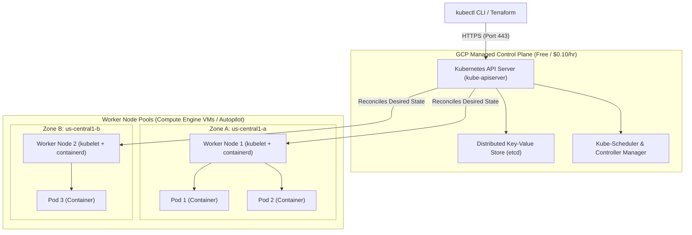

# Topic 60: GKE Overview

---

## 1. What Is It?

**Google Kubernetes Engine (GKE)** is a enterprise-grade, fully managed container orchestration service for deploying, managing, scaling, and securing containerized applications using Kubernetes infrastructure on Google Cloud Platform.

Developed by the original creators of Kubernetes, GKE eliminates the operational overhead of installing, patching, and maintaining self-hosted Kubernetes control planes (API Servers, etcd databases, schedulers).

GKE offers two operational modes:
1. **GKE Autopilot (Fully Managed - Recommended)**: Google manages the entire cluster infrastructure—including node provisioning, scaling, security hardening, and OS patching. You pay only for the CPU, memory, and storage requested by running Pods.
2. **GKE Standard (Infrastructure Control)**: Google manages the control plane; you manage and configure node pools, worker VM instance sizes, and cluster autoscaling parameters.

### Real-World Analogy
Think of GKE like an automated commercial airline fleet management system:
- **Self-Hosted Kubernetes**: You buy physical airplanes, build repair hangars, hire mechanics, write flight controller software, and pilot the planes yourself.
- **GKE Standard**: Google provides the air traffic control tower and mechanics. You pick the plane sizes (VM Node Pools) and schedule the flights.
- **GKE Autopilot**: Google provides the entire airline service. You simply purchase passenger seats (Pod CPU & Memory requests); Google handles plane maintenance, pilot staffing, fuel management, and flight routing automatically.

---

## 2. Where Does It Fit?

GKE serves as the primary container orchestration engine in Google Cloud, connecting microservices, load balancers, databases, and CI/CD pipelines.



---

## 3. Core Concepts

| GKE Feature | GKE Autopilot Mode | GKE Standard Mode | Best Practice |
|---|---|---|---|
| **Control Plane Management** | Managed 100% by Google. | Managed 100% by Google. | Standard across both modes (Google handles etcd & API server). |
| **Worker Node Management** | Fully automated by Google. | Customer manages node pools, machine types, OS updates. | Use **Autopilot** for zero-ops; **Standard** for custom hardware/OS. |
| **Billing Model** | Billed per Pod CPU/RAM/Storage requests. | Billed per Compute Engine VM node provisioned. | Autopilot eliminates paying for unallocated node RAM/CPU capacity. |
| **Cluster SLA** | 99.95% (Multi-zonal) / 99.9% (Zonal). | 99.95% (Multi-zonal) / 99.9% (Zonal). | Deploy Multi-Zonal or Regional clusters for production 99.95% SLA. |
| **Security Baseline** | Pre-configured with CIS Kubernetes Benchmark hardening. | Customer configures PodSecurity, Shielded Nodes, etc. | Autopilot enforces production security guardrails by default. |

---

## 4. How It Works

GKE reconciles desired state using declarative Kubernetes manifests (`yaml` files):

```text
Developer submits `kubectl apply -f deployment.yaml` (Desired State: 5 Replicas of App v1)
              ↓
Kubernetes API Server writes manifest to etcd database
              ↓
Kube-Scheduler assigns Pods to available Worker Nodes with capacity
              ↓
Kubelet agent on Worker Nodes pulls container image from Artifact Registry via containerd
              ↓
Containers started -> Kubelet reports status back to Control Plane: "Desired State = Live State"
```

1. **Auto-Repair & Auto-Upgrade**: GKE automatically repairs unhealthy worker nodes and rolls out Kubernetes version upgrades without service interruption.
2. **VPC-Native Networking**: GKE assigns native VPC IP addresses to Pods using Alias IP ranges, delivering direct low-latency pod-to-pod routing.

---

## 5. Production Scenario

### Enterprise Multi-Zone Microservices Engine with Autopilot

```text
Requirement: Run a 50-microservice containerized application platform with automatic scaling, 99.95% SLA, zero node management overhead, and VPC private networking.
    ↓
Architecture: Regional GKE Autopilot Cluster (`gke-prod-uscentral1`) in `us-central1`.
    ↓
Cluster Configuration:
  - Mode: **Autopilot**.
  - Networking: **Private Cluster** (Control plane public endpoint restricted to authorized networks).
  - Subnet: `sb-gke-uscentral1` with Secondary IP ranges for Pods (`10.4.0.0/14`) and Services (`10.8.0.0/20`).
  - Workload Identity: Enabled natively.
    ↓
Deployment Execution: Developers submit standard Kubernetes manifests specifying `requests` and `limits`.
    ↓
Security: GKE Autopilot automatically enforces non-root containers, drops dangerous Linux capabilities, and blocks SSH node access.
    ↓
Monitoring: Google Cloud Observability pre-configured to stream Pod logs and metrics to Cloud Logging.
```

*Why Selected*: GKE Autopilot eliminates all worker node management toil while enforcing enterprise security guardrails and delivering a 99.95% multi-zonal SLA out of the box.

---

## 6. Hands-On Lab

### Prerequisites
- Active GCP Project with Compute Engine & GKE APIs enabled.
- Cloud Shell or `gcloud` CLI (`kubectl` installed).
- IAM permissions: `roles/container.admin`.

### Console Method
1. Log into [Google Cloud Console](https://console.cloud.google.com/).
2. Navigate to **Kubernetes Engine** → **Clusters**.
3. Click **CREATE** at top.
4. Choose **GKE Autopilot** (Recommended) → Click **CONFIGURE**.
5. Set Name: `gke-demo-cluster`, Region: `us-central1`.
6. Networking: Select VPC `custom-prod-vpc`, Subnet `sb-us-central1`.
7. Click **CREATE CLUSTER** (Wait 5–7 minutes for provisioning).
8. Once created, click **CONNECT** → Copy the `gcloud container clusters get-credentials` command.

### CLI Method
Create a GKE Autopilot cluster and deploy a sample workload using `gcloud`:

```bash
# Set project and network variables
PROJECT_ID="your-gcp-project-id"
REGION="us-central1"
CLUSTER_NAME="gke-demo-cluster"
VPC_NAME="custom-prod-vpc"
SUBNET_NAME="sb-us-central1"

# 1. Create a Regional GKE Autopilot Cluster
gcloud container clusters create-auto $CLUSTER_NAME \
    --region=$REGION \
    --network=$VPC_NAME \
    --subnetwork=$SUBNET_NAME \
    --project=$PROJECT_ID

# 2. Configure kubectl authentication credentials for the cluster
gcloud container clusters get-credentials $CLUSTER_NAME --region=$REGION

# 3. Deploy a sample Nginx deployment using kubectl
kubectl create deployment nginx-web --image=nginx:alpine --replicas=3

# 4. Verify running Pods across nodes
kubectl get pods -o wide
```

### Verification
*Expected Result*: `kubectl get pods` displays 3 running Nginx Pods status `Running` distributed across cluster nodes.

### Cleanup
Delete deployment and GKE cluster:

```bash
kubectl delete deployment nginx-web
gcloud container clusters delete $CLUSTER_NAME --region=$REGION --quiet
```

---

## 7. Security

### GKE Cluster Hardening Standards
- **Private Cluster Architecture**: Deploy GKE as a Private Cluster. Worker nodes receive internal IPs ONLY (zero public IPs). Restrict API Server access to Authorized Networks.
- **Workload Identity**: Enable Workload Identity to bind Kubernetes Service Accounts (KSAs) to Google Service Accounts (GSAs), eliminating static service account JSON key files.
- **Shielded GKE Nodes**: Enable Shielded Nodes to protect worker node VMs against rootkit and bootkit tampering.

```text
BAD PRACTICE:
Creating public GKE Standard clusters with open API Server endpoints (0.0.0.0/0) and using default Node Service Accounts (`Editor` role).
Risk: Public API server exposed to brute-force attacks; compromised Pods inherit full project Editor permissions.

PRODUCTION PRACTICE:
Deploy Private GKE Autopilot clusters with Workload Identity enabled and API Server Authorized Networks restricted to corporate bastion IPs.
```

---

## 8. Scaling & High Availability

GKE Cluster Availability Models:

```text
Zonal GKE Cluster (Control Plane in 1 Zone -> 99.9% SLA -> Control plane upgrades cause brief API downtime)
   ↓ (Production HA Upgrade)
Regional GKE Cluster (Replicated Control Plane across 3 Zones -> 99.95% SLA -> Zero-downtime control plane updates)
   ↓ (Autopiloted Node Auto-Scaling)
GKE Autopilot Cluster (Automatically provisions, scales, and repairs worker nodes across all 3 zones)
```

- **Control Plane SLA**: Regional GKE clusters replicate the Kubernetes API server and `etcd` across three availability zones, delivering a **99.95% availability SLA**.

---

## 9. Cost

### GKE Cost Breakdown
- **Cluster Management Fee**: Fixed charge of **$0.10 per cluster per hour** (approx. $73/month) for the managed control plane. (One cluster free per billing account via GCP free tier).
- **GKE Standard Node Billing**: Billed for full Compute Engine VM instance costs (vCPU, RAM, Disks) provisioned in Node Pools, regardless of whether Pods utilize 10% or 100% of node capacity.
- **GKE Autopilot Pod Billing**: Billed strictly for the **vCPU, Memory, and Storage requested** by running Pods. Zero charges for unallocated idle node space.

---

## 10. Monitoring & Troubleshooting

### GKE Observability Tools
- **GKE Dashboard**: Built-in Console dashboard showing Workloads, Services, Ingress, and Storage utilization.
- **Google Cloud Observability (Stackdriver)**: Pre-integrated agent streaming Kubernetes container logs (`stdout`/`stderr`) and metrics (CPU, RAM, Disk) to Cloud Logging and Monitoring.

### Troubleshooting Matrix

| Symptom | Possible Cause | What to Check | Fix |
|---|---|---|---|
| `kubectl` command fails with `Unauthorized` or `Connection Refused` | Credentials expired or API server endpoint blocked by Authorized Networks | `gcloud container clusters get-credentials` | Refresh credentials via `gcloud`; add client IP to cluster Authorized Networks. |
| Pod stuck in `Pending` state | Insufficient cluster CPU/RAM resources or un-attachable PVC volume | `kubectl describe pod <pod-name>` | Increase cluster node pool size or check persistent volume claim binding. |
| Pod stuck in `CrashLoopBackOff` | Application code crashing on startup or missing environment variable | `kubectl logs <pod-name>` | Inspect application stdout/stderr logs using `kubectl logs`. |

---

## 11. Common Mistakes

```text
Mistake: Selecting GKE Standard mode for simple microservices without having dedicated Kubernetes SRE teams.
Why: Wanting low-level control over node VM configurations.
Impact: Incurring heavy operational toil managing node OS upgrades, node pool scaling, and security hardening manually.
Correct approach: Default to GKE Autopilot mode for 90%+ of production container workloads.

Mistake: Omitting CPU and Memory `requests` and `limits` in Kubernetes Pod manifests.
Why: Laziness during manifest creation.
Impact: In GKE Standard, noisy neighbor Pods consume all node RAM, causing node OOM crashes; in Autopilot, default resource values are applied.
Correct approach: Always specify explicit `resources.requests` and `resources.limits` in all deployment manifests.
```

---

## 12. Production Best Practices

- [ ] Default to **GKE Autopilot** for new production Kubernetes workloads.
- [ ] Deploy **Regional Clusters** spanning 3 availability zones for 99.95% control plane SLA.
- [ ] Enable **Private Cluster** mode to remove public IP addresses from worker nodes.
- [ ] Enable **Workload Identity** for keyless pod-to-GCP service authentication.
- [ ] Always define explicit CPU and Memory `requests` and `limits` in Pod specifications.
- [ ] Automate cluster provisioning and node pool configurations using Infrastructure as Code (Terraform).

---

## 13. Hyperscaler / Enterprise Perspective

```text
Personal / Learning
  Public Zonal Standard Cluster → Default Node SA (`Editor`) → Manual `kubectl` commands
        ↓
Small Production
  Regional Private Standard Cluster → Dedicated Node SA → Workload Identity enabled
        ↓
Enterprise Environment
  Regional GKE Autopilot Clusters → Multi-Cluster Ingress (MCI) → Binary Authorization
        ↓
Hyperscaler Environment
  100% GitOps Managed Clusters (ArgoCD / Anthos Config Management) → SLSA Level 3 Supply Chain Security → Automated Disaster Recovery Failover
```

In a hyperscaler environment, GKE clusters are managed using **GitOps** (ArgoCD or Anthos Config Management). Developers never run `kubectl` directly against production clusters; instead, they commit Kubernetes manifests to Git. GitOps controllers synchronize cluster state automatically, while **Binary Authorization** enforces signature checks on all container images before deployment.

---

## 14. Real Project Questions

### Q1: What is the primary difference between GKE Autopilot mode and GKE Standard mode?
**Answer:** In **GKE Standard mode**, Google manages the control plane, but the customer must configure and manage node pools, machine types, OS updates, and node autoscaling parameters (paying for full VM node capacity). In **GKE Autopilot mode**, Google manages both the control plane AND the worker node infrastructure; the customer manages only Kubernetes manifests, paying strictly for the CPU, RAM, and storage requested by running Pods.

### Q2: Why is enabling Workload Identity considered a mandatory security requirement for GKE clusters?
**Answer:** Workload Identity binds Kubernetes Service Accounts (KSAs) directly to Google Service Accounts (GSAs). This allows Pods to authenticate keylessly to GCP APIs (such as Cloud Storage or BigQuery) using short-lived OAuth2 tokens provided by the GKE metadata server, eliminating long-lived Service Account JSON key files.

### Q3: What is the benefit of a VPC-Native GKE cluster compared to a legacy routes-based cluster?
**Answer:** In a **VPC-Native cluster**, GKE uses Secondary Subnet IP ranges (Alias IPs) to assign native VPC IP addresses directly to Kubernetes Pods. This enables direct, un-proxied pod-to-pod routing over internal Google SDN, improves network performance, supports Private Service Connect integration, and allows VPC firewall rules to inspect Pod traffic directly.

---

## 15. Quick Decision Guide

| Requirement | Recommended Approach | Reason |
|---|---|---|
| Running production container microservices with zero worker node management toil | **GKE Autopilot (Regional Cluster)** | Fully managed node infrastructure, enforced security baselines, 99.95% SLA. |
| Specialized workload requiring custom Linux kernel modules or specific GPU shapes | **GKE Standard (Regional Cluster)** | Provides full access to underlying worker VM node pool configurations. |
| Serverless HTTP container application scaling to zero with zero fixed monthly fees | **Google Cloud Run (NOT GKE)** | Cloud Run has $0 base cost when idle; GKE has a $0.10/hr control plane fee. |

### When should I use it?
- Essential container orchestration platform for running complex multi-container microservice architectures, stateful applications, and enterprise API platforms.

### When should I NOT use it?
- Do not use GKE for simple single-container web APIs that fit easily into Cloud Run (saves cluster management overhead).

---

## 16. Related Services

```text
                 [60. GKE Overview]
                /        |        \
        Artifact     Workload     Cloud Run
        Registry     Identity    (Serverless Alt)
           |             |            |
       Container     Keyless       Single Container
        Images        Auth          APIs
```

- **Artifact Registry**: Stores OCI container images pulled by GKE nodes.
- **Workload Identity**: Binds Kubernetes Service Accounts to GCP IAM.
- **Cloud Run**: Serverless container execution alternative for simple HTTP workloads.

---

## 17. Cheat Sheet

### Operational Modes
- **Autopilot**: Fully managed (Pay per Pod request).
- **Standard**: Customer manages nodes (Pay per VM node).
- **Cluster Types**: Regional (3 Zones - 99.95% SLA) vs. Zonal (1 Zone - 99.9% SLA).

### Useful Commands
```bash
# Create a GKE Autopilot cluster
gcloud container clusters create-auto CLUSTER_NAME --region=us-central1 --network=VPC_NAME

# Fetch kubectl credentials for a cluster
gcloud container clusters get-credentials CLUSTER_NAME --region=us-central1

# Deploy workload via kubectl
kubectl create deployment APP_NAME --image=IMAGE_NAME

# View running pods
kubectl get pods -o wide
```

---

## 18. Learning Connection

- **Previous Topic**: [59. Artifact Registry](../59-artifact-registry/README.md)
- **Next Topic**: [61. Cluster Architecture](../61-cluster-architecture/README.md)
