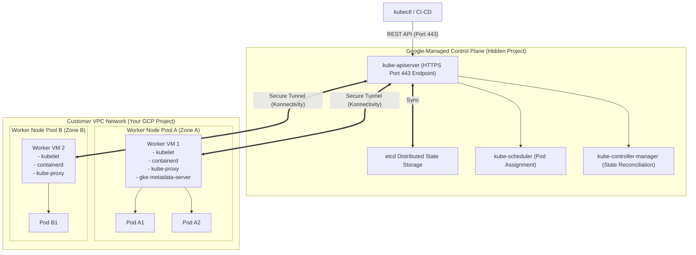

# Topic 61: Cluster Architecture

---

## 1. What Is It?

GKE **Cluster Architecture** defines the structural split between Google Cloud's fully managed **Control Plane** (the Kubernetes control plane) and the customer-facing **Worker Nodes** (Compute Engine VMs running container workloads).

In Google Kubernetes Engine:
- **Control Plane**: Google manages the `kube-apiserver`, `etcd` database, `kube-scheduler`, and `kube-controller-manager` inside a secure, Google-owned project environment. You never manage control plane VMs, OS patches, or etcd backups.
- **Worker Nodes**: Compute Engine VM instances running in your GCP project (Standard Mode) or managed seamlessly by Google (Autopilot Mode). Nodes execute the `kubelet` agent, `kube-proxy`, and the `containerd` container runtime to run application Pods.

### Real-World Analogy
Think of GKE Cluster Architecture like a modern commercial airport operations structure:
- **Control Plane (Air Traffic Control Tower)**: Run by licensed government controllers (Google Cloud). They monitor radar (`kube-apiserver`), store flight schedules (`etcd`), and assign landing runways (`kube-scheduler`). Pilots and passengers cannot enter the tower.
- **Worker Nodes (Terminal Gates & Airplanes)**: Physical structures where passengers (Pods) board planes and travel to destinations. The planes are maintained by mechanics (`kubelet`) following instructions broadcast from the control tower.

---

## 2. Where Does It Fit?

The GKE Control Plane resides in a Google-managed project, communicating securely over private network endpoints with Worker Nodes running inside your customer VPC.



---

## 3. Core Concepts

| Component | Layer | Location | Function / Purpose |
|---|---|---|---|
| **`kube-apiserver`** | Control Plane | Google-Managed Project | Central REST API gateway validating and configuring data for all cluster objects. |
| **`etcd`** | Control Plane | Google-Managed Project | Highly available distributed key-value store holding 100% of cluster state data. |
| **`kube-scheduler`** | Control Plane | Google-Managed Project | Selects optimal worker nodes for newly created Pods based on resource availability. |
| **`kubelet`** | Worker Node | Customer VM Instance | Node agent ensuring containers described in PodSpecs are running and healthy. |
| **`containerd`** | Worker Node | Customer VM Instance | OCI-compliant container runtime executing container image layers. |
| **`kube-proxy`** | Worker Node | Customer VM Instance | Maintains network rules on nodes (iptables/eBPF) for Kubernetes Service routing. |

---

## 4. How It Works

Control Plane to Worker Node communication relies on secure Konnectivity tunnels:

```text
User executes `kubectl apply -f deployment.yaml`
              ↓
`kube-apiserver` validates request -> Writes deployment spec to `etcd`
              ↓
`kube-scheduler` detects unassigned Pod -> Selects Worker Node 1 in Zone A
              ↓
`kube-apiserver` notifies `kubelet` agent on Worker Node 1 via Konnectivity secure tunnel
              ↓
`kubelet` instructs `containerd` runtime to pull image & start containers
              ↓
`containerd` executes container -> `kubelet` reports `PodStatus: Running` back to API Server
```

1. **Konnectivity Secure Proxy**: Communication between the Google-managed API server and private worker nodes uses an encrypted secure proxy (Konnectivity), ensuring control plane traffic never traverses the public internet.
2. **Automated Control Plane Upgrades**: Google handles Kubernetes API server patch updates and minor version upgrades automatically.

---

## 5. Production Scenario

### Highly Available Regional Control Plane & Isolated Private Nodes

```text
Requirement: Architect a GKE cluster for a bank that guarantees zero control plane downtime during API upgrades, isolates etcd data, and hides worker nodes from the public internet.
    ↓
Architecture: Regional Private GKE Cluster (`gke-bank-prod`) in `us-central1`.
    ↓
Control Plane Architecture:
  - Regional Control Plane spanning 3 zones (`us-central1-a`, `us-central1-b`, `us-central1-c`).
  - `etcd` encrypted at rest using Customer-Managed Encryption Keys (CMEK).
  - Control Plane Master Authorized Networks enabled (Restricted to Corporate VPN IP `198.51.100.0/24`).
    ↓
Worker Node Architecture:
  - Private Nodes (Nodes have 0 public IPs; outbound traffic via Cloud NAT).
  - Workload Identity enabled for keyless pod authentication.
    ↓
Security: Konnectivity secure tunnel for control-plane-to-node communication.
    ↓
Monitoring: Cloud Audit Logs recording all `kube-apiserver` requests and administrative changes.
```

*Why Selected*: A Regional Control Plane guarantees 99.95% SLA and zero API downtime during upgrades, while Private Nodes isolate internal workloads from internet port scans.

---

## 6. Hands-On Lab

### Prerequisites
- Active GCP Project with GKE API enabled.
- Cloud Shell or `gcloud` CLI (`kubectl` installed).
- IAM permissions: `roles/container.admin`.

### Console Method
1. Log into [Google Cloud Console](https://console.cloud.google.com/).
2. Navigate to **Kubernetes Engine** → **Clusters**.
3. Select an existing GKE cluster (or create a new test cluster).
4. Click **DETAILS** tab.
5. Observe **Control plane info**:
   - Master version (e.g., `1.28.7-gke.1026000`).
   - Endpoint (Control Plane IP address).
   - Control plane zone/region (`us-central1`).
6. Click **NODES** tab → Observe Node Pools, node OS images (`Container-Optimized OS`), and runtime (`containerd`).

### CLI Method
Inspect control plane components and node agent details using `gcloud` and `kubectl`:

```bash
# Set variables
PROJECT_ID="your-gcp-project-id"
CLUSTER_NAME="gke-demo-cluster"
REGION="us-central1"

# 1. Describe GKE Cluster Control Plane details
gcloud container clusters describe $CLUSTER_NAME \
    --region=$REGION \
    --format="yaml(endpoint, currentMasterVersion, currentNodeVersion, location)"

# 2. Query Kubernetes API Server cluster info using kubectl
kubectl cluster-info

# 3. Inspect worker node details and container runtime engine
kubectl get nodes -o wide

# 4. View system pods running on worker nodes (kube-proxy, metrics-server, etc.)
kubectl get pods -n kube-system
```

### Verification
*Expected Result*: `kubectl get nodes -o wide` displays node internal IPs, OS-Image (`Container-Optimized OS with containerd`), and kernel version.

---

## 7. Security

### Control Plane & Node Isolation
- **Master Authorized Networks**: Restrict access to the `kube-apiserver` HTTPS endpoint (Port 443) strictly to authorized corporate IP ranges or VPN bastions.
- **Node Service Account Isolation**: Never assign default Compute Engine service accounts to worker nodes. Use dedicated least-privilege node service accounts with `roles/artifactregistry.reader` and `roles/logging.logWriter`.
- **etcd Encryption (CMEK)**: Enable Customer-Managed Encryption Keys for `etcd` to encrypt Kubernetes Secrets at rest.

```text
BAD PRACTICE:
Leaving the GKE `kube-apiserver` endpoint open to `0.0.0.0/0` (Entire Internet) without Master Authorized Networks.
Risk: Exposes the Kubernetes control plane gateway to global brute-force attacks and zero-day API exploits.

PRODUCTION PRACTICE:
Enable Private Cluster mode. Restrict Master Authorized Networks to trusted corporate IP ranges and use Workload Identity for Pod access.
```

---

## 8. Scaling & High Availability

Control Plane Sizing & SLA:

```text
Zonal Control Plane (1 Master Instance in 1 Zone -> 99.9% SLA -> API downtime during upgrades)
   ↓ (Production Regional HA Upgrade)
Regional Control Plane (3 Master Instances in 3 Zones -> 99.95% SLA -> Zero API downtime during upgrades)
```

- **Automatic Control Plane Sizing**: Google automatically resizes and scales control plane VM resources (vCPU, RAM, etcd storage) behind the scenes as your cluster grows from 10 Pods to 10,000 Pods.

---

## 9. Cost

### Control Plane Billing Model
- **Fixed Management Fee**: Google charges a flat fee of **$0.10 per cluster per hour** (~$73/month) for managing the control plane.
- **Free Tier Discount**: GCP provides a $73/month credit per billing account, making your first GKE cluster's control plane **100% FREE**.
- **Zero etcd Storage Charges**: You do NOT pay for etcd storage space or control plane VM compute resources; Google manages these inside its own project.

---

## 10. Monitoring & Troubleshooting

### Cluster Architecture Observability
- **Kubernetes Audit Logs**: Enable Control Plane Audit Logging in GKE settings to capture all API Server requests (`Create`, `Update`, `Delete`).
- **Node Problem Detector**: System agent running on worker nodes that detects kernel deadlocks, hardware errors, and filesystem corruptions.

### Troubleshooting Matrix

| Symptom | Possible Cause | What to Check | Fix |
|---|---|---|---|
| `kubectl` commands timing out | API Server endpoint blocked by firewall or client IP not in Authorized Networks | `gcloud container clusters describe` | Add client IP to `master-authorized-networks` allowed CIDRs. |
| Pod stuck in `ContainerCreating` | `containerd` runtime on node unable to pull image from registry | `kubectl describe pod <pod-name>` | Check Node Service Account IAM permissions for Artifact Registry. |
| Node status `NotReady` | `kubelet` process crashed or node hypervisor experiencing hardware failure | `kubectl describe node <node-name>` | GKE Auto-Repair will automatically drain and recreate the unhealthy node. |

---

## 11. Common Mistakes

```text
Mistake: Attempting to SSH into GKE Control Plane master VMs to modify etcd or API server configs.
Why: Expecting GKE control plane nodes to be accessible like self-hosted Kubernetes masters.
Impact: Control plane nodes are completely isolated inside Google-owned projects and inaccessible via SSH.
Correct approach: Configure control plane behavior using GKE API flags, Cluster Configs, or Admission Controllers.

Mistake: Selecting a Zonal Control Plane for mission-critical production workloads.
Why: Attempting to avoid multi-zone control plane setups.
Impact: Control plane API becomes temporarily unavailable during GKE auto-upgrade maintenance windows.
Correct approach: Always deploy **Regional Clusters** for production environments requiring a 99.95% SLA.
```

---

## 12. Production Best Practices

- [ ] Deploy **Regional GKE Clusters** with replicated Control Planes across 3 availability zones.
- [ ] Enforce **Master Authorized Networks** to restrict API server HTTPS access to trusted corporate IPs.
- [ ] Use dedicated, least-privilege **Node Service Accounts** for worker node VMs.
- [ ] Enable **Workload Identity** to decouple Pod credentials from Node Service Accounts.
- [ ] Enable **Kubernetes Audit Logging** to track control plane administrative API calls.
- [ ] Automate all cluster architecture definitions using Infrastructure as Code (Terraform).

---

## 13. Hyperscaler / Enterprise Perspective

```text
Personal / Learning
  Public Zonal Cluster → Single Control Plane → Default Node Service Account
        ↓
Small Production
  Regional Control Plane → Private Nodes → Basic Master Authorized Networks
        ↓
Enterprise Environment
  Regional Private Cluster → Workload Identity → CMEK etcd Encryption → Audit Logging Sinks
        ↓
Hyperscaler Environment
  Automated Fleet Management (Anthos / GKE Enterprise) → GitOps Control Plane Policies → Real-time Security Command Center Threat Detection
```

In a hyperscaler environment, enterprises manage fleets of GKE clusters across multiple regions using **GKE Enterprise (Anthos)**. Central SecOps teams manage Control Plane policies, Master Authorized Networks, and admission controllers centrally from Git, ensuring every GKE cluster across all business units complies with corporate security baselines.

---

## 14. Real Project Questions

### Q1: Where does the GKE Control Plane run, and who manages its underlying infrastructure?
**Answer:** The GKE Control Plane (including `kube-apiserver`, `etcd`, `kube-scheduler`, and `kube-controller-manager`) runs inside a **Google-managed project** completely separate from the customer's project. Google Cloud manages 100% of the control plane infrastructure—handling OS patching, etcd backups, hardware maintenance, and automatic scaling.

### Q2: What is the technical difference between a Zonal Control Plane and a Regional Control Plane in GKE?
**Answer:** A **Zonal Control Plane** runs a single master instance in one availability zone (99.9% SLA); if that zone or control plane undergoes maintenance, the Kubernetes API server is temporarily unavailable. A **Regional Control Plane** replicates three control plane instances across three separate availability zones in a region (99.95% SLA), ensuring zero API downtime during maintenance or zonal outages.

### Q3: How do private worker nodes in a customer VPC communicate securely with the Google-managed API Server?
**Answer:** Private worker nodes communicate with the Google-managed API Server over private internal IP addresses using an encrypted secure tunnel mechanism called **Konnectivity** (formerly SSH Tunnels). This ensures all control plane traffic (such as `kubelet` status reports and Pod scheduling instructions) flows securely over Google's internal network without traversing the public internet.

---

## 15. Quick Decision Guide

| Requirement | Recommended Approach | Reason |
|---|---|---|
| Enterprise production Kubernetes cluster requiring 99.95% SLA and zero API downtime during updates | **Regional GKE Cluster** | Replicates control plane across 3 availability zones for high availability. |
| Restricting Kubernetes API server access to corporate developers on VPN | **Enable Master Authorized Networks** | Restricts `kube-apiserver` HTTPS port 443 access to specific approved CIDR ranges. |
| Securing Kubernetes Secrets stored inside `etcd` against unauthorized disk access | **Enable CMEK for etcd Database** | Encrypts `etcd` data at rest using Customer-Managed Encryption Keys in Cloud KMS. |

### When should I use it?
- Essential technical knowledge for understanding GKE management boundaries, control plane SLAs, and node security.

### When should I NOT use it?
- Do not attempt to manage control plane VMs manually—let GKE manage the control plane automatically.

---

## 16. Related Services

```text
             [61. Cluster Architecture]
            /            |            \
    Compute Engine   Cloud KMS       Cloud Audit
    (Worker Nodes)  (etcd Encryption)    Logs
          |              |                |
     Container        CMEK          API Server
      Execution       Keys          Audit History
```

- **Compute Engine**: Powers the worker node VM instances in customer projects.
- **Cloud KMS**: Provides CMEK encryption keys for the `etcd` database.
- **Cloud Audit Logs**: Captures Kubernetes API server audit events.

---

## 17. Cheat Sheet

### Control Plane vs. Worker Nodes
- **Control Plane**: Google-managed project (`kube-apiserver`, `etcd`, `scheduler`).
- **Worker Nodes**: Customer project (`kubelet`, `containerd`, `kube-proxy`).
- **Control Plane SLA**: 99.95% (Regional) vs. 99.9% (Zonal).
- **Control Plane Fee**: $0.10/hour (1st cluster free per billing account).

### Useful Commands
```bash
# Get cluster control plane details
gcloud container clusters describe CLUSTER_NAME --region=us-central1

# View cluster API server endpoint and version
kubectl cluster-info

# View worker node OS images and runtime details
kubectl get nodes -o wide
```

---

## 18. Learning Connection

- **Previous Topic**: [60. GKE Overview](../60-gke-overview/README.md)
- **Next Topic**: [62. GKE Cluster Types](../62-gke-cluster-types/README.md)
