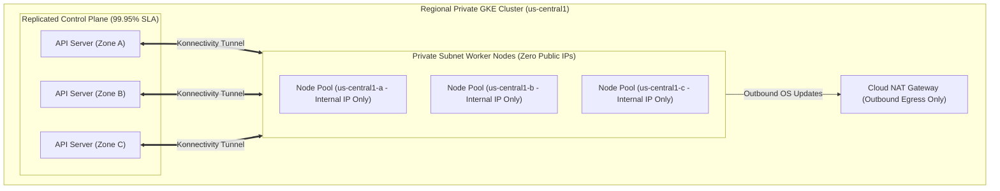

# Topic 62: GKE Cluster Types

---

## 1. What Is It?

GKE supports several **Cluster Types** categorized by geographic control plane availability, network isolation modes, and multi-tenant release channels:

1. **Regional Clusters (Recommended for Production)**: Control plane replicas and worker nodes are distributed across **three distinct Availability Zones** within a region, delivering a 99.95% availability SLA and zero-downtime control plane updates.
2. **Zonal Clusters**: Control plane and worker nodes reside in a single Availability Zone (99.9% SLA).
3. **Private Clusters**: Worker node VMs receive **internal RFC1918 IP addresses ONLY** (zero public IPv4 addresses), isolating nodes from direct internet scanning.
4. **Public Clusters**: Worker node VMs receive public IPv4 addresses (not recommended for production).
5. **Alpha / Rapid / Regular / Stable Release Channels**: Defines the automated Kubernetes version upgrade frequency and stability tier for the cluster.

### Real-World Analogy
Think of GKE Cluster Types like selecting a company headquarters location and security setup:
- **Zonal Public Cluster**: Operating out of a single office building in one neighborhood with glass doors directly on the public sidewalk. Easy to visit, but vulnerable to local power outages and street traffic noise.
- **Regional Private Cluster**: Operating out of a high-security corporate compound spanning 3 separate fortified locations across the state, connected by private underground T1 lines. If 1 building loses power, the other 2 buildings handle 100% of operations seamlessly, completely invisible to strangers on the public street.

---

## 2. Where Does It Fit?

Cluster Types define the high-availability topology and network isolation boundaries for GKE deployments across GCP regions.



---

## 3. Core Concepts

| Cluster Dimension | Option A | Option B | Production Recommendation |
|---|---|---|---|
| **Geographic Scope** | **Regional Cluster** (3 Zones, 99.95% SLA) | **Zonal Cluster** (1 Zone, 99.9% SLA) | **Regional Cluster** (Mandatory for HA production). |
| **Network Isolation** | **Private Cluster** (Private Node IPs only) | **Public Cluster** (Public Node IPs assigned) | **Private Cluster** (Mandatory for zero-trust security). |
| **Release Channel** | **Regular / Stable Channel** | **Rapid / Alpha Channel** | **Regular or Stable Channel** (Tested stability). |
| **Management Mode** | **Autopilot Mode** | **Standard Mode** | **Autopilot Mode** (Zero-ops node management). |

---

## 4. How It Works

Public vs. Private Cluster network topology determines packet ingress and egress paths:

```text
Public Cluster:
  Worker Node VM -> Assigned Public IPv4 Address -> Communicates directly with Internet
  Risk: External scanners port-scan worker nodes directly!

Private Cluster:
  Worker Node VM -> Assigned Internal RFC1918 IP ONLY (e.g., 10.100.0.5)
  Outbound Egress: VM -> Cloud NAT Gateway -> Public Internet
  Control Plane Access: Restricted via Master Authorized Networks (Bastion / VPN)
  Result: 100% Zero Public Attack Surface on Worker Nodes!
```

1. **Control Plane Endpoints in Private Clusters**: Private clusters allow choosing between a Private-only Control Plane Endpoint or a Public Control Plane Endpoint protected by Master Authorized Networks.
2. **Release Channels**: Selecting the `REGULAR` release channel instructs GCP to automatically apply fully qualified, tested Kubernetes patch versions approximately 2–3 weeks after release.

---

## 5. Production Scenario

### Enterprise Regional Private Cluster for Financial Services

```text
Requirement: Deploy a GKE cluster for a payment gateway requiring a 99.95% SLA, compliance isolation (zero public IPs on worker nodes), and predictable Kubernetes version stability.
    ↓
Architecture: Regional Private GKE Cluster (`gke-pay-prod`).
    ↓
Specifications:
  - Scope: **Regional** (`us-central1`, spanning zones `a`, `b`, and `c`).
  - Network Mode: **Private Cluster** (`enable-private-nodes`, `no-enable-private-endpoint`).
  - Master Authorized Networks: Enabled (`198.51.100.0/24` corporate VPN range).
  - Release Channel: **STABLE** (Maximum version stability).
  - Datapath: **Dataplane V2** (eBPF-based high-performance networking).
    ↓
Security: Worker nodes have ZERO public IPs; egress via Cloud NAT; etcd encrypted via CMEK.
    ↓
Monitoring: Cloud Monitoring tracking cluster availability and node pool health.
```

*Why Selected*: Combining a Regional Control Plane with Private Nodes and the STABLE Release Channel satisfies strict banking compliance regulations while guaranteeing maximum operational uptime.

---

## 6. Hands-On Lab

### Prerequisites
- Active GCP Project with Custom VPC and Subnet created.
- Cloud Shell or `gcloud` CLI.
- IAM permissions: `roles/container.admin`.

### Console Method
1. Log into [Google Cloud Console](https://console.cloud.google.com/).
2. Navigate to **Kubernetes Engine** → **Clusters** → Click **CREATE**.
3. Select **GKE Standard** (or Autopilot).
4. Basics: Set Name: `gke-regional-private`, Location type: **Regional** (`us-central1`).
5. Networking:
   - Select VPC `custom-prod-vpc`, Subnet `sb-us-central1`.
   - Check **Private cluster**.
   - Select **Access control plane using its public IP address** → Check **Set control plane authorized networks** → Add your IP.
6. Release channel: Select **REGULAR**.
7. Click **CREATE**.

### CLI Method
Create a Regional Private GKE Cluster using `gcloud`:

```bash
# Set project and network variables
PROJECT_ID="your-gcp-project-id"
REGION="us-central1"
CLUSTER_NAME="gke-regional-private"
VPC_NAME="custom-prod-vpc"
SUBNET_NAME="sb-us-central1"
MY_IP="198.51.100.5/32"

# 1. Create a Regional Private GKE Cluster with Master Authorized Networks
gcloud container clusters create $CLUSTER_NAME \
    --region=$REGION \
    --network=$VPC_NAME \
    --subnetwork=$SUBNET_NAME \
    --enable-ip-alias \
    --enable-private-nodes \
    --master-authorized-networks=$MY_IP \
    --enable-master-authorized-networks \
    --release-channel=regular \
    --enable-dataplane-v2

# 2. Inspect cluster topology and private node configuration
gcloud container clusters describe $CLUSTER_NAME --region=$REGION \
    --format="yaml(location, privateClusterConfig, masterAuthorizedNetworksConfig)"
```

### Verification
*Expected Result*: Output displays `privateClusterConfig.enablePrivateNodes: true` and confirms location is regional (`us-central1`).

### Cleanup
Delete cluster:

```bash
gcloud container clusters delete $CLUSTER_NAME --region=$REGION --quiet
```

---

## 7. Security

### Private Cluster & Release Channel Security
- **Mandate Private Nodes**: Always enable `--enable-private-nodes`. Worker nodes must never be assigned public IP addresses in production.
- **Enable Dataplane V2**: Use GKE Dataplane V2 (eBPF technology) for high-performance network policy enforcement and deep security visibility.
- **Release Channel Strategy**: Use `REGULAR` or `STABLE` release channels for production clusters. Avoid `RAPID` or `ALPHA` channels in production.

```text
BAD PRACTICE:
Deploying Zonal Public Clusters with open control plane endpoints (`0.0.0.0/0`) for production applications.
Risk: Zonal outages cause full API downtime; public node IPs expose cluster to global port scanning attacks.

PRODUCTION PRACTICE:
Deploy Regional Private Clusters with Master Authorized Networks restricted to corporate VPN IPs and Cloud NAT for node egress.
```

---

## 8. Scaling & High Availability

Release Channel Progression & Upgrades:

```text
RAPID Release Channel (Latest Kubernetes features - Test / Dev sandboxes)
   ↓ (GCP Validation Window ~2-3 Weeks)
REGULAR Release Channel (Production default - Balanced features & stability)
   ↓ (Extended Stability Window)
STABLE Release Channel (Highest stability - Critical enterprise workloads)
```

- **Surge Upgrades**: Configure node pool upgrade settings (`max-surge=1`, `max-unavailable=0`) so GKE provisions new upgraded nodes before draining old nodes during version upgrades.

---

## 9. Cost

### Cost Considerations Across Cluster Types
- **Control Plane Fee**: Regional and Zonal clusters both cost **$0.10/hour** for the control plane (One cluster free per billing account via GCP free tier).
- **Node Count Impact**: Regional clusters default to running node pools across 3 zones (e.g., 1 node per zone = 3 nodes total minimum), tripling baseline compute VM charges compared to a 1-node Zonal cluster.

---

## 10. Monitoring & Troubleshooting

### Cluster Type Observability Tools
- **GKE Maintenance Windows**: Schedule recurring maintenance windows in Console to control when GKE performs control plane and node upgrades.
- **Cloud Monitoring Cluster Metrics**: Monitor node count distribution across availability zones.

### Troubleshooting Matrix

| Symptom | Possible Cause | What to Check | Fix |
|---|---|---|---|
| `kubectl` commands fail on Private Cluster | Client IP not listed in Master Authorized Networks | `gcloud container clusters describe` | Add current client IP to `master-authorized-networks` allowed CIDRs. |
| Private Node Pods cannot pull public images | Private nodes lack outbound internet route | VPC routes & Cloud NAT status | Provision a Cloud NAT gateway in the node's region to grant private egress. |
| Automatic cluster upgrade disrupted application | Un-configured disruption budgets or missing PDBs | PodDisruptionBudget (PDB) specs | Define `PodDisruptionBudget` manifests so GKE drains nodes safely during upgrades. |

---

## 11. Common Mistakes

```text
Mistake: Selecting a Zonal Public Cluster to save on compute costs for production.
Why: Attempting to run a single node in one zone.
Impact: Zero fault tolerance; zonal outage or control plane upgrade causes total application downtime.
Correct approach: Use Regional Private Clusters for production workloads.

Mistake: Enabling `--enable-private-endpoint` on a Private Cluster without setting up a corporate VPN or Bastion host.
Why: Misunderstanding that a private master endpoint blocks ALL external `kubectl` access.
Impact: Developers in Cloud Shell or on home Wi-Fi cannot run `kubectl` commands against the cluster.
Correct approach: Leave public master endpoint enabled BUT restrict access using Master Authorized Networks.
```

---

## 12. Production Best Practices

- [ ] Use **Regional Clusters** spanning 3 zones for 99.95% control plane SLA.
- [ ] Deploy **Private Clusters** (`--enable-private-nodes`) so worker nodes have zero public IPs.
- [ ] Enforce **Master Authorized Networks** to restrict API server HTTPS access to trusted corporate IPs.
- [ ] Use the **REGULAR** or **STABLE** Release Channel for production workloads.
- [ ] Enable **Dataplane V2** for eBPF network policy enforcement and performance.
- [ ] Automate all cluster type definitions using Infrastructure as Code (Terraform).

---

## 13. Hyperscaler / Enterprise Perspective

```text
Personal / Learning
  Public Zonal Cluster → UNSPECIFIED Release Channel → Single Zone
        ↓
Small Production
  Regional Private Cluster → REGULAR Release Channel → Master Authorized Networks
        ↓
Enterprise Environment
  Regional Private Clusters → STABLE Release Channel → Dataplane V2 → Maintenance Exclusion Windows
        ↓
Hyperscaler Environment
  Fleet Management (GKE Enterprise) → Multi-Region Regional Clusters → Automated GitOps Release Progression → Binary Authorization
```

In a hyperscaler environment, enterprise cluster types are standardized into landing zones. SRE teams define cluster templates in Terraform enforcing Regional Private topologies with Dataplane V2, CMEK encryption, and Maintenance Exclusion Windows configured to block automatic cluster upgrades during peak holiday sales periods.

---

## 14. Real Project Questions

### Q1: What is the main operational difference between a Zonal GKE Cluster and a Regional GKE Cluster?
**Answer:** A **Zonal Cluster** runs its control plane and worker nodes in a single Availability Zone (99.9% SLA); control plane upgrades cause brief API downtime, and zonal outages bring down the cluster. A **Regional Cluster** replicates three control plane instances and distributes worker node pools across **three separate Availability Zones** (99.95% SLA), enabling zero-downtime control plane updates and multi-zone fault tolerance.

### Q2: How does a Private GKE Cluster protect worker nodes from internet-based attacks?
**Answer:** In a **Private Cluster**, worker node VM instances are assigned **internal RFC1918 IP addresses ONLY**—they have zero public IPv4 addresses. This completely isolates worker nodes from internet-wide port scans and direct incoming attacks. Nodes send outbound traffic (e.g., for software patches) via Cloud NAT.

### Q3: What is the purpose of GKE Release Channels (Rapid, Regular, Stable)?
**Answer:** Release Channels automate Kubernetes version upgrades according to desired stability thresholds. The **Rapid Channel** offers the latest Kubernetes releases for testing; the **Regular Channel** offers fully validated releases suitable for most production workloads; the **Stable Channel** receives updates only after extended production validation, prioritizing maximum operational stability.

---

## 15. Quick Decision Guide

| Requirement | Recommended Approach | Reason |
|---|---|---|
| Enterprise production microservice platform requiring 99.95% SLA and PCI-DSS compliance | **Regional Private Cluster (Regular/Stable Channel)** | 3-zone HA control plane, private nodes (0 public IPs), validated version stability. |
| Temporary 2-day developer sandbox environment | **Zonal Public Cluster (Unspecified Channel)** | Cheaper baseline node cost (runs in 1 zone only); fast setup for short-term testing. |
| Blocking automatic GKE cluster version upgrades during Black Friday shopping week | **Maintenance Exclusion Window** | Explicitly suppresses automatic GKE control plane and node upgrades during peak business windows. |

### When should I use it?
- Essential decision-making topic when designing GKE topology, high-availability SLAs, and network security baselines.

### When should I NOT use it?
- Do not deploy Public or Zonal clusters for mission-critical enterprise production applications.

---

## 16. Related Services

```text
             [62. GKE Cluster Types]
            /           |           \
      Cloud NAT     Dataplane V2   Release Channels
    (Private Nodes)   (eBPF)       (Auto-Upgrades)
           |            |                |
       Outbound      Network        Kubernetes
        Egress      Policies        Versions
```

- **Cloud NAT**: Provides outbound internet egress for Private Cluster worker nodes.
- **Dataplane V2**: High-performance eBPF networking engine for GKE clusters.
- **Master Authorized Networks**: Security feature restricting access to the control plane API.

---

## 17. Cheat Sheet

### Core Attributes
- **Regional Cluster**: 3 Zones, 99.95% SLA (Production Standard).
- **Zonal Cluster**: 1 Zone, 99.9% SLA (Dev/Test).
- **Private Cluster**: Nodes have 0 public IPs (Internal RFC1918 only).
- **Release Channels**: Rapid -> Regular (Default) -> Stable.

### Useful Commands
```bash
# Create a Regional Private GKE Cluster
gcloud container clusters create CLUSTER_NAME \
    --region=us-central1 --network=VPC_NAME --subnetwork=SUBNET_NAME \
    --enable-private-nodes --master-authorized-networks=MY_IP \
    --enable-master-authorized-networks --release-channel=regular

# List GKE clusters in a project
gcloud container clusters list

# Update maintenance window for a cluster
gcloud container clusters update CLUSTER_NAME --region=us-central1 \
    --maintenance-window=2026-08-08T00:00:00Z
```

---

## 18. Learning Connection

- **Previous Topic**: [61. Cluster Architecture](../61-cluster-architecture/README.md)
- **Next Topic**: [63. Autopilot vs Standard](../63-autopilot-vs-standard/README.md)
