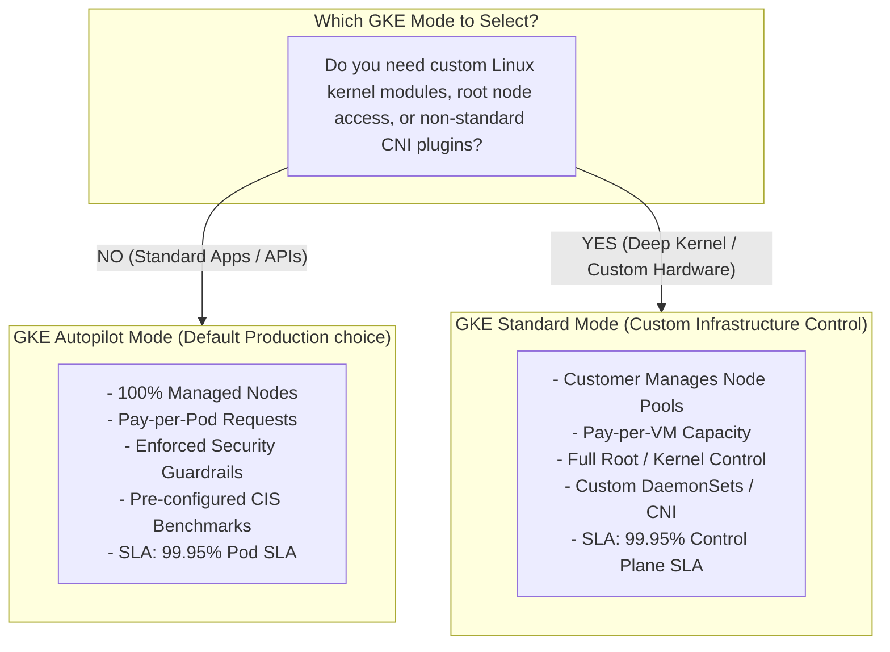

# Topic 63: Autopilot vs Standard

---

## 1. What Is It?

GKE provides two primary operating modes for running Kubernetes clusters: **GKE Autopilot** and **GKE Standard**.

- **GKE Autopilot**: A fully managed, "no-ops" mode where Google Cloud manages the entire cluster infrastructure—including worker node provisioning, auto-scaling, OS patching, security hardening, and node pool management. Customers manage only Kubernetes manifests (`yaml`), paying **strictly for the CPU, memory, and storage requested by running Pods**.
- **GKE Standard**: A traditional mode where Google manages the control plane, but the customer manages node pools, worker VM machine types (`n2-standard-4`), scaling parameters, and node OS upgrades. Customers pay for **full Compute Engine VM node capacity**, regardless of Pod utilization.

Google recommends **GKE Autopilot as the default choice for 90%+ of production container workloads**, reserving GKE Standard for specialized use cases requiring custom Linux kernel parameters or root-level node access.

### Real-World Analogy
Think of GKE Autopilot vs Standard like renting transportation:
- **GKE Standard (Car Rental)**: You rent a 7-passenger SUV (VM Node Pool). Whether you put 1 passenger or 7 passengers inside, you pay the exact same daily rental fee for the entire vehicle. You must monitor gas levels, pick tire types, and arrange oil changes.
- **GKE Autopilot (Uber / Rideshare)**: You pay strictly for individual passenger seats requested. You don't care what model of car arrives, who maintains the engine, or how many empty seats exist in the vehicle—Google manages the entire fleet, charging you only for the distance and seats requested.

---

## 2. Where Does It Fit?

Autopilot and Standard represent the two fundamental execution boundaries for container workloads in Google Cloud.



---

## 3. Core Concepts

| Feature | GKE Autopilot Mode | GKE Standard Mode |
|---|---|---|
| **Node Management** | Fully automated by Google (Zero node ops). | Customer provisions and manages node pools & VM shapes. |
| **Billing Model** | Billed per **Pod Resource Requests** (vCPU, RAM, Disk). | Billed per **Compute Engine VM Node Capacity** provisioned. |
| **Security Hardening** | Enforced CIS Benchmark guardrails (No root, no Privileged Pods). | Customer must configure Security Contexts and PodSecurity Standards. |
| **SLA Scope** | Covers **Pod Availability SLA** (99.95%). | Covers **Control Plane SLA** (99.95%); node SLA managed via VMs. |
| **SSH Node Access** | **Blocked** (No root access to underlying node VMs). | **Allowed** (Full SSH root access to worker node VMs). |
| **Custom DaemonSets** | Restricted (Allowed only from verified partners/system components). | Unrestricted (Run any custom DaemonSet). |

---

## 4. How It Works

Billing resource allocation and Pod scheduling differ between modes:

```text
GKE Standard Billing:
  Node Pool: 3 VMs * 8 vCPU / 32 GB RAM = 24 vCPU, 96 GB RAM Billed 24/7
  Pods Utilization: 4 vCPU, 16 GB RAM
  Wasted Capacity: 20 vCPU, 80 GB RAM -> YOU STILL PAY 100% FOR WASTED CAPACITY!

GKE Autopilot Billing:
  Pods Request: 4 vCPU, 16 GB RAM
  Billed Amount: EXACTLY 4 vCPU, 16 GB RAM!
  Google automatically packs Pods efficiently onto internal node infrastructure.
```

1. **Autopilot Resource Bin-Packing**: Google's internal controllers automatically bin-pack Pods onto optimal Compute Engine VM instances, absorbing overhead for system daemons.
2. **Autopilot Security Guardrails**: Autopilot blocks privileged containers (`privileged: true`), host path mounts (`hostPath`), and host networking (`hostNetwork: true`) to maintain multi-tenant security.

---

## 5. Production Scenario

### E-Commerce API Migration to GKE Autopilot

```text
Requirement: Migrate a 30-microservice Node.js and Python web platform to GKE, eliminating $5,000/month in wasted idle VM node capacity and removing node patching toil.
    ↓
Architecture: Regional GKE Autopilot Cluster (`gke-ecommerce-prod`).
    ↓
Deployment Spec (`deployment.yaml`):
  ```yaml
  apiVersion: apps/v1
  kind: Deployment
  metadata:
    name: payment-api
  spec:
    replicas: 10
    template:
      spec:
        containers:
        - name: payment
          image: us-central1-docker.pkg.dev/proj/repo/pay:v1.0
          resources:
            requests:
              cpu: "250m"
              memory: "512Mi"
  ```
    ↓
Financial Impact: Cluster billing drops from 20 under-utilized VM nodes down strictly to 10 Pod requests (2.5 vCPU, 5 GB RAM total), reducing monthly cluster costs by 65%.
    ↓
Monitoring: Cloud Monitoring tracking Pod request billing metrics and Pod scaling response times.
```

*Why Selected*: GKE Autopilot eliminates paying for unallocated idle node space while removing all worker node OS patching and security maintenance.

---

## 6. Hands-On Lab

### Prerequisites
- Active GCP Project.
- Cloud Shell or `gcloud` CLI (`kubectl` installed).
- IAM permissions: `roles/container.admin`.

### Console Method
1. Log into [Google Cloud Console](https://console.cloud.google.com/).
2. Navigate to **Kubernetes Engine** → **Clusters** → Click **CREATE**.
3. Compare the two UI flows:
   - Select **GKE Autopilot** → Note zero options for node pools, VM machine types, or disk sizes.
   - Select **GKE Standard** → Note extensive options for Node Pools, Machine Types (`e2-medium`), Disk Types (`pd-balanced`), and Auto-repair settings.
4. Click **CANCEL** (or provision an Autopilot cluster).

### CLI Method
Inspect resource request billing on GKE Autopilot using `kubectl`:

```bash
# Set variables
CLUSTER_NAME="gke-demo-cluster"
REGION="us-central1"

# 1. Connect to GKE Autopilot cluster
gcloud container clusters get-credentials $CLUSTER_NAME --region=$REGION

# 2. Deploy a microservice specifying explicit resource requests
cat <<EOF | kubectl apply -f -
apiVersion: apps/v1
kind: Deployment
metadata:
  name: demo-service
spec:
  replicas: 2
  template:
    metadata:
      labels:
        app: demo-service
    spec:
      containers:
      - name: web
        image: nginx:alpine
        resources:
          requests:
            cpu: "500m"
            memory: "256Mi"
EOF

# 3. Inspect Pod resource allocations and billing requests
kubectl get pods -l app=demo-service -o jsonpath='{range .items[*]}{.metadata.name}{"\t"}{.spec.containers[0].resources.requests}{"\n"}{end}'
```

### Verification
*Expected Result*: Command displays 2 Pods running with explicit billing requests `cpu: 500m`, `memory: 256Mi`.

### Cleanup
Delete deployment:

```bash
kubectl delete deployment demo-service
```

---

## 7. Security

### Autopilot Security Guardrails vs Standard Hardening
- **Privileged Execution**: Autopilot enforces `privileged: false`. Containers cannot access raw host kernel devices or bypass security controls.
- **Capabilities Restrictions**: Autopilot drops dangerous Linux capabilities (e.g., `CAP_SYS_ADMIN`, `CAP_NET_ADMIN`).
- **CIS Kubernetes Benchmark**: Autopilot clusters apply pre-configured CIS Kubernetes Benchmark security settings automatically.

```text
BAD PRACTICE:
Using GKE Standard mode without configuring PodSecurity Standards or Node Security Policies, allowing developers to run `privileged: true` root containers.
Risk: Vulnerable containers allow attackers to execute container breakouts and compromise underlying host VM nodes.

PRODUCTION PRACTICE:
Default to GKE Autopilot. Autopilot automatically blocks privileged containers, host mounts, and root execution by default.
```

---

## 8. Scaling & High Availability

Autopilot Horizontal Pod Autoscaling (HPA):

```text
Application Traffic Increases
   ↓ (Metrics Server Triggers HPA)
HPA increases Deployment Replicas from 2 to 10 Pods
   ↓ (Google Autopilot Controller)
Autopilot automatically provisions underlying node capacity in seconds to accommodate 8 new Pods
```

- **Pod Availability SLA**: GKE Autopilot provides an industry-leading **99.95% Pod Availability SLA** for Pods deployed across multiple zones.

---

## 9. Cost

### Detailed Billing Model Comparison

| Cost Vector | GKE Autopilot Mode | GKE Standard Mode |
|---|---|---|
| **Base Unit Billed** | **Pod Resource Requests** (vCPU, RAM, Disk). | **Compute Engine VM Instances** (Node Pools). |
| **Idle Capacity Cost** | **$0** (Google absorbs unallocated node space). | **Full Cost** (You pay for 100% of VM node RAM/CPU). |
| **System Daemon Overhead** | **$0** (Google pays for `kubelet`, `cAdvisor` RAM). | **Customer Pays** (~0.5 vCPU, 1 GB RAM per node). |
| **Minimum Pod Request** | `0.05` vCPU, `64 MiB` RAM. | N/A (Limited by VM node size). |

---

## 10. Monitoring & Troubleshooting

### Autopilot vs Standard Observability
- **Autopilot Resource Warnings**: If a manifest omits resource requests, Autopilot applies default values (`500m` CPU, `512Mi` RAM) and logs a warning.
- **Cost Allocation Tags**: Autopilot tags Pod billing metrics directly by namespace and workload name in Cloud Billing reports.

### Troubleshooting Matrix

| Symptom | Possible Cause | What to Check | Fix |
|---|---|---|---|
| Deployment rejected in Autopilot | Manifest requests `privileged: true` or `hostPath` volume | `kubectl describe deployment` | Remove privileged settings or use standard PVC storage instead of `hostPath`. |
| Autopilot Pod stuck in `Pending` | Requested CPU/RAM exceeds max single Pod limits | PodSpec `resources.requests` | Lower CPU/RAM requests (Max single Pod: 224 vCPU, 896 GB RAM). |
| Standard Cluster node pool CPU 100% | Cluster Autoscaler max nodes limit reached | GKE Node Pool configuration | Increase `--max-nodes` setting in Node Pool Autoscaler. |

---

## 11. Common Mistakes

```text
Mistake: Omitting `resources.requests` in GKE Autopilot manifests.
Why: Assuming Kubernetes will allocate resources dynamically without explicit requests.
Impact: Autopilot applies default resource requests (500m CPU, 512Mi RAM), potentially over-billing for lightweight microservices.
Correct approach: Explicitly define precise `resources.requests` (e.g., `100m` CPU, `128Mi` RAM) in all Autopilot manifests.

Mistake: Attempting to deploy third-party security agents requiring root `hostPath` mounts on GKE Autopilot.
Why: Treating Autopilot like GKE Standard.
Impact: Kubernetes API Server rejects the deployment with security guardrail errors.
Correct approach: Use GKE-approved DaemonSets or sidecar patterns for telemetry and monitoring on Autopilot.
```

---

## 12. Production Best Practices

- [ ] Default to **GKE Autopilot** for all new production container workloads.
- [ ] Define explicit, granular **`resources.requests`** (CPU, RAM) in all Pod manifests.
- [ ] Rely on GKE Autopilot's **99.95% Pod Availability SLA** by deploying multi-replica Pods.
- [ ] Use **GKE Standard** ONLY if your workload requires custom Linux kernel parameters, GPUs, or raw node SSH access.
- [ ] Use **Horizontal Pod Autoscaler (HPA)** to scale Pod replicas dynamically based on traffic.
- [ ] Automate all cluster definitions using Infrastructure as Code (Terraform).

---

## 13. Hyperscaler / Enterprise Perspective

```text
Personal / Learning
  Standard Mode (Single e2-medium VM) → Manual Pod Requests → No HPA
        ↓
Small Production
  Standard Mode (Auto-scaling Node Pools) → Custom Security Policies
        ↓
Enterprise Environment
  Autopilot Mode (Default Platform Choice) → Strict Pod Resource Guarantees → Workload Identity
        ↓
Hyperscaler Environment
  100% Autopilot Landing Zones → Granular FinOps Pod Billing Reports → Automated HPA & VPA Policy Enforcements
```

In a hyperscaler environment, enterprise platform engineering teams mandate **GKE Autopilot** across all business units. Autopilot eliminates node maintenance toil for thousands of clusters, while FinOps teams receive granular, pod-level billing attribution directly in BigQuery, enabling precise cost chargebacks to individual application development teams.

---

## 14. Real Project Questions

### Q1: What is the main billing difference between GKE Autopilot and GKE Standard?
**Answer:** In **GKE Standard**, customers pay for the **full Compute Engine VM capacity** of provisioned worker node pools, regardless of whether Pods utilize 10% or 100% of node RAM/CPU. In **GKE Autopilot**, customers pay **strictly for the CPU, memory, and storage requested by running Pods**, while Google absorbs the cost of unallocated node capacity and system daemon overhead.

### Q2: Why does GKE Autopilot block `privileged: true` containers and `hostPath` volume mounts?
**Answer:** GKE Autopilot enforces built-in **CIS Kubernetes Benchmark security guardrails** to guarantee multi-tenant security and cluster stability. Privileged containers and `hostPath` volume mounts allow containers to bypass isolation barriers, access raw host node hardware, and modify underlying host OS files—creating severe container breakout vulnerabilities.

### Q3: When MUST an enterprise choose GKE Standard over GKE Autopilot?
**Answer:** An enterprise must choose GKE Standard if their workload strictly requires:
1. Direct SSH root access to worker node VMs.
2. Custom Linux kernel parameters or non-standard kernel modules.
3. Third-party monitoring agents requiring privileged `hostPath` mounts.
4. Specific legacy CNI networking plugins unsupported in Autopilot.

---

## 15. Quick Decision Guide

| Requirement | Recommended Approach | Reason |
|---|---|---|
| Standard web APIs, microservices, or queue workers with zero node maintenance toil | **GKE Autopilot** | 100% managed nodes, pay-per-Pod requests, enforced security guardrails, 99.95% Pod SLA. |
| Specialized machine learning workload requiring custom GPU drivers and kernel modules | **GKE Standard** | Full access to underlying worker VM node pool configurations and OS settings. |
| Eliminating wasted billing on under-utilized Kubernetes worker nodes | **GKE Autopilot** | Eliminates paying for idle, unallocated VM node capacity. |

### When should I use it?
- Essential comparison framework for selecting between GKE Autopilot and GKE Standard cluster modes.

### When should I NOT use it?
- Do not default to GKE Standard unless custom node infrastructure requirements explicitly demand it.

---

## 16. Related Services

```text
               [63. Autopilot vs Standard]
              /             |             \
      Pod Resource    Compute Engine   Cloud Billing
      Requests (Auto)   VM Nodes (Std) (Cost Attribution)
           |                |               |
       Pay-per-Pod       Pay-per-VM       Pod-Level
       Requests           Capacity        Chargebacks
```

- **Compute Engine**: Powers worker VM nodes in GKE Standard.
- **Horizontal Pod Autoscaler (HPA)**: Scales Pod replicas dynamically in both modes.
- **Cloud Billing**: Reports granular pod-level costs for Autopilot clusters.

---

## 17. Cheat Sheet

### Feature Summary
- **Autopilot**: Pay-per-Pod, 100% managed nodes, No SSH, Enforced Security.
- **Standard**: Pay-per-VM, customer manages node pools, SSH allowed, Custom Nodes.
- **Autopilot SLA**: 99.95% Pod Availability SLA.
- **Recommendation**: Autopilot default for 90%+ of workloads.

### Useful Commands
```bash
# Create a GKE Autopilot cluster (Default)
gcloud container clusters create-auto CLUSTER_NAME --region=us-central1

# Create a GKE Standard cluster (Legacy)
gcloud container clusters create CLUSTER_NAME --region=us-central1 --num-nodes=3

# Inspect Pod resource requests on Autopilot
kubectl get pods -o custom-columns=NAME:.metadata.name,CPU:.spec.containers[*].resources.requests.cpu
```

---

## 18. Learning Connection

- **Previous Topic**: [62. GKE Cluster Types](../62-gke-cluster-types/README.md)
- **Next Topic**: [64. Node Pools](../64-node-pools/README.md)
