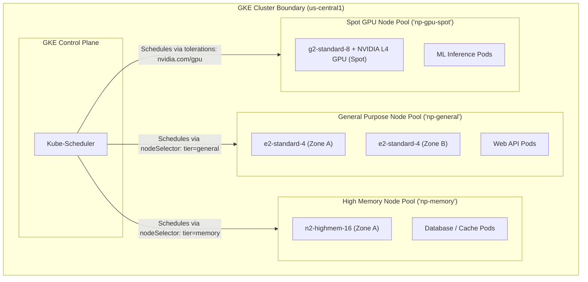

# Topic 64: Node Pools

---

## 1. What Is It?

In GKE Standard mode, a **Node Pool** is a subset of worker machine instances within a cluster that all share the exact same configuration: machine type (e.g., `n2-standard-4`), disk size, disk type (`pd-ssd`), operating system image (`Container-Optimized OS`), labels, taints, and scaling policies.

Node Pools allow cluster administrators to customize hardware environments within a single GKE cluster. Rather than running all application Pods on identical generic VM instances, administrators can create heterogeneous node pools tailored to specific workload profiles:
- **General Purpose Node Pool**: Low-cost `e2-standard-4` instances for web APIs.
- **High-Memory Node Pool**: `n2-highmem-16` instances for in-memory caching and analytics.
- **GPU Node Pool**: `g2-standard-8` instances equipped with NVIDIA L4 GPUs for AI/ML inference.
- **Spot / Preemptible Node Pool**: Discounted `e2-standard-8` Spot VMs (60–91% cost savings) for fault-tolerant batch processing.

### Real-World Analogy
Think of a Node Pool like different specialized delivery vehicle fleets owned by a logistics company (GKE Cluster). Instead of using heavy 18-wheeler semi-trucks to deliver small envelope letters (General APIs), the company maintains 3 distinct vehicle pools: a pool of scooters for small letters (General Purpose Pool), a pool of refrigerated trucks for ice cream (High-Memory Pool), and a pool of heavy flatbed trucks for construction beams (GPU / High-Compute Pool).

---

## 2. Where Does It Fit?

Node Pools reside within a GKE Cluster, serving as target Compute Engine VM infrastructure for Pod scheduling using Kubernetes Node Selectors, Taints, and Tolerations.



---

## 3. Core Concepts

| Node Pool Setting | Description | Example / Value | Best Practice |
|---|---|---|---|
| **Machine Type** | Compute Engine VM shape driving vCPU and RAM capacity. | `e2-standard-4`, `c3-highcpu-8` | Match machine shape to workload resource requirements. |
| **Cluster Autoscaler** | Dynamically adds or removes VM nodes in response to Pod pending status. | `--enable-autoscaling --min-nodes=1 --max-nodes=10` | Always enable Cluster Autoscaler on production node pools. |
| **Spot VMs** | Excess Compute Engine capacity offered at 60–91% discounts (preemptible). | `--spot` | Use Spot Node Pools strictly for fault-tolerant, stateless batch jobs. |
| **Node Taints** | Key-value attributes that repel Pods unless the Pod has a matching Toleration. | `key=gpu:NoSchedule` | Use Taints to prevent general Pods from taking space on expensive GPU nodes. |
| **Node Labels** | Key-value tags used by `nodeSelector` or `nodeAffinity` for Pod targeting. | `cloud.google.com/gke-nodepool=np-memory` | Target specific workloads to matching node pools using Node Labels. |

---

## 4. How It Works

Node Pool Autoscaling and Taint evaluation operate deterministically:

```text
Cluster Autoscaler monitors for `Pending` Pods (Un-schedulable due to CPU/RAM limits)
              ↓
Identifies matching Node Pool based on Pod `nodeSelector` / `tolerations`
              ↓
Autoscaler provisions new Compute Engine VM instance in target Node Pool
              ↓
VM boots -> `kubelet` joins cluster -> Kube-Scheduler places `Pending` Pod on new node!
              ↓
(Scale-Down): Node un-utilized for 10 minutes -> Autoscaler drains & terminates VM instance
```

1. **Auto-Repair**: Node Pools monitor VM health continuously. If a node fails health checks, GKE drains and replaces the underlying VM instance automatically.
2. **Surge Upgrades**: Node Pool upgrades use `max-surge` (new nodes added first) and `max-unavailable` (old nodes removed) to ensure zero workload downtime during OS patches.

---

## 5. Production Scenario

### Cost-Optimized Multi-Tier Node Pool Architecture

```text
Requirement: Run a enterprise SaaS application containing web APIs, Redis caches, and batch video encoding jobs, minimizing monthly compute costs while maintaining high availability.
    ↓
Architecture: 3 Specialized Node Pools within a single Regional GKE Cluster (`gke-saas-prod`).
    ↓
Node Pool Definitions:
  - Node Pool 1 (`np-web`): `e2-standard-4` (Autoscaling: Min 3, Max 12 nodes) for web APIs.
  - Node Pool 2 (`np-cache`): `n2-highmem-8` (Autoscaling: Min 2, Max 4 nodes) with Taint `workload=cache:NoSchedule` for Redis.
  - Node Pool 3 (`np-batch-spot`): `e2-standard-8` **Spot VMs** (Autoscaling: Min 0, Max 20 nodes) with Taint `spot=true:NoSchedule` for video encoding.
    ↓
Financial Impact: Using Spot VMs for batch encoding cuts batch processing compute costs by 70%, saving ~$3,500/month.
    ↓
Monitoring: Cloud Monitoring tracking `node_pool/node_count` and Cluster Autoscaler events.
```

*Why Selected*: Combining standard, high-memory, and Spot VM node pools ensures specialized workloads receive appropriate hardware while Spot VMs drastically reduce batch compute expenses.

---

## 6. Hands-On Lab

### Prerequisites
- Active GCP Project with a GKE Standard Cluster running.
- Cloud Shell or `gcloud` CLI (`kubectl` installed).
- IAM permissions: `roles/container.admin`.

### Console Method
1. Log into [Google Cloud Console](https://console.cloud.google.com/).
2. Navigate to **Kubernetes Engine** → **Clusters** → Select your Standard Cluster.
3. Click **NODES** tab → Click **ADD NODE POOL** at top.
4. Set Name: `np-highmem`, Machine type: `n2-highmem-4` (4 vCPU, 32 GB RAM).
5. Expansion: Check **Enable autoscaling** → Min nodes: `1`, Max nodes: `5`.
6. Expand **Node labels and taints**:
   - Add Taint: Key `workload`, Value `highmem`, Effect `NoSchedule`.
   - Add Label: Key `tier`, Value `highmem`.
7. Click **CREATE**.

### CLI Method
Create a Spot VM Node Pool with Taints and Autoscaling using `gcloud`:

```bash
# Set variables
PROJECT_ID="your-gcp-project-id"
CLUSTER_NAME="gke-demo-cluster"
REGION="us-central1"
NODE_POOL_NAME="np-batch-spot"

# 1. Add a Spot VM Node Pool with Autoscaling, Labels, and Taints
gcloud container node-pools create $NODE_POOL_NAME \
    --cluster=$CLUSTER_NAME \
    --region=$REGION \
    --machine-type=e2-standard-4 \
    --spot \
    --enable-autoscaling \
    --min-nodes=0 \
    --max-nodes=10 \
    --node-labels=workload-type=batch \
    --node-taints=spot-instance=true:NoSchedule

# 2. Inspect node pools in the cluster
gcloud container node-pools list --cluster=$CLUSTER_NAME --region=$REGION

# 3. View node pool nodes and taints using kubectl
kubectl get nodes -l workload-type=batch -o custom-columns=NAME:.metadata.name,TAINTS:.spec.taints
```

### Verification
*Expected Result*: Output displays new Spot nodes labeled `workload-type=batch` with Taint `spot-instance=true:NoSchedule`.

### Cleanup
Delete node pool:

```bash
gcloud container node-pools delete $NODE_POOL_NAME --cluster=$CLUSTER_NAME --region=$REGION --quiet
```

---

## 7. Security

### Node Pool Security Hardening
- **Dedicated Node Service Accounts**: Assign custom least-privilege service accounts to each node pool. Never use the default Compute Engine service account.
- **Shielded GKE Nodes**: Enable Shielded VM options (Secure Boot, Integrity Monitoring) on all node pools.
- **Node Isolation via Taints**: Taint expensive or sensitive node pools (e.g., GPU nodes or payment processing nodes) to prevent unauthorized general Pods from scheduling onto them.

```text
BAD PRACTICE:
Assigning default Compute Engine Service Accounts (with `Editor` role) to GKE Node Pools without node taints.
Risk: A compromised web container can query the GKE metadata server and obtain full project Editor privileges.

PRODUCTION PRACTICE:
Create dedicated Node Service Accounts with `roles/artifactregistry.reader` and `roles/logging.logWriter`. Taint specialized node pools.
```

---

## 8. Scaling & High Availability

Node Pool Auto-Repair & Auto-Upgrade Lifecycle:

```text
Node VM Health Check Fails (Unresponsive kubelet or memory corruption)
   ↓ (GKE Auto-Repair System)
GKE drains Pods gracefully -> Terminates failed VM instance -> Provisions fresh VM replacement
   ↓ (Zero Application Downtime)
New VM joins Node Pool -> Kube-Scheduler reschedules Pods onto healthy replacement node
```

- **Surge Upgrade Strategy**: Always configure `--max-surge=1` and `--max-unavailable=0` on production node pools to ensure zero capacity loss during rolling OS upgrades.

---

## 9. Cost

### Node Pool Financial Optimization Strategies
- **Spot / Preemptible VMs**: Leverage Spot Node Pools (`--spot`) for fault-tolerant, stateless batch workloads to save **60% to 91%** on compute costs.
- **Scale to Zero (Min Nodes = 0)**: Set `--min-nodes=0` on batch or GPU node pools so idle node pools scale down to 0 instances when no batch jobs are queued.
- **Right-Sizing Machine Types**: Avoid using over-sized machine shapes; use Cloud Monitoring node utilization metrics to pick lean, cost-effective machine families (`e2` vs `n2`).

---

## 10. Monitoring & Troubleshooting

### Node Pool Observability Tools
- **Cluster Autoscaler Logs**: Inspect Cloud Logging logs under `resource.type="k8s_cluster"` to audit scale-up and scale-down decisions.
- **Cloud Monitoring Node Dashboards**: Track CPU, Memory, and Disk utilization per node pool.

### Troubleshooting Matrix

| Symptom | Possible Cause | What to Check | Fix |
|---|---|---|---|
| Pod stuck in `Pending` with `untolerated taint` error | Pod lacks `tolerations` required by the target Node Pool | `kubectl describe pod <pod-name>` | Add matching `tolerations` block to PodSpec or adjust node taints. |
| Node Pool fails to scale down | Pods on node lack `PodDisruptionBudget` or use local `hostPath` storage | Cluster Autoscaler logs | Remove `hostPath` volumes; configure `PodDisruptionBudget` correctly. |
| Spot VM nodes terminated unexpectedly | Compute Engine reclaimed Spot VM capacity | `kubectl get nodes` | Ensure Deployment has multiple replicas and handles preemption gracefully. |

---

## 11. Common Mistakes

```text
Mistake: Forgetting to add Taints to expensive GPU or High-Memory Node Pools.
Why: Assuming `nodeSelector` alone is sufficient to isolate workloads.
Impact: General lightweight web Pods get scheduled onto expensive GPU nodes, consuming RAM and preventing GPU batch jobs from scheduling.
Correct approach: Always add a Taint (e.g., `gpu=true:NoSchedule`) to specialized node pools and add matching `tolerations` to GPU PodSpecs.

Mistake: Setting `--min-nodes=1` on non-production or batch node pools that only run jobs once per day.
Why: Defaulting min-nodes to 1 out of habit.
Impact: Paying for 24/7 idle VM node capacity when no batch jobs are running.
Correct approach: Set `--min-nodes=0` so the Cluster Autoscaler scales the node pool to 0 instances when idle.
```

---

## 12. Production Best Practices

- [ ] Separate workloads into dedicated node pools based on hardware requirements (General, High-Memory, GPU, Spot).
- [ ] Enable **Cluster Autoscaler** (`--enable-autoscaling`) on all production node pools.
- [ ] Use **Node Taints and Labels** to isolate specialized hardware (GPU / Memory).
- [ ] Use **Spot VMs** for stateless, fault-tolerant batch processing workloads.
- [ ] Configure **Dedicated Node Service Accounts** with least-privilege IAM roles.
- [ ] Automate node pool creation and scaling policies using Infrastructure as Code (Terraform).

---

## 13. Hyperscaler / Enterprise Perspective

```text
Personal / Learning
  Single Default Node Pool → Generic `e2-medium` VMs → No Autoscaling → Default Service Account
        ↓
Small Production
  Autoscaling Node Pools → Separate High-Memory Pool → Custom Node Service Account
        ↓
Enterprise Environment
  Heterogeneous Node Pools (General, Memory, Spot) → Node Taints & Tolerations → Shielded Nodes
        ↓
Hyperscaler Environment
  100% Terraform Provisioned Node Pools → Automated Spot Preemption Resilience Testing → Dynamic GPU Node Provisioning
```

In a hyperscaler environment, platform SRE teams maintain specialized node pools across massive GKE clusters. Automated Terraform modules provision dedicated Spot VM node pools for batch processing, high-memory node pools for stateful caches, and GPU node pools for AI inference. Continuous chaos experiments validate that applications fail over seamlessly when Spot nodes are preempted by Compute Engine.

---

## 14. Real Project Questions

### Q1: What is the purpose of Node Taints and Tolerations in GKE Node Pools?
**Answer:** **Node Taints** are key-value attributes applied to a node pool that *repel* Pods, preventing general workloads from scheduling on those nodes. **Tolerations** are applied to specific PodSpecs, allowing those specific Pods to "tolerate" the taint and schedule onto the node. This mechanism ensures specialized nodes (like expensive GPU or High-Memory instances) are reserved strictly for intended workloads.

### Q2: How does the GKE Cluster Autoscaler interact with Node Pools?
**Answer:** The Cluster Autoscaler monitors for Pods in a `Pending` state due to insufficient cluster CPU or memory. It inspects available node pools, identifies which node pool satisfies the pending Pod's requirements (`nodeSelector`, `tolerations`, zone), and requests Compute Engine to provision additional VM instances in that node pool up to `--max-nodes`. When nodes remain un-utilized, it drains and terminates them down to `--min-nodes`.

### Q3: When should an enterprise leverage Spot VM Node Pools in GKE?
**Answer:** Enterprises should leverage **Spot VM Node Pools** for stateless, fault-tolerant, or batch-processing workloads (such as video transcoding, CI/CD builds, or ML model training) that can handle sudden node terminations. Spot VMs provide **60% to 91% cost savings** compared to standard VMs, allowing scale-to-zero autoscaling when no batch jobs are queued.

---

## 15. Quick Decision Guide

| Requirement | Recommended Approach | Reason |
|---|---|---|
| Running stateless batch processing jobs requiring maximum cost savings | **Spot VM Node Pool (`--spot --min-nodes=0`)** | Delivers 60–91% cost savings and scales to 0 nodes when no jobs exist. |
| Isolating expensive NVIDIA L4 GPU instances so general web APIs cannot schedule on them | **GPU Node Pool with Taint (`gpu=true:NoSchedule`)** | Taint blocks general Pods; only GPU Pods with matching toleration can schedule. |
| Running memory-intensive Redis caching workloads requiring 64 GB RAM per node | **High-Memory Node Pool (`n2-highmem-8`)** | Provides optimized high-RAM-to-CPU ratio tailored for in-memory datastores. |

### When should I use it?
- Essential architectural concept for customizing hardware, scaling policies, and cost optimization in GKE Standard mode.

### When should I NOT use it?
- Do not manage node pools manually in GKE Autopilot mode (Autopilot manages node infrastructure automatically).

---

## 16. Related Services

```text
                 [64. Node Pools]
                /        |        \
        Compute Engine Cluster     Cloud Monitoring
        (VM Shapes)   Autoscaler    (Node Metrics)
           |             |               |
        Hardware      Scale Up /     CPU / RAM
        Profiles      Scale Down     Utilization
```

- **Compute Engine**: Underlying VM instance infrastructure powering node pools.
- **Cluster Autoscaler**: Automatically scales node pool instance counts up and down.
- **Cloud Monitoring**: Tracks CPU, memory, and disk utilization metrics across node pools.

---

## 17. Cheat Sheet

### Essential Parameters
- `--machine-type` : VM machine shape (e.g., `e2-standard-4`).
- `--enable-autoscaling --min-nodes=0 --max-nodes=10` : Autoscaling bounds.
- `--spot` : Provision Spot VM instances (60-91% savings).
- `--node-taints=KEY=VALUE:EFFECT` : Repel non-matching Pods.

### Useful Commands
```bash
# Add a new node pool to an existing cluster
gcloud container node-pools create POOL_NAME \
    --cluster=CLUSTER_NAME --region=us-central1 \
    --machine-type=e2-standard-4 --enable-autoscaling --min-nodes=1 --max-nodes=5

# Delete a node pool
gcloud container node-pools delete POOL_NAME --cluster=CLUSTER_NAME --region=us-central1

# View node pool taints using kubectl
kubectl get nodes -o custom-columns=NAME:.metadata.name,TAINTS:.spec.taints
```

---

## 18. Learning Connection

- **Previous Topic**: [63. Autopilot vs Standard](../63-autopilot-vs-standard/README.md)
- **Next Topic**: [65. Workloads](../65-workloads/README.md)
