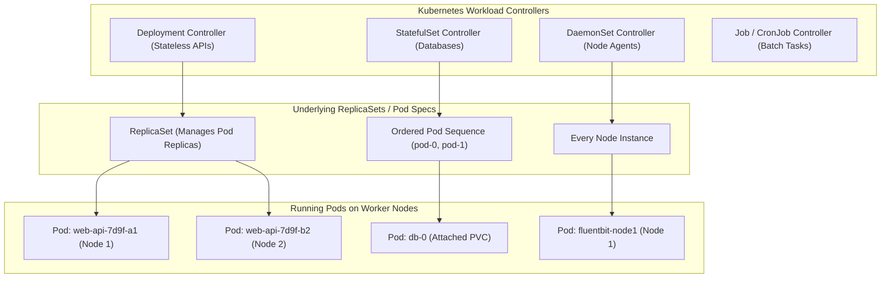

# Topic 65: Workloads

---

## 1. What Is It?

In Kubernetes and GKE, a **Workload** is an application or process running inside one or more **Pods** on the cluster. Rather than creating and managing raw individual Pods directly, Kubernetes provides high-level **Workload Controllers** that manage Pod lifecycles, scaling, rolling updates, and self-healing automatically.

The primary Kubernetes Workload Controller types are:
1. **Deployment**: Ideal for stateless applications (e.g., web APIs, microservices). Handles zero-downtime rolling updates and replica scaling.
2. **StatefulSet**: Designed for stateful applications (e.g., databases, Kafka, Redis). Guarantees sticky network identities (`pod-0`, `pod-1`) and ordered volume provisioning.
3. **DaemonSet**: Ensures a copy of a specific Pod runs on **every worker node** (or selected nodes) in the cluster (e.g., logging agents, security sidecars).
4. **Job**: Executes a batch task to completion and exits (e.g., database migrations, data export scripts).
5. **CronJob**: Runs batch Jobs automatically on a recurring schedule (e.g., nightly report generation).

### Real-World Analogy
Think of Workload Controllers like different management contracts for staffing an event venue:
- **Deployment**: Standard shift workers. If 1 worker calls in sick, a replacement worker steps in instantly. Nobody cares about the worker's name or badge number.
- **StatefulSet**: Orchestra musicians. Player #1 plays first violin, Player #2 plays cello. If Player #1 calls in sick, the substitute MUST sit in Chair #1 and play the exact same first violin parts.
- **DaemonSet**: Facility security guards. Every single door in the venue MUST have exactly 1 guard posted at all times.
- **Job / CronJob**: A specialized cleaning crew hired to clean the venue at 02:00 AM every Sunday night and leave when done.

---

## 2. Where Does It Fit?

Workload Controllers sit above raw Pods in the Kubernetes API hierarchy, managing Pod lifecycle state and deployment updates.



---

## 3. Core Concepts

| Workload Type | Primary Use Case | Pod Naming Pattern | Storage Binding |
|---|---|---|---|
| **Deployment** | Stateless HTTP APIs, microservices, frontend apps. | Random hashes (`web-api-7d8b-x9q`) | Ephemeral or shared ReadOnly. |
| **StatefulSet** | Relational databases, Redis, Kafka, ZooKeeper. | Persistent ordinal index (`db-0`, `db-1`) | Dedicated PersistentVolumeClaim per Pod. |
| **DaemonSet** | Log collectors (`Fluentbit`), monitoring agents (`Prometheus`), CNI plugins. | Tied to Node name | HostPath mounts for system logs. |
| **Job** | One-off database schema migrations, batch ETL tasks. | Random hash (`mig-job-k82p`) | Ephemeral or temporary buckets. |
| **CronJob** | Scheduled nightly backups, billing processing runs. | Scheduled execution instances | Ephemeral or temporary buckets. |

---

## 4. How It Works

Zero-Downtime Rolling Updates in Deployments operate deterministically:

```text
Developer updates Deployment image tag from `v1.0` to `v2.0` (`kubectl set image`)
              ↓
Deployment Controller creates a NEW ReplicaSet (v2.0)
              ↓
New ReplicaSet launches Pod 1 (v2.0) -> Waits for Readiness Probe success
              ↓
Once ready, OLD ReplicaSet terminates Pod 1 (v1.0)
              ↓
Process repeats incrementally (Rolling Update) until ALL Pods run v2.0 with ZERO downtime!
```

1. **Self-Healing**: If a worker node crashes, Deployment and StatefulSet controllers immediately reschedule replacement Pods onto healthy nodes.
2. **StatefulSet Ordinal Indexing**: StatefulSets deploy Pods sequentially (`db-0` must be healthy before `db-1` boots) and terminate them in reverse order (`db-1` before `db-0`).

---

## 5. Production Scenario

### Enterprise Payment Processing Deployment & Stateful Cache

```text
Requirement: Run a high-availability stateless Payment Microservice with zero-downtime rolling updates alongside a stateful Redis session cluster requiring persistent ordered storage.
    ↓
Architecture: Deployment (Stateless API) + StatefulSet (Session Store).
    ↓
Deployment Manifest (`payment-deployment.yaml`):
  - Kind: `Deployment`, Replicas: `5`.
  - Strategy: `RollingUpdate` (`maxSurge: 25%`, `maxUnavailable: 0`).
  - Probes: Readiness (`/healthz`) & Liveness (`/livez`) configured.
    ↓
StatefulSet Manifest (`redis-statefulset.yaml`):
  - Kind: `StatefulSet`, Replicas: `3`, ServiceName: `redis-cluster`.
  - VolumeClaimTemplate: Automatically provisions 3 distinct 20 GB `pd-ssd` PersistentDisks bound to `redis-0`, `redis-1`, and `redis-2`.
    ↓
Security: Non-root execution (`runAsNonRoot: true`), read-only root filesystems.
    ↓
Monitoring: Cloud Monitoring tracking Pod readiness status and restart counts.
```

*Why Selected*: Deployments guarantee zero downtime during API updates, while StatefulSets provide stable network identities and dedicated SSD disks for each database node.

---

## 6. Hands-On Lab

### Prerequisites
- Active GCP Project with a GKE Cluster running.
- Cloud Shell or `gcloud` CLI (`kubectl` installed).
- IAM permissions: `roles/container.admin`.

### Console Method
1. Log into [Google Cloud Console](https://console.cloud.google.com/).
2. Navigate to **Kubernetes Engine** → **Workloads**.
3. View the list of active workloads grouped by Name, Type (Deployment, StatefulSet, DaemonSet), Namespace, and Status.
4. Click **DEPLOY** at top → Select **Existing container image** (`nginx:alpine`).
5. Set Application Name: `nginx-demo`, Replicas: `3`.
6. Click **DEPLOY** → Inspect the created Deployment details page, Pods, and Revision History.

### CLI Method
Create a Deployment, execute a rolling update, and observe rollbacks using `kubectl`:

```bash
# Set variables
CLUSTER_NAME="gke-demo-cluster"
REGION="us-central1"

# 1. Connect to GKE cluster
gcloud container clusters get-credentials $CLUSTER_NAME --region=$REGION

# 2. Create a Deployment running Nginx v1.21
kubectl create deployment web-app --image=nginx:1.21 --replicas=3

# 3. Expose deployment and verify running Pods
kubectl rollout status deployment/web-app

# 4. Perform a zero-downtime Rolling Update to Nginx v1.23
kubectl set image deployment/web-app nginx=nginx:1.23

# 5. Monitor the rolling update progress
kubectl rollout status deployment/web-app

# 6. Undo (rollback) the update if an issue occurs
kubectl rollout undo deployment/web-app
```

### Verification
*Expected Result*: `kubectl rollout undo` rolls back the deployment to revision 1, verified via `kubectl describe deployment web-app`.

### Cleanup
Delete deployment:

```bash
kubectl delete deployment web-app
```

---

## 7. Security

### Workload Security Context Hardening
- **Run as Non-Root**: Set `securityContext.runAsNonRoot: true` and specify `runAsUser: 1000` to block root container execution.
- **Read-Only Root Filesystem**: Enforce `securityContext.readOnlyRootFilesystem: true` to prevent malware from modifying container binaries.
- **Drop Linux Capabilities**: Drop ALL Linux capabilities (`capabilities.drop: ["ALL"]`) to restrict system call access.

```text
BAD PRACTICE:
Creating raw Pod manifests directly (`kind: Pod`) in production without a Workload Controller (Deployment/StatefulSet).
Risk: If the worker node hosting the raw Pod crashes, Kubernetes will NOT reschedule the Pod, causing permanent service downtime.

PRODUCTION PRACTICE:
Always manage Pods using Workload Controllers (Deployment or StatefulSet). Enforce strict PodSecurity standards in SecurityContexts.
```

---

## 8. Scaling & High Availability

Deployment Rolling Update Strategies:

```text
Recreate Strategy (All old Pods killed simultaneously -> Service Downtime during update)
   ↓ (Zero Downtime Production Upgrade)
RollingUpdate Strategy (`maxSurge: 25%`, `maxUnavailable: 0` -> New Pods provisioned first -> Zero Downtime)
```

- **PodDisruptionBudget (PDB)**: Always define a `PodDisruptionBudget` for production Deployments (e.g., `minAvailable: 80%`) to prevent node maintenance upgrades from draining too many Pods simultaneously.

---

## 9. Cost

### Workload Cost Optimization
- **Right-Size Resource Requests**: Set accurate `requests.cpu` and `requests.memory` values based on actual usage telemetry. Over-provisioning requests wastes node capacity.
- **Horizontal Pod Autoscaling (HPA)**: Use HPA to scale Deployment replicas down during off-peak hours (e.g., scale from 20 replicas down to 2 at night).

---

## 10. Monitoring & Troubleshooting

### Workload Observability Tools
- **Kubernetes Probes**: Configure **Liveness Probes** (restarts dead containers) and **Readiness Probes** (removes unhealthy containers from load balancing).
- **Cloud Monitoring Workload Metrics**: Monitor `kubernetes.io/pod/container/cpu/core_usage_time` and `container/memory/used_bytes`.

### Troubleshooting Matrix

| Symptom | Possible Cause | What to Check | Fix |
|---|---|---|---|
| Deployment stuck in `ProgressDeadlineExceeded` | New container failing Liveness/Readiness probe or missing image | `kubectl rollout status` & `kubectl describe pod` | Inspect application startup logs; fix failing readiness probe endpoints. |
| StatefulSet Pod fails to attach storage | PersistentVolumeClaim already bound or zone mismatch | `kubectl describe pvc` | Ensure PVC volume storage class supports the target node zone. |
| Pod crashing repeatedly (`CrashLoopBackOff`) | Missing environment variable, missing secret, or app runtime error | `kubectl logs <pod-name> --previous` | Inspect previous container crash logs to diagnose initialization bugs. |

---

## 11. Common Mistakes

```text
Mistake: Using a Deployment workload controller for stateful database software (e.g., MySQL or PostgreSQL).
Why: Treating all workloads as interchangeable Deployments.
Impact: Data corruption! Deployments terminate and replace Pods in random order, sharing or misattaching persistent disks.
Correct approach: Use **StatefulSet** for stateful database workloads requiring persistent ordered storage and network identities.

Mistake: Omitting Readiness Probes from Deployment manifests.
Why: Shortcut taken during initial manifest creation.
Impact: Traffic is routed to newly launched Pods before the application finishes booting, causing HTTP 502/503 errors during rolling updates.
Correct approach: Define explicit `readinessProbe` HTTP or TCP checks on all web service containers.
```

---

## 12. Production Best Practices

- [ ] Use **Deployments** for stateless APIs and **StatefulSets** for stateful database workloads.
- [ ] Always configure explicit **Readiness** and **Liveness Probes** on web applications.
- [ ] Set `maxUnavailable: 0` in Deployment `RollingUpdate` strategies for zero-downtime updates.
- [ ] Define **PodDisruptionBudgets (PDBs)** to protect workload availability during node upgrades.
- [ ] Enforce security guardrails (`runAsNonRoot: true`, `readOnlyRootFilesystem: true`).
- [ ] Automate all workload manifest deployments using Helm, Kustomize, or GitOps (ArgoCD).

---

## 13. Hyperscaler / Enterprise Perspective

```text
Personal / Learning
  Raw Pod Manifests (`kind: Pod`) → No Probes → No Resource Limits → Manual `kubectl apply`
        ↓
Small Production
  Deployments → Rolling Updates → Basic Readiness Probes → Helm Management
        ↓
Enterprise Environment
  Deployments & StatefulSets → PodDisruptionBudgets → Non-Root SecurityContexts → HPA
        ↓
Hyperscaler Environment
  100% GitOps Declarative Deployment (ArgoCD / Flux) → Automated Canary Deployments (Flagger) → Automated PDB & VPA Governance
```

In a hyperscaler environment, workloads are managed entirely via **GitOps** and automated progressive delivery tools (such as Flagger or Argo Rollouts). When code is merged, GitOps controllers deploy canary releases, automatically analyzing real-time error rates and latency metrics before shifting 100% of production traffic to the new workload revision.

---

## 14. Real Project Questions

### Q1: What is the main architectural difference between a Deployment controller and a StatefulSet controller in Kubernetes?
**Answer:** A **Deployment** manages interchangeable, stateless Pods with random hashed names (`web-api-7d8b-x9q`) where Pods can be created or destroyed in any order. A **StatefulSet** manages stateful Pods with unique, persistent ordinal indexes (`db-0`, `db-1`), providing deterministic startup/shutdown ordering and binding a dedicated PersistentVolumeClaim (PVC) to each specific ordinal Pod instance.

### Q2: How do Readiness Probes prevent user-facing downtime during Deployment rolling updates?
**Answer:** During a rolling update, Kubernetes launches a new Pod running the updated image. The Load Balancer service will **NOT** route user traffic to the new Pod until its **Readiness Probe** returns HTTP 200 OK, verifying the application has booted successfully. Only after the new Pod passes readiness does Kubernetes terminate an old Pod revision.

### Q3: What is the function of a DaemonSet workload controller in GKE?
**Answer:** A **DaemonSet** guarantees that a copy of a specific Pod runs on **every worker node** (or a selected subset of nodes) in the cluster. As new worker nodes are added to node pools, the DaemonSet automatically schedules the Pod onto the new nodes. DaemonSets are primarily used for node-level system agents, such as log collectors (`Fluentbit`), security scanners, and network plugins.

---

## 15. Quick Decision Guide

| Requirement | Recommended Approach | Reason |
|---|---|---|
| Running a stateless Node.js REST API with zero-downtime rolling updates | **Deployment Workload Controller** | Manages stateless replicas, rolling updates, and self-healing automatically. |
| Running a 3-node MongoDB database cluster requiring dedicated persistent SSD disks per node | **StatefulSet Workload Controller** | Guarantees ordered Pod index names (`mongo-0`) and dedicated PVC disk bindings. |
| Installing a Datadog log monitoring agent on every worker node in the GKE cluster | **DaemonSet Workload Controller** | Automatically provisions exactly 1 monitoring Pod per worker node. |

### When should I use it?
- Essential core concept for packaging, managing, and scaling applications inside Kubernetes and GKE.

### When should I NOT use it?
- Do not create raw individual Pod manifests (`kind: Pod`) directly in production—always use a Workload Controller.

---

## 16. Related Services

```text
                   [65. Workloads]
                  /       |       \
          Kubernetes   GKE Node   Cloud Monitoring
          Services      Pools     (Pod Metrics)
              |           |              |
          Network      Worker        CPU / RAM
          Routing      Execution     Telemetry
```

- **Kubernetes Services**: Provides stable networking endpoints for Pod workloads.
- **Node Pools**: Worker VM infrastructure executing Pod workloads.
- **Horizontal Pod Autoscaler (HPA)**: Scales Deployment workload replicas dynamically.

---

## 17. Cheat Sheet

### Workload Types
- **Deployment**: Stateless web apps (Random Pod hashes).
- **StatefulSet**: Stateful DBs (Ordinal index `app-0`, dedicated PVCs).
- **DaemonSet**: Node-level agents (1 Pod per node).
- **Job / CronJob**: Batch tasks (Run to completion / Scheduled).

### Useful Commands
```bash
# Create a deployment
kubectl create deployment APP_NAME --image=IMAGE_NAME --replicas=3

# Update deployment image (Rolling update)
kubectl set image deployment/APP_NAME CONTAINER_NAME=NEW_IMAGE:TAG

# Check rollout status
kubectl rollout status deployment/APP_NAME

# Rollback deployment update
kubectl rollout undo deployment/APP_NAME
```

---

## 18. Learning Connection

- **Previous Topic**: [64. Node Pools](../64-node-pools/README.md)
- **Next Topic**: [66. Services](../66-services/README.md)
