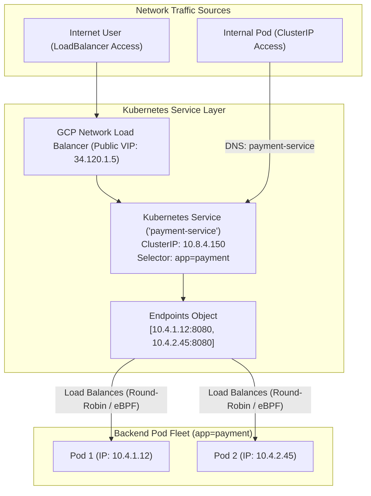

# Topic 66: Services

---

## 1. What Is It?

In Kubernetes, a **Service** is an abstract REST object that defines a logical set of running **Pods** and a stable network access policy to reach them.

Because Kubernetes Pods are ephemeral—frequently created, destroyed, and rescheduled with dynamic, changing IP addresses—applications cannot rely on connecting directly to raw Pod IPs.

A Service solves this problem by providing a single **stable virtual IP address (ClusterIP)** and a persistent **DNS entry** (e.g., `my-service.default.svc.cluster.local`). The Service automatically routes incoming traffic across healthy backend Pods matching its label selector (`app=payment-api`), performing load balancing automatically.

The primary Kubernetes Service types are:
1. **ClusterIP (Default)**: Exposes the Service on an internal IP address inside the cluster. Accessible ONLY from within the cluster.
2. **NodePort**: Exposes the Service on a static high-range port (`30000–32767`) on every worker node's IP address.
3. **LoadBalancer**: Provisions an external GCP Cloud Load Balancer (Passthrough or Application LB) to route public or private network traffic to the Service.
4. **Headless (ClusterIP: None)**: Returns individual Pod IP records directly via DNS without a single virtual VIP (used for database clustering in StatefulSets).

### Real-World Analogy
Think of a Kubernetes Service like a main corporate switchboard telephone number (`1-800-COMPANY`). Individual customer service reps (Pods) work flexible shifts; their desk extension numbers and mobile phones (Pod IPs) change daily. When a customer dials the main switchboard number (Service ClusterIP), an automated PBX routing system (kube-proxy / Dataplane V2) transfers the call to whichever customer service rep is currently sitting at their desk and available to answer (Healthy Pod).

---

## 2. Where Does It Fit?

Services sit between incoming network clients and backend Pod workloads, maintaining dynamic Endpoints objects as Pods scale up and down.



---

## 3. Core Concepts

| Service Type | Scope / Visibility | Routing Engine | Best Practice / Use Case |
|---|---|---|---|
| **ClusterIP** | Internal to cluster only. | `kube-proxy` / Dataplane V2 (eBPF) | Default choice for internal microservices & DB access. |
| **NodePort** | Exposed on Node IP:Port (`30000-32767`). | Node port forwarding | Avoid direct production use; used internally by LoadBalancers. |
| **LoadBalancer** | External (Public) or Internal (Private VIP). | Provisions GCP Cloud Load Balancer | Use for exposing services externally or via Private Service Connect. |
| **Headless** | Internal (`clusterIP: None`). | Direct Pod A-Records via CoreDNS | Mandatory for StatefulSet database discovery (e.g., Redis/Kafka). |
| **Endpoints / EndpointSlices** | Cluster internal object. | Tracks active healthy Pod IPs | Updated automatically by Kubernetes based on Readiness Probes. |

---

## 4. How It Works

Packet routing and Endpoint generation operate automatically:

```text
Service created with selector `app=web`
              ↓
Control Plane scans cluster for Pods with label `app=web` AND `Ready=True`
              ↓
Generates EndpointSlice object containing live Pod IPs: [10.4.1.5, 10.4.2.9]
              ↓
Dataplane V2 / eBPF installs eBPF kernel rules on every worker node
              ↓
Incoming packet to ClusterIP 10.8.0.50 -> eBPF rewrites destination IP directly to 10.4.1.5 (Pod 1)!
```

1. **Readiness Filtering**: If a Pod fails its Readiness Probe, the Endpoints controller removes its IP address from the EndpointSlice immediately, stopping traffic to that Pod.
2. **Kube-DNS / CoreDNS Resolution**: CoreDNS resolves `service-name` to its ClusterIP automatically within the same namespace.

---

## 5. Production Scenario

### Multi-Tier Microservice Service Architecture

```text
Requirement: Expose a Frontend Web Deployment to public HTTPS traffic via a GCP External Load Balancer, while isolating an Internal Payment API Service strictly inside the cluster.
    ↓
Architecture: LoadBalancer Service (Frontend) + ClusterIP Service (Internal API).
    ↓
Frontend Service Spec (`frontend-svc.yaml`):
  ```yaml
  apiVersion: v1
  kind: Service
  metadata:
    name: frontend-svc
    annotations:
      networking.gke.io/load-balancer-type: "External"
  spec:
    type: LoadBalancer
    selector:
      app: frontend
    ports:
    - port: 80
      targetPort: 8080
  ```
    ↓
Internal Payment Service Spec (`payment-svc.yaml`):
  ```yaml
  apiVersion: v1
  kind: Service
  metadata:
    name: payment-svc
  spec:
    type: ClusterIP
    selector:
      app: payment-api
    ports:
    - port: 8080
      targetPort: 8080
  ```
    ↓
Security: Payment API is accessible strictly via `http://payment-svc` inside the cluster; zero public exposure.
    ↓
Monitoring: Cloud Monitoring tracking `loadbalancing.googleapis.com/ingress/backend_latencies`.
```

*Why Selected*: Combines a GCP LoadBalancer Service for public frontend traffic with isolated ClusterIP Services to protect internal API microservices.

---

## 6. Hands-On Lab

### Prerequisites
- Active GCP Project with a GKE Cluster running.
- Cloud Shell or `gcloud` CLI (`kubectl` installed).
- IAM permissions: `roles/container.admin`.

### Console Method
1. Log into [Google Cloud Console](https://console.cloud.google.com/).
2. Navigate to **Kubernetes Engine** → **Services & Ingress**.
3. View the list of active Services grouped by Name, Type (ClusterIP, LoadBalancer), Cluster IP, External IP, and Target Pods.
4. Click **CREATE SERVICE** → Select an existing Deployment → Select Service Type **LoadBalancer**.
5. Set Port: `80`, Target Port: `8080`.
6. Click **EXPOSE** → Observe GCP provisioning an External Load Balancer IP address.

### CLI Method
Deploy a workload, expose it via ClusterIP and LoadBalancer Services using `kubectl`:

```bash
# Set variables
CLUSTER_NAME="gke-demo-cluster"
REGION="us-central1"

# 1. Connect to GKE cluster
gcloud container clusters get-credentials $CLUSTER_NAME --region=$REGION

# 2. Deploy a sample web deployment
kubectl create deployment web-demo --image=nginx:alpine --replicas=2

# 3. Create an internal ClusterIP Service
kubectl expose deployment web-demo --name=web-internal-svc --port=80 --target-port=80 --type=ClusterIP

# 4. Create an external LoadBalancer Service
kubectl expose deployment web-demo --name=web-public-svc --port=80 --target-port=80 --type=LoadBalancer

# 5. Inspect Services and wait for GCP External IP assignment
kubectl get services --watch
```

### Verification
*Expected Result*: `kubectl get services` displays `web-public-svc` with an assigned `EXTERNAL-IP` (e.g., `34.120.15.50`). Querying `curl http://34.120.15.50` returns Nginx homepage.

### Cleanup
Delete services and deployment:

```bash
kubectl delete service web-internal-svc web-public-svc
kubectl delete deployment web-demo
```

---

## 7. Security

### Service Security & Traffic Isolation
- **Default to ClusterIP**: Keep 100% of internal microservices and database connections on `ClusterIP` Services to prevent accidental public exposure.
- **Internal Load Balancers**: Use annotation `networking.gke.io/load-balancer-type: "Internal"` on LoadBalancer Services to provision private RFC1918 load balancers inside your VPC.
- **Network Policies**: Use Kubernetes NetworkPolicies to restrict which Pods are allowed to communicate with specific ClusterIP Services.

```text
BAD PRACTICE:
Exposing internal microservices or database admin tools directly via public `type: LoadBalancer` Services.
Risk: Public IPs expose internal microservices to internet port scans and unauthenticated API exploitation.

PRODUCTION PRACTICE:
Use `type: ClusterIP` for internal communication. Expose public web APIs exclusively through GKE Ingress or Gateway API with WAF protection.
```

---

## 8. Scaling & High Availability

Load Balancing Performance & Dataplane V2:

```text
Legacy Kube-Proxy (Sequential iptables rules -> High CPU overhead with 10,000+ Services)
   ↓ (GKE Dataplane V2 eBPF Upgrade)
Dataplane V2 eBPF Routing (Direct in-kernel packet routing -> Constant O(1) latency scaling)
```

- **Container-Native Load Balancing**: When using GKE Ingress or Network Endpoint Groups (NEGs), GCP Load Balancers route traffic directly to individual Pod IPs, bypassing NodePort hops for maximum throughput.

---

## 9. Cost

### Service Billing Considerations
- **ClusterIP & NodePort**: 100% **FREE**. Zero additional GCP infrastructure charges.
- **LoadBalancer Service**: Charges for provisioned GCP Network Load Balancer forwarding rules (~$0.025/hour per rule + network egress fees).
- **Consolidate Services**: Use **GKE Ingress** or **Gateway API** to route multiple domain paths through a single shared External Load Balancer instead of creating 20 separate `type: LoadBalancer` Services.

---

## 10. Monitoring & Troubleshooting

### Service Observability Tools
- **EndpointSlice Inspection**: Use `kubectl get endpointslices` to verify which active Pod IPs are attached to a Service.
- **Cloud Monitoring Load Balancer Metrics**: Track `loadbalancing.googleapis.com/ingress/backend_request_count`.

### Troubleshooting Matrix

| Symptom | Possible Cause | What to Check | Fix |
|---|---|---|---|
| Service ClusterIP returns no response / Connection Refused | Target Pods failing Readiness Probes or mismatched selector | `kubectl get endpoints <svc-name>` | Inspect Pod readiness probes and verify `selector` labels match Pod labels exactly. |
| `type: LoadBalancer` stuck in `<pending>` External IP | Quota limit reached for External IP addresses or invalid annotation | `kubectl describe service <svc-name>` | Check GCP IP address quotas or fix invalid annotations in Service metadata. |
| CoreDNS resolution fails inside Pod | Service name misspelled or target in different namespace | `kubectl get svc -A` | Use FQDN format: `<service-name>.<namespace>.svc.cluster.local`. |

---

## 11. Common Mistakes

```text
Mistake: Mismatching the `selector` key-value labels in the Service manifest with actual Pod labels.
Why: Typo in manifest YAML (e.g., `app: web-api` vs `app: webapi`).
Impact: The Service creates an empty Endpoints object; requests to ClusterIP fail with connection timeouts.
Correct approach: Verify label matching using `kubectl get pods --show-labels` and `kubectl get endpoints`.

Mistake: Creating separate `type: LoadBalancer` Services for 50 distinct microservices.
Why: Unaware of GKE Ingress or Gateway API routing options.
Impact: Incurring charges for 50 individual GCP forwarding rules (~$1,250/month) unnecessarily.
Correct approach: Use `type: ClusterIP` for microservices and route them through a single GKE Ingress or Gateway API.
```

---

## 12. Production Best Practices

- [ ] Default to **`type: ClusterIP`** for all internal microservices and database workloads.
- [ ] Use **Internal Load Balancers** (`load-balancer-type: "Internal"`) for private VPC communication.
- [ ] Ensure all workload Pods define explicit **Readiness Probes** so unready Pods are excluded from Endpoints.
- [ ] Consolidate public HTTPS traffic routing using **GKE Ingress** or **Gateway API** rather than standalone LoadBalancer services.
- [ ] Enable **Dataplane V2** for high-performance eBPF-based packet routing.
- [ ] Automate all Service definitions and annotations using Infrastructure as Code (Terraform/Helm).

---

## 13. Hyperscaler / Enterprise Perspective

```text
Personal / Learning
  Public `type: LoadBalancer` for every app → Manual NodePort debugging → Mismatched selectors
        ↓
Small Production
  ClusterIP Services → Internal LoadBalancers → Basic CoreDNS resolution
        ↓
Enterprise Environment
  ClusterIP Services + GKE Ingress → Dataplane V2 eBPF → NetworkPolicy Enforcement
        ↓
Hyperscaler Environment
  GKE Gateway API → Container-Native Load Balancing (NEGs) → Multi-Cluster Service Mesh (Istio / Anthos Service Mesh)
```

In a hyperscaler environment, enterprise platforms use **GKE Gateway API** and **Service Mesh (Istio)** to manage traffic. Services use Container-Native Load Balancing via **Network Endpoint Groups (NEGs)** to route Anycast traffic directly to Pod IPs across multi-region clusters, while Service Mesh policies enforce zero-trust mutual TLS (mTLS) encryption between internal ClusterIP services.

---

## 14. Real Project Questions

### Q1: What is the primary function of a Kubernetes ClusterIP Service?
**Answer:** A **ClusterIP Service** (the default Service type) provides a stable virtual IP address and persistent DNS entry (`service-name.namespace.svc.cluster.local`) accessible **only from within the Kubernetes cluster**. It automatically load-balances internal traffic across healthy backend Pods matching its label selector, isolating internal microservices from public exposure.

### Q2: How does Kubernetes determine which Pod IPs to include in a Service's Endpoints object?
**Answer:** Kubernetes continuously evaluates Pod labels against the Service's `selector` configuration. For a Pod IP to be included in the Service's active **Endpoints / EndpointSlice** object, the Pod must match the label selector AND pass its configured **Readiness Probe**. If a Pod fails its readiness probe, its IP is immediately removed from the Endpoints list, stopping traffic to that Pod.

### Q3: What is the difference between a standard LoadBalancer Service and a Headless Service (`clusterIP: None`)?
**Answer:** A **LoadBalancer Service** provisions a single virtual IP address (and external GCP Load Balancer) that performs load balancing across backend Pods. A **Headless Service** (`clusterIP: None`) explicitly disables virtual IP allocation; querying its CoreDNS record returns the raw A-record IP addresses of ALL matching individual Pods directly, which is essential for stateful database clustering (such as Redis or Kafka nodes).

---

## 15. Quick Decision Guide

| Requirement | Recommended Approach | Reason |
|---|---|---|
| Exposing an internal microservice strictly to other Pods inside the GKE cluster | **`type: ClusterIP` Service** | Provides internal VIP and DNS entry with zero public network exposure. |
| Exposing a private API microservice to on-premises servers over VPN | **`type: LoadBalancer` with Internal Annotation** | Provisions a private RFC1918 GCP Internal Load Balancer inside your VPC. |
| Stateful database cluster requiring direct peer-to-peer Pod IP discovery | **Headless Service (`clusterIP: None`)** | Returns direct Pod IP records via DNS for peer-to-peer node discovery. |

### When should I use it?
- Essential core networking abstraction for routing, load balancing, and discovering Pod workloads in Kubernetes.

### When should I NOT use it?
- Do not use raw Pod IPs directly in application code—always route traffic through a Kubernetes Service.

---

## 16. Related Services

```text
                  [66. Services]
                 /       |       \
        GKE Dataplane CoreDNS     GCP Cloud Load
          V2 (eBPF)   (DNS)        Balancing
             |           |              |
         In-Kernel   Name-to-IP     Public / Internal
          Routing   Resolution     Ingress VIPs
```

- **Dataplane V2**: In-kernel eBPF packet routing engine powering GKE Services.
- **CoreDNS**: In-cluster DNS server resolving Service names to ClusterIPs.
- **GCP Cloud Load Balancing**: Provisioned automatically by `type: LoadBalancer` Services.

---

## 17. Cheat Sheet

### Service Types
- **ClusterIP**: Internal only (Default).
- **NodePort**: Exposed on Node IP:30000-32767.
- **LoadBalancer**: External/Internal GCP Cloud LB.
- **Headless**: Direct Pod IP DNS resolution (`clusterIP: None`).

### Useful Commands
```bash
# Expose a deployment as a ClusterIP Service
kubectl expose deployment DEPLOYMENT_NAME --name=SVC_NAME --port=80 --target-port=8080 --type=ClusterIP

# Expose a deployment as an external LoadBalancer Service
kubectl expose deployment DEPLOYMENT_NAME --name=SVC_NAME --port=80 --target-port=8080 --type=LoadBalancer

# View Endpoints attached to a Service
kubectl get endpoints SVC_NAME
```

---

## 18. Learning Connection

- **Previous Topic**: [65. Workloads](../65-workloads/README.md)
- **Next Topic**: [67. Ingress](../67-ingress/README.md)
