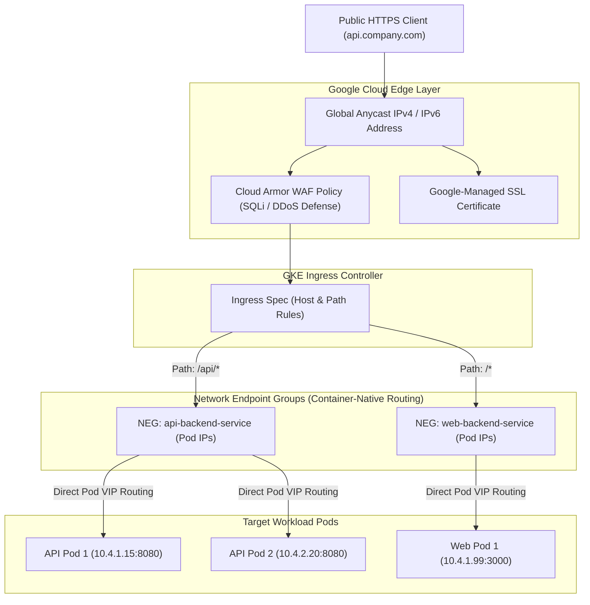

# Topic 67: Ingress

---

## 1. What Is It?

In GKE, **Ingress** is an API object that manages external HTTP and HTTPS routing to internal cluster Services. It functions as an intelligent Layer 7 entry point that consolidates path-based (`/api`, `/static`) and host-based (`api.company.com`) routing rules behind a single external IP address.

When an Ingress resource is created in GKE, the built-in **GKE Ingress Controller** automatically provisions and configures a Google Cloud **External Application Load Balancer** (or Internal Application Load Balancer).

GKE Ingress provides advanced enterprise edge capabilities, including:
1. **Container-Native Load Balancing**: Routes traffic directly to individual Pod IP addresses using Network Endpoint Groups (NEGs), bypassing NodePort network hops.
2. **Google-Managed SSL Certificates**: Automatically provisions, validates, and rotates free SSL/TLS certificates via Cloud KMS.
3. **Cloud Armor WAF Protection**: Integrates with Cloud Armor security policies to block Layer 7 DDoS and SQLi/XSS attacks at Google's edge.

### Real-World Analogy
Think of GKE Ingress like an international airport customs hall receptionist desk. Instead of every airline building its own separate physical entrance door and security checkpoint (Creating 20 separate `type: LoadBalancer` Services), all international passengers enter through a single main glass entrance (Global Anycast IP). The receptionist (GKE Ingress Controller) inspects tickets (Host headers & URL paths) and directs passengers down specific corridors (`/flights` -> Flight Service; `/baggage` -> Baggage Service) while security guards (Cloud Armor) verify passports at the door.

---

## 2. Where Does It Fit?

Ingress sits at the perimeter of the GKE cluster, converting Kubernetes ingress rules into Google Cloud Application Load Balancer configurations.



---

## 3. Core Concepts

| Ingress Element | Description | Syntax / Annotation | Best Practice |
|---|---|---|---|
| **GKE Ingress Class** | Specifies External (`gce`) or Internal (`gce-internal`) load balancer. | `kubernetes.io/ingress.class: "gce"` | Use `gce` for public apps; `gce-internal` for private APIs. |
| **Container-Native Routing** | Routes traffic directly to Pod IPs via Network Endpoint Groups. | `cloud.google.com/neg: '{"ingress": true}'` | **Mandatory standard**: Enable NEGs on all backend Services. |
| **Managed Certificates** | Provisions free Google-managed SSL/TLS certificates automatically. | `networking.gke.io/managed-certificates` | Use ManagedCertificates custom resources for zero-maintenance SSL. |
| **FrontendConfig** | Customizes HTTPS redirects, TLS policy versions, and SSL ciphers. | `networking.gke.io/v1beta1.FrontendConfig` | Enforce TLS 1.2+ minimum version on public entry points. |
| **BackendConfig** | Connects Cloud Armor WAF, CDN, and custom health checks to backends. | `cloud.google.com/backend-config` | Attach BackendConfig custom resources to backend Services. |

---

## 4. How It Works

Ingress reconciliation and Container-Native NEG routing operate seamlessly:

```text
Developer applies Ingress manifest (`ingress.yaml`)
              ↓
GKE Ingress Controller detects manifest -> Calls GCP Compute Engine APIs
              ↓
Provisions GCP External HTTP(S) Load Balancer + Reserved Anycast IP + SSL Cert
              ↓
Configures Network Endpoint Groups (NEGs) targeting live Pod IPs directly
              ↓
Client sends request: `https://api.company.com/v1/users`
              ↓
Load Balancer terminates TLS -> Routes packet DIRECTLY to Pod IP (10.4.1.15:8080)
```

1. **Bypassing NodePort**: Standard NodePort routing hops through a node VM's iptables before reaching a Pod. Container-native NEG routing sends packets directly from the Google Load Balancer to the target Pod IP.
2. **Managed Certificate Validation**: Google-Managed Certificates perform automatic DNS ownership validation and rotate certificates 30 days prior to expiration without service interruption.

---

## 5. Production Scenario

### Enterprise Public API Gateway with WAF & Managed SSL

```text
Requirement: Expose a production microservices platform on `api.company.com` using HTTPS, Google-Managed SSL, Cloud Armor WAF protection, and container-native pod routing.
    ↓
Architecture: GKE Ingress + ManagedCertificate + BackendConfig + Cloud Armor.
    ↓
Manifest Stack:
  1. ManagedCertificate (`api-cert`): Domain `api.company.com`.
  2. BackendConfig (`api-backend-config`): Attaches Cloud Armor policy `sec-policy-prod`.
  3. Service (`api-service`): Annotated with `cloud.google.com/neg: '{"ingress": true}'` and `backend-config: '{"default": "api-backend-config"}'`.
  4. Ingress (`api-ingress`):
     ```yaml
     apiVersion: networking.k8s.io/v1
     kind: Ingress
     metadata:
       name: api-ingress
       annotations:
         kubernetes.io/ingress.class: "gce"
         networking.gke.io/managed-certificates: "api-cert"
     spec:
       rules:
       - host: api.company.com
         http:
           paths:
           - path: /*
             pathType: ImplementationSpecific
             backend:
               service:
                 name: api-service
                 port:
                   number: 8080
     ```
    ↓
Result: Zero-maintenance SSL rotation, Layer 7 WAF protection, sub-second container-native routing.
    ↓
Monitoring: Cloud Monitoring tracking `loadbalancing.googleapis.com/https/backend_latencies`.
```

*Why Selected*: Combining Managed Certificates and BackendConfigs delivers enterprise edge security (WAF) and zero-maintenance SSL management natively inside Kubernetes.

---

## 6. Hands-On Lab

### Prerequisites
- Active GCP Project with a GKE Cluster running.
- Cloud Shell or `gcloud` CLI (`kubectl` installed).
- A registered domain name (optional for Managed Certs).
- IAM permissions: `roles/container.admin`.

### Console Method
1. Log into [Google Cloud Console](https://console.cloud.google.com/).
2. Navigate to **Kubernetes Engine** → **Services & Ingress**.
3. Select **Ingress** tab → View active Ingress controllers and public IP endpoints.
4. Inspect the underlying GCP Load Balancer created by navigating to **Network services** → **Load balancing**.

### CLI Method
Deploy a Web Deployment, Service with NEGs, and a GKE Ingress resource using `kubectl`:

```bash
# Set variables
CLUSTER_NAME="gke-demo-cluster"
REGION="us-central1"

# 1. Connect to GKE cluster
gcloud container clusters get-credentials $CLUSTER_NAME --region=$REGION

# 2. Deploy sample web workload
kubectl create deployment web-app --image=nginx:alpine --replicas=2

# 3. Create Service with Container-Native NEG annotation
cat <<EOF | kubectl apply -f -
apiVersion: v1
kind: Service
metadata:
  name: web-service
  annotations:
    cloud.google.com/neg: '{"ingress": true}'
spec:
  type: ClusterIP
  selector:
    app: web-app
  ports:
  - port: 80
    targetPort: 80
EOF

# 4. Create GKE Ingress resource
cat <<EOF | kubectl apply -f -
apiVersion: networking.k8s.io/v1
kind: Ingress
metadata:
  name: web-ingress
  annotations:
    kubernetes.io/ingress.class: "gce"
spec:
  rules:
  - http:
      paths:
      - path: /*
        pathType: ImplementationSpecific
        backend:
          service:
            name: web-service
            port:
              number: 80
EOF

# 5. Monitor Ingress provisioning and assigned Public VIP
kubectl get ingress web-ingress --watch
```

### Verification
*Expected Result*: Output displays assigned `ADDRESS` (e.g., `34.120.45.100`). Querying `curl http://34.120.45.100` returns Nginx welcome page.

### Cleanup
Delete Ingress, Service, and Deployment:

```bash
kubectl delete ingress web-ingress
kubectl delete service web-service
kubectl delete deployment web-app
```

---

## 7. Security

### Edge Security Hardening
- **Cloud Armor WAF Integration**: Attach Cloud Armor security policies to GKE Ingress using `BackendConfig` resources to block SQL injection, cross-site scripting, and geo-ip attacks.
- **FrontendConfig TLS Enforcement**: Use `FrontendConfig` to enforce minimum TLS 1.2 or 1.3 protocol versions and disable insecure SSL ciphers.
- **HTTPS Redirects**: Enable automatic HTTP-to-HTTPS redirection in `FrontendConfig` (`redirectToHttps: true`).

```text
BAD PRACTICE:
Exposing Ingress entry points over plain HTTP without SSL/TLS certificates or Cloud Armor WAF protection.
Risk: Transmitted passwords and auth tokens are exposed in plain text; cluster is vulnerable to Layer 7 DDoS.

PRODUCTION PRACTICE:
Use `ManagedCertificate` for SSL termination, attach Cloud Armor via `BackendConfig`, and enforce HTTP-to-HTTPS redirection via `FrontendConfig`.
```

---

## 8. Scaling & High Availability

Container-Native vs. Legacy NodePort Path:

```text
Legacy NodePort Ingress:
  LB -> Node 1 (Public IP) -> iptables -> Node 2 (Private IP) -> Target Pod (Double Hop Overhead)

Container-Native NEG Ingress:
  LB -> Target Pod IP (Direct Single Hop - Zero Node Overhead!)
```

- **Instant Pod Health Sync**: When a Pod terminates, GKE container-native NEGs remove the Pod's IP address from the GCP Load Balancer backend target pool in seconds, preventing HTTP 502 errors.

---

## 9. Cost

### Ingress Financial Efficiency
- **Consolidated Load Balancers**: A single GKE Ingress HTTP(S) Load Balancer can route traffic to 50+ distinct backend Services using path and host rules, sharing a single forwarding rule cost (~$0.025/hour).
- **Free SSL Certificates**: Google-Managed Certificates (`ManagedCertificate`) are provided 100% **FREE** of charge.

---

## 10. Monitoring & Troubleshooting

### Ingress Observability Tools
- **Cloud Monitoring Latency Dashboards**: Measure p50, p95, and p99 latency breakdowns between the GCP Load Balancer and GKE Pod backends.
- **Ingress Controller Events**: Run `kubectl describe ingress <name>` to trace GCP load balancer provisioning events.

### Troubleshooting Matrix

| Symptom | Possible Cause | What to Check | Fix |
|---|---|---|---|
| Ingress returns `HTTP 502 Bad Gateway` | Target Pods failing Readiness Probes or missing NEG annotation | `kubectl describe service` | Ensure Service has annotation `cloud.google.com/neg: '{"ingress": true}'` and Pods are Ready. |
| Managed Certificate stuck in `Provisioning` | Domain DNS A-record not pointing to Ingress IP address | `kubectl get managedcertificate` | Update domain DNS registrar to point domain A-record to the Ingress public IP. |
| Changes to Ingress manifest take 3 minutes to apply | GCP Load Balancer API propagation delay | GCP Load Balancing console | Allow 2–5 minutes for GCP Load Balancer infrastructure to reconcile updates. |

---

## 11. Common Mistakes

```text
Mistake: Forgetting to add the Container-Native NEG annotation (`cloud.google.com/neg: '{"ingress": true}'`) to backend Services.
Why: Unaware that container-native routing requires explicit NEG annotations on ClusterIP services.
Impact: GKE falls back to legacy NodePort routing, causing extra network hops, higher latency, and potential HTTP 502 errors during pod scaling.
Correct approach: Always include the NEG annotation on all Kubernetes Services targeted by an Ingress.

Mistake: Creating an Ingress resource targeting a Service of `type: LoadBalancer`.
Why: Misunderstanding Kubernetes Service and Ingress relationships.
Impact: Provisions two separate GCP Load Balancers (one L4 and one L7) for the same application, doubling billing costs.
Correct approach: Target Services of `type: ClusterIP` when creating an Ingress resource.
```

---

## 12. Production Best Practices

- [ ] Enable **Container-Native Routing** using Network Endpoint Groups (NEGs) on all backend Services.
- [ ] Use **Google-Managed Certificates** (`ManagedCertificate`) for zero-maintenance SSL/TLS management.
- [ ] Enforce **HTTP-to-HTTPS Redirection** using `FrontendConfig` custom resources.
- [ ] Attach **Cloud Armor WAF Policies** to backend Services using `BackendConfig` custom resources.
- [ ] Target **`type: ClusterIP`** Services from Ingress resources.
- [ ] Automate all Ingress, BackendConfig, and ManagedCertificate manifests via Helm or Terraform.

---

## 13. Hyperscaler / Enterprise Perspective

```text
Personal / Learning
  Ingress without SSL → Single HTTP Path → Legacy NodePort Routing → No WAF
        ↓
Small Production
  GKE Ingress + ManagedCertificates → Host-based Routing → Basic Container-Native NEGs
        ↓
Enterprise Environment
  GKE Ingress + Cloud Armor WAF → FrontendConfig TLS 1.3 Enforcement → Internal & External Ingress
        ↓
Hyperscaler Environment
  GKE Gateway API (Multi-Cluster Gateway) → Global Anycast Traffic Sharding → Automated WAF Anomaly Isolation
```

In a hyperscaler environment, enterprise platforms are transitioning from standard Ingress to **GKE Gateway API**. Gateway API provides role-oriented routing definitions (separating Infrastructure Admins from Application Developers) and supports **Multi-Cluster Gateways**, allowing a single global GCP Application Load Balancer to route traffic across GKE clusters running in North America, Europe, and Asia.

---

## 14. Real Project Questions

### Q1: What is the technical advantage of Container-Native Load Balancing (NEGs) over legacy NodePort routing in GKE Ingress?
**Answer:** Legacy NodePort routing sends load-balanced traffic to a worker node VM's IP address, where `iptables` or `kube-proxy` redirects the packet to a target Pod (often requiring a second network hop to a different node). **Container-Native NEGs** register individual Pod IP addresses directly with the GCP Application Load Balancer, routing traffic in a single direct hop directly to the container, reducing latency and eliminating node network overhead.

### Q2: How do BackendConfig custom resources extend GKE Ingress security functionality?
**Answer:** `BackendConfig` is a GKE-specific Custom Resource Definition (CRD) that connects GCP-specific edge capabilities to Kubernetes Services. By attaching a `BackendConfig` to a Service targeted by an Ingress, engineers can configure **Cloud Armor WAF security policies**, Cloud CDN caching, custom HTTP health check paths, and IAP (Identity-Aware Proxy) authentication natively within Kubernetes YAML specs.

### Q3: What is the difference between GKE Ingress and the newer GKE Gateway API?
**Answer:** **GKE Ingress** is the classic Kubernetes Layer 7 routing object that provisions a single GCP Application Load Balancer for a cluster. The **GKE Gateway API** is the next-generation Kubernetes routing standard that provides role-oriented resource separation (`GatewayClass`, `Gateway`, `HTTPRoute`), advanced traffic splitting (canary releases), and native support for **Multi-Cluster Load Balancing** across multiple GKE clusters globally.

---

## 15. Quick Decision Guide

| Requirement | Recommended Approach | Reason |
|---|---|---|
| Routing public HTTPS traffic to multiple microservices (`/api`, `/web`) behind a single IP | **GKE External Ingress (`kubernetes.io/ingress.class: "gce"`)** | Provisions a GCP External Application Load Balancer with path and host routing. |
| Provisioning free, auto-rotating SSL/TLS certificates for `app.company.com` | **Google-Managed Certificate (`ManagedCertificate` CRD)** | Automatically provisions, validates, and rotates SSL certs without manual intervention. |
| Protecting a public GKE web application against Layer 7 SQLi and DDoS attacks | **Cloud Armor Policy via `BackendConfig` CRD** | Integrates enterprise WAF security directly into the GKE Ingress backend pipeline. |

### When should I use it?
- Essential core networking component for managing Layer 7 HTTP/HTTPS external traffic routing, SSL termination, and WAF security in GKE.

### When should I NOT use it?
- Do not use Ingress for raw non-HTTP Layer 4 TCP/UDP protocols (use `type: LoadBalancer` or Gateway API instead).

---

## 16. Related Services

```text
                  [67. Ingress]
                 /      |      \
        Cloud Armor ManagedCert  BackendConfig
           (WAF)       (SSL)       (CRD Settings)
             |          |              |
         Layer 7     Zero-Ops     CDN, WAF &
         Security    TLS Certs    Health Checks
```

- **Cloud Armor**: Web Application Firewall (WAF) attached to Ingress backends.
- **Google-Managed Certificates**: Provisioned and rotated automatically by GKE Ingress.
- **GKE Gateway API**: Next-generation Kubernetes multi-cluster routing alternative to Ingress.

---

## 17. Cheat Sheet

### Essential Annotations
- `kubernetes.io/ingress.class: "gce"` : Public GCP Application Load Balancer.
- `kubernetes.io/ingress.class: "gce-internal"` : Private Internal Load Balancer.
- `cloud.google.com/neg: '{"ingress": true}'` : Container-Native Pod routing (On Service).
- `networking.gke.io/managed-certificates: "CERT_NAME"` : Attach SSL cert.

### Useful Commands
```bash
# Get Ingress details and assigned VIP
kubectl get ingress INGRESS_NAME

# Describe Ingress events and GCP LB reconciliation status
kubectl describe ingress INGRESS_NAME

# View ManagedCertificate status
kubectl get managedcertificates
```

---

## 18. Learning Connection

- **Previous Topic**: [66. Services](../66-services/README.md)
- **Next Topic**: [68. ConfigMaps](../68-configmaps/README.md)
