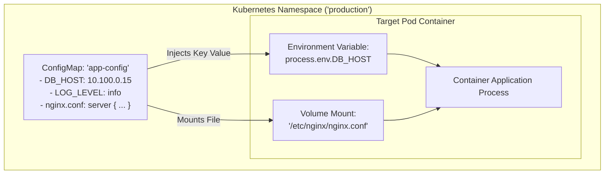

# Topic 68: ConfigMaps

---

## 1. What Is It?

In Kubernetes and GKE, a **ConfigMap** is an API object used to store non-confidential configuration data in key-value pairs.

ConfigMaps decouple environment-specific configuration artifacts—such as application settings, database connection strings, feature flags, and configuration files (`nginx.conf`, `app.properties`)—from container image source code.

By separating configuration from container images, developers can build a single, immutable container image (12-Factor App methodology) and deploy it identically across **Development**, **Staging**, and **Production** environments, simply injecting different ConfigMaps in each environment.

ConfigMaps inject data into Pod containers using three primary methods:
1. **Environment Variables**: Individual key-value pairs passed directly to the container OS process environment.
2. **Volume Mounts**: Files created dynamically inside a directory mounted into the container's filesystem.
3. **Command-Line Arguments**: Passing values into container entrypoint commands (`args`).

### Real-World Analogy
Think of a ConfigMap like a removable SIM card inserted into a mobile phone (Container Image). The phone hardware and operating system are completely identical regardless of who owns it. However, inserting an "AT&T SIM Card" (Development ConfigMap) configures the phone to connect to the AT&T network and assign Number A, while inserting a "Verizon SIM Card" (Production ConfigMap) configures the exact same phone to connect to the Verizon network and assign Number B.

---

## 2. Where Does It Fit?

ConfigMaps reside within a Kubernetes Namespace, injecting non-confidential configuration properties into Pod workloads at runtime.



---

## 3. Core Concepts

| ConfigMap Method | Inject Technique | Live Updates? | Best Practice |
|---|---|---|---|
| **Environment Variable** | `envFrom` or `valueFrom.configMapKeyRef` | **No** (Requires Pod restart). | Use for static environment variables (`LOG_LEVEL`, `PORT`). |
| **Volume Mount** | `volumes.configMap` mounted to directory | **Yes** (Updates within 60s dynamically). | Use for full configuration files (`nginx.conf`, `redis.conf`). |
| **Immutable ConfigMap** | `immutable: true` | N/A (Blocks API modifications). | **Recommended**: Protects against unexpected config changes and speeds up API performance. |
| **Size Limit** | Hard API limit for single ConfigMap object. | **1 Megabyte** | Use Cloud Storage for large binary assets or files >1 MB. |

---

## 4. How It Works

Dynamic updates when mounting ConfigMaps as Volumes operate automatically:

```text
Developer updates ConfigMap (`kubectl edit configmap app-config`)
              ↓
Kubernetes API Server updates ConfigMap object in `etcd`
              ↓
Kubelet agent on Worker Node detects update during periodic sync loop (~60s)
              ↓
Kubelet updates symlink files inside mounted volume directory (`/etc/config/`)
              ↓
Application reads updated file directly from disk (No Pod restart required!)
```

1. **Volume Symlinks**: When a ConfigMap is mounted as a volume, Kubelet creates atomic symlinks inside the container directory. Updating the ConfigMap updates the symlink target without unmounting the volume.
2. **Environment Variable Limitation**: Environment variables injected at container startup are static. Updating a ConfigMap does NOT update environment variables inside running containers unless the Pods are restarted.

---

## 5. Production Scenario

### Decoupled Nginx Reverse Proxy Configuration & App Flags

```text
Requirement: Deploy an Nginx reverse proxy microservice where custom server routing rules (`nginx.conf`) and feature flags are updated dynamically without rebuilding container images.
    ↓
Architecture: Deployment + ConfigMap Volume Mount + Immutable App Config.
    ↓
ConfigMap Manifest (`app-config.yaml`):
  ```yaml
  apiVersion: v1
  kind: ConfigMap
  metadata:
    name: nginx-config
  data:
    LOG_LEVEL: "warn"
    nginx.conf: |
      server {
          listen 8080;
          location /api {
              proxy_pass http://payment-service:8080;
          }
      }
  ```
    ↓
Deployment Mount:
  - Mounted `data["nginx.conf"]` as a volume to `/etc/nginx/conf.d/default.conf`.
  - Injected `LOG_LEVEL` as an environment variable via `envFrom`.
    ↓
Security: Enforced `immutable: true` on production release manifests to prevent manual configuration drift.
    ↓
Monitoring: Cloud Monitoring tracking container log levels and HTTP 5xx error rates.
```

*Why Selected*: Decoupling `nginx.conf` into a ConfigMap volume allows SREs to update routing rules dynamically across 50 Pods in seconds without image rebuilds.

---

## 6. Hands-On Lab

### Prerequisites
- Active GCP Project with a GKE Cluster running.
- Cloud Shell or `gcloud` CLI (`kubectl` installed).
- IAM permissions: `roles/container.admin`.

### Console Method
1. Log into [Google Cloud Console](https://console.cloud.google.com/).
2. Navigate to **Kubernetes Engine** → **Configuration**.
3. Click **CREATE WITH YAML** at top (or view existing ConfigMaps).
4. Paste ConfigMap spec:
   ```yaml
   apiVersion: v1
   kind: ConfigMap
   metadata:
     name: feature-flags
   data:
     ENABLE_NEW_UI: "true"
     MAX_CONNECTIONS: "100"
   ```
5. Click **CREATE** → Observe created ConfigMap listed under Configuration tab.

### CLI Method
Create a ConfigMap from literal values and from a local configuration file using `kubectl`:

```bash
# Set variables
CLUSTER_NAME="gke-demo-cluster"
REGION="us-central1"

# 1. Connect to GKE cluster
gcloud container clusters get-credentials $CLUSTER_NAME --region=$REGION

# 2. Create a ConfigMap from literal key-value pairs
kubectl create configmap app-settings \
    --from-literal=ENVIRONMENT=production \
    --from-literal=LOG_LEVEL=info

# 3. Create a local sample config file and generate ConfigMap from file
echo "server { listen 80; server_name localhost; }" > default.conf
kubectl create configmap nginx-files --from-file=default.conf

# 4. View ConfigMap details and data keys
kubectl get configmap app-settings -o yaml
```

### Verification
*Expected Result*: Output displays ConfigMap `data` containing `ENVIRONMENT: production` and `LOG_LEVEL: info`.

### Cleanup
Delete ConfigMaps and local file:

```bash
kubectl delete configmap app-settings nginx-files
rm default.conf
```

---

## 7. Security

### Sensitive Data Hazard & Immutability
- **NEVER Store Secrets in ConfigMaps**: ConfigMaps are stored in plain text inside `etcd` and displayed in plain text in `kubectl get configmap`. Use **Kubernetes Secrets** or **Secret Manager** for passwords, API keys, and certificates.
- **Enable Immutable ConfigMaps**: Add `immutable: true` to production ConfigMaps to prevent accidental modifications (`kubectl edit`) and reduce API Server load.
- **RBAC Protections**: Restrict `update` and `patch` permissions on ConfigMaps using Kubernetes RBAC.

```text
BAD PRACTICE:
Storing database passwords, AWS secret keys, or TLS private keys inside ConfigMap data fields.
Risk: Plain-text credentials are exposed to anyone with basic `read` access to the namespace or Kubernetes audit logs.

PRODUCTION PRACTICE:
Use ConfigMaps strictly for non-confidential configuration settings. Store passwords and API keys in Google Secret Manager or Kubernetes Secrets.
```

---

## 8. Scaling & High Availability

Performance Optimization with Immutable ConfigMaps:

```text
Standard ConfigMap (Kubelet watches for updates every 60s -> Increases API Server load)
   ↓ (Immutable ConfigMap Performance Optimization)
`immutable: true` ConfigMap (Kubelet skips watching for updates -> Zero API Server overhead!)
```

- **API Server Offloading**: Marking ConfigMaps as `immutable: true` instructs Kubelet agents to stop polling the Kubernetes API Server for updates, significantly reducing control plane memory and CPU load in large clusters (>1,000 Pods).

---

## 9. Cost

### ConfigMap Billing & Resource Impact
- **$0 Additional Charge**: ConfigMaps consume negligible etcd storage space and incur zero extra GCP charges.
- **Image Build Cost Savings**: Eliminates rebuilding and pushing multi-gigabyte container images through CI/CD pipelines whenever minor configuration parameters change.

---

## 10. Monitoring & Troubleshooting

### ConfigMap Observability Tools
- **Kubernetes Events**: Inspect `kubectl get events` to trace Volume mount failures or missing ConfigMap keys.
- **Pod Inspection**: Use `kubectl exec <pod-name> -- env` to verify environment variables injected from ConfigMaps.

### Troubleshooting Matrix

| Symptom | Possible Cause | What to Check | Fix |
|---|---|---|---|
| Pod stuck in `CreateContainerConfigError` | ConfigMap or specific key referenced in `configMapKeyRef` does not exist | `kubectl describe pod <pod-name>` | Create missing ConfigMap or mark reference as `optional: true`. |
| Mounted ConfigMap file updated, but application hasn't reloaded | Application reads file only once at startup | App source code | Restart Pods (`kubectl rollout restart`) or implement file watching in app code. |
| Cannot edit ConfigMap: `field is immutable` | ConfigMap has `immutable: true` enabled | ConfigMap YAML manifest | Delete and recreate the ConfigMap, or deploy a new versioned ConfigMap name. |

---

## 11. Common Mistakes

```text
Mistake: Storing database passwords or JWT signing keys inside a ConfigMap.
Why: Treating ConfigMaps and Secrets as interchangeable configuration objects.
Impact: Severe security exposure; plain-text credentials appear in source code repos and audit logs.
Correct approach: Store sensitive credentials in **Secret Manager** or **Kubernetes Secrets**.

Mistake: Expecting Environment Variables injected from a ConfigMap to update live inside running containers when the ConfigMap is modified.
Why: Misunderstanding Linux process environment inheritance.
Impact: Developers update the ConfigMap but running applications continue using stale environment variables.
Correct approach: Execute `kubectl rollout restart deployment <name>` to restart Pods and inject updated environment variables.
```

---

## 12. Production Best Practices

- [ ] Store **non-confidential** configuration settings only in ConfigMaps.
- [ ] Use **Volume Mounts** when applications need to read full configuration files (`nginx.conf`).
- [ ] Add **`immutable: true`** to production ConfigMaps to prevent accidental modifications.
- [ ] Use **versioned ConfigMap names** (e.g., `app-config-v1`, `app-config-v2`) in GitOps workflows to trigger rolling updates reliably.
- [ ] Restrict `update` and `delete` permissions on ConfigMaps using Kubernetes RBAC.
- [ ] Automate ConfigMap generation using Helm, Kustomize, or Terraform.

---

## 13. Hyperscaler / Enterprise Perspective

```text
Personal / Learning
  Hardcoded environment variables inside Dockerfile → Manual `kubectl edit configmap`
        ↓
Small Production
  Decoupled ConfigMaps → Helm Values injection → Basic Environment Variables
        ↓
Enterprise Environment
  Kustomize ConfigMap Generators → `immutable: true` Enforcement → GitOps Synchronization
        ↓
Hyperscaler Environment
  100% Declarative Configs (Config Sync / Anthos) → Automated Immutable Versioning → Real-time Drift Detection
```

In a hyperscaler environment, enterprise platform teams use **Config Sync** or **Kustomize ConfigMap Generators**. ConfigMaps are generated automatically from Git repositories during CI/CD. Kustomize appends a unique content hash to the ConfigMap name (e.g., `app-config-a8f19c`), guaranteeing that updating a configuration setting automatically triggers a zero-downtime rolling update across target GKE workloads.

---

## 14. Real Project Questions

### Q1: What is the primary architectural purpose of a Kubernetes ConfigMap?
**Answer:** The primary purpose of a **ConfigMap** is to decouple non-confidential application configuration settings (such as feature flags, database hostnames, and configuration files) from container image source code. This allows building a single, immutable container image and deploying it across Development, Staging, and Production environments simply by injecting different ConfigMaps.

### Q2: What happens when you update a ConfigMap mounted as a Volume versus one injected as an Environment Variable?
**Answer:** When mounted as a **Volume**, the Kubelet agent updates the mounted files inside the running container's filesystem asynchronously (within ~60 seconds) without requiring a Pod restart. When injected as an **Environment Variable**, the values are set at container startup and remain static; updating the ConfigMap requires restarting the Pod (`kubectl rollout restart`) to load updated values.

### Q3: Why is adding `immutable: true` to production ConfigMaps considered a performance and security best practice?
**Answer:** Setting `immutable: true` prevents accidental or malicious configuration changes (`kubectl edit`) in production. Architecturally, it instructs Kubelet agents on worker nodes to stop polling the Kubernetes API Server for updates, significantly reducing control plane CPU and memory load in large enterprise clusters.

---

## 15. Quick Decision Guide

| Requirement | Recommended Approach | Reason |
|---|---|---|
| Injecting non-confidential log level (`LOG_LEVEL: debug`) into a microservice | **ConfigMap via Environment Variable** | Simple key-value injection into process environment at startup. |
| Mounting a 500-line `nginx.conf` file into a web server container | **ConfigMap via Volume Mount** | Dynamically mounts file into `/etc/nginx/` and receives automatic updates. |
| Storing a database password or API authentication token | **Kubernetes Secret / Secret Manager (NOT ConfigMap)** | ConfigMaps are stored in plain text and must NEVER store sensitive credentials. |

### When should I use it?
- Essential Kubernetes object for managing non-confidential application configuration and decoupling code from environment settings.

### When should I NOT use it?
- Do not use ConfigMaps for sensitive passwords, private keys, or API tokens (use Secret Manager or Kubernetes Secrets).

---

## 16. Related Services

```text
                  [68. ConfigMaps]
                 /       |        \
        K8s Secrets   Kustomize   Config Sync
       (Sensitive)    (Hashes)    (GitOps)
            |            |            |
        Encrypted    Automated     Git State
       Credentials   Versioning   Reconciliation
```

- **Kubernetes Secrets**: Companion object for storing sensitive, encrypted credentials.
- **Kustomize**: Automatically appends content hashes to ConfigMap names for reliable rolling updates.
- **Config Sync**: GitOps engine synchronizing ConfigMaps from Git repositories.

---

## 17. Cheat Sheet

### Core Injection Methods
- **Environment Variables**: Static at startup (`envFrom`).
- **Volume Mounts**: Dynamic file updates (`volumes.configMap`).
- **Immutability**: `immutable: true` (Blocks API modifications & saves CPU).
- **Size Limit**: 1 Megabyte max per ConfigMap.

### Useful Commands
```bash
# Create a ConfigMap from literal values
kubectl create configmap CONFIG_NAME --from-literal=KEY1=VALUE1 --from-literal=KEY2=VALUE2

# Create a ConfigMap from a local file
kubectl create configmap CONFIG_NAME --from-file=PATH_TO_FILE

# View ConfigMap contents
kubectl get configmap CONFIG_NAME -o yaml
```

---

## 18. Learning Connection

- **Previous Topic**: [67. Ingress](../67-ingress/README.md)
- **Next Topic**: [69. Secrets](../69-secrets/README.md)
