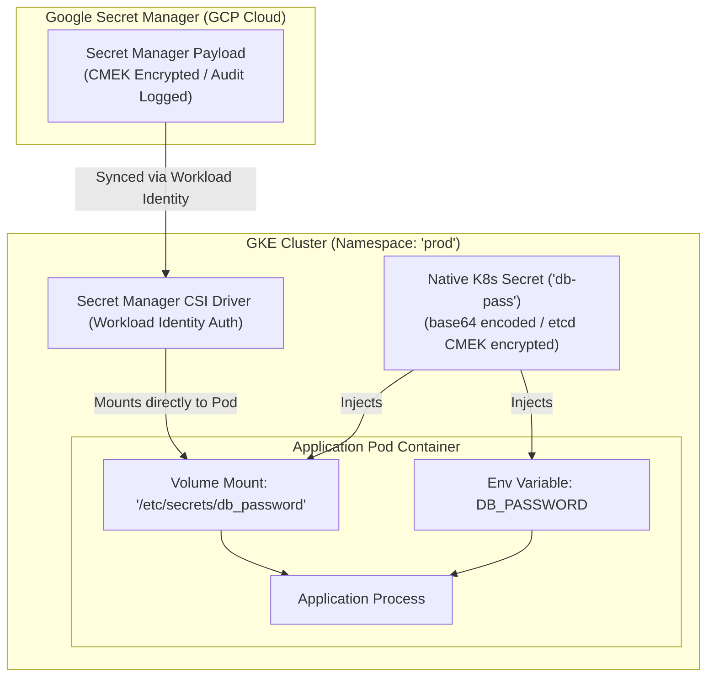

# Topic 69: Secrets

---

## 1. What Is It?

In Kubernetes and GKE, a **Secret** is an API object specifically designed to store and manage sensitive data—such as database passwords, API tokens, SSH keys, OAuth credentials, and TLS certificates.

Kubernetes Secrets decouple confidential credentials from application source code and container images, injecting sensitive values into Pod containers at runtime via Environment Variables, Volume Mounts, or dedicated CSI drivers.

By default, native Kubernetes Secrets store data encoded in **base64** format (which is obfuscation, NOT encryption). In Google Kubernetes Engine (GKE), enterprise security is established by combining native Secrets with **etcd Encryption at Rest (using Cloud KMS)** or integrating natively with **Google Secret Manager via the Secret Manager CSI Store Driver**.

### Real-World Analogy
Think of a Kubernetes Secret like a high-security automated hotel room keycard system:
- **Base64 Encoding**: Printing the room number in a magnetic stripe format on the plastic keycard. Anyone holding the card can read the room number if they swipe it through a card reader (base64 decode).
- **GKE etcd Encryption (CMEK)**: Depositing all spare keycards inside a reinforced steel safe in the hotel manager's office, locked with a master keycard (Cloud KMS Key).
- **Google Secret Manager CSI Driver**: Keeping the physical master keycard inside a remote bank vault (Secret Manager). When a guest arrives at Room 302, a security guard fetches the keycard from the bank vault, hands it to the guest at the door, and returns it to the vault when the guest leaves.

---

## 2. Where Does It Fit?

Secrets reside within a Kubernetes Namespace, injecting sensitive credentials into Pod containers or integrating with Google Secret Manager.



---

## 3. Core Concepts

| Secret Mechanism | Description | Security Level | Best Practice |
|---|---|---|---|
| **Base64 Encoding** | Native Kubernetes encoding (`data: base64_string`). | **Low** (Obfuscation only, easily decoded). | Never rely on base64 alone for security. |
| **etcd CMEK Encryption** | Encrypts `etcd` database storage at rest using Cloud KMS keys. | **High** (Protects underlying disk media). | Enable CMEK for etcd on production GKE clusters. |
| **Secret Manager CSI Driver** | Mounts GCP Secret Manager payloads directly as Pod volumes. | **Highest** (No native K8s Secret stored in etcd). | **Production Standard**: Use Secret Manager + CSI Driver. |
| **Secret Types** | Special built-in types: `Opaque`, `kubernetes.io/tls`, `kubernetes.io/dockerconfigjson`. | Standard K8s types | Use `kubernetes.io/tls` for SSL/TLS certificates. |

---

## 4. How It Works

Injecting Secrets via the Secret Manager CSI Driver operates keylessly using Workload Identity:

```text
Pod launches -> Kubernetes Service Account (KSA) requests Secret via CSI Driver
              ↓
Workload Identity exchanges KSA token for Google Service Account (GSA) short-lived token
              ↓
CSI Driver calls Google Secret Manager API -> Fetches encrypted secret payload
              ↓
CSI Driver mounts secret payload as temporary in-memory `tmpfs` volume inside container
              ↓
Application reads password from `/etc/secrets/db_password` -> Zero secrets written to disk!
```

1. **In-Memory `tmpfs` Mounts**: Mounted Secrets are stored in RAM (`tmpfs`), guaranteeing secrets are never written to physical node disks.
2. **Automatic Secret Rotation**: The Secret Manager CSI Driver periodically polls Secret Manager for new secret versions, updating mounted files automatically.

---

## 5. Production Scenario

### Keyless Secret Injection via Secret Manager CSI Driver

```text
Requirement: Inject a database password into a production GKE API Pod without storing plain-text or base64 secrets in `etcd`, Git repositories, or environment variables.
    ↓
Architecture: Secret Manager + Secret Manager CSI Driver + Workload Identity.
    ↓
Workflow Steps:
  1. Create secret `db-password` in Google Secret Manager.
  2. Grant `roles/secretmanager.secretAccessor` on `db-password` to Google Service Account (`gsa-api@proj.iam.gserviceaccount.com`).
  3. Bind KSA `ksa-api` to GSA `gsa-api` via Workload Identity.
  4. Deploy SecretProviderClass and Pod manifest:
     ```yaml
     apiVersion: apps/v1
     kind: Deployment
     metadata:
       name: payment-api
     spec:
       template:
         spec:
           serviceAccountName: ksa-api
           containers:
           - name: api
             image: gcr.io/proj/api:v1
             volumeMounts:
             - name: secret-volume
               mountPath: "/etc/secrets"
               readOnly: true
           volumes:
           - name: secret-volume
             csi:
               driver: secrets-store.csi.k8s.io
               readOnly: true
               volumeAttributes:
                 secretProviderClass: "gcp-secret-provider"
     ```
    ↓
Security: Zero plain-text credentials in etcd or Git; access audit logged in Cloud Audit Logs.
    ↓
Monitoring: Secret Manager access logs tracking secret retrieval operations.
```

*Why Selected*: Combines Secret Manager IAM security and automatic rotation with keyless Workload Identity authentication, keeping secrets out of Kubernetes `etcd`.

---

## 6. Hands-On Lab

### Prerequisites
- Active GCP Project with a GKE Cluster running (Workload Identity enabled).
- Cloud Shell or `gcloud` CLI (`kubectl` installed).
- IAM permissions: `roles/container.admin` and `roles/secretmanager.admin`.

### Console Method
1. Log into [Google Cloud Console](https://console.cloud.google.com/).
2. Navigate to **Security** → **Secret Manager**.
3. Click **CREATE SECRET** at top.
4. Set Name: `prod-db-pass`, Secret value: `SuperSecretPassword123!`.
5. Click **CREATE SECRET**.
6. Navigate to **Kubernetes Engine** → **Configuration** → View native Secrets tab.

### CLI Method
Create a native Kubernetes Secret and decode its base64 contents using `kubectl`:

```bash
# Set variables
CLUSTER_NAME="gke-demo-cluster"
REGION="us-central1"

# 1. Connect to GKE cluster
gcloud container clusters get-credentials $CLUSTER_NAME --region=$REGION

# 2. Create a native Kubernetes Opaque Secret from literal values
kubectl create secret generic db-credentials \
    --from-literal=username=admin_user \
    --from-literal=password=SuperSecretPassword123!

# 3. View Secret manifest (Notice Base64 encoding)
kubectl get secret db-credentials -o yaml

# 4. Decode base64 password string locally
BASE64_PASS=$(kubectl get secret db-credentials -o jsonpath='{.data.password}')
echo $BASE64_PASS | base64 --decode && echo ""
```

### Verification
*Expected Result*: Base64 decode output prints `SuperSecretPassword123!`.

### Cleanup
Delete Secret:

```bash
kubectl delete secret db-credentials
```

---

## 7. Security

### Secret Hardening & Best Practices
- **Base64 is NOT Encryption**: Never check base64-encoded Kubernetes Secret YAML files into Git repositories. Base64 can be decoded instantly by anyone.
- **Prefer Volume Mounts over Env Vars**: Mount Secrets as volumes instead of injecting as environment variables. Environment variables often leak into process crash dumps, child processes, and logging agents.
- **Enable etcd CMEK Encryption**: Always enable Application-layer Secrets Encryption (CMEK via Cloud KMS) for GKE clusters storing native Secrets.

```text
BAD PRACTICE:
Committing Kubernetes Secret YAML files (`data: {password: cGFzc3dvcmQ=}`) directly into public or private Git repositories.
Risk: Anyone with repository access decodes the base64 string instantly, compromising database credentials.

PRODUCTION PRACTICE:
Use Google Secret Manager with the CSI Driver. Store secrets in Secret Manager and mount them keylessly using Workload Identity.
```

---

## 8. Scaling & High Availability

Secret Manager CSI Driver Performance:

```text
Secret Manager API Query (Initial Pod Launch -> Secret fetched & cached in RAM)
   ↓ (Periodic Background Sync Loop)
CSI Driver polls Secret Manager every 120s -> Updates in-memory `tmpfs` volume automatically
```

- **Zero Node Disk Storage**: Secrets mounted via the Secret Manager CSI Driver reside strictly in volatile RAM (`tmpfs`), guaranteeing secrets disappear immediately if the host VM loses power or is terminated.

---

## 9. Cost

### Secrets Cost Model
- **Native Kubernetes Secrets**: 100% **FREE** (Consumes minimal etcd storage space).
- **Google Secret Manager**:
  - Secret Versions: ~$0.06 per active secret version per month.
  - API Operations: ~$0.03 per 10,000 secret retrieval requests.

---

## 10. Monitoring & Troubleshooting

### Secret Observability Tools
- **Cloud Audit Logs**: Filter by `protoPayload.serviceName="secretmanager.googleapis.com"` to audit secret access history.
- **CSI Driver Logs**: Inspect `kubectl logs -n kube-system -l app=secrets-store-csi-driver` to trace mount failures.

### Troubleshooting Matrix

| Symptom | Possible Cause | What to Check | Fix |
|---|---|---|---|
| Pod stuck in `ContainerCreating` with CSI error | KSA lacks Workload Identity binding or missing Secret Manager IAM role | `kubectl describe pod <pod-name>` | Grant `roles/secretmanager.secretAccessor` to GSA and bind KSA via Workload Identity. |
| Application receiving stale secret after update | Secret injected as static Environment Variable | App process environment | Execute `kubectl rollout restart deployment <name>` to inject updated secret values. |
| Secret Manager API returns `404 Not Found` | Secret name or version misspelled in SecretProviderClass | SecretProviderClass YAML spec | Verify secret name and version string in Google Secret Manager console. |

---

## 11. Common Mistakes

```text
Mistake: Assuming native Kubernetes Secrets are securely encrypted out of the box.
Why: Misunderstanding base64 encoding as encryption.
Impact: Base64 is simple string formatting (`echo "cGFzc3dvcmQ=" | base64 --decode`); credentials are exposed in plain text in etcd and Git.
Correct approach: Enable **etcd CMEK Encryption** in GKE or use **Google Secret Manager**.

Mistake: Injecting sensitive database passwords as static Environment Variables in long-running Pods.
Why: Shortcut taken during initial development.
Impact: Environment variables do not support automatic rotation and frequently leak into application error logs and crash dumps.
Correct approach: Mount Secrets as **Volume Mounts** (`tmpfs`) using the Secret Manager CSI Driver.
```

---

## 12. Production Best Practices

- [ ] Use **Google Secret Manager** + **Secret Manager CSI Driver** for enterprise secret management.
- [ ] Mount Secrets as **Volumes (`tmpfs`)** rather than injecting them as static Environment Variables.
- [ ] Authenticate to Secret Manager keylessly using **Workload Identity**.
- [ ] Enable **etcd CMEK Encryption** (Cloud KMS) for GKE clusters using native Kubernetes Secrets.
- [ ] Enforce **RBAC Least Privilege** to restrict namespace Secret access (`kubectl get secrets`).
- [ ] Automate Secret Manager provisioning and IAM role bindings using Infrastructure as Code (Terraform).

---

## 13. Hyperscaler / Enterprise Perspective

```text
Personal / Learning
  Base64 Native Secrets → Injected as Env Vars → Secrets committed to Git repos
        ↓
Small Production
  Native Secrets + etcd CMEK Encryption → Mounted as Volumes → SealedSecrets / SOPS
        ↓
Enterprise Environment
  Google Secret Manager + CSI Driver → Workload Identity Keyless Auth → Cloud Audit Logging
        ↓
Hyperscaler Environment
  100% External Secret Integration (HashiCorp Vault / Secret Manager) → Automated 90-Day Secret Rotation → Real-time Leaked Secret Scanning
```

In a hyperscaler environment, enterprise security policies strictly forbid storing native Secrets in Git or `etcd`. Organizations deploy **Google Secret Manager** or **HashiCorp Vault** integrated via CSI Drivers. Automated rotation pipelines update database passwords every 90 days, while automated GitHub scanners detect and revoke any secret accidentally committed to source code repositories.

---

## 14. Real Project Questions

### Q1: Why is Base64 encoding in native Kubernetes Secrets NOT considered a security mechanism?
**Answer:** Base64 is a two-way string encoding algorithm designed for data formatting, **NOT encryption**. Anyone with read access to the Kubernetes namespace or Git repository can instantly decode a base64 string back into plain text using standard command-line tools (`base64 --decode`). True security requires **etcd CMEK Encryption** or external key management via **Secret Manager**.

### Q2: What are the security advantages of using the Google Secret Manager CSI Driver over native Kubernetes Secrets?
**Answer:** The **Secret Manager CSI Driver**:
1. Eliminates storing sensitive credentials inside the Kubernetes `etcd` database altogether.
2. Authenticates keylessly using **Workload Identity** (no static JSON keys).
3. Mounts secret payloads directly into volatile RAM (`tmpfs`), guaranteeing secrets are never written to physical node disks.
4. Supports central audit logging and automatic secret rotation in Cloud Secret Manager.

### Q3: Why is mounting Secrets as Volumes preferred over injecting Secrets as Environment Variables?
**Answer:** Mounting Secrets as **Volumes** stores the credential files in volatile RAM (`tmpfs`), allowing dynamic secret updates when credentials rotate without restarting Pods. Environment variables are set statically at container startup, cannot be updated dynamically, and frequently leak into application process inspection tools, error logs, and sub-process environments.

---

## 15. Quick Decision Guide

| Requirement | Recommended Approach | Reason |
|---|---|---|
| Enterprise production GKE cluster requiring keyless secret management and audit logging | **Google Secret Manager + CSI Driver + Workload Identity** | Zero secrets in `etcd`, RAM-only `tmpfs` mounts, keyless IAM access, automated rotation. |
| Securing native Kubernetes Secrets stored in `etcd` against disk theft | **Enable etcd Application-Layer Encryption (CMEK)** | Encrypts `etcd` storage at rest using Cloud KMS keys managed by customer. |
| Managing SSL/TLS certificates for Kubernetes Services | **Native Kubernetes Secret (`type: kubernetes.io/tls`)** | Standard format recognized natively by GKE Ingress and cert-manager controllers. |

### When should I use it?
- Essential security component for managing sensitive database passwords, API tokens, and TLS certificates in GKE.

### When should I NOT use it?
- Do not use native Secrets without etcd CMEK encryption or Secret Manager CSI Driver integration in production.

---

## 16. Related Services

```text
                  [69. Secrets]
                 /      |      \
        Secret Manager Workload   Cloud KMS
         (GCP Storage) Identity  (etcd Encryption)
            |           |             |
        Encrypted    Keyless        Master
        Payloads     Pod Auth     Key Rotation
```

- **Google Secret Manager**: External GCP secret storage engine.
- **Workload Identity**: Provides keyless authentication from GKE Pods to Secret Manager.
- **Cloud KMS**: Manages encryption keys for etcd database encryption.

---

## 17. Cheat Sheet

### Essential Concepts
- **Base64**: Obfuscation only (`base64 --decode`).
- **CSI Driver**: Mounts Secret Manager payloads into RAM (`tmpfs`).
- **etcd CMEK**: Encrypts native K8s secrets at rest in `etcd`.
- **TLS Secret**: `kubernetes.io/tls` (Contains `tls.crt` and `tls.key`).

### Useful Commands
```bash
# Create a native Opaque Secret from literals
kubectl create secret generic SECRET_NAME --from-literal=KEY=VALUE

# Create a TLS Secret from local certificate files
kubectl create secret tls TLS_SECRET_NAME --cert=path/to/cert.crt --key=path/to/key.key

# View base64 encoded secret data
kubectl get secret SECRET_NAME -o yaml
```

---

## 18. Learning Connection

- **Previous Topic**: [68. ConfigMaps](../68-configmaps/README.md)
- **Next Topic**: [70. GKE Networking](../70-gke-networking/README.md)
