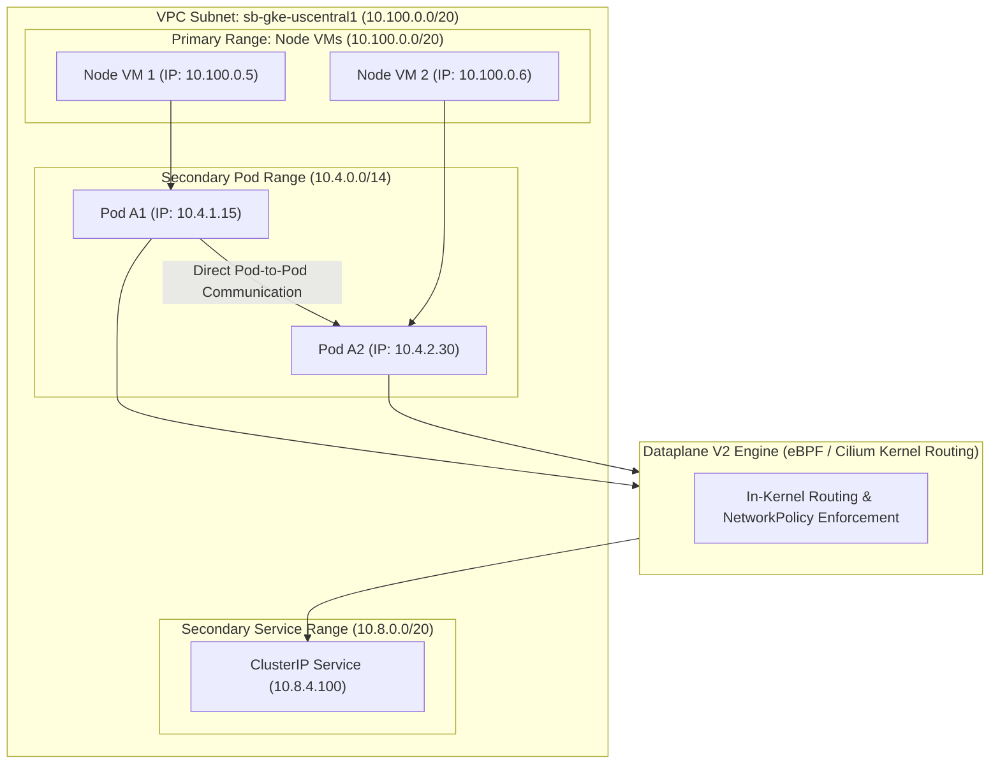

# Topic 70: GKE Networking

---

## 1. What Is It?

**GKE Networking** encompasses the underlying network model, IP address allocation schemes, routing mechanisms, and network security policies that govern pod-to-pod, pod-to-service, and external traffic communication within Google Kubernetes Engine.

GKE networking relies on two fundamental architecture pillars:
1. **VPC-Native Clusters (IP Alias)**: Pods receive native, routable internal IP addresses directly from Secondary IP Ranges of your VPC subnet, rather than relying on legacy software-overlay networks.
2. **GKE Dataplane V2 (eBPF)**: Built on Cilium and Linux eBPF (Extended Berkeley Packet Filter), Dataplane V2 replaces legacy `iptables` rules with high-performance in-kernel packet routing, native Kubernetes NetworkPolicy enforcement, and real-time flow logging.

VPC-Native GKE networking enables direct, un-proxied pod-to-pod communication over Google's internal software-defined network (SDN), enabling seamless integration with Cloud VPN, Cloud Interconnect, and Private Service Connect.

### Real-World Analogy
Think of GKE Networking like a modern smart city mail routing system:
- **Legacy Routes-Based (Overlay)**: A package addressed to Apartment 4B (Pod IP) is sent to a central city post office (Worker Node VM). The post office opens the package, translates the address using a custom internal map (`iptables`), and reships it on a local bicycle (Overlay network).
- **VPC-Native Dataplane V2 (eBPF)**: Every apartment (Pod IP) receives a unique, recognized street address directly on the main city postal map (VPC Subnet Alias IP). Smart pneumatic tubes (eBPF kernel routing) shoot packages directly to Apartment 4B in milliseconds without stopping at intermediate sorting stations.

---

## 2. Where Does It Fit?

GKE Networking operates inside your customer VPC network, allocating Subnet primary ranges for Node VMs, secondary ranges for Pods and Services, and using eBPF for in-kernel packet processing.



---

## 3. Core Concepts

| Networking Component | Description | Default IP Range / Setting | Best Practice |
|---|---|---|---|
| **VPC-Native (IP Alias)** | Pods receive native VPC secondary IP addresses. | Enabled (`--enable-ip-alias`) | **Mandatory standard**: Required for all production GKE clusters. |
| **Dataplane V2** | eBPF-based network datapath replacing `iptables` & `kube-proxy`. | Enabled (`--enable-dataplane-v2`) | Enforces NetworkPolicies natively with maximum packet throughput. |
| **Pod CIDR Range** | Secondary IP range allocated for Pod IP addresses. | e.g., `/14` (262,144 Pod IPs) | Allocate large Pod CIDR ranges (`/14` or `/16`) during cluster creation. |
| **Service CIDR Range** | Secondary IP range allocated for ClusterIP Services. | e.g., `/20` (4,096 Service IPs) | Allocate `/20` range for cluster internal services. |
| **NetworkPolicy** | Declarative firewall rules restricting pod-to-pod network traffic. | Ingress & Egress Rules | Enforce Zero-Trust network isolation between microservice namespaces. |

---

## 4. How It Works

Packet flow between Pods on separate nodes using VPC-Native eBPF routing:

```text
Pod A (10.4.1.15 on Node 1) sends packet to Pod B (10.4.2.30 on Node 2)
              ↓
Dataplane V2 eBPF program intercepts packet at socket level inside host kernel
              ↓
Evaluates Kubernetes NetworkPolicies -> Is traffic allowed? YES!
              ↓
Packet routed directly across Google Andromeda SDN to Node 2 (No overlay encapsulation!)
              ↓
Node 2 eBPF program receives packet -> Delivers directly to Pod B's veth pair
```

1. **Zero Overlay Overhead**: VPC-Native clusters use native IP routing over Google's Andromeda SDN, eliminating VXLAN/Geneve encapsulation CPU overhead.
2. **NetworkPolicy eBPF Filtering**: NetworkPolicies are evaluated in-kernel via eBPF programs, executing in nanoseconds regardless of whether 10 or 10,000 firewall rules exist.

---

## 5. Production Scenario

### Enterprise Zero-Trust Microservice Network Architecture

```text
Requirement: Establish a secure, high-performance GKE networking architecture for a multi-tenant platform, isolating Payment microservices from General Frontend Pods using NetworkPolicies.
    ↓
Architecture: VPC-Native Cluster + Dataplane V2 + Namespace NetworkPolicies.
    ↓
Networking Configuration:
  - Mode: **VPC-Native** (`--enable-ip-alias`).
  - Subnet: `sb-gke-prod` (Nodes: `10.100.0.0/20`, Pods: `10.4.0.0/14`, Services: `10.8.0.0/20`).
  - Datapath: **Dataplane V2** (`--enable-dataplane-v2`).
    ↓
Zero-Trust NetworkPolicy (`isolate-payment.yaml`):
  ```yaml
  apiVersion: networking.k8s.io/v1
  kind: NetworkPolicy
  metadata:
    name: deny-all-except-frontend
    namespace: payment
  spec:
    podSelector:
      matchLabels:
        app: payment-api
    policyTypes:
    - Ingress
    ingress:
    - from:
      - namespaceSelector:
          matchLabels:
            name: frontend
  ```
    ↓
Security: Blocks all incoming traffic to `payment` namespace unless originating from `frontend` namespace.
    ↓
Monitoring: Cloud Logging tracking Dataplane V2 eBPF NetworkPolicy dropped packet logs.
```

*Why Selected*: Combines high-performance VPC-Native eBPF routing with declarative Zero-Trust NetworkPolicies enforced in-kernel.

---

## 6. Hands-On Lab

### Prerequisites
- Active GCP Project with Custom VPC and Subnet configured.
- Cloud Shell or `gcloud` CLI (`kubectl` installed).
- IAM permissions: `roles/container.admin`.

### Console Method
1. Log into [Google Cloud Console](https://console.cloud.google.com/).
2. Navigate to **Kubernetes Engine** → **Clusters** → Click **CREATE**.
3. Select **GKE Standard** (or Autopilot).
4. Under **Networking**:
   - Cluster networking: Select **VPC-native**.
   - Datapath provider: Select **Dataplane V2** (Advanced networking).
   - Node subnet: `sb-us-central1`.
   - Pod Secondary Range: `gke-pods-range`.
   - Service Secondary Range: `gke-services-range`.
5. Click **CREATE**.

### CLI Method
Create a VPC-Native GKE Cluster with Dataplane V2 and apply a NetworkPolicy using `gcloud`:

```bash
# Set variables
PROJECT_ID="your-gcp-project-id"
REGION="us-central1"
CLUSTER_NAME="gke-net-demo"
VPC_NAME="custom-prod-vpc"
SUBNET_NAME="sb-us-central1"

# 1. Create a VPC-Native Cluster with Dataplane V2
gcloud container clusters create $CLUSTER_NAME \
    --region=$REGION \
    --network=$VPC_NAME \
    --subnetwork=$SUBNET_NAME \
    --enable-ip-alias \
    --enable-dataplane-v2 \
    --num-nodes=1

# 2. Get credentials
gcloud container clusters get-credentials $CLUSTER_NAME --region=$REGION

# 3. Create 'test' namespace and deploy isolated Pod
kubectl create namespace test-ns
kubectl run secure-pod --image=nginx:alpine -n test-ns --labels="app=secure"

# 4. Apply a NetworkPolicy denying all ingress to 'secure-pod'
cat <<EOF | kubectl apply -f -
apiVersion: networking.k8s.io/v1
kind: NetworkPolicy
metadata:
  name: deny-ingress
  namespace: test-ns
spec:
  podSelector:
    matchLabels:
      app: secure
  policyTypes:
  - Ingress
EOF
```

### Verification
*Expected Result*: Querying `kubectl get networkpolicy -n test-ns` confirms `deny-ingress` is active, enforcing eBPF packet dropping for unauthorized incoming connections.

### Cleanup
Delete cluster:

```bash
gcloud container clusters delete $CLUSTER_NAME --region=$REGION --quiet
```

---

## 7. Security

### Zero-Trust Network Policy Standards
- **Default Deny Ingress & Egress**: Apply a default-deny NetworkPolicy across namespaces, explicitly opening allowed microservice communication paths.
- **Namespace Isolation**: Use `namespaceSelector` in NetworkPolicies to isolate multi-tenant workloads.
- **Enable Dataplane V2 Logging**: Enable NetworkPolicy logging in Dataplane V2 settings to log dropped connection attempts to Cloud Logging for audit analysis.

```text
BAD PRACTICE:
Deploying GKE clusters without NetworkPolicies enabled, allowing any compromised Pod in a test namespace to communicate directly with production database Pods.
Risk: Horizontal lateral movement across namespaces during container breach incidents.

PRODUCTION PRACTICE:
Deploy Dataplane V2 clusters with default-deny NetworkPolicies. Enforce strict namespace and label isolation rules.
```

---

## 8. Scaling & High Availability

Pod CIDR Allocation & IP Sizing:

```text
Default /24 Pod CIDR per Node (Allocates 256 Pod IPs per VM node -> Max 110 Pods per node)
   ↓ (VPC Subnet Sizing Strategy)
Subnet Secondary Pod Range: /14 (Supports up to 262,144 Pod IPs globally across cluster)
```

- **Avoid Subnet IP Exhaustion**: Secondary Pod CIDR ranges cannot be expanded easily after cluster creation. Always size Pod ranges generously (`/14` or `/16`) during initial cluster creation.

---

## 9. Cost

### Networking Cost Breakdown
- **Dataplane V2 & VPC-Native**: 100% **FREE**. Zero additional GCP charges for eBPF routing or VPC-Native IP Alias configuration.
- **Cross-Zone Pod Communication**: Traffic flowing between Pods located in different availability zones (`us-central1-a` to `us-central1-b`) incurs standard inter-zone network egress charges (~$0.01/GB).

---

## 10. Monitoring & Troubleshooting

### Networking Observability Tools
- **Dataplane V2 Network Flow Logs**: Real-time eBPF packet flow logs streamed to Cloud Logging.
- **Connectivity Tests**: Run GCP Network Intelligence Center Connectivity Tests to diagnose VPC routing issues between GKE Pods and Compute Engine VMs.

### Troubleshooting Matrix

| Symptom | Possible Cause | What to Check | Fix |
|---|---|---|---|
| Pods unable to communicate across namespaces | Active **NetworkPolicy** dropping packets | `kubectl get networkpolicies -A` | Add `namespaceSelector` rule to NetworkPolicy allowing target Pod labels. |
| Cannot create new Pods: `FailedCreatePodSandBox` | **Pod CIDR IP Exhaustion** in secondary subnet range | VPC Subnet Secondary IP utilization | Create a new Node Pool with a custom `--max-pods-per-node` limit or expand IP ranges. |
| Pod connection to on-premises DB failing | Missing Cloud VPN/Interconnect route or firewall rule | VPC Firewall Rules & Cloud Router | Ensure VPC secondary Pod IP range is advertised via BGP on Cloud Router. |

---

## 11. Common Mistakes

```text
Mistake: Sizing the VPC Subnet Secondary Pod IP range too small (e.g., using a `/24` range allowing only 256 total Pods).
Why: Underestimating cluster growth during initial network planning.
Impact: Cluster expansion fails when secondary Pod IP capacity is exhausted.
Correct approach: Allocate a large `/14` or `/16` Secondary Pod IP range during VPC subnet creation.

Mistake: Deploying GKE without Dataplane V2 and assuming `iptables` scales efficiently for 10,000+ Services.
Why: Relying on legacy GKE network defaults.
Impact: Severe CPU overhead on worker nodes as `kube-proxy` struggles to process massive `iptables` rule updates.
Correct approach: Always enable `--enable-dataplane-v2` for eBPF-based in-kernel packet routing.
```

---

## 12. Production Best Practices

- [ ] Deploy **VPC-Native Clusters** (`--enable-ip-alias`) on all GKE workloads.
- [ ] Enable **Dataplane V2** (`--enable-dataplane-v2`) for eBPF-based networking and security.
- [ ] Allocate large Secondary Subnet IP ranges for Pods (`/14`) and Services (`/20`).
- [ ] Implement **Zero-Trust NetworkPolicies** with default-deny rules across namespaces.
- [ ] Enable **Dataplane V2 NetworkPolicy Logging** for audit compliance.
- [ ] Automate all VPC subnets, secondary ranges, and GKE networking parameters via Terraform.

---

## 13. Hyperscaler / Enterprise Perspective

```text
Personal / Learning
  Routes-based cluster → Default iptables routing → Open pod-to-pod communication
        ↓
Small Production
  VPC-Native Cluster → Dataplane V2 enabled → Basic Namespace NetworkPolicies
        ↓
Enterprise Environment
  VPC-Native Dataplane V2 → Default-Deny Zero-Trust NetworkPolicies → Private Service Connect Integration
        ↓
Hyperscaler Environment
  Multi-Cluster Service Mesh (Anthos Service Mesh / Istio) → eBPF Observability (Cilium Hubble) → Automated BGP Route Advertising
```

In a hyperscaler environment, enterprise networking is managed via **Service Mesh (Istio / Anthos Service Mesh)** running on top of **VPC-Native Dataplane V2**. SRE teams use **Cilium Hubble** eBPF telemetry to visualize real-time service dependency maps, while mTLS encryption protects 100% of inter-pod data in transit across global GKE clusters.

---

## 14. Real Project Questions

### Q1: What is the technical advantage of VPC-Native (IP Alias) GKE clusters over legacy Routes-Based clusters?
**Answer:** In a **VPC-Native cluster**, Pods receive native, routable internal IP addresses directly from Secondary Subnet ranges of your VPC. Packets route over Google's Andromeda SDN without overlay encapsulation (VXLAN/Geneve), reducing CPU latency. Furthermore, Pod IPs are directly reachable over Cloud VPN, Cloud Interconnect, and Private Service Connect without NAT proxies.

### Q2: How does GKE Dataplane V2 leverage eBPF to improve Kubernetes network performance?
**Answer:** **Dataplane V2** replaces legacy `iptables` and `kube-proxy` with Linux **eBPF (Extended Berkeley Packet Filter)** programs running directly inside the host Linux kernel. eBPF handles packet routing and NetworkPolicy enforcement in-kernel at socket level, eliminating `iptables` rule evaluation overhead and scaling at constant $O(1)$ performance regardless of whether 10 or 10,000 Services exist.

### Q3: Why must secondary Pod CIDR ranges be planned carefully prior to cluster creation?
**Answer:** GKE pre-allocates a block of Pod IP addresses (by default a `/24` subnet = 256 IPs) to each worker node VM from the secondary Pod CIDR range. If the overall secondary Pod range is sized too small (e.g., `/24`), the cluster will run out of Pod IPs after launching just 1 or 2 nodes, blocking further cluster expansion.

---

## 15. Quick Decision Guide

| Requirement | Recommended Approach | Reason |
|---|---|---|
| Enterprise GKE cluster requiring maximum networking performance and NetworkPolicy isolation | **VPC-Native Cluster with Dataplane V2 (`--enable-dataplane-v2`)** | Direct SDN routing, eBPF in-kernel packet processing, native NetworkPolicy support. |
| Restricting communication between `frontend` and `backend` microservice namespaces | **Kubernetes NetworkPolicy** | Enforces declarative Layer 3/4 firewall rules between Pod namespaces. |
| Connecting GKE Pods directly to on-premises databases over Cloud VPN | **VPC-Native Cluster (`--enable-ip-alias`)** | Assigns native VPC IPs to Pods, making them directly routable over BGP Cloud Routers. |

### When should I use it?
- Essential foundation for designing cluster IP ranges, network policies, and eBPF datapath routing in GKE.

### When should I NOT use it?
- Do not use legacy Routes-Based networking for new production GKE deployments.

---

## 16. Related Services

```text
               [70. GKE Networking]
              /         |          \
      Dataplane V2  VPC Subnets   Cloud NAT
       (eBPF Engine)  (Secondary)  (Private Nodes)
            |           |               |
        In-Kernel   Pod & Service    Outbound
        Routing      IP Ranges        Egress
```

- **Dataplane V2 (Cilium)**: In-kernel eBPF packet routing and security engine.
- **VPC Subnets**: Provides primary and secondary IP ranges for nodes, pods, and services.
- **Network Intelligence Center**: Provides connectivity testing and flow visualization.

---

## 17. Cheat Sheet

### Essential Parameters
- `--enable-ip-alias` : Enable VPC-Native networking.
- `--enable-dataplane-v2` : Enable eBPF-based Dataplane V2.
- `--cluster-ipv4-cidr` : Secondary subnet range for Pods.
- `--services-ipv4-cidr` : Secondary subnet range for Services.

### Useful Commands
```bash
# Create a VPC-Native cluster with Dataplane V2
gcloud container clusters create CLUSTER_NAME \
    --region=us-central1 --network=VPC_NAME --subnetwork=SUBNET_NAME \
    --enable-ip-alias --enable-dataplane-v2

# View active NetworkPolicies in a namespace
kubectl get networkpolicy -n NAMESPACE

# Inspect Dataplane V2 pods running on nodes
kubectl get pods -n kube-system -l k8s-app=cilium
```

---

## 18. Learning Connection

- **Previous Topic**: [69. Secrets](../69-secrets/README.md)
- **Next Topic**: [71. GKE Storage](../71-gke-storage/README.md)
