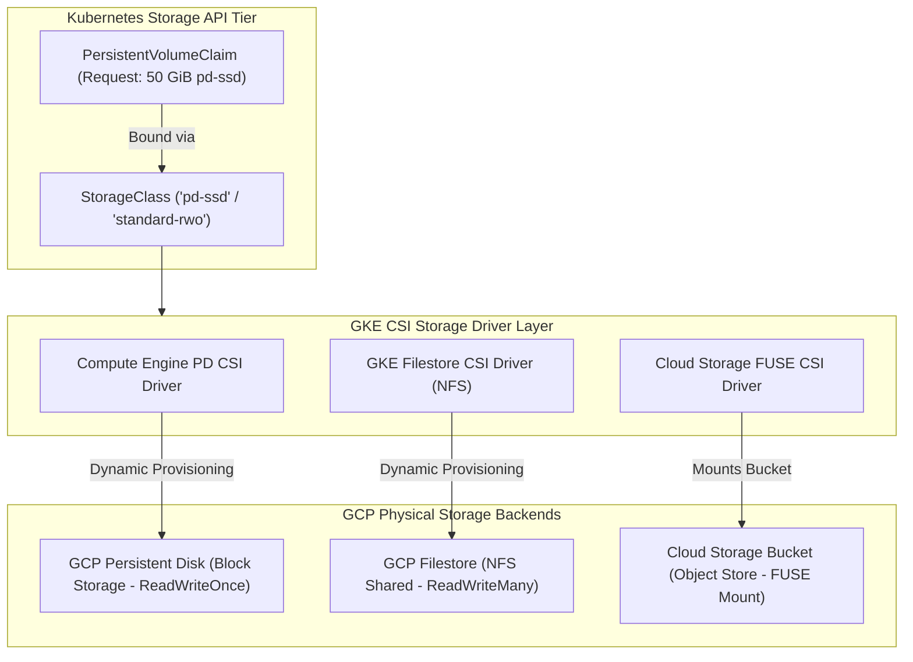

# Topic 71: GKE Storage

---

## 1. What Is It?

**GKE Storage** defines how persistent and ephemeral data is provisioned, attached, formatted, and managed for containerized workloads running in Google Kubernetes Engine.

Because container root filesystems are ephemeral (erased whenever a container restarts), stateful applications (databases, message queues, content management systems) require persistent storage decoupled from container lifecycles.

GKE implements the Kubernetes **Container Storage Interface (CSI)** driver architecture, allowing workloads to dynamically request GCP storage backends using standard Kubernetes manifests:
1. **Persistent Volumes (PV) & Claims (PVC)**: Abstraction layer decoupling storage requests (`StorageClass`) from physical GCP storage disk creation.
2. **Compute Engine Persistent Disks (`pd-balanced`, `pd-ssd`, `hyperdisk-balanced`)**: Block storage dynamically provisioned for single Pod read-write workloads (`ReadWriteOnce`).
3. **Filestore CSI Driver (NFS)**: Fully managed NFS file storage mounted simultaneously across hundreds of Pods (`ReadWriteMany`).
4. **Cloud Storage FUSE CSI Driver**: Allows Pods to mount Cloud Storage buckets directly as local filesystems for high-throughput media and AI/ML data access.

### Real-World Analogy
Think of GKE Storage like renting a safe deposit box at a bank:
- **Container Filesystem**: A plastic shopping bag you carry into the bank. If you drop the bag or leave for lunch (Container Restart), everything inside is lost.
- **StorageClass**: The bank's catalog of safe deposit box options (Standard Steel Box, Ultra-HD Titanium Vault).
- **PersistentVolumeClaim (PVC)**: The rental agreement form you sign requesting a 50-Liter Titanium Vault.
- **PersistentVolume (PV)**: The physical steel box assigned to you in the vault (GCP Persistent Disk). Even if you leave the bank for 10 years, your items remain safely locked in the box until you return.

---

## 2. Where Does It Fit?

GKE Storage drivers bridge standard Kubernetes PVC requests to GCP underlying storage infrastructure (Compute Engine PD, Filestore, Cloud Storage).



---

## 3. Core Concepts

| Storage Driver / Concept | Access Mode | Underlying Storage | Best Practice / Use Case |
|---|---|---|---|
| **Compute Engine PD CSI** | `ReadWriteOnce` (RWO) | GCP Persistent Disk (`pd-ssd`, `hyperdisk`) | Relational DBs (PostgreSQL, MySQL), Redis, single Pod write storage. |
| **Filestore CSI Driver** | `ReadWriteMany` (RWX) | GCP Filestore NFS | CMS file uploads (WordPress), shared web assets, multi-Pod write files. |
| **Cloud Storage FUSE CSI** | `ReadWriteMany` / Read | Cloud Storage Bucket | AI/ML model training datasets, large media processing pipelines. |
| **Volume Snapshot CSI** | Snapshot Backup | Cloud Storage Snapshots | Point-in-time backup and disaster recovery for PersistentDisks. |
| **Local SSD** | Ephemeral High IOPS | Host Node Local NVMe SSD | Ultra-fast scratch disks, temporary Caching (Non-persistent). |

---

## 4. How It Works

Dynamic PersistentDisk Provisioning operates automatically:

```text
Developer applies PVC manifest (`storageClassName: premium-rwo`, `50Gi`)
              ↓
GKE Compute Engine PD CSI Driver intercepts PVC request
              ↓
Calls Compute Engine API -> Dynamically provisions 50 GB `pd-ssd` disk in target zone
              ↓
Creates PersistentVolume (PV) object and binds it to the PVC
              ↓
Worker Node attaches physical disk -> Formats filesystem (ext4/xfs) -> Mounts inside Pod container
```

1. **Dynamic Provisioning**: Developers never pre-create physical disks manually. Creating a PVC triggers GKE to provision the exact disk size and type automatically.
2. **Volume Expansion**: Increasing `spec.resources.requests.storage` on a PVC expands the underlying GCP PersistentDisk online without Pod downtime.

---

## 5. Production Scenario

### Stateful Database Storage & Shared Web Assets Architecture

```text
Requirement: Run a High-Availability PostgreSQL database requiring 100 GB low-latency SSD storage alongside a 20-pod web cluster sharing a common 500 GB media upload directory.
    ↓
Architecture: Compute Engine PD CSI (Database) + Filestore CSI (Shared Web Assets).
    ↓
Database Manifest (`db-pvc.yaml`):
  - StorageClass: `premium-rwo` (`pd-ssd`).
  - AccessMode: `ReadWriteOnce` (RWO).
  - VolumeExpansion: `allowVolumeExpansion: true`.
    ↓
Shared Assets Manifest (`assets-pvc.yaml`):
  - StorageClass: `enterprise-rwx` (GCP Filestore NFS).
  - AccessMode: `ReadWriteMany` (RWX).
  - VolumeMount: Mounted to `/var/www/uploads` across all 20 web Pods.
    ↓
Security: Disk volumes encrypted at rest via CMEK keys; NFS access limited to cluster VPC.
    ↓
Monitoring: Cloud Monitoring tracking `kubernetes.io/pv/volume/utilization_bytes`.
```

*Why Selected*: Uses `pd-ssd` for low-latency database IOPS and Filestore NFS for multi-Pod shared write access across web nodes.

---

## 6. Hands-On Lab

### Prerequisites
- Active GCP Project with a GKE Cluster running.
- Cloud Shell or `gcloud` CLI (`kubectl` installed).
- IAM permissions: `roles/container.admin`.

### Console Method
1. Log into [Google Cloud Console](https://console.cloud.google.com/).
2. Navigate to **Kubernetes Engine** → **Storage**.
3. View active StorageClasses (`standard-rwo`, `premium-rwo`), PersistentVolumeClaims (PVCs), and PersistentVolumes (PVs).
4. Inspect underlying GCP Persistent Disks created by navigating to **Compute Engine** → **Disks**.

### CLI Method
Create a PVC, attach it to a Pod, and verify dynamic volume provisioning using `kubectl`:

```bash
# Set variables
CLUSTER_NAME="gke-demo-cluster"
REGION="us-central1"

# 1. Connect to GKE cluster
gcloud container clusters get-credentials $CLUSTER_NAME --region=$REGION

# 2. Create a PersistentVolumeClaim requesting 10 GiB of SSD storage
cat <<EOF | kubectl apply -f -
apiVersion: v1
kind: PersistentVolumeClaim
metadata:
  name: demo-ssd-pvc
spec:
  accessModes:
    - ReadWriteOnce
  storageClassName: premium-rwo
  resources:
    requests:
      storage: 10Gi
EOF

# 3. Create a Pod that mounts the PVC
cat <<EOF | kubectl apply -f -
apiVersion: v1
kind: Pod
metadata:
  name: storage-test-pod
spec:
  containers:
  - name: app
    image: nginx:alpine
    volumeMounts:
    - name: data-volume
      mountPath: /usr/share/nginx/html
  volumes:
  - name: data-volume
    persistentVolumeClaim:
      claimName: demo-ssd-pvc
EOF

# 4. Verify PVC status and underlying dynamically provisioned PV
kubectl get pvc demo-ssd-pvc
kubectl get pv
```

### Verification
*Expected Result*: `kubectl get pvc` displays status `Bound`, confirming GKE dynamically provisioned a physical 10 GB `pd-ssd` disk.

### Cleanup
Delete Pod and PVC:

```bash
kubectl delete pod storage-test-pod
kubectl delete pvc demo-ssd-pvc
```

---

## 7. Security

### Storage Encryption & Access Control
- **CMEK Encryption for Disks**: Encrypt GKE Persistent Disks using Customer-Managed Encryption Keys (CMEK) via Cloud KMS (`kmsKeyName` in StorageClass).
- **Read-Only Volume Mounts**: Mount volumes as read-only (`readOnly: true`) whenever Pods only need to read static data.
- **Volume VolumeSnapshot Protection**: Take automated VolumeSnapshots before executing major database schema upgrades.

```text
BAD PRACTICE:
Attempting to mount a single GCP Persistent Disk (`pd-ssd`) as `ReadWriteMany` across 10 Pods on different nodes.
Risk: Mount operation fails. Persistent Disks support block-level writing from ONE node at a time (`ReadWriteOnce`).

PRODUCTION PRACTICE:
Use `pd-ssd` for single-pod database workloads (`ReadWriteOnce`). Use **Filestore CSI** (NFS) when multiple Pods need simultaneous write access (`ReadWriteMany`).
```

---

## 8. Scaling & High Availability

Volume Binding Mode & Zonal Placement:

```text
`volumeBindingMode: Immediate` (Provisions disk immediately -> Might pick wrong zone relative to Pod scheduling!)
   ↓ (GKE Best Practice Standard)
`volumeBindingMode: WaitForFirstConsumer` (Delays disk creation until Pod is scheduled -> Guarantees same zone placement!)
```

- **WaitForFirstConsumer**: Always use `volumeBindingMode: WaitForFirstConsumer` in StorageClasses to ensure GKE provisions the persistent disk in the exact same Availability Zone where the consuming Pod is scheduled.

---

## 9. Cost

### GKE Storage Pricing Architecture
- **Persistent Disk Billing**: Billed per GB/month for provisioned disk capacity (e.g., `pd-standard` ~$0.04/GB/mo; `pd-ssd` ~$0.17/GB/mo; `hyperdisk-balanced` ~$0.09/GB/mo).
- **Over-Provisioning Warning**: Disks are billed for **provisioned size** (e.g., 500 GB PVC = 500 GB disk), regardless of whether your database uses 5 GB or 500 GB of actual file space.
- **Volume Expansion**: PVCs can be expanded online, but CANNOT be shrunk. Start with conservative PVC sizes and expand as data grows.

---

## 10. Monitoring & Troubleshooting

### Storage Observability Tools
- **Cloud Monitoring Volume Metrics**: Track `kubernetes.io/pv/volume/utilization_bytes` and `volume/inodes_used`.
- **Alert Policies**: Set alerts when persistent volume utilization exceeds 85% of capacity.

### Troubleshooting Matrix

| Symptom | Possible Cause | What to Check | Fix |
|---|---|---|---|
| Pod stuck in `ContainerCreating` with `Multi-Attach error` | Disk still attached to old node VM from previous Pod instance | `kubectl describe pod <pod-name>` | Wait ~2 minutes for GKE to detach disk from old VM, or force drain old node. |
| PVC stuck in `Pending` state | Insufficient storage quota or invalid `storageClassName` | `kubectl describe pvc <pvc-name>` | Verify StorageClass name and check GCP Persistent Disk quota in region. |
| Pod fails with `No space left on device` | Disk space exhausted on persistent volume | `kubectl exec <pod-name> -- df -h` | Increase `spec.resources.requests.storage` in PVC to expand disk online. |

---

## 11. Common Mistakes

```text
Mistake: Provisioning a massive 1 Terabyte PVC upfront for a database that only requires 20 Gigabytes.
Why: Over-estimating storage requirements out of fear of running out of disk space.
Impact: Paying for 1 TB of provisioned SSD storage (~$170/month) unnecessarily.
Correct approach: Start with a lean PVC size (e.g., 50 GB) and rely on online PVC expansion (`allowVolumeExpansion: true`) to grow the disk as data expands.

Mistake: Attempting to shrink a PVC size in Kubernetes.
Why: Trying to reduce storage costs after deleting large database tables.
Impact: Kubernetes API and GCP block volume shrinking; PVC modification fails.
Correct approach: Create a new smaller PVC, copy data over, and delete the old PVC.
```

---

## 12. Production Best Practices

- [ ] Use **`premium-rwo` (`pd-ssd`)** or **`hyperdisk-balanced`** for production database workloads.
- [ ] Set **`volumeBindingMode: WaitForFirstConsumer`** in all custom StorageClasses.
- [ ] Set **`allowVolumeExpansion: true`** in StorageClasses to support online disk expansion.
- [ ] Use **Filestore CSI** (NFS) when multiple Pods require concurrent write access (`ReadWriteMany`).
- [ ] Encrypt persistent disks using **Customer-Managed Encryption Keys (CMEK)** via Cloud KMS.
- [ ] Automate StorageClasses and PVC definitions using Infrastructure as Code (Terraform/Helm).

---

## 13. Hyperscaler / Enterprise Perspective

```text
Personal / Learning
  Ephemeral Container Disks → Manual PVC creation → `pd-standard` StorageClass
        ↓
Small Production
  Dynamic Provisioning (`pd-ssd`) → Online Volume Expansion → Basic Snapshots
        ↓
Enterprise Environment
  CMEK Encrypted StorageClasses → Filestore NFS RWX Storage → VolumeSnapshot Backups
        ↓
Hyperscaler Environment
  Automated Stateful Operator Orchestration → Multi-Region Asynchronous Disk Replication → Automated Volume Expansion Controllers
```

In a hyperscaler environment, enterprise database workloads run on GKE using **Stateful Operators** (e.g., Cloud Native PG, Strimzi Kafka). Platform teams deploy CMEK-encrypted StorageClasses using **Hyperdisk Balanced** for maximum IOPS. Automated storage controllers monitor disk usage, automatically expanding PVC sizes in 20% increments whenever disk capacity hits 85% utilization.

---

## 14. Real Project Questions

### Q1: How does dynamic provisioning work when a developer creates a PersistentVolumeClaim (PVC) in GKE?
**Answer:** When a developer submits a PVC manifest referencing a specific `StorageClass` (e.g., `premium-rwo`), the GKE Compute Engine PD CSI Driver intercepts the request, calls the GCP Compute Engine API to dynamically provision a physical Persistent Disk matching the requested size and type, creates a `PersistentVolume` (PV) object in Kubernetes, and binds the PV to the PVC automatically.

### Q2: What is the difference between `ReadWriteOnce` (RWO) and `ReadWriteMany` (RWX) access modes in GKE?
**Answer:** **`ReadWriteOnce` (RWO)** allows a volume to be mounted with read-write permissions by Pods running on a **single worker node** at a time (standard for GCP Persistent Disks). **`ReadWriteMany` (RWX)** allows a volume to be mounted with read-write permissions simultaneously across **multiple Pods running on different worker nodes** (requires GCP Filestore NFS or Cloud Storage FUSE).

### Q3: Why should `volumeBindingMode` be set to `WaitForFirstConsumer` in GKE StorageClasses?
**Answer:** Setting `volumeBindingMode: WaitForFirstConsumer` delays physical GCP disk creation until the consuming Pod is actually scheduled onto a specific worker node. This guarantees that GKE provisions the persistent disk in the **exact same Availability Zone** as the node hosting the Pod, preventing cross-zone attachment errors.

---

## 15. Quick Decision Guide

| Requirement | Recommended Approach | Reason |
|---|---|---|
| High-performance transactional database (PostgreSQL/MySQL) running in a single Pod | **Compute Engine PD CSI (`pd-ssd` / `ReadWriteOnce`)** | Low-latency block storage optimized for single-node database IOPS. |
| WordPress or CMS cluster requiring 20 Pods to share a common media upload directory | **GKE Filestore CSI Driver (`ReadWriteMany`)** | Fully managed NFS file storage supporting concurrent multi-node writes. |
| Mounting a 10 TB machine learning dataset stored in Cloud Storage into an AI training Pod | **Cloud Storage FUSE CSI Driver** | Mounts GCS object buckets directly as local filesystems without copying data to disk. |

### When should I use it?
- Essential technical guide for managing stateful storage, persistent volumes, and dynamic disk provisioning in GKE.

### When should I NOT use it?
- Do not use persistent disk storage for purely stateless web APIs that store no local file state.

---

## 16. Related Services

```text
                  [71. GKE Storage]
                 /        |        \
        Persistent     Filestore  Cloud Storage
        Disks (PD)       (NFS)      FUSE Driver
            |              |             |
        Block Storage   Shared File   Object Store
        (ReadWriteOnce) (ReadWriteMany) (FUSE Mount)
```

- **Compute Engine Persistent Disks**: Primary block storage engine for GKE PVs.
- **GCP Filestore**: NFS storage engine for multi-pod shared write storage.
- **Cloud KMS**: Provides CMEK keys for encrypting GKE storage volumes at rest.

---

## 17. Cheat Sheet

### Access Modes & Classes
- **`ReadWriteOnce` (RWO)**: Single node mount (GCP Persistent Disks).
- **`ReadWriteMany` (RWX)**: Multi-node simultaneous mount (GCP Filestore NFS).
- **`standard-rwo`**: Standard HDD / Balanced Disk.
- **`premium-rwo`**: High-performance SSD (`pd-ssd`).

### Useful Commands
```bash
# View active StorageClasses in GKE
kubectl get storageclass

# View PersistentVolumeClaims and bound volumes
kubectl get pvc

# Describe a PVC to check dynamic provisioning status
kubectl describe pvc PVC_NAME
```

---

## 18. Learning Connection

- **Previous Topic**: [70. GKE Networking](../70-gke-networking/README.md)
- **Next Topic**: [72. GKE Security](../72-gke-security/README.md)
