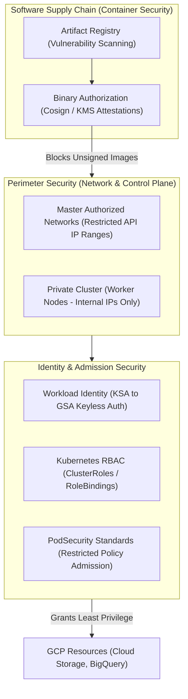

# Topic 72: GKE Security

---

## 1. What Is It?

**GKE Security** encompasses the multi-layered defense-in-depth framework, identity controls, binary verification systems, and network isolation policies designed to secure Kubernetes workloads, control planes, and worker node infrastructure on Google Cloud.

GKE security operates across four fundamental layers (The 4Cs of Cloud-Native Security):
1. **Cloud / Infrastructure Layer**: Private Clusters (zero public node IPs), Master Authorized Networks, Shielded GKE Nodes, and CMEK encryption for `etcd` and persistent disks.
2. **Cluster Layer**: Kubernetes Role-Based Access Control (RBAC), Workload Identity (keyless IAM authentication), and Dataplane V2 NetworkPolicies.
3. **Container Layer**: GKE Binary Authorization (cryptographic image signing), Artifact Registry vulnerability scanning, and Distroless minimal base images.
4. **Code / Application Layer**: PodSecurity Standards (Baseline / Restricted), dropping Linux capabilities, non-root execution, and Secret Manager integration.

### Real-World Analogy
Think of GKE Security like securing an international embassy building:
- **Infrastructure**: Perimeter moat and electric fences (Private Cluster & Master Authorized Networks).
- **Cluster**: Guard stations verifying diplomatic ID badges at every interior door (RBAC & Workload Identity).
- **Container**: Inspecting incoming delivery crates using X-ray scanners and biometric seals before allowing them inside (Artifact Registry Scanning & Binary Authorization).
- **Code**: Diplomats working in restricted offices without master keys to the building's electrical generators (Non-root Pod Execution & Dropped Linux Capabilities).

---

## 2. Where Does It Fit?

GKE Security integrates natively across GCP IAM, Cloud KMS, Binary Authorization, and Kubernetes admission controllers.



---

## 3. Core Concepts

| Security Control | Layer | GCP Service / Feature | Best Practice / Implementation |
|---|---|---|---|
| **Workload Identity** | Identity | GCP IAM + GKE Metadata Server | **Mandatory**: Binds KSAs to GSAs; eliminates static JSON keys. |
| **Binary Authorization** | Container | GCP Binary Authorization | Enforces cryptographic signatures; blocks un-signed image deployments. |
| **Private Cluster** | Network | VPC Private Subnets | Nodes receive internal IPs ONLY; outbound via Cloud NAT. |
| **PodSecurity Standards** | Workload | Built-in Admission Controller | Enforce `restricted` policy (non-root, drop ALL capabilities). |
| **Master Authorized Networks** | Control Plane | GKE API Server Control | Restrict API HTTPS port 443 to corporate VPN / Bastion IPs. |
| **Shielded Nodes** | Node Hardware | Compute Engine Shielded VMs | Enable Secure Boot & Integrity Monitoring on worker node VMs. |

---

## 4. How It Works

Workload Identity keyless authentication and Binary Authorization admission control operate deterministically:

```text
Developer applies Deployment manifest -> API Server intercepts request
              ↓
Binary Authorization Admission Controller inspects image signature in Artifact Registry
              ↓
Is image signed by KMS Production Key & clean of Critical CVEs?
  NO  -> Admission Controller REJECTS deployment!
  YES -> Pod created on Private Worker Node
              ↓
Pod application queries GCS bucket:
  Kubelet Metadata Server intercepts request -> Exchanges KSA token for short-lived GSA OAuth2 token
              ↓
GCS grants access via GCP IAM (Zero static service account JSON keys stored anywhere!)
```

1. **Metadata Concealment**: GKE Workload Identity blocks Pod access to raw Compute Engine VM metadata endpoints (`169.254.169.254`), preventing Pods from stealing host node VM credentials.
2. **PodSecurity Admission**: Replaces legacy PodSecurityPolicies (PSP). Automatically evaluates PodSpecs on submit, rejecting containers that request `privileged: true` or root execution.

---

## 5. Production Scenario

### Enterprise Banking GKE Cluster Security Hardening Stack

```text
Requirement: Establish a PCI-DSS compliant GKE cluster for a bank, enforcing zero-trust network isolation, keyless GCP IAM authentication, signed image verification, and restricted Pod execution.
    ↓
Architecture: Regional Private GKE Cluster (`gke-bank-prod`) + Binary Authorization + Workload Identity.
    ↓
Security Stack Configuration:
  1. Infrastructure: Regional Private Cluster, Master Authorized Networks enabled (`198.51.100.0/24`), etcd CMEK encrypted via Cloud KMS.
  2. Identity: Workload Identity enabled; default node service account disabled.
  3. Supply Chain: Binary Authorization policy requiring KMS attestations (`projects/bank/attestors/sec-team`).
  4. Workload Security: Namespace labeled `pod-security.kubernetes.io/enforce: restricted`.
    ↓
Namespace Security Labeling:
  ```bash
  kubectl label namespace payment pod-security.kubernetes.io/enforce=restricted
  ```
    ↓
Result: Pods attempting to run as root or mount host paths are rejected instantly by the admission controller.
    ↓
Monitoring: Security Command Center auditing container vulnerability findings and RBAC cluster roles.
```

*Why Selected*: Satisfies PCI-DSS compliance by combining supply chain attestation (Binary Auth), keyless identity (Workload Identity), and zero-trust workload admission policies.

---

## 6. Hands-On Lab

### Prerequisites
- Active GCP Project with GKE & Binary Authorization APIs enabled.
- Cloud Shell or `gcloud` CLI (`kubectl` installed).
- IAM permissions: `roles/container.admin` and `roles/binaryauthorization.attestorsAdmin`.

### Console Method
1. Log into [Google Cloud Console](https://console.cloud.google.com/).
2. Navigate to **Kubernetes Engine** → **Security**.
3. Inspect **Workload Identity**, **Shielded Nodes**, and **Binary Authorization** status.
4. Navigate to **Security** → **Binary Authorization**:
   - View default policy: **Allow all images** (Change to **Require attestations** for production).
5. Open **Security Command Center** → View **Vulnerability Findings** across GKE container images.

### CLI Method
Enforce PodSecurity `restricted` standard on a namespace using `kubectl`:

```bash
# Set variables
CLUSTER_NAME="gke-demo-cluster"
REGION="us-central1"

# 1. Connect to GKE cluster
gcloud container clusters get-credentials $CLUSTER_NAME --region=$REGION

# 2. Create a secure production namespace
kubectl create namespace secure-apps

# 3. Apply Kubernetes PodSecurity 'restricted' enforcement label to namespace
kubectl label --overwrite namespace secure-apps \
    pod-security.kubernetes.io/enforce=restricted \
    pod-security.kubernetes.io/enforce-version=latest

# 4. Attempt to run a non-compliant privileged container (Should fail!)
kubectl run bad-pod --image=nginx:alpine -n secure-apps --privileged
```

### Verification
*Expected Result*: Kubernetes API Server rejects `bad-pod` creation with error: `violates PodSecurity "restricted:latest": privileged (container "bad-pod" must not set securityContext.privileged=true)`.

### Cleanup
Delete test namespace:

```bash
kubectl delete namespace secure-apps
```

---

## 7. Security

### Core Security Vulnerabilities & Mitigations
- **Avoid Service Account JSON Keys**: Never download Service Account JSON keys to mount inside Pods. Use Workload Identity exclusively.
- **Audit RBAC Bindings**: Block wildcards (`*`) in ClusterRoles. Never grant `cluster-admin` to application service accounts.
- **Disable Legacy ABAC**: Always disable Attribute-Based Access Control (`--no-enable-legacy-abac`).

```text
BAD PRACTICE:
Downloading Service Account JSON keys and storing them in Kubernetes Secrets or committing them to Git repositories.
Risk: Key leakage allows attackers to access GCP resources outside the cluster permanently.

PRODUCTION PRACTICE:
Enable Workload Identity. Bind Kubernetes Service Accounts directly to IAM Service Accounts using short-lived tokens.
```

---

## 8. Scaling & High Availability

Binary Authorization Policy Evaluation:

```text
Container Image Push -> Cloud Build -> KMS Image Attestation Signed
   ↓ (GKE Pod Scheduling)
Binary Authorization Policy Evaluation (<50ms In-Kernel Check)
   ↓ (Passed Attestation)
Pod scheduled across multi-zone nodes seamlessly with zero scaling delays
```

- **Cached Attestations**: Binary Authorization caches verified image signatures at the cluster edge, ensuring high-frequency auto-scaling events incur zero performance degradation.

---

## 9. Cost

### Security Feature Billing Impact
- **Workload Identity & PodSecurity**: 100% **FREE**. Zero additional GCP infrastructure cost.
- **Shielded Nodes & Dataplane V2**: 100% **FREE** baseline features in GKE.
- **Binary Authorization**: Pay per evaluation request (~$0.002 per policy evaluation) or flat-rate via GKE Enterprise (Anthos).

---

## 10. Monitoring & Troubleshooting

### Security Observability Tools
- **Security Command Center (SCC)**: Aggregates GKE misconfigurations, vulnerable container images, and RBAC violations.
- **Kubernetes Audit Logs**: Filter by `protoPayload.methodName="io.k8s.core.v1.namespaces.pods.create"` to audit Pod creation attempts.

### Troubleshooting Matrix

| Symptom | Possible Cause | What to Check | Fix |
|---|---|---|---|
| Pod creation rejected: `violates PodSecurity` | PodSpec contains `privileged: true`, root user, or host mounts | `kubectl describe namespace` | Update PodSpec to set `runAsNonRoot: true` and drop Linux capabilities. |
| Pod receives `403 Permission Denied` calling GCP API | Workload Identity IAM binding missing or incorrect annotation | `kubectl get sa <ksa-name> -o yaml` | Ensure KSA has annotation `iam.gke.io/gcp-service-account` and IAM binding exists. |
| Pod blocked by Binary Authorization | Image lacks valid KMS attestation signature | Binary Auth Policy logs | Ensure CI/CD pipeline signs container images with Cloud KMS prior to deployment. |

---

## 11. Common Mistakes

```text
Mistake: Mounting host paths (`hostPath`) or running containers as `root` in production GKE workloads.
Why: Shortcut taken during initial container creation.
Impact: Severe container breakout vulnerability; compromised container grants root access to underlying host VM.
Correct approach: Enforce `pod-security.kubernetes.io/enforce=restricted` on all production namespaces.

Mistake: Granting `cluster-admin` RBAC permissions to application Service Accounts.
Why: Avoiding fine-grained RBAC configuration during development.
Impact: Over-privileged application; container compromise allows attackers to take over 100% of cluster workloads.
Correct approach: Grant least-privilege RoleBindings scoped strictly to specific namespaces and resources.
```

---

## 12. Production Best Practices

- [ ] Enable **Workload Identity** on 100% of production GKE clusters; disable static JSON keys.
- [ ] Enforce **PodSecurity `restricted`** standards across all application namespaces.
- [ ] Deploy **Private Clusters** with Master Authorized Networks enabled.
- [ ] Implement **Binary Authorization** to enforce cryptographic image signing in CI/CD pipelines.
- [ ] Use **Dataplane V2** with default-deny **NetworkPolicies** to enforce zero-trust pod isolation.
- [ ] Automate all security policies and RBAC bindings using Infrastructure as Code (Terraform).

---

## 13. Hyperscaler / Enterprise Perspective

```text
Personal / Learning
  Public Cluster → Default Node SA (`Editor`) → `root` Containers → No Binary Auth
        ↓
Small Production
  Private Cluster → Workload Identity → Basic NetworkPolicies → PodSecurity Baseline
        ↓
Enterprise Environment
  Regional Private Cluster → Binary Authorization (KMS Signatures) → PodSecurity Restricted → CMEK etcd
        ↓
Hyperscaler Environment
  100% Automated Security Governance (Policy Controller / Gatekeeper) → Continuous Vulnerability Auditing → Real-time SCC Incident Remediation
```

In a hyperscaler environment, enterprise SRE teams enforce security governance using **Policy Controller (OPA Gatekeeper)**. GitOps pipelines enforce policies that automatically block un-encrypted volumes, un-signed container images, and over-privileged RBAC roles before manifests reach the Kubernetes API server, maintaining continuous PCI-DSS and FedRAMP compliance.

---

## 14. Real Project Questions

### Q1: How does Workload Identity work in GKE, and why does it eliminate Service Account JSON keys?
**Answer:** Workload Identity binds a **Kubernetes Service Account (KSA)** to a **Google Service Account (GSA)**. When a Pod makes an API call to a GCP service (such as Cloud Storage), the GKE Metadata Server intercepts the request, verifies the Pod's KSA identity, and exchanges it for a short-lived OAuth2 token for the bound GSA. This provides keyless, automatic credential rotation, eliminating static Service Account JSON key files.

### Q2: What is the purpose of GKE Binary Authorization in a container pipeline?
**Answer:** **Binary Authorization** is an enterprise admission control service that enforces software supply chain security. It verifies that container images possess valid cryptographic signatures (attestations) generated by trusted CI/CD pipeline keys (using Cloud KMS) and have passed vulnerability scans before allowing the Kubernetes API Server to deploy the image to a GKE cluster.

### Q3: How do Kubernetes PodSecurity Standards (`restricted`) protect cluster worker nodes?
**Answer:** The **`restricted` PodSecurity Standard** enforces hardening best practices by blocking containers that request root execution (`runAsNonRoot: true` required), dropping all Linux capabilities (`capabilities.drop: ["ALL"]`), disallowing privileged escalation (`allowPrivilegeEscalation: false`), and blocking `hostPath` volume mounts, preventing container breakout attacks onto host VM nodes.

---

## 15. Quick Decision Guide

| Requirement | Recommended Approach | Reason |
|---|---|---|
| Authenticating a GKE Pod to write files to Cloud Storage without static credentials | **Workload Identity (KSA to GSA Binding)** | Keyless, short-lived OAuth2 token authentication via GKE Metadata Server. |
| Blocking deployment of un-signed or un-scanned container images in GKE | **GCP Binary Authorization** | Enforces cryptographic KMS image signature verification at API admission. |
| Blocking root container execution and host path mounts across a namespace | **PodSecurity Standard (`enforce=restricted`)** | Built-in Kubernetes admission controller enforcing container hardening. |

### When should I use it?
- Essential security framework for securing GKE clusters, workloads, identities, and software supply chains.

### When should I NOT use it?
- Do not disable Workload Identity or PodSecurity standards in production environments.

---

## 16. Related Services

```text
                  [72. GKE Security]
                 /        |        \
        Workload       Binary      Security Command
        Identity    Authorization     Center
           |              |              |
       Keyless IAM     Cryptographic  Vulnerability
      Authentication   Image Signings   Dashboard
```

- **Workload Identity**: Binds Kubernetes Service Accounts to GCP IAM Service Accounts.
- **Binary Authorization**: Verifies image attestations at cluster admission.
- **Security Command Center**: Displays cluster security findings and compliance posture.

---

## 17. Cheat Sheet

### Essential Security Standards
- **Workload Identity**: KSA -> GSA binding (No JSON keys).
- **PodSecurity**: `enforce=restricted` (Non-root, drop ALL caps).
- **Binary Auth**: KMS-signed image attestations.
- **Private Cluster**: Nodes have 0 public IPs.

### Useful Commands
```bash
# Label a namespace for PodSecurity 'restricted' enforcement
kubectl label namespace NAMESPACE pod-security.kubernetes.io/enforce=restricted

# Bind KSA to GSA for Workload Identity
gcloud iam service-accounts add-iam-policy-binding GSA_NAME@PROJECT_ID.iam.gserviceaccount.com \
    --role="roles/iam.workloadIdentityUser" \
    --member="serviceAccount:PROJECT_ID.svc.id.goog[NAMESPACE/KSA_NAME]"

# Annotate KSA to enable Workload Identity
kubectl annotate serviceaccount KSA_NAME -n NAMESPACE \
    iam.gke.io/gcp-service-account=GSA_NAME@PROJECT_ID.iam.gserviceaccount.com
```

---

## 18. Learning Connection

- **Previous Topic**: [71. GKE Storage](../71-gke-storage/README.md)
- **Next Topic**: [73. Autoscaling](../73-autoscaling/README.md)
