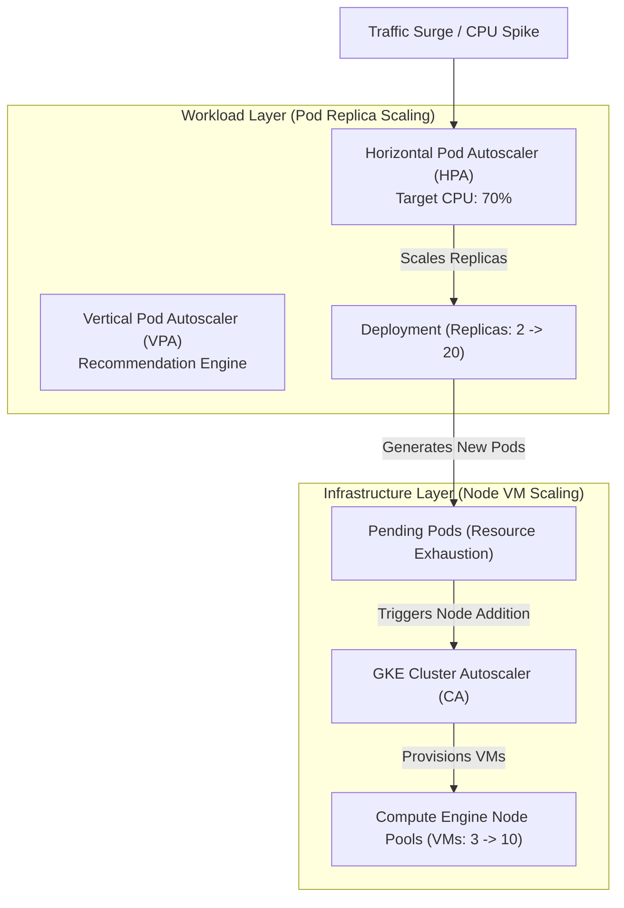

# Topic 73: Autoscaling

---

## 1. What Is It?

**GKE Autoscaling** is a multi-layered automated scaling architecture that dynamically adjusts application Pod replicas and underlying worker VM node capacity in real time based on workload demand.

GKE delivers four distinct autoscaling mechanisms operating across different cluster layers:
1. **Horizontal Pod Autoscaler (HPA)**: Adjusts the number of Pod replicas in a Deployment or StatefulSet based on CPU/Memory metrics or custom Cloud Monitoring metrics (e.g., Pub/Sub queue depth).
2. **Vertical Pod Autoscaler (VPA)**: Automatically analyzes Pod resource utilization over time and recommends or updates container CPU and Memory `requests` and `limits`.
3. **Cluster Autoscaler (CA)**: Adds or removes Compute Engine VM instances in GKE Standard node pools when Pods become un-schedulable (`Pending`) due to resource exhaustion.
4. **GKE Autopilot Auto-Provisioning**: Fully automated node autoscaling and bin-packing managed by Google Cloud (no manual node pool config required).

### Real-World Analogy
Think of GKE Autoscaling like managing an automated taxi fleet:
- **Horizontal Pod Autoscaler (HPA)**: Adding more taxi cars (Pods) to the street when passenger queues grow at the airport.
- **Vertical Pod Autoscaler (VPA)**: Upgrading small 4-cylinder taxi sedans to 8-cylinder minivans (Adjusting Pod CPU/RAM) when families with heavy luggage arrive.
- **Cluster Autoscaler (CA)**: The taxi company opening additional parking garage floors (Worker VM Nodes) to store all the extra taxi cars needed during a major holiday.

---

## 2. Where Does It Fit?

GKE Autoscaling operates across two distinct layers: Pod Workload Scaling (HPA/VPA) and Infrastructure Compute Scaling (Cluster Autoscaler).



---

## 3. Core Concepts

| Autoscaler Component | Scaling Layer | Metric Signals | Action Taken |
|---|---|---|---|
| **Horizontal Pod Autoscaler (HPA)** | Workload | CPU, RAM, Custom Metrics (RPS, Queue Depth) | Scales Pod **replica count** up or down. |
| **Vertical Pod Autoscaler (VPA)** | Workload | Historical CPU/Memory usage | Adjusts Pod **CPU/RAM request sizes**. |
| **Cluster Autoscaler (CA)** | Infrastructure | Un-schedulable `Pending` Pods | Adds/Removes **worker VM nodes** in Node Pools. |
| **Node Auto-Provisioning (NAP)** | Infrastructure | Un-schedulable `Pending` Pods | Dynamically **creates new Node Pools** with required VM shapes. |

---

## 4. How It Works

Coordinated end-to-end autoscaling executes in sequential phases:

```text
Traffic surge hits Deployment -> Average CPU utilization reaches 85% (Target: 60%)
              ↓
HPA calculates required replicas: (Current CPU / Target CPU) * Current Replicas -> Scales from 3 to 15 Pods
              ↓
Worker nodes run out of CPU capacity -> 5 new Pods placed in `Pending` status
              ↓
Cluster Autoscaler detects `Pending` Pods -> Requests Compute Engine to add 2 new VM nodes
              ↓
New VMs boot -> `kubelet` joins cluster -> Kube-Scheduler places `Pending` Pods -> Traffic handled!
              ↓
Traffic drops -> HPA scales Pods down to 3 -> Cluster Autoscaler drains & terminates idle VM nodes
```

1. **HPA Cool-Down Periods**: To prevent thrashing (rapid scale-up followed by immediate scale-down), HPA uses a default 5-minute stabilization window before scaling down Pods.
2. **VPA Modes**: VPA operates in `Off` (recommendations only), `Initial` (applies recommendations on creation), or `Auto` (restarts Pods to apply new CPU/RAM limits).

---

## 5. Production Scenario

### Multi-Tier Autoscaling for E-Commerce Flash Sale

```text
Requirement: Scale a web application fleet from 5 Pods up to 100 Pods during flash sales, while dynamically adding worker VM capacity and optimizing container CPU/RAM requests.
    ↓
Architecture: HPA + Cluster Autoscaler + VPA (Off Mode).
    ↓
HPA Configuration (`hpa.yaml`):
  ```yaml
  apiVersion: autoscaling/v2
  kind: HorizontalPodAutoscaler
  metadata:
    name: web-hpa
  spec:
    scaleTargetRef:
      apiVersion: apps/v1
      kind: Deployment
      name: web-api
    minReplicas: 5
    maxReplicas: 100
    metrics:
    - type: Resource
      resource:
        name: cpu
        target:
          type: Utilization
          averageUtilization: 65
  ```
    ↓
Cluster Autoscaler: Enabled on Node Pool (`--enable-autoscaling --min-nodes=3 --max-nodes=20`).
    ↓
VPA: Configured in `Off` mode to analyze real-world memory usage and output recommendations.
    ↓
Result: Scales from 5 Pods on 3 nodes up to 80 Pods on 12 nodes during flash sale; scales back down post-event.
    ↓
Monitoring: Cloud Monitoring tracking HPA replica count and Cluster Autoscaler scale-down events.
```

*Why Selected*: Combines real-time HPA pod replica scaling with Cluster Autoscaler node provisioning to guarantee immediate capacity during viral traffic bursts.

---

## 6. Hands-On Lab

### Prerequisites
- Active GCP Project with a GKE Cluster running (Metrics Server enabled).
- Cloud Shell or `gcloud` CLI (`kubectl` installed).
- IAM permissions: `roles/container.admin`.

### Console Method
1. Log into [Google Cloud Console](https://console.cloud.google.com/).
2. Navigate to **Kubernetes Engine** → **Workloads** → Select your Deployment.
3. Click **ACTIONS** → Select **Autoscale**.
4. Set Minimum replicas: `2`, Maximum replicas: `10`.
5. Target metric: **CPU utilization** = `60%`.
6. Click **AUTOSCALE** → View the created HPA resource under Workloads.

### CLI Method
Create an HPA resource using `kubectl` and simulate CPU load:

```bash
# Set variables
CLUSTER_NAME="gke-demo-cluster"
REGION="us-central1"

# 1. Connect to GKE cluster
gcloud container clusters get-credentials $CLUSTER_NAME --region=$REGION

# 2. Deploy a web workload specifying resource requests
kubectl create deployment php-apache --image=registry.k8s.io/hpa-example --replicas=2
kubectl set resources deployment php-apache --requests=cpu=200m,memory=256Mi

# 3. Create an HPA targeting 50% CPU utilization
kubectl autoscale deployment php-apache --cpu-percent=50 --min=2 --max=10

# 4. View HPA status and current CPU utilization
kubectl get hpa php-apache --watch
```

### Verification
*Expected Result*: `kubectl get hpa` displays `TARGETS` showing current CPU % vs target 50% and `REPLICAS: 2`.

### Cleanup
Delete HPA and deployment:

```bash
kubectl delete hpa php-apache
kubectl delete deployment php-apache
```

---

## 7. Security

### Safeguards for Automated Autoscaling
- **Max Replicas Hard Floors**: Always define a strict `maxReplicas` ceiling in HPA manifests (e.g., max 50 replicas) to prevent runaway billing charges during DDoS attacks.
- **Node Pool Autoscaling Ceilings**: Set strict `--max-nodes` limits on GKE Node Pools to prevent un-capped VM node creation.
- **Isolate VPA and HPA**: Do NOT run HPA and VPA simultaneously on the *exact same resource metric* (CPU/Memory) on the same workload; they will conflict and cause unstable scaling loops.

```text
BAD PRACTICE:
Setting HPA `maxReplicas: 1000` without setting Cluster Autoscaler `--max-nodes` limits or budget caps.
Risk: A sudden Layer 7 HTTP DDoS attack scales out thousands of Pods and dozens of VM nodes, generating massive, uncontrolled cloud bills.

PRODUCTION PRACTICE:
Set realistic `maxReplicas` ceilings on HPA resources. Pair with Cloud Monitoring budget alerts and Cloud Armor WAF protection.
```

---

## 8. Scaling & High Availability

Preventing Scale-Down Flapping:

```text
HPA Scale-Up (Triggers instantly when CPU > 65%)
   ↓ (Stabilization Window Safeguard)
HPA Scale-Down (Waits 5 minutes before reducing replica count -> Prevents Flapping)
```

- **PodDisruptionBudget (PDB)**: When Cluster Autoscaler drains and terminates nodes during scale-down, it respects active `PodDisruptionBudget` manifests, ensuring zero application downtime.

---

## 9. Cost

### FinOps Economics of GKE Autoscaling
- **$0 Autoscaler Cost**: HPA, VPA, and Cluster Autoscaler software engines are provided 100% **FREE** by GCP.
- **Significant Infrastructure Reductions**: Scale-down rules reduce compute node infrastructure costs by 50% to 80% during off-peak night and weekend hours.
- **GKE Autopilot Savings**: In GKE Autopilot, Google handles node packing automatically; HPA scaling adjusts your exact billable Pod requests in real time.

---

## 10. Monitoring & Troubleshooting

### Autoscaling Observability Tools
- **Cloud Monitoring HPA Metrics**: Track `kubernetes.io/autoscaler/hpa/current_ss_capacity` and `replica_count`.
- **Cluster Autoscaler Event Logs**: View scale-up and scale-down decisions under Cloud Logging filter `resource.type="k8s_cluster"`.

### Troubleshooting Matrix

| Symptom | Possible Cause | What to Check | Fix |
|---|---|---|---|
| HPA displays `<unknown>` for CPU metric | Missing `resources.requests.cpu` in PodSpec or Metrics Server down | `kubectl get hpa` & PodSpec | Add explicit `resources.requests.cpu` to container PodSpec. |
| Pods stuck in `Pending`, Cluster Autoscaler not adding nodes | Node Pool reached `--max-nodes` limit or quota exceeded | Cluster Autoscaler logs | Increase `--max-nodes` on Node Pool or request GCP vCPU quota increase. |
| VPA and HPA fighting / scaling uncontrollably | Both HPA and VPA enabled on CPU metric for same Deployment | Deployment YAML manifests | Configure VPA to scale Memory while HPA scales CPU (or set VPA mode to `Off`). |

---

## 11. Common Mistakes

```text
Mistake: Omitting `resources.requests.cpu` from Deployment container specifications when configuring an HPA.
Why: Assuming HPA can calculate CPU percentage without knowing baseline requested CPU.
Impact: HPA fails to function, displaying `<unknown>` for current CPU utilization metrics.
Correct approach: Always define explicit `resources.requests.cpu` in container specs when using CPU-based HPA.

Mistake: Enabling both HPA and VPA on CPU metrics for the exact same Deployment.
Why: Attempting to combine horizontal and vertical scaling simultaneously.
Impact: Creates unstable scaling feedback loops; HPA adds Pods while VPA increases CPU requests, resulting in erratic behavior.
Correct approach: Use HPA for CPU/RPS horizontal scaling; use VPA in `Off` mode for resource recommendations.
```

---

## 12. Production Best Practices

- [ ] Define explicit **`resources.requests`** (CPU, Memory) on all Pod containers.
- [ ] Use **Horizontal Pod Autoscaler (HPA)** for stateless web application scaling.
- [ ] Set realistic **`maxReplicas`** and **`--max-nodes`** ceilings to prevent runaway billing.
- [ ] Configure **VPA in `Off` mode** to receive CPU/Memory sizing recommendations without unexpected Pod restarts.
- [ ] Define **PodDisruptionBudgets (PDBs)** to protect workload availability during Cluster Autoscaler scale-down.
- [ ] Automate all HPA, VPA, and Cluster Autoscaler policies using Infrastructure as Code (Terraform/Helm).

---

## 13. Hyperscaler / Enterprise Perspective

```text
Personal / Learning
  No HPA → Static Replicas → No Cluster Autoscaler → Fixed Node Counts
        ↓
Small Production
  CPU-based HPA → Cluster Autoscaler enabled → Basic Min/Max limits
        ↓
Enterprise Environment
  Custom Metric HPA (Pub/Sub Queue Depth / RPS) → VPA Recommendation Engine → PodDisruptionBudgets
        ↓
Hyperscaler Environment
  100% Automated Multi-Metric HPA → GKE Autopilot Pod Auto-Scaling → Real-time FinOps Billing Attribution
```

In a hyperscaler environment, enterprise platforms scale Pods based on **Custom Metrics** (such as Cloud Pub/Sub queue depth or HTTP requests per second) using KEDA (Kubernetes Event-driven Autoscaling). In GKE Autopilot, Pod autoscaling directly expands or contracts the organization's cloud compute bill in real time, while automated VPA engines continuously analyze petabyte workloads to right-size CPU/RAM requests.

---

## 14. Real Project Questions

### Q1: What is the primary functional difference between the Horizontal Pod Autoscaler (HPA) and the Vertical Pod Autoscaler (VPA)?
**Answer:** The **Horizontal Pod Autoscaler (HPA)** scales workloads horizontally by increasing or decreasing the number of **Pod replicas** (e.g., scaling from 2 to 10 Pods). The **Vertical Pod Autoscaler (VPA)** scales workloads vertically by adjusting the **CPU and Memory resource requests/limits** assigned to individual containers (e.g., increasing container RAM from 512MB to 2GB).

### Q2: How does the GKE Cluster Autoscaler interact with the Horizontal Pod Autoscaler (HPA)?
**Answer:** The HPA operates at the workload layer, adding Pod replicas when CPU/RPS metrics spike. If the worker nodes run out of CPU/memory capacity to host these new Pods, the Pods enter a `Pending` state. The **Cluster Autoscaler** detects these `Pending` Pods at the infrastructure layer and automatically provisions new Compute Engine VM instances in the Node Pool to host them.

### Q3: Why should engineers avoid running HPA and VPA simultaneously on the exact same metric (e.g., CPU)?
**Answer:** Running HPA and VPA simultaneously on the same metric creates unstable **scaling feedback loops**. For example, when CPU spikes, HPA attempts to add more Pod replicas while VPA attempts to increase CPU requests on existing Pods. This causes conflicting calculations, resource over-provisioning, and unexpected Pod restarts.

---

## 15. Quick Decision Guide

| Requirement | Recommended Approach | Reason |
|---|---|---|
| Scaling a stateless web API fleet in response to real-time HTTP traffic surges | **Horizontal Pod Autoscaler (HPA)** | Dynamically expands Pod replica count based on CPU or RPS utilization. |
| Scaling a background worker fleet based on unacknowledged messages in a Pub/Sub queue | **HPA with Custom Cloud Monitoring Metric (KEDA)** | Scales Pod replicas directly based on queue depth rather than CPU. |
| Identifying whether container CPU and Memory requests are over-provisioned | **Vertical Pod Autoscaler (VPA in `Off` Mode)** | Analyzes historical usage and provides right-sizing recommendations without restarting Pods. |

### When should I use it?
- Essential feature for automating application performance, high availability, and infrastructure cost optimization in GKE.

### When should I NOT use it?
- Do not use HPA without setting explicit `maxReplicas` limits or CPU resource requests.

---

## 16. Related Services

```text
                  [73. Autoscaling]
                 /        |        \
        Horizontal Pod   Vertical Pod  Cluster Autoscaler
         Autoscaler      Autoscaler       (Node Pools)
            |                 |                |
        Pod Replicas     CPU / RAM         Worker VM
         (Count)         (Requests)        Capacity
```

- **Metrics Server**: In-cluster agent providing CPU/RAM telemetry to HPA.
- **Cloud Monitoring**: Streams custom application metrics (RPS, Queue depth) to HPA.
- **Compute Engine Node Pools**: Provisioned dynamically by the Cluster Autoscaler.

---

## 17. Cheat Sheet

### Scaling Layers
- **HPA**: Workload layer (Scales Pod replica count).
- **VPA**: Workload layer (Adjusts Pod CPU/RAM requests).
- **Cluster Autoscaler**: Infrastructure layer (Adds/Removes VM nodes).
- **Metric Requirement**: `resources.requests` MUST be defined for HPA.

### Useful Commands
```bash
# Autoscale a deployment based on CPU utilization
kubectl autoscale deployment DEPLOYMENT_NAME --cpu-percent=60 --min=2 --max=10

# Inspect HPA status and current metrics
kubectl get hpa

# View VPA resource recommendations
kubectl get vpa
```

---

## 18. Learning Connection

- **Previous Topic**: [72. GKE Security](../72-gke-security/README.md)
- **Next Topic**: [74. Multi-cluster GKE](../74-multi-cluster-gke/README.md)
