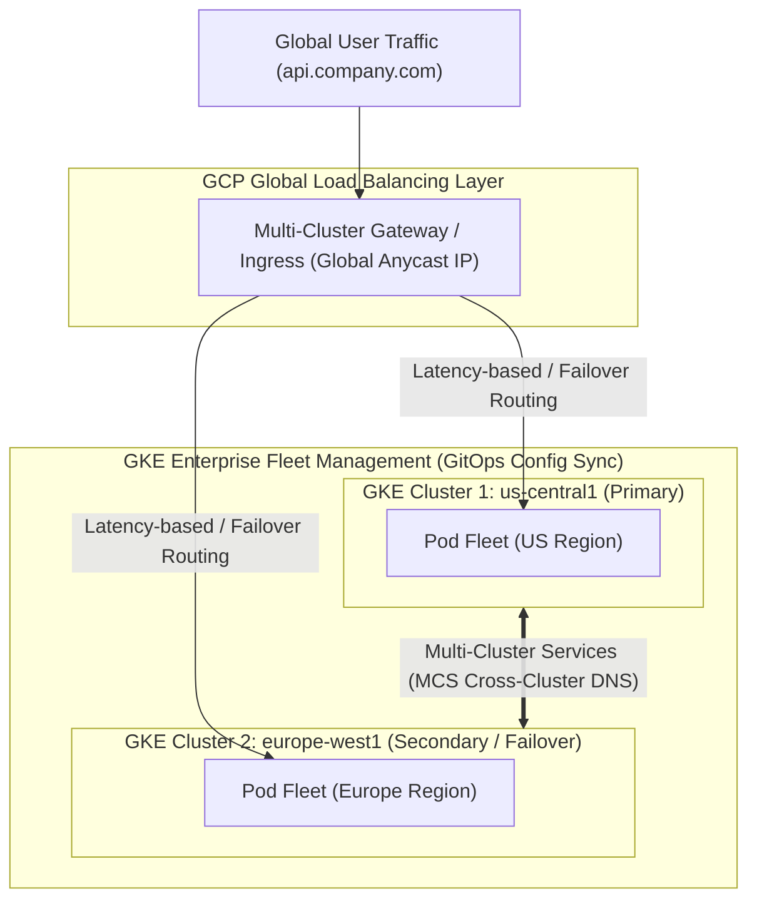

# Topic 74: Multi-cluster GKE

---

## 1. What Is It?

**Multi-cluster GKE** is an enterprise architecture pattern and operational framework that manages, routes, secures, and synchronizes containerized workloads deployed across multiple distinct Google Kubernetes Engine clusters spanning multiple GCP regions or hybrid/multi-cloud environments.

Single GKE clusters (even Regional clusters) are bounded by regional availability limits, Blast Radius security concerns, and single-cluster resource ceilings.

Multi-cluster GKE solves these constraints using three core GCP technologies:
1. **Multi-Cluster Gateway & Ingress (MCI)**: Deploys a global GCP Application Load Balancer that routes incoming HTTP(S) traffic across Pods running in multiple GKE clusters in North America, Europe, and Asia.
2. **Multi-Cluster Services (MCS)**: Enables cross-cluster service discovery and pod-to-pod communication over internal DNS across independent GKE clusters.
3. **GKE Enterprise (Anthos Fleets)**: Groups multiple GKE clusters into a logical **Fleet**, enabling centralized GitOps configuration management (Config Sync) and unified Service Mesh policies (Anthos Service Mesh).

### Real-World Analogy
Think of Multi-Cluster GKE like a multinational banking network operating independent regional headquarters in New York, London, and Tokyo. Each regional office (GKE Cluster) operates its own independent power generators, computer servers, and local staff (Fault Domain Isolation). A central global switchboard (Multi-Cluster Gateway) routes incoming international customers to whichever regional office is closest or has open teller windows, while internal pneumatic tubes (Multi-Cluster Services) transfer inter-office documents securely between New York and London.

---

## 2. Where Does It Fit?

Multi-cluster GKE orchestrates global traffic routing, cross-cluster networking, and fleet-wide GitOps policy synchronization across multiple GKE clusters.



---

## 3. Core Concepts

| Technology | Layer | Purpose / Function | Best Practice |
|---|---|---|---|
| **Anthos Fleet** | Governance | Logical grouping of GKE clusters for unified management. | Register all production GKE clusters into a single Fleet. |
| **Multi-Cluster Gateway** | Global L7 Ingress | Routes HTTPS traffic across clusters via Global Anycast LB. | Standard for global multi-region active-active web APIs. |
| **Multi-Cluster Services (MCS)** | L3/L4 Network | Cross-cluster service discovery (`svc.clusterset.local`). | Use for private inter-cluster pod communication across regions. |
| **Config Sync** | GitOps | Synchronizes Kubernetes manifests from Git to all fleet clusters. | Enforce central security policies across 50+ clusters. |
| **Service Mesh (ASM)** | L7 Mesh | Multi-cluster mTLS encryption, telemetry, and traffic control. | Secure cross-cluster microservice communications. |

---

## 4. How It Works

Global active-active traffic routing using Multi-Cluster Gateway:

```text
User in London sends HTTPS request to `api.company.com`
              ↓
GCP Anycast IP routes request to nearest Google Edge Point of Presence (PoP)
              ↓
Multi-Cluster Gateway checks health & latency of registered clusters:
  - Cluster 1 (us-central1): Healthy (Latency 110ms)
  - Cluster 2 (europe-west1): Healthy (Latency 12ms)
              ↓
Gateway routes request to Cluster 2 (europe-west1) Pod IP!
              ↓
(Disaster Recovery Outage): Cluster 2 fails -> Gateway shifts 100% of global traffic to Cluster 1 in <30s!
```

1. **Clusterset Namespace Sameness**: Clusters registered in a Fleet observe "Namespace Sameness"—a Service in the `payment` namespace in Cluster 1 automatically maps to the `payment` namespace in Cluster 2.
2. **Config Sync Reconciliation**: Config Sync periodically pulls Kubernetes manifests from a central Git repository, applying updates simultaneously across all Fleet clusters.

---

## 5. Production Scenario

### Global Active-Active E-Commerce Engine with Regional Failover

```text
Requirement: Build a global e-commerce API platform spanning North America and Europe, delivering sub-50ms latency to regional users with zero-downtime regional failover capability.
    ↓
Architecture: Dual GKE Regional Clusters (`gke-us`, `gke-eu`) + Multi-Cluster Gateway + Config Sync.
    ↓
Setup Steps:
  1. Create Cluster 1 (`us-central1`) and Cluster 2 (`europe-west1`).
  2. Register both clusters into an **Anthos Fleet**: `gcloud container fleet memberships register`.
  3. Deploy **Multi-Cluster Gateway** (`gateway.networking.k8s.io/v1`).
  4. Create `HTTPRoute` mapping `api.company.com` to `ServiceImport` backends in both clusters.
    ↓
Config Sync: Central Git repository enforces `PodSecurity: restricted` and NetworkPolicies across both clusters.
    ↓
Disaster Recovery Impact: If an entire US region experiences a datacenter outage, GCP Anycast automatically routes 100% of global traffic to the European cluster within seconds.
    ↓
Monitoring: Cloud Monitoring tracking global p99 backend latency and fleet membership status.
```

*Why Selected*: Combines global active-active traffic distribution with automated regional failover and centralized GitOps fleet management.

---

## 6. Hands-On Lab

### Prerequisites
- Active GCP Project with GKE, Anthos Fleet, and Multi-Cluster Services APIs enabled.
- Cloud Shell or `gcloud` CLI (`kubectl` installed).
- IAM permissions: `roles/container.admin` and `roles/gkehub.admin`.

### Console Method
1. Log into [Google Cloud Console](https://console.cloud.google.com/).
2. Navigate to **Kubernetes Engine** → **Fleet Management**.
3. View the **Fleet Overview** dashboard displaying registered cluster memberships.
4. Click **REGISTER CLUSTER** → Select existing GKE clusters in `us-central1` and `europe-west1`.
5. Navigate to **Multi-cluster features** → Inspect **Multi-Cluster Services** and **Config Sync** status.

### CLI Method
Register two GKE clusters into an Anthos Fleet and enable Multi-Cluster Services using `gcloud`:

```bash
# Set variables
PROJECT_ID="your-gcp-project-id"
CLUSTER_US="gke-us"
CLUSTER_EU="gke-eu"

# 1. Register US and EU clusters to the Anthos Fleet
gcloud container fleet memberships register $CLUSTER_US \
    --gke-cluster=us-central1/$CLUSTER_US \
    --enable-workload-identity

gcloud container fleet memberships register $CLUSTER_EU \
    --gke-cluster=europe-west1/$CLUSTER_EU \
    --enable-workload-identity

# 2. Enable Multi-Cluster Services (MCS) on the Fleet
gcloud container fleet multi-cluster-services enable

# 3. Grant MCS IAM permissions across cluster projects
gcloud projects add-iam-policy-binding $PROJECT_ID \
    --member="serviceAccount:${PROJECT_ID}.svc.id.goog[gke-mcs/gke-mcs-importer]" \
    --role="roles/compute.networkViewer"

# 4. List Fleet memberships
gcloud container fleet memberships list
```

### Verification
*Expected Result*: Output displays both `gke-us` and `gke-eu` registered as active members of the Fleet.

### Cleanup
Unregister clusters from Fleet:

```bash
gcloud container fleet memberships unregister $CLUSTER_US --gke-cluster=us-central1/$CLUSTER_US --quiet
gcloud container fleet memberships unregister $CLUSTER_EU --gke-cluster=europe-west1/$CLUSTER_EU --quiet
```

---

## 7. Security

### Multi-Cluster Security & Governance
- **Blast Radius Reduction**: Spreading workloads across multiple GKE clusters isolates security incidents; a cluster breach in Region A does not compromise Region B.
- **Fleet-Wide GitOps Policy Enforcement**: Use Config Sync or Policy Controller (OPA Gatekeeper) to enforce RBAC and security policies uniformly across 100% of fleet clusters.
- **Multi-Cluster mTLS Encryption**: Deploy Anthos Service Mesh (ASM) to enforce mutual TLS (mTLS) encryption on all cross-cluster pod-to-pod communications.

```text
BAD PRACTICE:
Managing 20 independent GKE clusters with ad-hoc manual `kubectl` commands without a central Fleet or GitOps controller.
Risk: Security policy drift; clusters develop inconsistent RBAC, firewall rules, and container vulnerabilities.

PRODUCTION PRACTICE:
Register all clusters into an Anthos Fleet. Use **Config Sync** to enforce immutable declarative security manifests from Git.
```

---

## 8. Scaling & High Availability

Multi-Cluster High Availability SLAs:

```text
Single Regional GKE Cluster (99.95% Availability SLA -> Vulnerable to regional GCP outages)
   ↓ (Multi-Cluster Global Active-Active Upgrade)
Multi-Cluster Multi-Region GKE Fleet (99.999% SLA -> Zero downtime during total regional datacenter disasters)
```

- **Global Anycast Resiliency**: Multi-Cluster Gateway uses GCP Anycast IP routing to continuously health-check clusters, instantly shunting traffic away from unhealthy regions.

---

## 9. Cost

### Multi-Cluster Financial Architecture
- **GKE Control Plane Charges**: Standard GKE control plane fee ($0.10/hour per cluster) applies to each cluster in the fleet.
- **GKE Enterprise (Anthos) Pricing**: Charged per vCPU hour across managed fleet nodes (or pay-as-you-go per vCPU for advanced features like Config Sync and ASM).
- **Cross-Region Network Egress**: Cross-cluster pod communication over Multi-Cluster Services between `us-central1` and `europe-west1` incurs standard cross-region egress charges (~$0.02 to $0.08/GB).

---

## 10. Monitoring & Troubleshooting

### Multi-Cluster Observability Tools
- **Anthos Service Mesh Dashboard**: Unified topology map displaying cross-cluster traffic latency, error rates, and mTLS status.
- **Config Sync Status**: Use `nomos status` CLI to verify GitOps synchronization across all fleet clusters.

### Troubleshooting Matrix

| Symptom | Possible Cause | What to Check | Fix |
|---|---|---|---|
| Cross-cluster DNS (`svc.clusterset.local`) fails | Multi-Cluster Services (MCS) CRDs or `ServiceExport` missing | `kubectl get serviceexport` | Apply `ServiceExport` manifest in source cluster to export service to fleet. |
| Multi-Cluster Gateway traffic not reaching secondary region | Target cluster health check failing or missing `ServiceImport` | Gateway HTTPRoute status | Verify backend Pod readiness probes and `ServiceImport` bindings. |
| Config Sync status shows `Error` | Invalid YAML manifest or missing RBAC in Git repository | `nomos status` or Cloud Logging | Inspect Config Sync log errors and fix non-compliant manifest in Git. |

---

## 11. Common Mistakes

```text
Mistake: Attempting to connect two independent GKE clusters over internal network IPs without establishing an Anthos Fleet or Shared VPC.
Why: Assuming Kubernetes clusters can automatically route private traffic without network peering or MCS.
Impact: Pod-to-pod cross-cluster network traffic drops silently due to overlapping IP ranges or un-routed subnets.
Correct approach: Register clusters in an **Anthos Fleet** and use **Multi-Cluster Services (MCS)**.

Mistake: Manually editing Kubernetes manifests (`kubectl edit`) on individual clusters in a multi-cluster Fleet.
Why: Taking shortcuts during operational troubleshooting.
Impact: Configuration drift; central GitOps controllers overwrite manual edits during the next sync loop.
Correct approach: Commit all configuration updates directly to the central GitOps repository.
```

---

## 12. Production Best Practices

- [ ] Register all production GKE clusters into a centralized **Anthos Fleet**.
- [ ] Use **Multi-Cluster Gateway** for global active-active HTTP(S) traffic distribution and failover.
- [ ] Use **Multi-Cluster Services (MCS)** for private cross-cluster pod-to-pod communication (`.clusterset.local`).
- [ ] Enforce declarative security policies across all clusters using **Config Sync** (GitOps).
- [ ] Implement **Anthos Service Mesh (ASM)** for cross-cluster mTLS encryption and telemetry.
- [ ] Automate cluster registration and Fleet feature activation using Infrastructure as Code (Terraform).

---

## 13. Hyperscaler / Enterprise Perspective

```text
Personal / Learning
  Single Zonal Cluster → Manual `kubectl` management → Local cluster scope
        ↓
Small Production
  Single Regional Cluster → Basic Ingress → Manual multi-region setups
        ↓
Enterprise Environment
  Dual Regional Clusters → Multi-Cluster Gateway → Anthos Fleet Membership
        ↓
Hyperscaler Environment
  Global Multi-Cluster Fleet Architecture → 100% GitOps Management (Config Sync) → Automated Regional Disaster Recovery Drills
```

In a hyperscaler environment, multi-cluster architectures are standard operating procedure. Global enterprises run dozens of GKE clusters across North America, Europe, and Asia. Central platform engineering teams enforce unified security policies using **Config Sync**, while SRE teams conduct unannounced regional chaos drills—draining an entire GCP region to validate that **Multi-Cluster Gateway** seamlessly shifts millions of concurrent users to secondary regions without dropping a single HTTP transaction.

---

## 14. Real Project Questions

### Q1: What is an Anthos Fleet in Google Cloud, and why is it essential for multi-cluster management?
**Answer:** An **Anthos Fleet** is a logical grouping of GKE clusters (across regions or multi-cloud environments) that enforces unified management, security, and networking. Fleets introduce the concept of "Namespace Sameness"—guaranteeing that namespaces, services, and IAM identities with the same name across different clusters are treated as identical entities, enabling seamless cross-cluster service discovery (MCS) and GitOps policy synchronization (Config Sync).

### Q2: How does Multi-Cluster Services (MCS) enable cross-cluster communication in GKE?
**Answer:** **Multi-Cluster Services (MCS)** allows Pods in one GKE cluster to discover and communicate with Pods in another GKE cluster using standard internal DNS. By applying a `ServiceExport` manifest to a local Service, MCS exports the service endpoint to the Fleet, making it resolveable across all registered clusters via the specialized domain `service-name.namespace.svc.clusterset.local`.

### Q3: What is the primary difference between standard GKE Ingress and Multi-Cluster Gateway?
**Answer:** Standard **GKE Ingress** manages Layer 7 load balancing for a **single** GKE cluster. **Multi-Cluster Gateway** manages a global GCP Application Load Balancer that routes traffic across **multiple GKE clusters** globally, providing Anycast-based active-active routing, latency optimization, and automated cross-region disaster recovery failover.

---

## 15. Quick Decision Guide

| Requirement | Recommended Approach | Reason |
|---|---|---|
| Global active-active HTTPS web platform spanning US and Europe with regional failover | **Multi-Cluster Gateway (MCI)** | Routes traffic globally via Anycast LB across multiple GKE clusters. |
| Private cross-cluster pod-to-pod RPC communication between US and EU clusters | **Multi-Cluster Services (MCS)** | Provides cross-cluster DNS discovery (`svc.clusterset.local`) over internal network. |
| Synchronizing RBAC and security policies across 30 GKE clusters automatically | **Anthos Fleet + Config Sync (GitOps)** | Automatically pulls and enforces Kubernetes manifests from Git across all fleet clusters. |

### When should I use it?
- Essential architectural pattern for global high availability, regional disaster recovery, and multi-cluster enterprise governance in GKE.

### When should I NOT use it?
- Do not deploy multi-cluster architectures for simple single-region applications where a single Regional GKE cluster provides sufficient availability.

---

## 16. Related Services

```text
               [74. Multi-cluster GKE]
              /          |          \
      Anthos Fleet   Multi-Cluster   Config Sync
      (Governance)   Gateway / MCS    (GitOps)
           |             |               |
       Cluster       Global Traffic   Git State
      Grouping        & DNS Routing   Syncing
```

- **Anthos Fleet**: Central logical container grouping for multi-cluster management.
- **Multi-Cluster Gateway**: Global Layer 7 load balancing across multiple GKE clusters.
- **Config Sync**: GitOps engine synchronizing manifests from Git across Fleet clusters.

---

## 17. Cheat Sheet

### Core Concepts
- **Fleet**: Logical grouping of GKE clusters.
- **Namespace Sameness**: Namespaces with the same name across clusters are treated as identical.
- **MCS DNS Domain**: `service-name.namespace.svc.clusterset.local`.
- **ServiceExport**: Manifest used to export a local service to the Fleet.

### Useful Commands
```bash
# Register a cluster to an Anthos Fleet
gcloud container fleet memberships register CLUSTER_NAME \
    --gke-cluster=REGION/CLUSTER_NAME --enable-workload-identity

# Enable Multi-Cluster Services on a Fleet
gcloud container fleet multi-cluster-services enable

# List registered Fleet memberships
gcloud container fleet memberships list
```

---

## 18. Learning Connection

- **Previous Topic**: [73. Autoscaling](../73-autoscaling/README.md)
- **Next Topic**: [75. Cloud Functions Overview](../../07-serverless-architecture/75-cloud-functions-overview/README.md)
