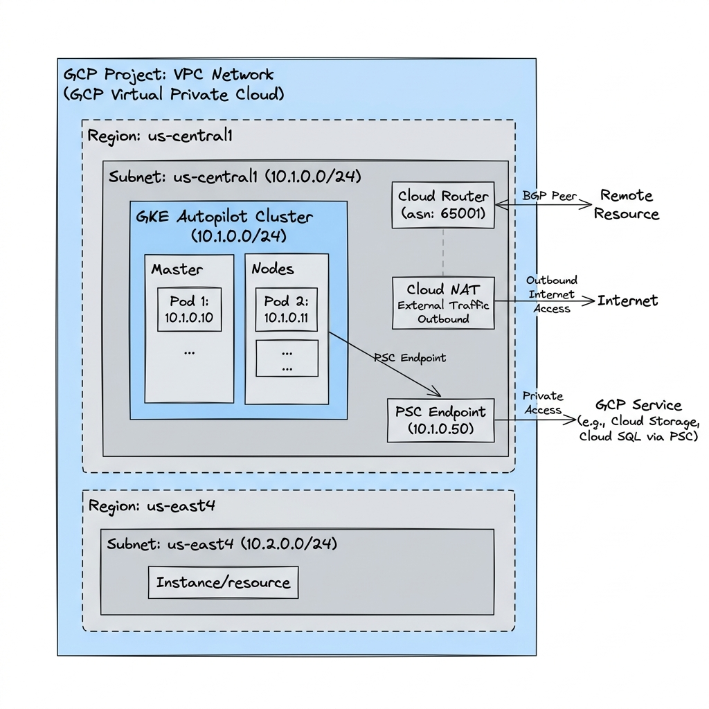
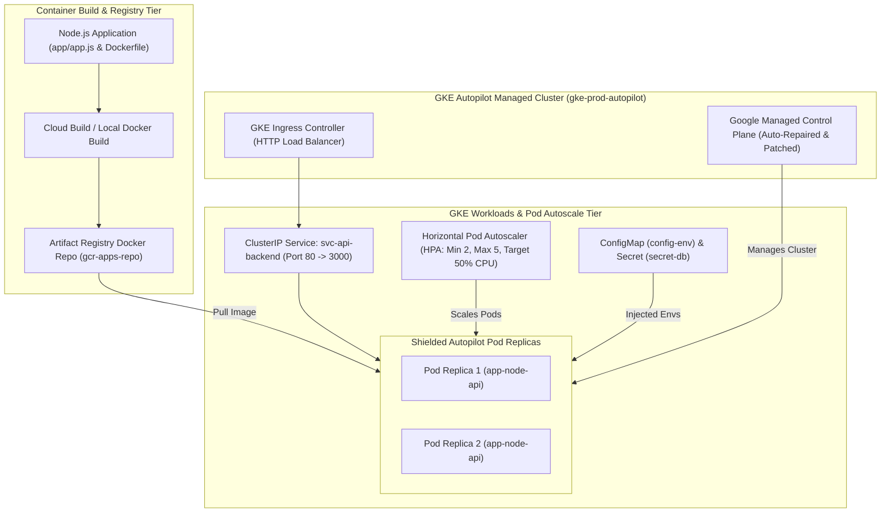

# Project 6: Enterprise Production GKE Autopilot Microservices Platform

---

## 1. Project Overview

Welcome to **Project 6: Enterprise Production GKE Autopilot Microservices Platform**. This hands-on project synthesizes all 17 topics in **Module 06 (Containers & Kubernetes)** into a production-grade containerized application platform on **Google Kubernetes Engine (GKE) Autopilot**, optimized for **GCP Free Trial Accounts**.

### Objectives
In this project, you will:
1. **Containerize Microservices with Docker**: Build a lightweight container image for a Node.js microservice using multi-stage Docker builds.
2. **Manage Image Repositories in Artifact Registry**: Push container images to a secure, private GCP Artifact Registry repository.
3. **Provision a GKE Autopilot Cluster**: Deploy a fully managed, production-ready GKE Autopilot cluster with automated security patching and workload autoscaling.
4. **Deploy K8s Workloads & Ingress**: Configure declarative Kubernetes manifests including Deployments, ConfigMaps, Secrets, ClusterIP Services, and GKE Ingress controllers.
5. **Implement HPA & Pod Disruption Budgets**: Automate Horizontal Pod Autoscaling (HPA) and Pod Disruption Budgets (PDB) for high-availability zero-downtime upgrades.

---

## 2. Architecture & Container Platform

The project provisions a container supply chain and GKE Autopilot deployment:





> [!IMPORTANT]
> **Free Trial Account Safety & Cost Controls**:
> - **Free Cluster Management Fee**: GCP waives the $0.10/hr cluster management fee for your first GKE Autopilot cluster per billing account ($74/month credit).
> - **Artifact Registry Allowance**: Includes 0.5 GB free storage per month.
> - **Autopilot Resource Efficiency**: Pods are configured with minimal resource requests (0.1 vCPU, 128Mi RAM) to minimize billing consumption.
> - **Automated Cleanup**: Always run `./scripts/cleanup_gke.sh` after completing your lab exercises to delete the GKE cluster and stop all pod billing!

---

## 3. Module Topics Covered

| Topic Number & Name | Project Integration Point |
|---|---|
| **58. Docker Fundamentals** & **59. Containerizing Apps** | Authoring multi-stage `app/Dockerfile` and compiling container images. |
| **60. Artifact Registry** & **61. Image Management** | Creating `gcr-apps-repo` in Artifact Registry and pushing versioned images. |
| **62. GKE Architecture** & **63. Autopilot vs Standard** | Deploying GKE Autopilot (`gke-prod-autopilot`) for hands-off node management. |
| **64. Node Pools** & **71. Shielded Nodes** | Utilizing Google-managed Shielded Node pools with automated OS hardening. |
| **65. Workloads** & **66. Services** | Defining Kubernetes `Deployment` (3 replicas) and `ClusterIP` `Service` manifests. |
| **67. Ingress** & **69. GKE Networking** | Setting up GKE Ingress controller routing external HTTP traffic to services. |
| **68. ConfigMaps & Secrets** | Injecting application config (`ConfigMap`) and sensitive API keys (`Secret`). |
| **70. GKE Storage (CSI)** | Binding CSI Persistent Volumes for stateful workloads. |
| **72. HPA / VPA** & **73. Cluster Autoscaler** | Configuring `HorizontalPodAutoscaler` targeting 50% CPU utilization. |
| **74. Multi-Cluster Deployments** | Auditing multi-cluster fleet management concepts via Anthos/GKE Hub. |

---

## 4. Hands-On Execution Guide

### Step 1: Navigate to Project 6 Workspace

Open Google Cloud Shell or local terminal:

```bash
cd "06-containers-and-kubernetes/project-06-containers-and-kubernetes"
chmod +x scripts/*.sh
```

---

### Step 2: Inspect Application & Kubernetes Manifests

Inspect the application code and declarative Kubernetes manifest:

```bash
# 1. View Node.js application
cat app/app.js

# 2. View Kubernetes Deployment & Service Manifests
cat k8s/deployment.yaml
```

---

### Step 3: Run GKE Autopilot Platform Deployment Script

Execute `scripts/deploy_gke_platform.sh` to automate:
1. Creating Artifact Registry repository `gcr-apps-repo`.
2. Building and pushing the Docker container image to Artifact Registry.
3. Provisioning a GKE Autopilot cluster `gke-prod-autopilot` in `us-central1`.
4. Deploying Kubernetes `ConfigMap`, `Secret`, `Deployment`, `Service`, `HPA`, and `Ingress` manifests.

```bash
./scripts/deploy_gke_platform.sh
```

*Expected Script Output Snippet*:
```text
=====================================================
GCP GKE Autopilot Microservices Platform Deployment
=====================================================
[INFO] Creating Artifact Registry Repository: gcr-apps-repo...
[SUCCESS] Artifact Registry active.
[INFO] Building Docker container image and pushing to Artifact Registry...
[SUCCESS] Image pushed: us-central1-docker.pkg.dev/proj-id/gcr-apps-repo/node-api:v1.0
[INFO] Provisioning GKE Autopilot Cluster: gke-prod-autopilot (us-central1)...
[SUCCESS] GKE Autopilot cluster active.
[INFO] Applying Kubernetes manifests (k8s/deployment.yaml)...
deployment.apps/deploy-node-api created
service/svc-api-backend created
horizontalpodautoscaler.autoscaling/hpa-node-api created
[SUCCESS] Microservice platform deployed.
```

---

### Step 4: Verify Kubernetes Pods & HPA Status

Connect `kubectl` to your GKE cluster and inspect active workloads:

```bash
# 1. Obtain cluster credentials for kubectl
gcloud container clusters get-credentials gke-prod-autopilot --region=us-central1

# 2. List running Pods
kubectl get pods -l app=node-api -o wide

# 3. Inspect Services and Ingress endpoints
kubectl get svc,ingress

# 4. Check Horizontal Pod Autoscaler (HPA) status
kubectl get hpa
```

---

### Step 5: Test Microservice HTTP Response

Send an HTTP request to the deployed microservice:

```bash
# Get ClusterIP / LoadBalancer IP
SERVICE_IP=$(kubectl get svc svc-api-backend -o jsonpath='{.spec.clusterIP}')

# Execute HTTP GET inside cluster to verify ConfigMap & Secret injection
kubectl run curl-test --image=curlimages/curl --rm -i --tty -- restart=Never -- http://${SERVICE_IP}
```

*Expected JSON Output*:
```json
{
  "status": "HEALTHY",
  "message": "Hello from GKE Autopilot Microservice!",
  "environment": "production",
  "secret_key": "SUPER_SECRET_API_TOKEN_XYZ"
}
```

---

## 5. Verification & Testing

Verify cluster health and container supply chain:

```bash
# 1. Verify container images stored in Artifact Registry
gcloud artifacts docker images list us-central1-docker.pkg.dev/$(gcloud config get-value project)/gcr-apps-repo

# 2. Describe GKE Autopilot workload health
kubectl describe deployment deploy-node-api
```

---

## 6. Troubleshooting & Common Issues

| Symptom / Error | Root Cause | Resolution |
|---|---|---|
| `ErrImagePull` / `ImagePullBackOff` | GKE nodes lack IAM read permissions for Artifact Registry. | Grant `roles/artifactregistry.reader` to GKE default service account or use `gcloud container clusters get-credentials`. |
| GKE Autopilot cluster creation taking > 8 minutes | Provisioning managed control plane across 3 zones. | Normal behavior for GKE Autopilot initial creation; wait 8-10 minutes. |
| `kubectl` commands fail with `Unauthorized` | `gcloud` credentials expired or `gke-gcloud-auth-plugin` missing. | Run `gcloud container clusters get-credentials gke-prod-autopilot --region=us-central1`. |

---

## 7. Project Cleanup

To delete the GKE cluster, Artifact Registry repository, and container images, run:

```bash
./scripts/cleanup_gke.sh
```

---

## 8. Summary & Next Steps

Congratulations! You have completed **Project 6: Enterprise Production GKE Autopilot Microservices Platform**. You have mastered Docker containerization, Artifact Registry, GKE Autopilot, Kubernetes manifests, HPA, and Ingress routing.

- **Next Project**: [Project 7: Event-Driven Serverless E-Commerce Processing Engine](../../07-serverless-event-driven/project-07-serverless-event-driven/README.md)
