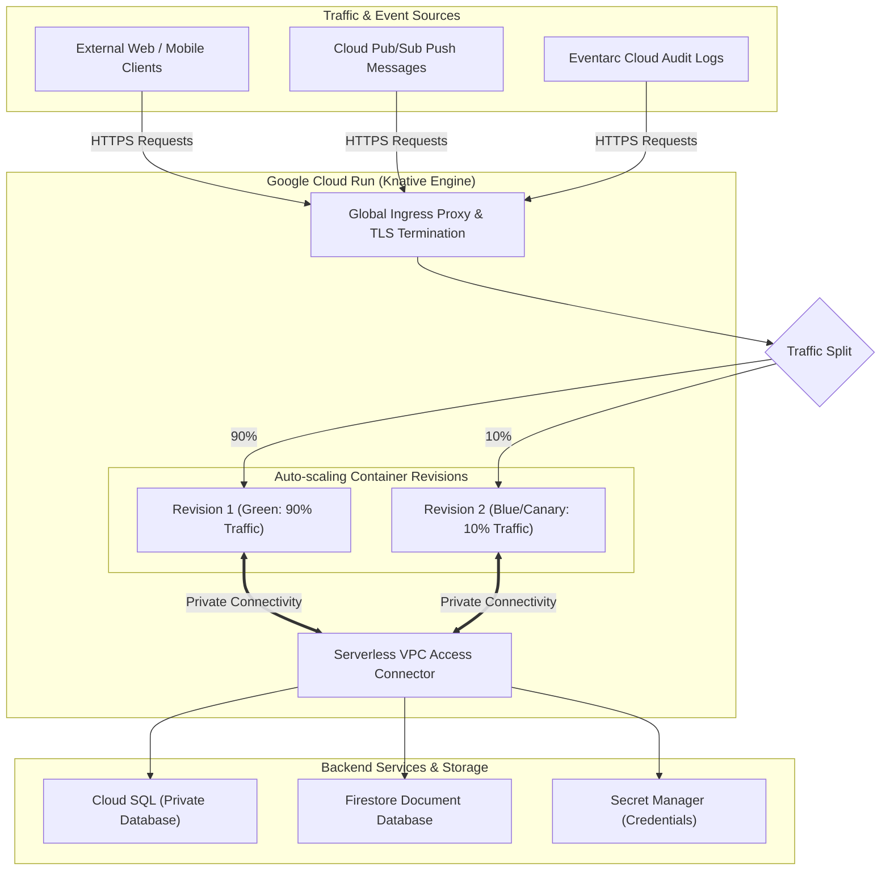

# Topic 75: Cloud Run

---

## 1. What Is It?

**Google Cloud Run** is a fully managed, serverless compute platform that enables developers to execute stateless containerized applications directly on top of Google Cloud's infrastructure without managing virtual machines, clusters, or operating systems.

Cloud Run is built on open-source **Knative**, providing container portability while offering zero-to-N autoscaling based on incoming web traffic.

Key operational capabilities of Cloud Run include:
1. **Container-Based Serverless Execution**: Run any language, runtime, binary, or framework packaged into an OCI container image listening on `$PORT` (default 8080).
2. **True Scale-to-Zero**: Automatically scales compute instances down to 0 instances when idle, incurring $0 billing cost when no requests are being processed.
3. **Concurrency Control**: Supports handling up to 1,000 concurrent HTTP requests per container instance, drastically reducing instance count and billing costs compared to single-concurrency FaaS.
4. **Traffic Management**: Native blue-green deployments, canary releases, and gradual traffic splitting between container revisions.

### Real-World Analogy
Think of Cloud Run like a fleet of high-speed automated taxis at an airport terminal:
- **Compute Engine VMs (Leased Car)**: Paying $100 per day for a rental car sitting in a parking garage 22 hours a day even when nobody is driving it.
- **GKE Kubernetes (City Bus System)**: Operating a schedule-driven bus system with fixed routes, mechanics, and maintenance depots.
- **Cloud Run (Automated Taxis)**: When 1 passenger lands, 1 taxi powers on, picks up the passenger, drops them off, and immediately powers off ($0 idle cost). If 50 passengers land at once, 50 taxis deploy simultaneously, handle the passengers, and vanish when finished.

---

## 2. Where Does It Fit?

Cloud Run processes HTTP web traffic, Pub/Sub push messages, and Eventarc triggers, writing data to Cloud SQL, BigQuery, or Firestore.



---

## 3. Core Concepts

| Resource / Setting | Description | Technical Value | Best Practice |
|---|---|---|---|
| **Service** | Main Cloud Run lifecycle resource management unit. | Represents full application configuration and URL. | Use 1 Service per microservice domain. |
| **Revision** | Immutable snapshot of container image and configuration. | Automatically created on every code or env update. | Tag revisions (`v1-0-2`) for canary rollbacks. |
| **Concurrency** | Max concurrent requests assigned to 1 container. | Range: 1 to 1,000 (Default: 80). | Increase concurrency for lightweight I/O bound APIs. |
| **Min Instances** | Pre-warmed container instances kept alive 24/7. | Prevents cold start latency for critical APIs. | Set `min-instances=1` on latency-sensitive APIs. |
| **Max Instances** | Hard limit on maximum containers provisioned. | Prevents runaway billing during traffic surges. | Set `max-instances` to match downstream DB limits. |

---

## 4. How It Works

Scale-from-zero, request routing, and container autoscaling operate deterministically:

```text
HTTP Request arrives at Cloud Run Ingress Proxy URL
              ↓
Ingress checks active container instances:
  - Active containers available? -> Route request to container ($PORT 8080)
  - 0 instances active? -> Trigger Cold Start -> Provision container image in <1s -> Route request!
              ↓
Container handles up to N concurrent requests (Concurrency Limit)
              ↓
Request load spikes -> Autoscaler provisions additional container instances in parallel
              ↓
Traffic drops to 0 -> Idle timer expires -> Deletes containers -> Scales to 0!
```

1. **Cold Starts**: Occur when a request hits a service with 0 active container instances, requiring image pulling and container initialization.
2. **Stateless Requirement**: Containers MUST be stateless; local disk writes are ephemeral memory-backed volumes lost when containers scale down.

---

## 5. Production Scenario

### Real-Time Microservice API with Blue-Green Deployment & Private DB Access

```text
Requirement: Deploy a high-throughput Node.js microservice handling 5,000 requests/sec with zero cold-start latency for production traffic, zero public IP exposure to Cloud SQL, and canary deployments.
    ↓
Architecture: Cloud Run + Serverless VPC Access + Cloud SQL Private IP + Secret Manager.
    ↓
Deployment Execution Command:
  ```bash
  gcloud run deploy payment-api \
      --image=us-central1-docker.pkg.dev/prod-proj/repo/payment-api:v2.0 \
      --region=us-central1 \
      --platform=managed \
      --no-allow-unauthenticated \
      --min-instances=2 \
      --max-instances=50 \
      --concurrency=100 \
      --vpc-connector=projects/prod-proj/locations/us-central1/connectors/vpc-conn \
      --set-secrets=DB_PASS=payment-db-pass:latest \
      --no-traffic
  ```
    ↓
Canary Traffic Split:
  `gcloud run services update-traffic payment-api --region=us-central1 --to-revisions=v2-0=10,v1-0=90`
    ↓
Result: Serves production traffic with 0 cold starts; 10% canary traffic evaluated safely; Cloud SQL accessed privately via VPC Connector.
```

*Why Selected*: Combines `min-instances=2` for zero cold starts, Serverless VPC Access for private database security, and native traffic splitting.

---

## 6. Hands-On Lab

### Prerequisites
- Active GCP Project with Cloud Run and Artifact Registry APIs enabled.
- Cloud Shell or `gcloud` CLI.
- IAM permissions: `roles/run.admin`.

### Console Method
1. Log into [Google Cloud Console](https://console.cloud.google.com/).
2. Navigate to **Serverless** → **Cloud Run**.
3. Click **CREATE SERVICE** at top.
4. Deployment: Select **Deploy one revision from an existing container image**.
5. Image URL: `us-docker.pkg.dev/cloudrun/container/hello`.
6. Service name: `demo-cloud-run`, Region: `us-central1`.
7. Authentication: Select **Allow unauthenticated invocations**.
8. Autoscaling: Min instances `0`, Max instances `5`.
9. Click **CREATE** (Deploys service and generates HTTPS URL in 30 seconds).
10. Click the generated Service URL → View sample web page.

### CLI Method
Deploy a sample container to Cloud Run using `gcloud`:

```bash
# Set variables
PROJECT_ID="your-gcp-project-id"
REGION="us-central1"
SERVICE_NAME="demo-run-cli"

# 1. Deploy pre-built hello container to Cloud Run
gcloud run deploy $SERVICE_NAME \
    --image=us-docker.pkg.dev/cloudrun/container/hello \
    --region=$REGION \
    --allow-unauthenticated \
    --min-instances=0 \
    --max-instances=3

# 2. Describe service and fetch public URL
SERVICE_URL=$(gcloud run services describe $SERVICE_NAME --region=$REGION --format="value(status.url)")
echo "Service Deployed at: $SERVICE_URL"

# 3. Test HTTP request to public URL
curl -s $SERVICE_URL
```

### Verification
*Expected Result*: `curl` returns HTML response `Welcome to Cloud Run!`.

### Cleanup
Delete service:

```bash
gcloud run services delete $SERVICE_NAME --region=$REGION --quiet
```

---

## 7. Security

### Cloud Run Hardening & Perimeter Defense
- **Require IAM Authentication**: Set `--no-allow-unauthenticated` on internal microservices. Callers must pass a valid GCP Identity OIDC token in the `Authorization: Bearer ID_TOKEN` header.
- **Serverless VPC Access Connector**: Route outbound traffic through a Serverless VPC Access Connector (`--vpc-connector`) to access private Cloud SQL, Compute Engine VMs, or Redis instances without public IPs.
- **Secret Manager Binding**: Inject credentials using `--set-secrets` rather than hardcoding environment variables in container images.

```text
BAD PRACTICE:
Setting `--allow-unauthenticated` on internal microservices that process sensitive database mutations.
Risk: Exposes internal REST endpoints to un-authenticated internet attackers.

PRODUCTION PRACTICE:
Enforce `--no-allow-unauthenticated`. Protect public endpoints using **Cloud Armor** and **HTTP(S) Load Balancing**.
```

---

## 8. Scaling & High Availability

Scale-to-Zero vs Pre-Warmed Performance:

```text
Traffic Drops to 0 (Autoscaler deletes container instances -> $0 compute cost -> Potential Cold Start on next request)
   ↓ (Production Latency Upgrade: `min-instances=2`)
Traffic Drops to 0 (Autoscaler retains 2 pre-warmed container instances -> Sub-10ms response latency on all requests)
```

- **Global Load Balancing Integration**: Attach Cloud Run services to a Global HTTP(S) Load Balancer using Serverless Network Endpoint Groups (NEGs) to enable Cloud Armor WAF and Cloud CDN.

---

## 9. Cost

### Cloud Run Billing Structure
- **vCPU & RAM Allocation**: Billed per vCPU-second and GB-second during request processing (or 24/7 if `min-instances` configured).
- **Request Billing**: Billed per 1,000,000 HTTP requests (~$0.40 per 1M requests).
- **Concurrency Savings**: Setting concurrency to 80 allows 1 container instance to process 80 concurrent requests, reducing billing costs by up to 80x compared to 1-concurrency FaaS.

---

## 10. Monitoring & Troubleshooting

### Diagnostic Tools
- **Cloud Run Metrics Tab**: Real-time graphs showing Request Count, Request Latency (50th, 95th, 99th percentile), Container Instance Count, and Memory Utilization.
- **Cloud Logging Logs Explorer**: Container `stdout`/`stderr` logs indexed automatically.

### Troubleshooting Matrix

| Symptom | Possible Cause | What to Check | Fix |
|---|---|---|---|
| Service returns `HTTP 504 Gateway Timeout` | Request duration exceeded Service timeout setting | Service timeout configuration | Increase `--timeout` (Max 60 minutes for HTTP services). |
| Container fails startup: `Port binding error` | Container app not listening on `$PORT` environment variable | Container Dockerfile & code | Ensure web server listens on `process.env.PORT` or `$PORT` (8080). |
| Service returns `HTTP 403 Forbidden` | Callers missing IAM `roles/run.invoker` role | Cloud Run IAM policy | Grant `roles/run.invoker` to the requesting Service Account. |

---

## 11. Common Mistakes

```text
Mistake: Hardcoding port `8080` in application code without reading the `$PORT` environment variable injected by Cloud Run.
Why: Assuming port 8080 is static.
Impact: Container fails Cloud Run health checks when Cloud Run binds a different dynamic port.
Correct approach: Bind web server to `process.env.PORT || 8080`.

Mistake: Storing user file uploads on the local container filesystem inside Cloud Run.
Why: Treating Cloud Run like a stateful virtual machine.
Impact: Files are lost when the container scales down to 0 or restarts.
Correct approach: Upload files directly to **Cloud Storage (`gs://`)**.
```

---

## 12. Production Best Practices

- [ ] Bind application web servers to the **`$PORT`** environment variable.
- [ ] Set **`min-instances >= 1`** on latency-sensitive APIs to eliminate cold starts.
- [ ] Set **`max-instances`** to match downstream database connection limits.
- [ ] Configure high **concurrency (50 to 100)** for I/O bound web applications.
- [ ] Use **Serverless VPC Access Connectors** for private database access.
- [ ] Automate deployments using **Cloud Build** triggers and Infrastructure as Code (Terraform).

---

## 13. Hyperscaler / Enterprise Perspective

```text
Personal / Learning
  Public HTTP Endpoint → Single Container → Default Concurrency → Scale to Zero
        ↓
Small Production
  Private VPC Connector → Cloud SQL Access → `min-instances=1` → Secret Manager
        ↓
Enterprise Environment
  Serverless NEG + Load Balancer → Cloud Armor WAF → Canary Traffic Splitting → Identity-Aware Proxy
        ↓
Hyperscaler Environment
  100% Policy-Governed Serverless Mesh → Multi-Region Failover → Automated Binary Authorization Container Verification
```

In a hyperscaler environment, Cloud Run is the standard platform for **Stateless Container Workloads**. Platform teams deploy microservices across multiple GCP regions. Services sit behind a **Global HTTP(S) Load Balancer** with **Cloud Armor WAF** protection. CI/CD pipelines use **Binary Authorization** to verify container signatures in Artifact Registry before triggering automated blue-green deployments with zero API downtime.

---

## 14. Real Project Questions

### Q1: How does concurrency control in Cloud Run differ from traditional FaaS platforms like AWS Lambda or Cloud Functions?
**Answer:** Traditional FaaS platforms allocate 1 container instance per concurrent request (concurrency = 1). **Cloud Run** supports up to **1,000 concurrent requests per container instance** (default concurrency = 80). For I/O-bound web applications, a single Cloud Run container instance can handle dozens of simultaneous requests, dramatically lowering instance counts, cold start frequencies, and overall cloud billing costs.

### Q2: What is the purpose of the `min-instances` setting in Cloud Run, and what operational trade-off does it introduce?
**Answer:** The **`min-instances`** setting specifies a minimum baseline of pre-warmed container instances kept running 24/7. Setting `min-instances >= 1` completely eliminates **Cold Start latency** for latency-sensitive applications. The operational trade-off is cost: pre-warmed instances incur continuous baseline vCPU and RAM billing even when idle, sacrificing pure scale-to-zero cost savings.

### Q3: How do Serverless VPC Access Connectors secure outbound network traffic from Cloud Run services?
**Answer:** By default, Cloud Run outbound traffic routes over the public internet. A **Serverless VPC Access Connector** provisions a lightweight private tunnel between Cloud Run and a specific VPC network subnet. This allows Cloud Run applications to communicate with internal resources (such as Cloud SQL Private IP, Compute Engine VMs, or Memorystore Redis) using internal RFC1918 IP addresses with zero public internet exposure.

---

## 15. Quick Decision Guide

| Requirement | Recommended Approach | Reason |
|---|---|---|
| Deploying a stateless microservice packaged in a Docker container with zero server management | **Google Cloud Run** | Fully managed serverless container runtime with scale-to-zero autoscaling. |
| Eliminating cold start latency for a critical customer-facing REST API on Cloud Run | **Set `--min-instances=2`** | Retains 2 pre-warmed container instances 24/7 to process requests instantly. |
| Safely testing a new v2.0 container image on 10% of production traffic | **Cloud Run Traffic Splitting (`--to-revisions=v2-0=10,v1-0=90`)** | Native blue-green canary traffic management without external load balancers. |

### When should I use it?
- Essential serverless compute platform for executing stateless HTTP container applications, APIs, web applications, and microservices on GCP.

### When should I NOT use it?
- Do not use Cloud Run for stateful workloads requiring persistent local disk storage (use GKE or Compute Engine instead).

---

## 16. Related Services

```text
                     [75. Cloud Run]
                    /       |       \
        Cloud Build    Artifact Reg   Cloud SQL
        (CI/CD)        (Images)       (Private DB)
             |              |              |
        Builds &       Stores OCI     Stores Private
        Deploys        Containers     App Data
```

- **Cloud Build**: Primary CI/CD engine building and deploying Cloud Run revisions.
- **Artifact Registry**: Stores container images deployed to Cloud Run.
- **Cloud SQL**: Primary relational database connected to Cloud Run via Serverless VPC Connectors.

---

## 17. Cheat Sheet

### Core Flags
- `--image`: Container image URI in Artifact Registry.
- `--allow-unauthenticated`: Permits public internet access.
- `--min-instances`: Pre-warmed baseline containers (Eliminates cold starts).
- `--max-instances`: Upper auto-scaling instance ceiling.
- `--concurrency`: Max simultaneous requests per container (1 to 1,000).
- `--vpc-connector`: Enables private VPC access to Cloud SQL / Redis.

### Useful Commands
```bash
# Deploy a Cloud Run service
gcloud run deploy SERVICE_NAME \
    --image=IMAGE_URI --region=us-central1 \
    --allow-unauthenticated --min-instances=1 --max-instances=10

# Update traffic split for canary testing
gcloud run services update-traffic SERVICE_NAME --region=us-central1 \
    --to-revisions=REV1=90,REV2=10

# List active Cloud Run services
gcloud run services list --region=us-central1
```

---

## 18. Learning Connection

- **Previous Topic**: [74. Multi-Cluster GKE](../../06-containers-and-kubernetes/74-multi-cluster-gke/README.md)
- **Next Topic**: [76. Cloud Functions](../76-cloud-functions/README.md)
