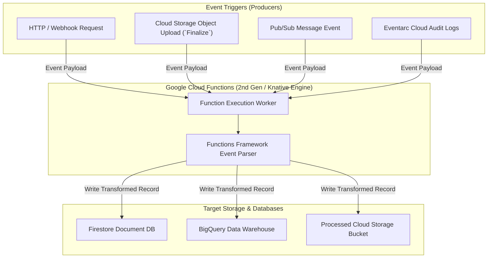

# Topic 76: Cloud Functions

---

## 1. What Is It?

**Google Cloud Functions** is a serverless Functions-as-a-Service (FaaS) platform designed to execute lightweight, single-purpose code snippets in response to cloud events without managing servers, runtime environments, or container builds.

Cloud Functions automatically provisions, scales, and manages compute infrastructure on-demand, executing code written in Node.js, Python, Go, Java, Ruby, PHP, or .NET when triggered by HTTP requests, Cloud Storage object mutations, Cloud Pub/Sub messages, or Eventarc audit logs.

Cloud Functions offers two generations:
1. **Cloud Functions 1st Gen**: Legacy lightweight FaaS engine with 1-concurrency per instance and basic event bindings.
2. **Cloud Functions 2nd Gen**: Built directly on top of **Google Cloud Run** and **Knative**, delivering longer processing timeouts (up to 60 minutes for HTTP), higher concurrency (up to 1,000 requests per instance), larger memory limits (up to 32 GB RAM / 8 vCPU), and Eventarc event triggers.

### Real-World Analogy
Think of Cloud Functions like an automated home motion sensor light fixture:
- **Compute Engine VM (Leaving the Porch Light On 24/7)**: Paying for electricity 24 hours a day even when no visitors approach your front door.
- **Cloud Functions (Motion-Sensor Light Switch)**: The light bulb stays 100% powered off ($0 electricity cost). The second a package delivery driver walks onto your porch (Event Trigger: Object uploaded to Cloud Storage bucket), the motion sensor trips, powers on the light for 10 seconds (Executes Code Function), illuminates the porch, and immediately switches back off.

---

## 2. Where Does It Fit?

Cloud Functions reacts to events emitted by Cloud Storage, Pub/Sub, and Eventarc, processing event payloads and updating downstream databases.



---

## 3. Core Concepts

| Generation / Concept | Technical Specification | Functionality | Best Practice |
|---|---|---|---|
| **2nd Gen Functions** | Built on Cloud Run & Eventarc | Up to 60-min timeout, 32 GB RAM, 1000 concurrency. | Standardize all new FaaS projects on 2nd Gen. |
| **Functions Framework** | Open-source FaaS runtime wrapper | Wraps Python/Node code into HTTP event endpoints. | Test functions locally using Functions Framework. |
| **Event Triggers** | Eventarc / PubSub / GCS / HTTP | Binds Cloud Function execution to cloud events. | Make event processing functions **Idempotent**. |
| **Cold Start** | Latency on 1st container init | Time taken to spin up instance from 0. | Use `--min-instances=1` for low-latency APIs. |
| **Environment Vars** | `--set-env-vars` | Configures dynamic environment properties. | Inject credentials via Secret Manager bindings. |

---

## 4. How It Works

Event triggering, payload parsing, and function execution operate deterministically:

```text
User uploads image `invoice.pdf` to Cloud Storage bucket `raw-invoices`
              ↓
Cloud Storage emits `google.cloud.storage.object.v1.finalized` event to Eventarc
              ↓
Eventarc triggers Cloud Function 2nd Gen worker
              ↓
Function worker executes Python code (`main.py`):
  - Downloads `invoice.pdf` -> Extracts text -> Inserts metadata record into BigQuery
              ↓
Function completes -> Returns Success -> Worker scales down when idle!
```

1. **Functions Framework Contract**: Functions accept an HTTP request object or CloudEvent payload object, executing code asynchronously and returning an HTTP 200 or status output.
2. **Stateless Execution**: Disk writes to `/tmp` are held in RAM memory; data is lost when function instances scale down.

---

## 5. Production Scenario

### Real-Time Event-Driven Image Resizing & Storage Pipeline

```text
Requirement: Automatically resize raw user avatar images uploaded to a Cloud Storage bucket, saving optimized thumbnails to a processed bucket and updating Firestore metadata with sub-2 second end-to-end processing time.
    ↓
Architecture: Cloud Storage Bucket + Cloud Functions 2nd Gen (Python) + Firestore.
    ↓
Python Function Script (`main.py`):
  ```python
  import functions_framework
  from google.cloud import storage, firestore
  from PIL import Image
  import io

  storage_client = storage.Client()
  db = firestore.Client()

  @functions_framework.cloud_event
  def resize_avatar(cloud_event):
      data = cloud_event.data
      bucket_name = data["bucket"]
      file_name = data["name"]

      # Download raw image from GCS
      bucket = storage_client.bucket(bucket_name)
      blob = bucket.blob(file_name)
      image_bytes = blob.download_as_bytes()

      # Resize image using Pillow
      img = Image.open(io.BytesIO(image_bytes))
      img.thumbnail((128, 128))

      # Save thumbnail to output bucket
      output_bucket = storage_client.bucket("processed-avatars")
      out_blob = output_bucket.blob(f"thumb_{file_name}")
      out_bytes = io.BytesIO()
      img.save(out_bytes, format=img.format)
      out_blob.upload_from_string(out_bytes.getvalue(), content_type=blob.content_type)

      # Update Firestore document
      db.collection("avatars").document(file_name).set({"processed": True, "thumb_path": out_blob.name})
  ```
    ↓
Result: Scales automatically from 0 to 100 parallel image processing workers during peak uploads; $0 idle cost off-peak.
```

*Why Selected*: Combines event-driven Cloud Storage triggers with serverless 2nd Gen Cloud Functions for zero-maintenance image processing.

---

## 6. Hands-On Lab

### Prerequisites
- Active GCP Project with Cloud Functions, Cloud Storage, and Artifact Registry APIs enabled.
- Cloud Shell or `gcloud` CLI.
- IAM permissions: `roles/cloudfunctions.admin`.

### Console Method
1. Log into [Google Cloud Console](https://console.cloud.google.com/).
2. Navigate to **Serverless** → **Cloud Functions**.
3. Click **CREATE FUNCTION** at top:
   - Environment: **2nd gen**.
   - Function name: `demo-function-ui`, Region: `us-central1`.
   - Trigger type: **HTTPS** → Select **Allow unauthenticated invocations**.
   - Click **NEXT**.
4. Code Editor:
   - Runtime: **Python 3.11**.
   - Entry point: `hello_http`.
   - Code: Default hello world Python snippet.
5. Click **DEPLOY** (Deploys 2nd Gen function in 1-2 minutes).
6. Click **TESTING** tab → Click **TEST THE FUNCTION** → View response payload.

### CLI Method
Deploy a Python 2nd Gen Cloud Function using `gcloud`:

```bash
# Set variables
PROJECT_ID="your-gcp-project-id"
REGION="us-central1"
FUNCTION_NAME="demo-fn-cli"

# 1. Create a local working directory
mkdir fn-demo && cd fn-demo

# 2. Create main.py script
cat <<EOF > main.py
import functions_framework

@functions_framework.http
def hello_cli(request):
    return "Hello from 2nd Gen Cloud Functions!", 200
EOF

# 3. Create requirements.txt
cat <<EOF > requirements.txt
functions-framework>=3.0.0
EOF

# 4. Deploy 2nd Gen Cloud Function using gcloud CLI
gcloud functions deploy $FUNCTION_NAME \
    --gen2 \
    --region=$REGION \
    --runtime=python311 \
    --source=. \
    --entry-point=hello_cli \
    --trigger-http \
    --allow-unauthenticated

# 5. Get HTTP trigger URL and test function call
FUNCTION_URL=$(gcloud functions describe $FUNCTION_NAME --gen2 --region=$REGION --format="value(serviceConfig.uri)")
curl -s $FUNCTION_URL
```

### Verification
*Expected Result*: Output prints `Hello from 2nd Gen Cloud Functions!`.

### Cleanup
Delete function and local folder:

```bash
gcloud functions delete $FUNCTION_NAME --gen2 --region=$REGION --quiet
cd .. && rm -rf fn-demo
```

---

## 7. Security

### Cloud Function Hardening & IAM Best Practices
- **Require Authentication**: Set `--no-allow-unauthenticated` on HTTP functions. Force callers to authenticate using GCP Identity OIDC tokens.
- **Service Account Principle of Least Privilege**: Assign a custom Service Account (`--service-account`) to the function with permissions limited strictly to required GCS buckets or BigQuery datasets.
- **Ingress Settings Restriction**: Restrict ingress (`--ingress-settings=internal-only`) to ensure functions can only be invoked from within your private VPC network or internal Load Balancer.

```text
BAD PRACTICE:
Using default App Engine / Compute Engine Editor service accounts for running Cloud Functions.
Risk: If a dependency vulnerability is exploited, the function worker can modify or delete unrelated GCP resources.

PRODUCTION PRACTICE:
Assign a dedicated **custom Service Account** per Cloud Function with minimal required IAM permissions.
```

---

## 8. Scaling & High Availability

Event Concurrency & Instance Autoscaling:

```text
10,000 Concurrent Pub/Sub Messages Published
   ↓ (Cloud Functions 2nd Gen Autoscaler)
Scales function instance workers dynamically -> Process messages concurrently -> Scales to 0 when idle
```

- **Concurrency Scaling**: 2nd Gen functions support handling multiple concurrent requests per instance (`--concurrency=N`), drastically improving throughput compared to 1st Gen single-request execution.

---

## 9. Cost

### Cloud Functions Pricing Model
- **Compute Execution**: Billed per GB-second and vCPU-second consumed during function execution duration.
- **Invocations**: First **2,000,000 invocations per month are 100% FREE**; ~$0.40 per million invocations thereafter.
- **Network Egress**: Standard GCP network data transfer rates apply.

---

## 10. Monitoring & Troubleshooting

### Diagnostic Tools
- **Cloud Functions Details UI**: Real-time graphs for Invocations/sec, Execution time (ms), Memory usage, and Active instances.
- **Cloud Logging Execution Logs**: Filter by `resource.type="cloud_function"` to view function execution traces and unhandled exception stack traces.

### Troubleshooting Matrix

| Symptom | Possible Cause | What to Check | Fix |
|---|---|---|---|
| Function execution times out | Function duration exceeded default 60s timeout | Function timeout config | Increase `--timeout` setting (Up to 60m for 2nd Gen HTTP functions). |
| Function fails: `Memory Limit Exceeded` | Function loaded large file into memory exceeding RAM capacity | Memory usage metrics | Increase function memory allocation (`--memory=2Gi`). |
| Duplicate execution side-effects | Event retries caused re-execution of non-idempotent code | Pub/Sub retry settings | Make function code **Idempotent** (use event IDs to check state). |

---

## 11. Common Mistakes

```text
Mistake: Writing non-idempotent code in event-triggered functions (e.g., unconditionally inserting rows into a database on every GCS upload event).
Why: Assuming cloud event triggers fire strictly once and only once.
Impact: Retries cause duplicate database records or duplicate emails sent to users.
Correct approach: Make functions **Idempotent** by checking unique event IDs in Firestore or BigQuery before executing side-effects.

Mistake: Choosing Cloud Functions 1st Gen for new project deployments.
Why: Following outdated documentation tutorials.
Impact: Missing out on 60-minute timeouts, higher concurrency, 32 GB RAM, and native Eventarc event integration.
Correct approach: Standardize all new FaaS projects on **Cloud Functions 2nd Gen** (`--gen2`).
```

---

## 12. Production Best Practices

- [ ] Standardize all new deployments on **Cloud Functions 2nd Gen** (`--gen2`).
- [ ] Make all event-driven functions **Idempotent** to handle potential event retries safely.
- [ ] Assign dedicated **custom Service Accounts** (`--service-account`) to each function.
- [ ] Set **`--min-instances=1`** for customer-facing HTTP functions to eliminate cold starts.
- [ ] Inject API keys and credentials using **Secret Manager** bindings (`--set-secrets`).
- [ ] Automate function deployments using **Cloud Build** and Infrastructure as Code (Terraform).

---

## 13. Hyperscaler / Enterprise Perspective

```text
Personal / Learning
  1st Gen Function → Public HTTP Access → Default Service Account → Plaintext Env Vars
        ↓
Small Production
  2nd Gen Function → Cloud Storage Triggers → Custom Service Account → Secret Manager
        ↓
Enterprise Environment
  2nd Gen Function + Eventarc → Internal VPC Ingress → Idempotent Code → Terraform Deployment
        ↓
Hyperscaler Environment
  100% Policy-Governed Event-Driven Architecture → Automated Security Scanning → Multi-Region Event Mesh
```

In a hyperscaler environment, Cloud Functions 2nd Gen serves as the primary **Event-Driven Glue**. Enterprise teams use **Eventarc** to route Cloud Audit Logs, Pub/Sub messages, and Cloud Storage events to 2nd Gen functions. Security policies enforce **Internal Ingress** and custom Service Accounts. Functions run inside private VPC networks, injecting credentials securely from **Secret Manager** and maintaining full **Cloud Logging** audit trails.

---

## 14. Real Project Questions

### Q1: What are the main architectural upgrades of Cloud Functions 2nd Gen compared to 1st Gen?
**Answer:** **Cloud Functions 2nd Gen** is built directly on top of **Google Cloud Run** and **Knative**, offering major technical upgrades:
1. Increased HTTP request timeouts (up to **60 minutes** vs 9 minutes in 1st Gen).
2. Increased compute capacity (up to **32 GB RAM and 8 vCPUs** vs 8 GB in 1st Gen).
3. **Multi-concurrency** (up to 1,000 requests per instance vs 1 in 1st Gen).
4. Direct event integration with 90+ GCP event sources via **Eventarc**.

### Q2: Why MUST event-driven Cloud Functions be written to be Idempotent?
**Answer:** Cloud event delivery systems (such as Cloud Pub/Sub and Eventarc) guarantee **at-least-once delivery**. In rare cases of network timeouts or worker retries, the same event may trigger a Cloud Function multiple times. Writing **Idempotent** code (e.g., checking an event ID in Firestore before processing) ensures that re-executing a function produces the exact same outcome without causing duplicate database inserts or double payments.

### Q3: How do Cloud Functions handle environment variables vs sensitive API keys securely?
**Answer:** Non-sensitive configuration properties are set using environment variables (`--set-env-vars`). Sensitive credentials (such as database passwords, TLS certificates, or API keys) should NEVER be passed as plain environment variables; they must be bound securely from **Google Secret Manager** (`--set-secrets`), which injects secrets into the function execution memory at runtime without exposing them in code repositories.

---

## 15. Quick Decision Guide

| Requirement | Recommended Approach | Reason |
|---|---|---|
| Running a lightweight single-purpose code snippet triggered instantly when a file is uploaded to GCS | **Cloud Functions 2nd Gen (`--gen2`)** | Serverless FaaS platform natively integrated with Cloud Storage and Eventarc event triggers. |
| Executing a complex web application with custom Dockerfiles, multiple routes, and multi-language binaries | **Google Cloud Run (NOT Cloud Functions)** | Cloud Run provides full container flexibility, custom Dockerfiles, and web framework routing. |
| Preventing cold start latency on a critical HTTP webhook endpoint deployed on Cloud Functions | **Set `--min-instances=1`** | Keeps 1 pre-warmed function instance running 24/7 to answer requests instantly. |

### When should I use it?
- Essential serverless FaaS platform for building event-driven microservices, background file processing, and webhook handlers on GCP.

### When should I NOT use it?
- Do not use Cloud Functions for complex, multi-route web applications that require custom Docker container configurations (use Cloud Run instead).

---

## 16. Related Services

```text
                  [76. Cloud Functions]
                 /          |          \
        Eventarc      Cloud Storage    Secret Manager
        (Event Router)(Event Trigger)  (Credentials)
           |                |                |
        Routes Event   Fires Object     Injects API
        Payloads       Mutations        Secrets
```

- **Eventarc**: Event routing framework delivering 90+ GCP event types to Cloud Functions.
- **Cloud Storage**: Primary object storage event trigger source for Cloud Functions.
- **Secret Manager**: Securely stores credentials injected into Cloud Functions.

---

## 17. Cheat Sheet

### Key Features
- **Engine**: 2nd Gen (Built on Cloud Run & Knative).
- **Max Timeout**: 60 minutes (HTTP) / 10 minutes (Events).
- **Max Memory**: Up to 32 GB RAM / 8 vCPUs.
- **Free Tier**: 2,000,000 free invocations per month.
- **Local Testing**: Functions Framework CLI.

### Useful Commands
```bash
# Deploy a 2nd Gen HTTP Cloud Function
gcloud functions deploy FUNCTION_NAME \
    --gen2 --region=us-central1 --runtime=python311 \
    --source=. --entry-point=main_func --trigger-http \
    --allow-unauthenticated --min-instances=1

# Deploy a 2nd Gen Cloud Storage event-triggered Function
gcloud functions deploy FUNCTION_NAME \
    --gen2 --region=us-central1 --runtime=python311 \
    --source=. --entry-point=gcs_func \
    --trigger-event-filters="type=google.cloud.storage.object.v1.finalized" \
    --trigger-event-filters="bucket=BUCKET_NAME"

# Delete a 2nd Gen Function
gcloud functions delete FUNCTION_NAME --gen2 --region=us-central1
```

---

## 18. Learning Connection

- **Previous Topic**: [75. Cloud Run](../75-cloud-run/README.md)
- **Next Topic**: [77. Cloud Scheduler](../77-cloud-scheduler/README.md)
