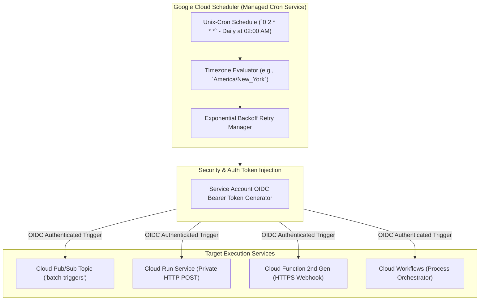

# Topic 77: Cloud Scheduler

---

## 1. What Is It?

**Google Cloud Scheduler** is a fully managed, serverless enterprise cron job management service that allows developers and systems administrators to schedule, automate, and execute recurring tasks across Google Cloud Platform and external HTTP endpoints using standard unix-cron format syntax.

Cloud Scheduler acts as the central heartbeat of enterprise cloud automation, eliminating the need to maintain dedicated Linux VMs running crontab scripts or operating un-reliable custom scheduler processes.

Cloud Scheduler supports three target invocation types:
1. **HTTP/HTTPS Endpoints**: Sends scheduled GET, POST, PUT, DELETE requests to any public or private web endpoint, Cloud Run service, or Cloud Function.
2. **Cloud Pub/Sub Topics**: Publishes scheduled messages to a Pub/Sub topic to trigger asynchronous streaming pipelines or fan-out subscribers.
3. **App Engine Applications**: Invokes HTTP handlers running inside App Engine environments.

Key operational capabilities include:
- **At-Least-Once Delivery**: Guarantees that scheduled job executions are delivered reliably.
- **Configurable Retry Policies**: Defines maximum retry attempts, backoff intervals, and job timeouts for failed executions.
- **Keyless OIDC/OAuth Authentication**: Automatically signs outbound HTTP requests with GCP Service Account identity tokens.

### Real-World Analogy
Think of Cloud Scheduler like a high-tech automated alarm clock and smart home controller:
- **Un-managed Linux Crontab (Manual Alarm Clock)**: Setting a manual alarm clock on a battery-powered nightstand. If the battery dies (VM crashes) or the clock breaks, the alarm doesn't ring, you oversleep, and your morning routine fails.
- **Cloud Scheduler (Automated Smart Home Controller)**: A central satellite-synced master clock system. At 07:00 AM every weekday (`0 7 * * 1-5`), it automatically sends a signal over Wi-Fi to start the coffee machine (Pub/Sub topic trigger), turns on the heater (HTTP call to Cloud Run), and opens the blinds (Cloud Function trigger). If the coffee machine fails to respond, it automatically retries 3 times before sending a notification to your phone.

---

## 2. Where Does It Fit?

Cloud Scheduler triggers recurring events based on unix-cron schedules, invoking HTTP endpoints, Cloud Functions, Pub/Sub topics, or Workflows.



---

## 3. Core Concepts

| Resource / Property | Description | Format / Syntax | Best Practice |
|---|---|---|---|
| **Cron Schedule** | Unix-cron 5-field time expression syntax. | `0 2 * * *` (Minute Hour Day Month DayOfWeek) | Use crontab.guru to validate cron expressions. |
| **Timezone** | Specifies the exact time zone for schedule execution. | `America/New_York`, `UTC` | Explicitly define timezones; avoid relying on defaults. |
| **Target Type** | Destination type invoked by the schedule. | `HTTP`, `Pub/Sub`, `App Engine` | Use Pub/Sub targets for decoupled fan-out tasks. |
| **OIDC / OAuth Token** | Authentication token injected into HTTP headers. | Service Account Email | Bind dedicated Service Account to HTTP targets. |
| **Retry Policy** | Configurable backoff parameters for failed jobs. | Min/Max Backoff, Max Doublings | Configure retry bounds to prevent hammering target DBs. |

---

## 4. How It Works

Cron evaluation, OIDC token generation, and job execution operate deterministically:

```text
Clock reaches 02:00 AM in America/New_York -> Cloud Scheduler evaluates active jobs
              ↓
Identifies Job `daily-backup` with schedule `0 2 * * *`
              ↓
Fetches assigned Service Account credentials -> Generates OIDC Bearer Token
              ↓
Sends HTTP POST request with `Authorization: Bearer ID_TOKEN` header to target Cloud Run Service
              ↓
Cloud Run verifies OIDC token -> Executes backup -> Returns HTTP 200 SUCCESS
              ↓
Scheduler receives HTTP 200 -> Marks execution SUCCESS -> Pauses until 02:00 AM tomorrow!
```

1. **At-Least-Once Execution**: Cloud Scheduler guarantees that a job runs at least once per scheduled interval. Target endpoints MUST be **Idempotent**.
2. **Timezone Support**: Cloud Scheduler natively handles daylight saving time (DST) transitions when a location-based timezone (e.g., `America/Los_Angeles`) is specified.

---

## 5. Production Scenario

### Automated Nightly Database Backup & Slack Notification Pipeline

```text
Requirement: Trigger a nightly database backup job on a private Cloud Run service every night at 03:00 AM UTC, passing a JSON payload with target backup options and retrying up to 5 times if transient network glitches occur.
    ↓
Architecture: Cloud Scheduler + OIDC Auth + Cloud Run Private Service.
    ↓
Scheduler Setup Command (`gcloud`):
  ```bash
  gcloud scheduler jobs create http nightly-db-backup \
      --schedule="0 3 * * *" \
      --time-zone="UTC" \
      --location="us-central1" \
      --uri="https://backup-service-12345.a.run.app/api/v1/backup" \
      --http-method="POST" \
      --headers="Content-Type=application/json" \
      --message-body='{"db_name":"prod_main","compression":"gzip"}' \
      --oidc-service-account-email="sa-scheduler-backup@prod-proj.iam.gserviceaccount.com" \
      --oidc-token-audience="https://backup-service-12345.a.run.app" \
      --max-retry-attempts=5 \
      --min-backoff-duration=10s \
      --max-backoff-duration=300s
  ```
    ↓
Operational Result: Executes daily at 03:00 AM UTC; authenticates keylessly via OIDC; automatically retries up to 5 times on network failure.
```

*Why Selected*: Combines exact unix-cron scheduling, OIDC keyless service account authentication, and exponential backoff retry policies for production reliability.

---

## 6. Hands-On Lab

### Prerequisites
- Active GCP Project with Cloud Scheduler API enabled.
- Cloud Shell or `gcloud` CLI.
- IAM permissions: `roles/cloudscheduler.admin`.

### Console Method
1. Log into [Google Cloud Console](https://console.cloud.google.com/).
2. Navigate to **Serverless** → **Cloud Scheduler**.
3. Click **CREATE JOB** at top.
4. Name: `demo-scheduler-ui`, Region: `us-central1`.
5. Frequency: `0 * * * *` (Runs every hour on the hour).
6. Timezone: Select `Coordinated Universal Time (UTC)`.
7. Target type: **HTTP**.
8. URL: `https://httpbin.org/post`, HTTP method: **POST**.
9. Body: `{"status": "scheduled_test"}`.
10. Click **CREATE**.
11. Test Execution: Select `demo-scheduler-ui` in list → Click **FORCE A RUN** → Observe Last run status `Success`.

### CLI Method
Create a Pub/Sub target Cloud Scheduler job using `gcloud`:

```bash
# Set variables
PROJECT_ID="your-gcp-project-id"
REGION="us-central1"
JOB_NAME="demo-pubsub-cron"
TOPIC_NAME="cron-events-topic"

# 1. Create a target Pub/Sub topic
gcloud pubsub topics create $TOPIC_NAME

# 2. Create a Cloud Scheduler job triggering the Pub/Sub topic every 15 minutes
gcloud scheduler jobs create pubsub $JOB_NAME \
    --schedule="*/15 * * * *" \
    --time-zone="UTC" \
    --location=$REGION \
    --topic=$TOPIC_NAME \
    --message-body="Cron trigger event execution"

# 3. Force a manual execution to test the job
gcloud scheduler jobs run $JOB_NAME --location=$REGION
```

### Verification
*Expected Result*: Querying `gcloud scheduler jobs describe $JOB_NAME --location=$REGION` displays `lastAttemptState: SUCCESS`.

### Cleanup
Delete job and topic:

```bash
gcloud scheduler jobs delete $JOB_NAME --location=$REGION --quiet
gcloud pubsub topics delete $TOPIC_NAME --quiet
```

---

## 7. Security

### Cloud Scheduler Security & OIDC Best Practices
- **Never Use Plain Un-authenticated HTTP URLs**: Always configure OIDC (`--oidc-service-account-email`) or OAuth (`--oauth-service-account-email`) authentication for HTTP targets.
- **Dedicated Service Account per Job**: Assign a dedicated Service Account (`sa-cron-job@proj.iam...`) to each scheduler job, granting `roles/run.invoker` or `roles/cloudfunctions.invoker` strictly on the target service.
- **Target Audience Matching**: Set `--oidc-token-audience` to match the exact URL of the target Cloud Run service to prevent token forwarding attacks.

```text
BAD PRACTICE:
Creating Cloud Scheduler HTTP jobs pointing to un-authenticated public Cloud Run services or webhooks.
Risk: Allows external attackers to invoke the endpoint directly, bypassing the intended cron schedule.

PRODUCTION PRACTICE:
Set `--no-allow-unauthenticated` on Cloud Run. Configure Cloud Scheduler with **OIDC Service Account Authentication**.
```

---

## 8. Scaling & High Availability

Global Infrastructure & Automatic Retries:

```text
Target Service Down / Returns HTTP 503 Service Unavailable
   ↓ (Cloud Scheduler Retry Policy)
Waits 10s (Attempt 1) -> Waits 20s (Attempt 2) -> Waits 40s (Attempt 3) -> Reclaims Success on HTTP 200
```

- **Built-in Resiliency**: Cloud Scheduler maintains state in Google's infrastructure; if a target endpoint experiences transient outages, Cloud Scheduler executes exponential backoff retries automatically based on your policy settings.

---

## 9. Cost

### Cloud Scheduler Pricing Architecture
- **Free Tier Allowance**: First **3 jobs per GCP account per month are 100% FREE**.
- **Job Pricing**: Billed at **$0.10 per job per month** for active jobs beyond the free tier.
- **Execution Frequency**: Executing a job 10,000 times per month costs the same as executing it once per month ($0.10/job/month).

---

## 10. Monitoring & Troubleshooting

### Diagnostic Tools
- **Cloud Scheduler Console**: Displays Last run time, Status (`Success` / `Has errors`), and direct execution logs.
- **Cloud Logging Execution Logs**: Filter by `resource.type="cloud_scheduler_job"` to view HTTP response status codes and body output logs.

### Troubleshooting Matrix

| Symptom | Possible Cause | What to Check | Fix |
|---|---|---|---|
| Job status shows `FAILED` with HTTP 403 | Target endpoint requires authentication, but OIDC token missing or SA lacks role | IAM bindings on target service | Grant `roles/run.invoker` to the Cloud Scheduler OIDC Service Account. |
| Cron expression failing validation | Syntax error in 5-field cron format | Cron string syntax | Use standard unix-cron format: `Minute Hour Day Month DayOfWeek`. |
| Job executed twice at scheduled time | At-least-once delivery behavior | Target endpoint code | Ensure target endpoint handling is **Idempotent**. |

---

## 11. Common Mistakes

```text
Mistake: Writing non-idempotent code on target endpoints triggered by Cloud Scheduler.
Why: Assuming Cloud Scheduler guarantees exactly-once delivery.
Impact: Rare network retries cause the target job (e.g., sending daily emails) to execute twice in a single day.
Correct approach: Design target endpoint handlers to be **Idempotent** (check current date execution status in database).

Mistake: Confusing the 5-field unix-cron format with 6-field quartz cron syntax.
Why: Mixing up cron formats from different programming frameworks.
Impact: Cloud Scheduler fails to create the job with `invalid schedule` errors.
Correct approach: Use standard 5-field unix-cron syntax (`* * * * *`).
```

---

## 12. Production Best Practices

- [ ] Use **OIDC Token Authentication** (`--oidc-service-account-email`) for all HTTP target jobs.
- [ ] Explicitly define the **Timezone** (`--time-zone="UTC"`) for every job.
- [ ] Design target endpoint handlers to be **Idempotent**.
- [ ] Assign a dedicated **least-privilege Service Account** to each scheduled job.
- [ ] Configure **Exponential Backoff Retry Policies** to absorb transient network failures.
- [ ] Automate Cloud Scheduler jobs using Infrastructure as Code (Terraform).

---

## 13. Hyperscaler / Enterprise Perspective

```text
Personal / Learning
  Un-authenticated HTTP Target → Default Timezone → No Retry Limits → Manual Console Runs
        ↓
Small Production
  OIDC Service Account Auth → Explicit UTC Timezone → Basic Pub/Sub Target
        ↓
Enterprise Environment
  Dedicated Cron Service Accounts → Exponential Backoff Retries → Cloud Workflows Integration
        ↓
Hyperscaler Environment
  100% Policy-Governed Cron Registry → Automated Failure Alerting → Multi-Region Failure Resiliency
```

In a hyperscaler environment, Cloud Scheduler serves as the primary **Enterprise Task Automator**. Platform teams automate nightly data pipeline triggers, periodic security compliance scans, and database maintenance jobs. Every job uses **OIDC Service Account Authentication** with target audience verification. Failures emit Cloud Logging alerts to SRE teams, while **Cloud Workflows** handles complex multi-step orchestration triggered by Cloud Scheduler.

---

## 14. Real Project Questions

### Q1: What are the three primary target types supported by Cloud Scheduler, and when should each be used?
**Answer:**
1. **HTTP/HTTPS Endpoints**: Best for triggering REST endpoints, Cloud Run services, Cloud Functions, or external webhooks.
2. **Cloud Pub/Sub Topics**: Best for decoupled fan-out architectures where multiple downstream subscribers process the scheduled event asynchronously.
3. **App Engine Applications**: Best for triggering legacy App Engine task handlers.

### Q2: How does OIDC authentication work between Cloud Scheduler and a private Cloud Run service?
**Answer:** Cloud Scheduler is assigned a GCP Service Account. When the cron schedule fires, Cloud Scheduler automatically generates a short-lived **OIDC (OpenID Connect) Bearer Token** signed by Google and injects it into the HTTP `Authorization: Bearer ID_TOKEN` header. The target Cloud Run service validates the OIDC token against GCP IAM; if the Service Account possesses the `roles/run.invoker` role, the request is authorized and processed.

### Q3: Why is it critical for target endpoints triggered by Cloud Scheduler to be Idempotent?
**Answer:** Cloud Scheduler provides an **at-least-once delivery guarantee**. In rare cases of transient network timeouts or retries, Cloud Scheduler may deliver the scheduled trigger request more than once. Designing **Idempotent** endpoints (e.g., checking a database record to verify if today's task has already completed) guarantees that duplicate triggers cause no unintended side-effects.

---

## 15. Quick Decision Guide

| Requirement | Recommended Approach | Reason |
|---|---|---|
| Triggering a daily database backup on a private Cloud Run service at 03:00 AM UTC | **Cloud Scheduler (HTTP Target + OIDC Auth)** | Fully managed serverless cron job with keyless OIDC authentication. |
| Publishing a scheduled message every 15 minutes to trigger multiple downstream microservices | **Cloud Scheduler (Pub/Sub Target)** | Publishes scheduled events to a Pub/Sub topic for asynchronous fan-out processing. |
| Retrying a failed scheduled task automatically with increasing delays if the target service is temporarily down | **Cloud Scheduler Exponential Backoff Retry Policy** | Automatically retries failed jobs with configurable minimum and maximum backoff delays. |

### When should I use it?
- Essential serverless cron service for automating recurring tasks, periodic data pipeline triggers, and scheduled API invocations on GCP.

### When should I NOT use it?
- Do not use Cloud Scheduler for complex multi-step conditional workflows (use Cloud Workflows or Cloud Composer instead).

---

## 16. Related Services

```text
                  [77. Cloud Scheduler]
                 /          |          \
        Cloud Run      Cloud Pub/Sub   Cloud Workflows
        (HTTP Target)  (Topic Target)  (Orchestrator Target)
             |              |                  |
        Executes App   Fans-Out        Executes Complex
        Logic          Scheduled Event  Multi-Step Workflows
```

- **Cloud Run / Functions**: Primary serverless HTTP targets invoked by Cloud Scheduler.
- **Cloud Pub/Sub**: Message middleware target for scheduled fan-out events.
- **Cloud Workflows**: Multi-step process orchestrator triggered by Cloud Scheduler.

---

## 17. Cheat Sheet

### Core Features
- **Format**: Unix-Cron 5-field syntax (`Minute Hour Day Month DayOfWeek`).
- **Targets**: HTTP/HTTPS, Cloud Pub/Sub, App Engine.
- **Security**: OIDC / OAuth Service Account Bearer Tokens.
- **Delivery**: At-least-once delivery guarantee.
- **Free Tier**: 3 free jobs per month ($0.10/job/month thereafter).

### Useful Commands
```bash
# Create an HTTP Target Cloud Scheduler job with OIDC Auth
gcloud scheduler jobs create http JOB_NAME \
    --schedule="0 2 * * *" --time-zone="UTC" --location=us-central1 \
    --uri="HTTPS_TARGET_URL" --http-method=POST \
    --oidc-service-account-email="SA_EMAIL"

# Create a Pub/Sub Target Cloud Scheduler job
gcloud scheduler jobs create pubsub JOB_NAME \
    --schedule="*/15 * * * *" --time-zone="UTC" --location=us-central1 \
    --topic=TOPIC_NAME --message-body="PAYLOAD_STRING"

# Manually trigger a job run
gcloud scheduler jobs run JOB_NAME --location=us-central1
```

---

## 18. Learning Connection

- **Previous Topic**: [76. Cloud Functions](../76-cloud-functions/README.md)
- **Next Topic**: [78. Pub/Sub Integration](../78-pubsub-integration/README.md)
