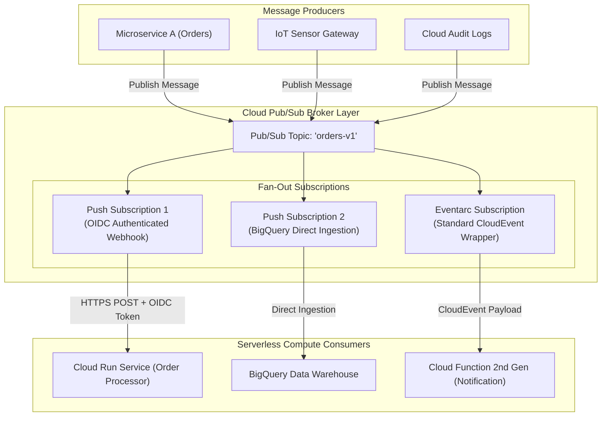

# Topic 78: Pub/Sub Integration

---

## 1. What Is It?

**Pub/Sub Integration** within serverless architectures refers to the technical integration pattern and communication binding between Google Cloud Pub/Sub and serverless compute runtimes—specifically **Google Cloud Run, Cloud Functions 2nd Gen, and Eventarc**.

In event-driven serverless systems, Pub/Sub serves as the central asynchronous message broker, decoupling event producers (microservices, IoT gateways, database change streams) from serverless event consumers.

Pub/Sub integrates with serverless targets through two primary patterns:
1. **Push Subscriptions (Webhook Integration)**: Pub/Sub acts as an active HTTP client, delivering incoming messages directly to serverless endpoints (Cloud Run / Cloud Functions) via HTTPS POST webhooks.
2. **Eventarc Pub/Sub Triggers**: Eventarc intercepts Pub/Sub topic events, wrapping message payloads into standardized **CloudEvents** JSON formats and delivering them to serverless targets with built-in IAM OIDC authentication.

Key capabilities of serverless Pub/Sub integration include:
- **Automatic Scale-to-Zero and Scale-Up**: Cloud Run and Cloud Functions instances scale up dynamically as Pub/Sub message queue depth increases, and scale back to 0 when the queue drains.
- **Dead-Letter Topics (DLQ)**: Automatically routes un-processable "poison pill" messages to a secondary topic after $N$ failed delivery attempts.
- **OIDC Service Account Authentication**: Secures Push subscriptions by signing outbound HTTP requests with GCP Service Account identity tokens.

### Real-World Analogy
Think of Pub/Sub Integration in a serverless architecture like an automated central mail distribution center for a corporation:
- **Direct Synchronous Calls (Hand-delivering Memos)**: Manager A walks over to Manager B's desk to hand them a document. If Manager B is out sick or away on vacation (Service Downtime), Manager A stands by their desk waiting indefinitely (Connection Timeout).
- **Pub/Sub Push Integration (Pneumatic Tube Delivery)**: Manager A drops the document into a central pneumatic tube labeled `invoices-topic` (Pub/Sub Topic). The central distribution center routes copies of the memo to Manager B's and Manager C's incoming mail slots (Fan-Out Subscriptions). A sensor detects a new memo, automatically wakes up an assistant (Cloud Run Scale-from-Zero), processes the document, and drops the assistant back to sleep when finished.

---

## 2. Where Does It Fit?

Pub/Sub Integration decouples event producers from serverless compute runtimes via Push Subscriptions or Eventarc.



---

## 3. Core Concepts

| Concept / Setting | Description | Technical Function | Best Practice |
|---|---|---|---|
| **Push Subscription** | Webhook delivery configuration | Delivers messages via HTTPS POST to serverless endpoints. | Use Push Subscriptions for serverless targets. |
| **OIDC Authentication** | Service Account token injection | Signs HTTP POST webhooks with OIDC Bearer Tokens. | **Mandatory**: Authenticate all Push endpoints. |
| **Ack Deadline** | Max time endpoint has to return HTTP 200 | Range: 10s to 600s (Default: 10s). | Match Ack Deadline to serverless endpoint processing time. |
| **Dead-Letter Topic (DLQ)** | Poison pill isolation queue | Captures messages exceeding max delivery attempts. | Set `--dead-letter-topic` on all production subscriptions. |
| **CloudEvent Format** | Standardized JSON event payload | Wraps Pub/Sub message data into CloudEvent schema. | Parse `cloud_event.data.message` in 2nd Gen functions. |

---

## 4. How It Works

Push delivery, authentication verification, and acknowledgment operate deterministically:

```text
Publisher sends message to Pub/Sub Topic `orders-v1`
              ↓
Pub/Sub Push Subscription evaluates target endpoint `https://order-api.run.app`
              ↓
Generates OIDC Bearer Token signed by assigned Service Account
              ↓
Sends HTTPS POST request to Cloud Run endpoint with `Authorization: Bearer ID_TOKEN` header
              ↓
Cloud Run verifies OIDC token -> Processes message payload -> Returns HTTP 200 SUCCESS
              ↓
Pub/Sub receives HTTP 200 -> Acknowledges (`ack`) and deletes message from subscription!
```

1. **HTTP Status Code Acknowledgment**: Returning HTTP `200`, `201`, `202`, or `204` acknowledges (`ack`) the message. Returning any other status code (or timing out) acts as a `nack`, causing Pub/Sub to retry delivery.
2. **Exponential Backoff**: Pub/Sub automatically scales retry intervals exponentially when endpoints return errors.

---

## 5. Production Scenario

### Serverless E-Commerce Order Processing Pipeline with DLQ & OIDC Protection

```text
Requirement: Ingest order messages from Pub/Sub, delivering them to a private Cloud Run microservice using OIDC authentication, configuring a 30-second Ack Deadline, and isolating un-processable messages to a Dead-Letter Topic after 5 failed attempts.
    ↓
Architecture: Pub/Sub Topic + OIDC Push Subscription + Cloud Run Private Service + DLQ.
    ↓
Setup Execution Steps (`gcloud`):
  1. Create Main Topic & DLQ Topic:
     `gcloud pubsub topics create order-events`
     `gcloud pubsub topics create order-dlq`
  2. Create Push Subscription with OIDC Auth & DLQ:
     ```bash
     gcloud pubsub subscriptions create order-cloudrun-push-sub \
         --topic=order-events \
         --push-endpoint="https://order-service-12345.a.run.app/pubsub-handler" \
         --push-auth-service-account="sa-pubsub-invoker@prod-proj.iam.gserviceaccount.com" \
         --ack-deadline=30 \
         --dead-letter-topic=order-dlq \
         --max-delivery-attempts=5 \
         --min-retry-backoff=10s \
         --max-retry-backoff=300s
     ```
  3. Grant Invoker Role to Service Account on Cloud Run:
     `gcloud run services add-iam-policy-binding order-service --member="serviceAccount:sa-pubsub-invoker@prod-proj.iam.gserviceaccount.com" --role="roles/run.invoker" --region=us-central1`
    ↓
Result: Secures endpoint with OIDC; processes messages asynchronously; automatically isolates poison pills to `order-dlq`.
```

*Why Selected*: Combines OIDC security, proper Ack Deadline alignment, exponential backoff retries, and automated Dead-Letter Queue isolation.

---

## 6. Hands-On Lab

### Prerequisites
- Active GCP Project with Cloud Pub/Sub and Cloud Run APIs enabled.
- Cloud Shell or `gcloud` CLI.
- IAM permissions: `roles/pubsub.admin` and `roles/run.admin`.

### Console Method
1. Log into [Google Cloud Console](https://console.cloud.google.com/).
2. Navigate to **Analytics** → **Pub/Sub** → **Topics** → Create topic `demo-integration-topic`.
3. Deploy a sample Cloud Run service (`demo-receiver`) or use an existing service URL.
4. In Pub/Sub Console, click **SUBSCRIPTIONS** → Click **CREATE SUBSCRIPTION**:
   - Subscription ID: `demo-push-sub`.
   - Topic: `demo-integration-topic`.
   - Delivery type: Select **Push**.
   - Endpoint URL: Enter your Cloud Run HTTPS URL.
   - Enable Authentication: Check **Enable authentication** → Select target Service Account.
   - Click **CREATE**.
5. Test: Publish a test message to `demo-integration-topic` → Check Cloud Run service logs for received HTTP POST payload.

### CLI Method
Create a Pub/Sub topic and Push Subscription to a Cloud Run service using `gcloud`:

```bash
# Set variables
PROJECT_ID="your-gcp-project-id"
REGION="us-central1"
TOPIC_NAME="demo-integration-cli"
SUB_NAME="demo-push-cli-sub"

# 1. Create a Pub/Sub Topic
gcloud pubsub topics create $TOPIC_NAME

# 2. Deploy a lightweight hello Cloud Run service to act as endpoint
gcloud run deploy demo-push-target \
    --image=us-docker.pkg.dev/cloudrun/container/hello \
    --region=$REGION \
    --allow-unauthenticated

ENDPOINT_URL=$(gcloud run services describe demo-push-target --region=$REGION --format="value(status.url)")

# 3. Create a Push Subscription pointing to the Cloud Run endpoint
gcloud pubsub subscriptions create $SUB_NAME \
    --topic=$TOPIC_NAME \
    --push-endpoint=$ENDPOINT_URL \
    --ack-deadline=30

# 4. Publish a test message to the topic
gcloud pubsub topics publish $TOPIC_NAME --message="Hello Serverless PubSub Integration!"
```

### Verification
*Expected Result*: Querying Cloud Run logs via `gcloud run services logs read demo-push-target --region=$REGION` displays received POST request.

### Cleanup
Delete resources:

```bash
gcloud pubsub subscriptions delete $SUB_NAME --quiet
gcloud pubsub topics delete $TOPIC_NAME --quiet
gcloud run services delete demo-push-target --region=$REGION --quiet
```

---

## 7. Security

### Pub/Sub Serverless Integration Security Rules
- **OIDC Endpoint Authentication**: ALWAYS enforce OIDC authentication (`--push-auth-service-account`) on Push Subscriptions. Cloud Run endpoints MUST enforce `--no-allow-unauthenticated`.
- **Grant `roles/run.invoker` Role**: The Service Account assigned to the Push Subscription MUST be granted `roles/run.invoker` on Cloud Run or `roles/cloudfunctions.invoker` on Cloud Functions.
- **Payload Validation**: Serverless endpoints MUST validate incoming payload fields and catch unhandled exceptions to prevent crashing container instances.

```text
BAD PRACTICE:
Deploying a Cloud Run endpoint with `--allow-unauthenticated` and creating an un-authenticated Pub/Sub Push Subscription.
Risk: Anyone on the public internet can send spoofed HTTP POST requests directly to your Cloud Run endpoint, bypassing Pub/Sub.

PRODUCTION PRACTICE:
Set `--no-allow-unauthenticated` on Cloud Run. Enable **OIDC Authentication** on the Pub/Sub Push Subscription.
```

---

## 8. Scaling & High Availability

Pub/Sub Driven Serverless Autoscaling:

```text
1,000 Messages Published to Pub/Sub Topic
   ↓ (Pub/Sub Push Engine + Cloud Run Autoscaler)
Generates 1,000 Concurrent HTTPS POST Requests -> Scales Cloud Run Instances from 0 to 10 -> Scales back to 0 when finished
```

- **Backpressure & Concurrency Tuning**: Tune Cloud Run `--concurrency` and Pub/Sub `--max-delivery-attempts` to manage backpressure without overloading downstream databases.

---

## 9. Cost

### Detailed Billing Architecture
- **Pub/Sub Ingestion & Delivery**: Billed per GB of data published and delivered (~$40.00 per TB; first 10 GB per month free).
- **Serverless Compute**: Cloud Run / Cloud Functions instances are billed ONLY for the vCPU and RAM seconds consumed while processing incoming HTTP POST webhook requests.
- **Scale-to-Zero Savings**: When zero messages are published, both Pub/Sub and the serverless consumer incur $0 compute billing cost.

---

## 10. Monitoring & Troubleshooting

### Diagnostic Tools
- **Pub/Sub Subscription Metrics**: Track `pubsub.googleapis.com/subscription/num_unacked_messages` and `oldest_unacked_message_age`.
- **Cloud Run Request Logs**: Filter by `protoPayload.responseCode` in Cloud Logging to check for HTTP 500 or 403 errors.

### Troubleshooting Matrix

| Symptom | Possible Cause | What to Check | Fix |
|---|---|---|---|
| Endpoint returns `HTTP 403 Forbidden` | Push Subscription Service Account lacks `roles/run.invoker` | Cloud Run IAM Policy | Grant `roles/run.invoker` to the Push Subscription Service Account. |
| Duplicate message processing occurring | Serverless processing duration exceeds Pub/Sub Ack Deadline | Ack Deadline setting | Increase `--ack-deadline` or make endpoint handler **Idempotent**. |
| Messages accumulating in Pub/Sub backlog | Serverless endpoint returning HTTP 500 errors | Cloud Run Container Logs | Fix unhandled exception bug in serverless application code. |

---

## 11. Common Mistakes

```text
Mistake: Assuming that a Push Subscription delivering a message to Cloud Run guarantees exactly-once delivery.
Why: Misunderstanding Pub/Sub delivery guarantees.
Impact: Network retries cause the serverless endpoint to process the exact same message twice.
Correct approach: Design all serverless endpoint handlers to be **Idempotent** (check message IDs in Firestore or Redis).

Mistake: Setting a 10-second Ack Deadline on a Push Subscription where the Cloud Run container takes 25 seconds to process heavy PDF files.
Why: Leaving default 10-second Ack Deadline.
Impact: Pub/Sub assumes the endpoint failed and sends duplicate HTTP POST requests continuously.
Correct approach: Set `--ack-deadline=60` to accommodate application processing times.
```

---

## 12. Production Best Practices

- [ ] Use **Push Subscriptions with OIDC Authentication** (`--push-auth-service-account`) for serverless endpoints.
- [ ] Set **`--no-allow-unauthenticated`** on Cloud Run endpoints and grant `roles/run.invoker` to the Pub/Sub SA.
- [ ] Match the **Ack Deadline** (`--ack-deadline`) to actual serverless container processing times.
- [ ] Implement **Dead-Letter Topics (DLQ)** with `--max-delivery-attempts=5` on all production subscriptions.
- [ ] Design all serverless endpoint handlers to be **Idempotent**.
- [ ] Automate Topics, Push Subscriptions, DLQs, and IAM bindings using Infrastructure as Code (Terraform).

---

## 13. Hyperscaler / Enterprise Perspective

```text
Personal / Learning
  Un-authenticated Push → Single Topic → Default Ack Deadline → Non-Idempotent Handler
        ↓
Small Production
  OIDC Authenticated Push → Cloud Run Private Service → Custom Ack Deadline → basic DLQ
        ↓
Enterprise Environment
  Eventarc CloudEvents → VPC Private Ingress → Dead-Letter Queue Alerting → Secret Manager
        ↓
Hyperscaler Environment
  100% Policy-Governed Event Mesh → Multi-Region Push Delivery → Automated Poison Pill Triage Pipelines
        ↓
```

In a hyperscaler environment, Pub/Sub Integration is the foundation of **Enterprise Event-Driven Architectures**. Microservices publish events to regional Pub/Sub topics. **Push Subscriptions** and **Eventarc** route messages to private **Cloud Run** services authenticated via OIDC tokens. Security Command Center enforces **OIDC Authentication** across all endpoints, while **Dead-Letter Topics** automatically catch and isolate malformed payloads to ensure 99.99% event pipeline resiliency.

---

## 14. Real Project Questions

### Q1: How does Pub/Sub Push Subscription OIDC authentication secure a private Cloud Run endpoint?
**Answer:** When OIDC authentication is configured on a Push Subscription (`--push-auth-service-account=SA_EMAIL`), Pub/Sub automatically generates a short-lived **OIDC Bearer Token** signed by Google for that Service Account and includes it in the `Authorization: Bearer ID_TOKEN` HTTP header. The private Cloud Run endpoint (configured with `--no-allow-unauthenticated`) verifies the token's signature and IAM permissions (`roles/run.invoker`), rejecting any un-authenticated internet requests.

### Q2: What happens when a serverless endpoint returns an HTTP 500 error or times out during Pub/Sub Push delivery?
**Answer:** Returning any HTTP status code other than `200`, `201`, `202`, or `204` (or failing to respond within the Ack Deadline) is treated by Pub/Sub as a **negative acknowledgment (`nack`)**. Pub/Sub retains the message in the subscription and automatically schedules redelivery using **exponential backoff**. If a Dead-Letter Topic is configured and max delivery attempts are exceeded, the message is routed to the DLQ.

### Q3: Why is matching the Pub/Sub Ack Deadline to serverless endpoint processing time critical?
**Answer:** If the Pub/Sub **Ack Deadline** is shorter than the time required for a Cloud Run container to process a message (e.g., Ack Deadline = 10s, processing time = 25s), Pub/Sub assumes the container died and redelivers the message to another container instance while the first container is still working. This causes unnecessary duplicate executions and compute resource waste.

---

## 15. Quick Decision Guide

| Requirement | Recommended Approach | Reason |
|---|---|---|
| Triggering a private Cloud Run microservice asynchronously whenever an order event is published | **Pub/Sub Push Subscription (with OIDC Auth)** | Delivers HTTPS POST webhooks directly to Cloud Run keylessly. |
| Isolating un-processable "poison pill" messages after 5 failed serverless endpoint retries | **Pub/Sub Dead-Letter Topic (`--max-delivery-attempts=5`)** | Automatically reroutes failing messages to a secondary DLQ topic. |
| Streaming Pub/Sub messages directly into a BigQuery table with zero serverless code | **Pub/Sub BigQuery Direct Subscription** | Ingests messages directly into BigQuery without Cloud Run or Cloud Functions code. |

### When should I use it?
- Essential integration pattern for connecting asynchronous Pub/Sub event streams to serverless Cloud Run and Cloud Functions runtimes on GCP.

### When should I NOT use it?
- Do not use Push Subscriptions for synchronous client-facing APIs requiring immediate HTTP response payloads.

---

## 16. Related Services

```text
               [78. PubSub Integration]
              /           |            \
      Cloud Run      Cloud Functions   BigQuery
      (Push Endpoint)(2nd Gen FaaS)    (Direct Ingestion)
           |              |                 |
      Executes Web   Executes Event     Stores Streamed
      Microservices  Code Snippets      Data Payloads
```

- **Cloud Run**: Primary container runtime receiving Pub/Sub Push webhooks.
- **Cloud Functions 2nd Gen**: FaaS runtime processing Pub/Sub CloudEvents.
- **BigQuery**: Direct ingestion target for Pub/Sub BigQuery Subscriptions.

---

## 17. Cheat Sheet

### Integration Patterns
- **Push Subscription**: Pub/Sub sends HTTPS POST to endpoint.
- **OIDC Auth**: `--push-auth-service-account=SA_EMAIL`.
- **Ack Rules**: HTTP 200/201/202/204 = `ack`; All others = `nack` & retry.
- **DLQ**: `--dead-letter-topic=DLQ_TOPIC --max-delivery-attempts=5`.

### Useful Commands
```bash
# Create an OIDC Authenticated Push Subscription to Cloud Run
gcloud pubsub subscriptions create SUB_NAME \
    --topic=TOPIC_NAME \
    --push-endpoint="https://SERVICE.a.run.app/path" \
    --push-auth-service-account="SA_EMAIL" \
    --ack-deadline=30 --dead-letter-topic=DLQ_TOPIC --max-delivery-attempts=5

# Grant Cloud Run Invoker Role to Push Service Account
gcloud run services add-iam-policy-binding SERVICE_NAME \
    --member="serviceAccount:SA_EMAIL" --role="roles/run.invoker" --region=us-central1
```

---

## 18. Learning Connection

- **Previous Topic**: [77. Cloud Scheduler](../77-cloud-scheduler/README.md)
- **Next Topic**: [79. Eventarc](../79-eventarc/README.md)
