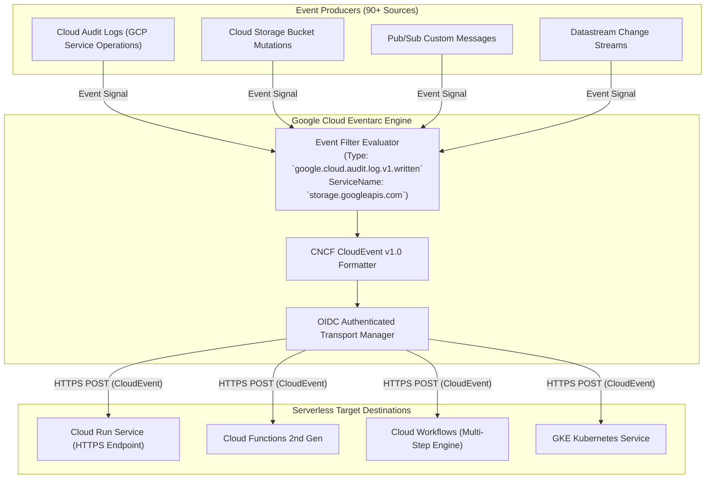

# Topic 79: Eventarc

---

## 1. What Is It?

**Google Cloud Eventarc** is a fully managed, serverless event routing platform that allows developers to build decoupled, event-driven architectures by asynchronously routing events from **90+ Google Cloud services (via Cloud Audit Logs)**, custom applications (via Cloud Pub/Sub), and third-party SaaS providers (via Workflows/Webhooks) directly to serverless execution targets.

Eventarc delivers events using the open-source **CNCF CloudEvents v1.0 specification**, ensuring a standardized JSON data structure across all event producers and consumers.

Key architectural capabilities of Eventarc include:
1. **Unified Event Router**: Intercepts events from Cloud Storage mutations, BigQuery dataset updates, IAM policy changes, Pub/Sub topics, and custom applications without custom polling code.
2. **CloudEvents Standard**: Wraps all event payloads into standardized CloudEvent JSON schemas (`type`, `source`, `subject`, `id`, `time`, `data`).
3. **Flexible Destinations**: Delivers events to **Google Cloud Run**, **Cloud Functions 2nd Gen**, **Cloud Workflows**, or **GKE Kubernetes Services**.
4. **Declarative Event Triggers**: Filters events by specific parameters (e.g., triggering a function ONLY when a file is uploaded to bucket `raw-data` with extension `.pdf`).

### Real-World Analogy
Think of Eventarc like an automated international air traffic control and flight dispatch network:
- **Individual Airline Dispatchers (Custom Polling Scripts)**: Every airline running separate radio operators to manually call every gate to check if plane doors opened or luggage was loaded.
- **Eventarc (Unified Master Radar Dispatcher)**: Sensors across the airport emit standardized radar blips (CloudEvents) whenever *anything* happens: Gate 4 Door Opened (`cloud.audit.log`), Luggage Loaded (`gcs.object.finalize`), Fuel Truck Arrived (`pubsub.message`). Eventarc reads the master radar, filters by Gate Number, and dispatches the exact right ground crew (Cloud Run Service) instantly without gates ever talking to each other directly.

---

## 2. Where Does It Fit?

Eventarc intercepts event signals from Cloud Audit Logs, GCS, and Pub/Sub, routing standardized CloudEvents to serverless destinations.



---

## 3. Core Concepts

| Eventarc Element | Technical Function | Example Attribute | Best Practice |
|---|---|---|---|
| **Trigger** | Declarative event routing rule binding source to destination. | `gcloud eventarc triggers create` | Name triggers descriptively (`trigger-gcs-pdf`). |
| **Event Source** | System generating the underlying event. | Audit Logs, Direct GCS, Pub/Sub | Use Audit Logs for tracking admin operations. |
| **Event Filter** | Attribute criteria determining when a trigger fires. | `type=google.cloud.storage.object.v1.finalized` | Filter strictly by specific bucket or service name. |
| **CloudEvent** | CNCF standardized JSON event wrapper format. | `specversion: "1.0"` | Parse `cloud_event.data` in serverless targets. |
| **Destination** | Serverless runtime receiving the HTTPS POST CloudEvent. | Cloud Run, Cloud Functions 2nd Gen, Workflows | Secure destinations with `--no-allow-unauthenticated`. |

---

## 4. How It Works

Audit Log event capture, CloudEvent formatting, and trigger routing operate deterministically:

```text
Admin deletes a BigQuery Dataset in GCP Console
              ↓
BigQuery emits Cloud Audit Log entry (`google.cloud.bigquery.v2.DatasetService.DeleteDataset`)
              ↓
Eventarc Trigger intercepts Audit Log entry matching filter criteria
              ↓
Eventarc formats payload into CNCF CloudEvent v1.0 JSON:
  {
    "specversion": "1.0",
    "type": "google.cloud.audit.log.v1.written",
    "source": "//cloudaudit.googleapis.com/...",
    "data": { ... }
  }
              ↓
Eventarc sends HTTPS POST with OIDC Bearer Token to Cloud Run Security Service
              ↓
Cloud Run processes security alert -> Sends Slack notification!
```

1. **Audit Log Prerequisite**: To trigger Eventarc from 90+ GCP services, **Admin Read / Data Write Cloud Audit Logging** MUST be enabled for the target service in IAM settings.
2. **Standardized Schema**: CloudEvents standardizes event headers (`id`, `source`, `type`, `time`), separating event metadata from application-specific data.

---

## 5. Production Scenario

### Real-Time Infrastructure Security Incident Response Pipeline

```text
Requirement: Detect whenever a developer modifies a Cloud Storage bucket IAM policy or deletes a BigQuery table, instantly routing the security event to a private Cloud Run Security Service that logs the incident and revokes unauthorized permissions.
    ↓
Architecture: Cloud Audit Logs + Eventarc Trigger + Cloud Run Private Service + Eventarc Service Account.
    ↓
Eventarc Trigger Creation Command (`gcloud`):
  ```bash
  gcloud eventarc triggers create sec-iam-audit-trigger \
      --location=us-central1 \
      --destination-run-service=sec-incident-service \
      --destination-run-region=us-central1 \
      --destination-run-path="/security-event" \
      --event-filters="type=google.cloud.audit.log.v1.written" \
      --event-filters="serviceName=storage.googleapis.com" \
      --event-filters="methodName=storage.setIamPolicy" \
      --service-account="sa-eventarc-invoker@prod-proj.iam.gserviceaccount.com"
  ```
    ↓
Operational Result: Intercepts IAM policy mutations on GCS buckets in sub-2 seconds; wraps event into a CloudEvent; delivers to private Cloud Run service with OIDC authentication.
```

*Why Selected*: Intercepts real-time GCP operational events via Cloud Audit Logs without writing custom polling scripts or modifying source GCP services.

---

## 6. Hands-On Lab

### Prerequisites
- Active GCP Project with Eventarc, Cloud Run, and Eventarc Publishing APIs enabled.
- Cloud Shell or `gcloud` CLI.
- IAM permissions: `roles/eventarc.admin` and `roles/run.admin`.

### Console Method
1. Log into [Google Cloud Console](https://console.cloud.google.com/).
2. Navigate to **Serverless** → **Eventarc** → **Triggers**.
3. Click **CREATE TRIGGER** at top.
4. Trigger name: `demo-gcs-trigger`, Region: `us-central1`.
5. Event provider: Select **Cloud Storage**.
6. Event type: Select **google.cloud.storage.object.v1.finalized** (Object created).
7. Bucket: Select or enter target GCS bucket name.
8. Destination: Select **Cloud Run** → Select target Cloud Run service.
9. Service Account: Select designated Eventarc Service Account.
10. Click **CREATE** (Initializes Eventarc trigger in 30 seconds).

### CLI Method
Create an Eventarc trigger listening to a Pub/Sub topic and routing to Cloud Run using `gcloud`:

```bash
# Set variables
PROJECT_ID="your-gcp-project-id"
REGION="us-central1"
TRIGGER_NAME="demo-eventarc-cli"
TOPIC_NAME="demo-eventarc-topic"

# 1. Create a Pub/Sub Topic to serve as custom event source
gcloud pubsub topics create $TOPIC_NAME

# 2. Deploy a hello Cloud Run service as destination
gcloud run deploy demo-eventarc-target \
    --image=us-docker.pkg.dev/cloudrun/container/hello \
    --region=$REGION \
    --allow-unauthenticated

# 3. Create an Eventarc Trigger for Pub/Sub events
gcloud eventarc triggers create $TRIGGER_NAME \
    --location=$REGION \
    --destination-run-service=demo-eventarc-target \
    --destination-run-region=$REGION \
    --event-filters="type=google.cloud.pubsub.topic.v1.messagePublished" \
    --transport-topic=$TOPIC_NAME

# 4. List active Eventarc triggers
gcloud eventarc triggers list --location=$REGION
```

### Verification
*Expected Result*: `gcloud eventarc triggers list` displays `$TRIGGER_NAME` bound to `demo-eventarc-target`.

### Cleanup
Delete trigger, topic, and Cloud Run service:

```bash
gcloud eventarc triggers delete $TRIGGER_NAME --location=$REGION --quiet
gcloud pubsub topics delete $TOPIC_NAME --quiet
gcloud run services delete demo-eventarc-target --region=$REGION --quiet
```

---

## 7. Security

### Eventarc Security & IAM Roles
- **Eventarc Service Agent IAM Roles**: The Eventarc Service Agent (`service-PROJECT_NUM@gcp-sa-eventarc.iam.gserviceaccount.com`) MUST be granted `roles/eventarc.serviceAgent`.
- **Pub/Sub Service Agent Publisher Role**: When triggering from Cloud Storage or Audit Logs, the Pub/Sub Service Agent MUST be granted `roles/pubsub.publisher` on underlying transport topics.
- **OIDC Destination Protection**: Configure Eventarc triggers with dedicated Service Accounts (`--service-account`) granted `roles/run.invoker` on target Cloud Run services.

```text
BAD PRACTICE:
Creating Eventarc triggers pointing to public Cloud Run services without validating CloudEvent signatures or using dedicated Service Accounts.
Risk: Allows malicious callers to bypass Eventarc and post fake CloudEvent payloads directly to destination webhooks.

PRODUCTION PRACTICE:
Enforce `--no-allow-unauthenticated` on Cloud Run. Assign a dedicated **custom Service Account** to the Eventarc trigger.
```

---

## 8. Scaling & High Availability

Pub/Sub Transport Scaling & SLA:

```text
Thousands of GCP Audit Log / Storage Events Occurring Simultaneously
   ↓ (Eventarc Engine via Internal Pub/Sub Transport)
Formats CloudEvents in parallel -> Delivers to Auto-scaling Cloud Run Services -> 99.99% Availability SLA
```

- **Underlying Pub/Sub Transport**: Eventarc utilizes Cloud Pub/Sub as its high-throughput transport layer, providing built-in message buffering, retries, and high availability.

---

## 9. Cost

### Eventarc Pricing Model
- **Eventarc Triggers**: Billed per 1,000,000 events processed (~$0.40 per 1M events; first 100,000 events per month are 100% **FREE**).
- **Underlying Pub/Sub & Audit Log Charges**: Standard Pub/Sub message transport and Cloud Audit Logging fees apply.
- **Serverless Compute Costs**: Target Cloud Run or Cloud Functions runtimes are billed strictly for compute time consumed while handling incoming CloudEvents.

---

## 10. Monitoring & Troubleshooting

### Diagnostic Tools
- **Eventarc Triggers Console UI**: Displays Trigger status (`Active` / `Error`), Event Type, and Destination URL.
- **Cloud Logging Tracing**: Filter logs by `resource.type="eventarc_trigger"` to inspect delivery attempts and status codes.

### Troubleshooting Matrix

| Symptom | Possible Cause | What to Check | Fix |
|---|---|---|---|
| Trigger status shows `ERROR` on creation | Pub/Sub Service Agent missing `roles/pubsub.publisher` role | GCP Service Agent IAM bindings | Grant `roles/pubsub.publisher` to `service-NUM@gcp-sa-pubsub.iam.gserviceaccount.com`. |
| Audit Log events not triggering Eventarc | Cloud Audit Logging disabled for target service | IAM -> Audit Logs Console | Enable **Admin Read / Data Write** Audit Logs for the target GCP service. |
| Target Cloud Run returns `HTTP 403 Forbidden` | Trigger Service Account lacks `roles/run.invoker` | Cloud Run IAM Policy | Grant `roles/run.invoker` to the Eventarc trigger's Service Account. |

---

## 11. Common Mistakes

```text
Mistake: Expecting Eventarc to capture Audit Log events for a GCP service where Cloud Audit Logging is turned off.
Why: Assuming all GCP services emit Audit Logs continuously by default.
Impact: Eventarc triggers never fire when resource mutations occur.
Correct approach: Verify and enable **Cloud Audit Logging** (Data Write / Admin Read) for the target GCP service in IAM settings.

Mistake: Hardcoding event parsing logic expecting raw Pub/Sub or raw GCS JSON instead of the CNCF CloudEvent wrapper format.
Why: Not accounting for Eventarc's CloudEvent standardization.
Impact: Serverless target fails to parse payload keys (`KeyError: 'data'`).
Correct approach: Parse payload using the **CNCF CloudEvent v1.0 specification** schema (`cloud_event.data`).
```

---

## 12. Production Best Practices

- [ ] Standardize event payloads using the **CNCF CloudEvent v1.0 specification**.
- [ ] Grant `roles/pubsub.publisher` to the Pub/Sub Service Agent for GCS/Audit Log triggers.
- [ ] Enable **Cloud Audit Logging** for services providing event signals to Eventarc.
- [ ] Set **`--no-allow-unauthenticated`** on Cloud Run destination services.
- [ ] Filter Eventarc triggers tightly by **service name, method name, or resource subject**.
- [ ] Automate all Eventarc Triggers and IAM policy bindings using Infrastructure as Code (Terraform).

---

## 13. Hyperscaler / Enterprise Perspective

```text
Personal / Learning
  Direct Pub/Sub Triggers → Un-authenticated Endpoints → Manual Scripting → No Audit Logs
        ↓
Small Production
  Eventarc GCS Triggers → Cloud Functions 2nd Gen → Basic Filters → CloudEvents Format
        ↓
Enterprise Environment
  Eventarc Audit Log Triggers → Private Cloud Run Services → Custom Service Accounts → IAM Auditing
        ↓
Hyperscaler Environment
  100% Policy-Governed Global Event Mesh → Automated Security Incident Trigger Response → Cross-Region Event Architecture
```

In a hyperscaler environment, Eventarc is the core **Event Routing Mesh**. Enterprise Security Operations (SecOps) teams deploy Eventarc triggers listening to **Cloud Audit Logs** across entire GCP Organization hierarchies. Any unauthorized IAM policy change, firewall deletion, or KMS key modification fires an Eventarc trigger in sub-2 seconds, routing standardized **CloudEvents** to private **Cloud Run** incident response microservices that remediate security violations automatically.

---

## 14. Real Project Questions

### Q1: What is Eventarc, and how does it standardize event routing across 90+ GCP services?
**Answer:** **Google Cloud Eventarc** is a serverless event routing platform that intercepts events from 90+ GCP services (via Cloud Audit Logs), Cloud Storage mutations, Pub/Sub topics, and custom apps. It standardizes all event routing by wrapping raw event payloads into the open-source **CNCF CloudEvents v1.0 specification** JSON format, delivering consistent event structures to serverless destinations like Cloud Run, Cloud Functions 2nd Gen, and Cloud Workflows.

### Q2: What IAM pre-requisite permissions are mandatory for Eventarc to route Cloud Storage or Audit Log events successfully?
**Answer:** Two critical IAM roles are required:
1. The **Eventarc Service Agent** (`service-PROJECT_NUM@gcp-sa-eventarc.iam.gserviceaccount.com`) must have `roles/eventarc.serviceAgent`.
2. The **Google Cloud Pub/Sub Service Agent** (`service-PROJECT_NUM@gcp-sa-pubsub.iam.gserviceaccount.com`) MUST be granted **`roles/pubsub.publisher`** because Eventarc uses Pub/Sub internally as its transport layer for GCS and Audit Log events.

### Q3: What is the benefit of using Cloud Audit Logs as an event source for Eventarc triggers?
**Answer:** Using **Cloud Audit Logs** allows Eventarc to turn virtually ANY Google Cloud API call or management action (such as creating a GKE cluster, deleting a BigQuery table, or modifying an IAM role) into an asynchronous event trigger *without writing custom event producer code or modifying existing GCP services*.

---

## 15. Quick Decision Guide

| Requirement | Recommended Approach | Reason |
|---|---|---|
| Triggering a private Cloud Run service whenever a user modifies an IAM policy or deletes a GCP resource | **Eventarc Trigger (Cloud Audit Logs Source)** | Intercepts 90+ GCP service API operations via Audit Logs with sub-2s latency. |
| Standardizing event payloads across multi-cloud and multi-language serverless microservices | **Eventarc (CNCF CloudEvent v1.0 Specification)** | Wraps all event payloads into standardized CloudEvent JSON schema (`source`, `type`, `data`). |
| Building complex multi-step serverless orchestration workflows triggered by Cloud Storage uploads | **Eventarc Trigger -> Target: Cloud Workflows** | Triggers serverless Workflows directly to execute complex multi-step logic. |

### When should I use it?
- Essential serverless event routing platform for building decoupled, event-driven architectures listening to GCP Audit Logs, Cloud Storage, and Pub/Sub events.

### When should I NOT use it?
- Do not use Eventarc for high-frequency synchronous RPC calls where the producer requires an immediate response payload.

---

## 16. Related Services

```text
                  [79. Eventarc]
                 /       |       \
        Cloud Audit Logs  Cloud Run    Cloud Workflows
        (Event Source)   (Destination) (Orchestration Target)
             |               |                 |
        Emits 90+ GCP    Executes          Orchestrates
        Service Events   Container Code    Multi-Step Tasks
```

- **Cloud Audit Logs**: Primary event source emitting 90+ GCP service operations to Eventarc.
- **Cloud Run**: Primary serverless container destination for Eventarc CloudEvents.
- **Cloud Workflows**: Multi-step orchestration engine invoked by Eventarc triggers.

---

## 17. Cheat Sheet

### Core Attributes
- **Specification**: CNCF CloudEvents v1.0 standard (`type`, `source`, `subject`, `data`).
- **Sources**: Cloud Audit Logs (90+ services), GCS mutations, Pub/Sub topics.
- **Destinations**: Cloud Run, Cloud Functions 2nd Gen, Cloud Workflows, GKE Services.
- **IAM Prerequisite**: Pub/Sub Service Agent needs `roles/pubsub.publisher`.

### Useful Commands
```bash
# Create an Eventarc Trigger for GCS Object Creation
gcloud eventarc triggers create TRIGGER_NAME \
    --location=us-central1 \
    --destination-run-service=SERVICE_NAME \
    --destination-run-region=us-central1 \
    --event-filters="type=google.cloud.storage.object.v1.finalized" \
    --event-filters="bucket=BUCKET_NAME" \
    --service-account=SA_EMAIL

# Create an Eventarc Trigger for Audit Log Events
gcloud eventarc triggers create AUDIT_TRIGGER_NAME \
    --location=us-central1 \
    --destination-run-service=SERVICE_NAME \
    --destination-run-region=us-central1 \
    --event-filters="type=google.cloud.audit.log.v1.written" \
    --event-filters="serviceName=storage.googleapis.com" \
    --event-filters="methodName=storage.setIamPolicy" \
    --service-account=SA_EMAIL
```

---

## 18. Learning Connection

- **Previous Topic**: [78. Pub/Sub Integration](../78-pubsub-integration/README.md)
- **Next Topic**: [80. API Gateway](../80-api-gateway/README.md)
