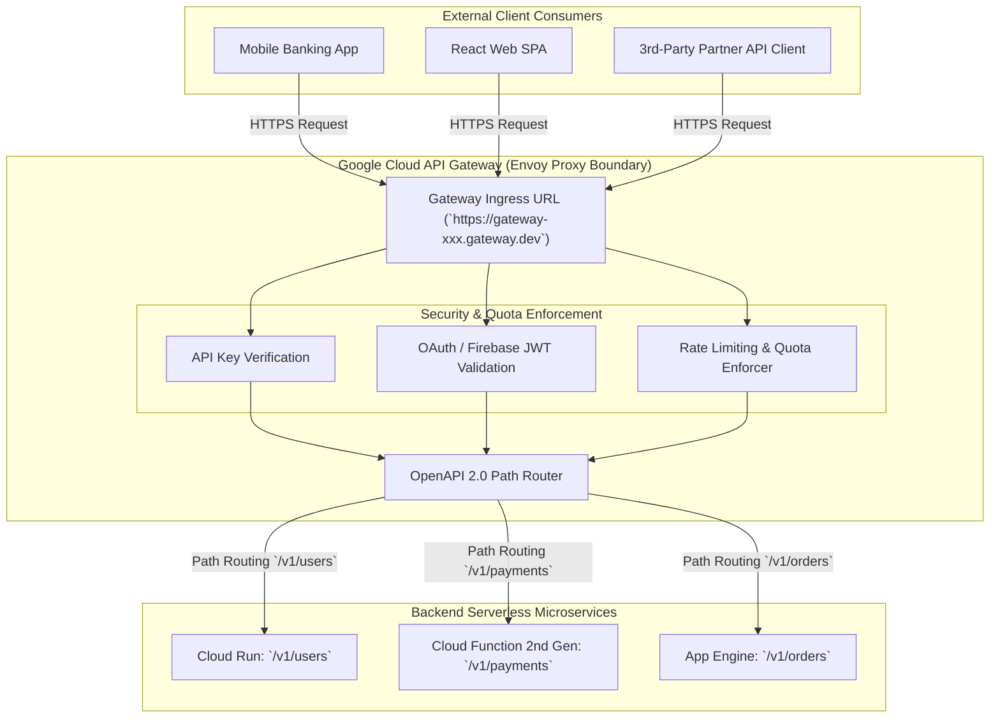

# Topic 80: API Gateway

---

## 1. What Is It?

**Google Cloud API Gateway** is a fully managed, serverless API management proxy service that allows developers to secure, inspect, route, rate-limit, and manage HTTP REST APIs backed by serverless GCP runtimes—specifically **Google Cloud Run, Cloud Functions, and App Engine**.

Built on Google's high-performance **Envoy proxy** technology, API Gateway acts as a single, unified entry point for external web, mobile, and third-party clients, abstracting complex backend serverless microservice architectures behind clean, version-controlled OpenAPI definitions.

Key capabilities of Cloud API Gateway include:
1. **OpenAPI 2.0 Specification Support**: Define API routes, parameters, request schemas, and backend targets declaratively using standard OpenAPI (Swagger) YAML definitions.
2. **API Key & JWT Authentication**: Verify API keys and validate Firebase / OAuth 2.0 / OIDC JSON Web Tokens (JWT) at the proxy boundary before forwarding requests to backends.
3. **Built-in Rate Limiting & Quotas**: Protect backend microservices against denial-of-service surges by defining per-minute or per-user request quotas.
4. **Unified Billing & Telemetry**: Seamlessly integrates with Google Cloud Monitoring, Logging, and Service Control for real-time latency dashboards and quota enforcement.

### Real-World Analogy
Think of API Gateway like the front desk concierge and security checkpoint of a 50-story corporate skyscraper:
- **Direct Microservice Access (Un-guarded Office Doors)**: Visitors wander through elevator shafts and hallways looking for accounting, engineering, or legal. Anyone can walk into an office, ask questions, or interrupt workers (No Authentication / No Rate Limiting).
- **API Gateway (Central Lobby Concierge)**: All visitors enter through a single front entrance (Unified Gateway URL). The security Guard verifies photo IDs (JWT Validation), checks visitor badges (API Keys), limits visitor entry to 5 people per minute (Rate Limiting), and directs approved guests to the exact floor and room (Path Routing to Cloud Run / Functions).

---

## 2. Where Does It Fit?

API Gateway sits at the public edge, receiving client HTTPS requests and routing authenticated traffic to Cloud Run, Cloud Functions, or App Engine backends.



---

## 3. Core Concepts

| Resource / Concept | Technical Role | Syntax / File | Best Practice |
|---|---|---|---|
| **API** | Logical API container resource | `gcloud api-gateway apis` | Create 1 API container per product domain (`payments-api`). |
| **API Config** | Versioned OpenAPI spec definition | `openapi.yaml` | Version API Configs (`config-v1`, `config-v2`). |
| **Gateway** | Managed Envoy proxy deployment | `gcloud api-gateway gateways` | Deploy Gateways in target user regions. |
| **Backend Binding** | x-google-backend extension | `x-google-backend: address: URL` | Point address directly to Cloud Run / Functions HTTPS URL. |
| **Security Definitions** | Authentication schema | `securityDefinitions: api_key:` | Enforce JWT or API key security on all non-public routes. |

---

## 4. How It Works

OpenAPI route parsing, JWT validation, and backend service invocation operate deterministically:

```text
Client sends HTTP GET `https://my-gateway.gateway.dev/v1/orders` with `Authorization: Bearer JWT_TOKEN`
              ↓
API Gateway Envoy proxy intercepts request
              ↓
Validates JWT signature against OAuth issuer public keys -> Validates API Key & Quotas
              ↓
(Security Passed): Matches path `/v1/orders` to `x-google-backend` directive in OpenAPI spec
              ↓
Injects Service Account OIDC token -> Forwards request to private Cloud Run service
              ↓
Cloud Run processes request -> API Gateway returns HTTP 200 payload to Client in <15ms!
```

1. **`x-google-backend` Extension**: Custom OpenAPI extension instructing API Gateway where to forward requests (e.g., `x-google-backend: address: https://my-function.run.app`).
2. **Keyless Backend Authentication**: API Gateway automatically authenticates to downstream Cloud Run / Functions using a GCP Service Account assigned to the Gateway.

---

## 5. Production Scenario

### Unified Enterprise Mobile API Gateway with Firebase Auth & Cloud Run Routing

```text
Requirement: Expose a unified public API endpoint (`https://api.company.com`) for a mobile app. Requests to `/users` must route to Cloud Run; requests to `/process-payment` must route to a 2nd Gen Cloud Function. All endpoints must validate Firebase Auth JWT tokens and enforce a 100 request/minute quota.
    ↓
Architecture: API Gateway + OpenAPI 2.0 + Firebase Auth + Cloud Run + Cloud Functions.
    ↓
OpenAPI Definition (`openapi.yaml`):
  ```yaml
  swagger: "2.0"
  info:
    title: "Mobile Enterprise API"
    version: "1.0.0"
  host: "mobile-gateway-12345.gateway.dev"
  schemes: ["https"]
  produces: ["application/json"]
  securityDefinitions:
    firebase_auth:
      authorizationUrl: ""
      flow: "implicit"
      type: "oauth2"
      x-google-issuer: "https://securetoken.google.com/prod-proj"
      x-google-jwks_uri: "https://www.googleapis.com/service_accounts/v1/metadata/x509/securetoken@system.gserviceaccount.com"
  paths:
    /v1/users:
      get:
        summary: "Get User Profiles"
        operationId: "getUsers"
        security:
          - firebase_auth: []
        x-google-backend:
          address: "https://user-service-xyz.a.run.app"
    /v1/payments:
      post:
        summary: "Process Payment"
        operationId: "processPayment"
        security:
          - firebase_auth: []
        x-google-backend:
          address: "https://us-central1-prod-proj.cloudfunctions.net/payment-fn"
  ```
    ↓
Deployment Commands (`gcloud`):
  1. Create API: `gcloud api-gateway apis create mobile-api`
  2. Create Config: `gcloud api-gateway api-configs create config-v1 --api=mobile-api --openapi-spec=openapi.yaml`
  3. Create Gateway: `gcloud api-gateway gateways create prod-gateway --api=mobile-api --api-config=config-v1 --location=us-central1`
    ↓
Result: Secures both backends with Firebase JWT validation; hides individual microservice URLs behind 1 unified gateway.
```

*Why Selected*: Unifies multiple serverless backends behind a single version-controlled OpenAPI definition with centralized JWT authentication and quota controls.

---

## 6. Hands-On Lab

### Prerequisites
- Active GCP Project with API Gateway and Service Control APIs enabled.
- Cloud Shell or `gcloud` CLI.
- IAM permissions: `roles/apigateway.admin`.

### Console Method
1. Log into [Google Cloud Console](https://console.cloud.google.com/).
2. Navigate to **API Management** → **API Gateway**.
3. Click **CREATE GATEWAY** at top.
4. Name: `demo-gateway-ui`, Location: `us-central1`.
5. API Spec: Select **Upload OpenAPI spec** → Select local `openapi.yaml` file.
6. Service Account: Select designated API Gateway Service Account.
7. Click **CREATE** (Initializes Envoy proxy gateway in 3-5 minutes).
8. Once active, copy Gateway Hostname (`https://demo-gateway-ui-xxx.gateway.dev`).
9. Test endpoint using `curl`.

### CLI Method
Create an API, API Config, and Gateway using `gcloud`:

```bash
# Set variables
PROJECT_ID="your-gcp-project-id"
REGION="us-central1"
API_NAME="demo-api-cli"
CONFIG_NAME="demo-config-v1"
GATEWAY_NAME="demo-gateway-cli"

# 1. Create a local simple OpenAPI spec
cat <<EOF > openapi.yaml
swagger: "2.0"
info:
  title: "Demo Public API"
  version: "1.0.0"
schemes:
  - "https"
paths:
  /hello:
    get:
      summary: "Public Hello Endpoint"
      operationId: "helloWorld"
      x-google-backend:
        address: "https://us-docker.pkg.dev/cloudrun/container/hello"
EOF

# 2. Create the API container resource
gcloud api-gateway apis create $API_NAME --project=$PROJECT_ID

# 3. Create the API Config from openapi.yaml
gcloud api-gateway api-configs create $CONFIG_NAME \
    --api=$API_NAME \
    --openapi-spec=openapi.yaml \
    --project=$PROJECT_ID

# 4. Create the Gateway deployment
gcloud api-gateway gateways create $GATEWAY_NAME \
    --api=$API_NAME \
    --api-config=$CONFIG_NAME \
    --location=$REGION \
    --project=$PROJECT_ID
```

### Verification
*Expected Result*: Querying `gcloud api-gateway gateways describe $GATEWAY_NAME --location=$REGION` displays `STATE: ACTIVE` and provides default hostname.

### Cleanup
Delete Gateway, API Config, and API:

```bash
gcloud api-gateway gateways delete $GATEWAY_NAME --location=$REGION --quiet
gcloud api-gateway api-configs delete $CONFIG_NAME --api=$API_NAME --quiet
gcloud api-gateway apis delete $API_NAME --quiet
rm openapi.yaml
```

---

## 7. Security

### API Gateway Security & Policy Rules
- **Gateway Service Account Permissions**: The Service Account bound to API Gateway MUST be granted `roles/run.invoker` on Cloud Run or `roles/cloudfunctions.invoker` on Cloud Functions to execute keyless backend requests.
- **Enforce Strict Security Definitions**: Configure `securityDefinitions` in OpenAPI to mandate API Keys or JWT tokens on all sensitive routes.
- **Hide Backend URLs**: Keep Cloud Run and Cloud Functions endpoints private (`--no-allow-unauthenticated`), allowing access ONLY through API Gateway.

```text
BAD PRACTICE:
Exposing Cloud Run backend service URLs publicly while relying on application-level code to validate authentication tokens.
Risk: Allows attackers to bypass API Gateway, avoiding rate limiting and central logging.

PRODUCTION PRACTICE:
Lock down Cloud Run backends to accept requests ONLY from API Gateway's Service Account identity.
```

---

## 8. Scaling & High Availability

Regional Auto-Scaling Envoy Proxies:

```text
Incoming HTTPS Request Surge (10,000 Requests/sec)
   ↓ (API Gateway Serverless Envoy Cluster)
Scales proxy capacity automatically -> Validates JWTs -> Routes to auto-scaling Cloud Run backends
```

- **Serverless Envoy Proxy Mesh**: API Gateway automatically scales Envoy proxy instances to handle massive concurrent traffic bursts without manual load balancer configuration.

---

## 9. Cost

### Cloud API Gateway Pricing Model
- **API Call Volume**: Billed per 1,000,000 API calls processed per month:
  - First 2,000,000 calls per month: **100% FREE**.
  - 2M to 1 Billion calls per month: ~$3.00 per 1M calls.
- **Backend Service Costs**: Standard Cloud Run, Cloud Functions, or App Engine compute execution rates apply for downstream processing.

---

## 10. Monitoring & Troubleshooting

### Diagnostic Tools
- **Cloud Monitoring API Gateway Metrics**: Track `apigateway.googleapis.com/gateway/request_count`, `latency`, and `error_count`.
- **Cloud Logging Service Control Logs**: Filter by `resource.type="api_gateway"` to view HTTP status codes (401 Unauthorized, 403 Forbidden, 429 Quota Exceeded).

### Troubleshooting Matrix

| Symptom | Possible Cause | What to Check | Fix |
|---|---|---|---|
| Gateway returns `HTTP 500 Internal Server Error` | API Gateway Service Account lacks `roles/run.invoker` on backend | Gateway Service Account IAM | Grant `roles/run.invoker` on Cloud Run service to Gateway SA. |
| Gateway returns `HTTP 401 Unauthorized` | Invalid or missing API key or JWT bearer token | Request HTTP headers | Pass valid `key=API_KEY` parameter or `Authorization: Bearer JWT` header. |
| Gateway creation fails: `OpenAPI parsing error` | Invalid YAML syntax or unsupported OpenAPI 3.0 feature | `openapi.yaml` file syntax | Ensure spec uses OpenAPI 2.0 (Swagger 2.0) format. |

---

## 11. Common Mistakes

```text
Mistake: Uploading an OpenAPI 3.0 (OAS3) specification file to Cloud API Gateway.
Why: Assuming API Gateway supports the latest OpenAPI 3.0 specification.
Impact: API Config creation fails with `Unsupported OpenAPI version` errors.
Correct approach: Convert your OpenAPI specification to **OpenAPI 2.0 (Swagger 2.0)** format.

Mistake: Leaving Cloud Run backend services publicly accessible (`--allow-unauthenticated`) after setting up API Gateway.
Why: Forgetting to lock down backend service permissions.
Impact: Clients can bypass API Gateway security controls and rate limits by calling the raw Cloud Run URL directly.
Correct approach: Update Cloud Run services to `--no-allow-unauthenticated`.
```

---

## 12. Production Best Practices

- [ ] Standardize API definitions on **OpenAPI 2.0 (Swagger 2.0)** syntax.
- [ ] Enforce **JWT or API Key Security Definitions** on all non-public routes.
- [ ] Grant **`roles/run.invoker`** to the API Gateway Service Account on backend services.
- [ ] Lock down Cloud Run backends to **`--no-allow-unauthenticated`**.
- [ ] Attach custom domain names using **Global HTTP(S) Load Balancing** in front of API Gateway.
- [ ] Automate APIs, API Configs, and Gateways using Infrastructure as Code (Terraform).

---

## 13. Hyperscaler / Enterprise Perspective

```text
Personal / Learning
  Raw Cloud Run URLs → No Authentication → Un-monitored Paths → Single Region
        ↓
Small Production
  API Gateway Envoy Proxy → OpenAPI 2.0 Spec → API Key Security → Cloud Run Routing
        ↓
Enterprise Environment
  Firebase / OAuth JWT Validation → Quota & Rate Limiting → Private Service Accounts → IAP Protection
        ↓
Hyperscaler Environment
  100% Policy-Governed Edge API Mesh → Multi-Region Gateway Failover → Global HTTP(S) LB + Cloud Armor WAF
```

In a hyperscaler environment, API Gateway is the central **Edge API Management Proxy**. Enterprise platform teams manage OpenAPI 2.0 specifications in Git repositories. API Gateway sits behind a **Global HTTP(S) Load Balancer** with **Cloud Armor WAF** protection. The gateway validates **OAuth 2.0 / OIDC JWT tokens** at the edge, enforcing rate limits and routing requests to private **Cloud Run** and **Cloud Functions** microservices across multiple GCP regions.

---

## 14. Real Project Questions

### Q1: What is the primary difference between Google Cloud API Gateway and Apigee?
**Answer:** **Cloud API Gateway** is a lightweight, serverless API proxy designed specifically for securing and routing APIs backed by GCP serverless runtimes (Cloud Run, Cloud Functions, App Engine) using OpenAPI 2.0 specs. **Apigee** is an enterprise-grade API management platform providing advanced features like developer portals, monetizing APIs, complex API transformations, multi-cloud routing, and legacy enterprise software integration.

### Q2: How does API Gateway securely authenticate to downstream private Cloud Run backends?
**Answer:** When deploying an API Gateway, it is assigned a dedicated GCP **Service Account**. When a client request passes API Gateway security checks, API Gateway automatically generates a short-lived **OIDC Bearer Token** for its assigned Service Account and includes it in the outbound HTTP request to Cloud Run. Because Cloud Run has granted `roles/run.invoker` to that Service Account, the private request is authorized and processed.

### Q3: Which OpenAPI specification version is supported by Cloud API Gateway?
**Answer:** Cloud API Gateway strictly supports **OpenAPI 2.0 (Swagger 2.0)** specifications. API specs written in OpenAPI 3.0 must be converted to OpenAPI 2.0 before creating API Configs in API Gateway.

---

## 15. Quick Decision Guide

| Requirement | Recommended Approach | Reason |
|---|---|---|
| Unifying multiple Cloud Run and Cloud Functions microservices behind a single public HTTPS domain URL | **Google Cloud API Gateway** | Managed Envoy proxy routing OpenAPI 2.0 paths to serverless backends. |
| Validating Firebase Auth or OAuth JWT tokens at the cloud edge before forwarding requests to Cloud Run | **API Gateway (`securityDefinitions` in OpenAPI)** | Validates JWT signatures at the edge proxy boundary in sub-millisecond time. |
| Protecting serverless backends against denial-of-service surges by capping clients to 100 requests/min | **API Gateway Rate Limiting & Quotas** | Enforces per-minute or per-user request quotas at the API gateway layer. |

### When should I use it?
- Essential serverless API management service for securing, routing, rate-limiting, and managing APIs backed by Cloud Run, Cloud Functions, and App Engine.

### When should I NOT use it?
- Do not use API Gateway if you require complex enterprise API monetization, developer portals, or advanced SOAP-to-REST transformations (use Apigee instead).

---

## 16. Related Services

```text
                   [80. API Gateway]
                  /        |        \
        Cloud Run    Cloud Functions   Secret Manager
        (Backend)    (Backend)         (API Keys)
            |              |                |
        Processes      Executes Event   Stores JWT /
        Microservices  Code Snippets    API Keys
```

- **Cloud Run**: Primary containerized backend service routed to by API Gateway.
- **Cloud Functions**: Primary FaaS backend service routed to by API Gateway.
- **Secret Manager**: Stores OAuth client secrets and API keys for gateway authentication.

---

## 17. Cheat Sheet

### Core Features
- **Engine**: Fully managed Envoy proxy.
- **Specification**: OpenAPI 2.0 (Swagger 2.0).
- **Backend Extension**: `x-google-backend: address: URL`.
- **Security**: API Keys, Firebase Auth, OAuth 2.0 / OIDC JWT.
- **Free Tier**: 2,000,000 free API calls per month ($3.00/1M thereafter).

### Useful Commands
```bash
# Create an API container
gcloud api-gateway apis create API_NAME

# Create an API Config from OpenAPI spec
gcloud api-gateway api-configs create CONFIG_NAME \
    --api=API_NAME --openapi-spec=openapi.yaml --backend-auth-service-account=SA_EMAIL

# Deploy a Gateway
gcloud api-gateway gateways create GATEWAY_NAME \
    --api=API_NAME --api-config=CONFIG_NAME --location=us-central1
```

---

## 18. Learning Connection

- **Previous Topic**: [79. Eventarc](../79-eventarc/README.md)
- **Next Topic**: [81. Event-Driven Architectures](../81-event-driven-architectures/README.md)
