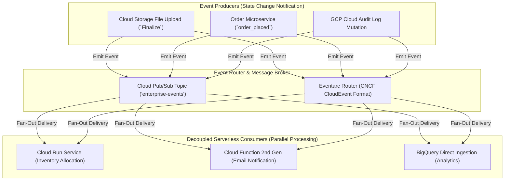

# Topic 81: Event-Driven Architectures

---

## 1. What Is It?

**Event-Driven Architecture (EDA)** on Google Cloud Platform is an asynchronous software design paradigm where decoupled microservices communicate by producing, detecting, routing, and consuming state-change notifications called **Events**.

Unlike traditional synchronous request-response architectures (where Client A calls Service B directly and waits for an HTTP 200 response), Event-Driven Architectures emit events asynchronously to an event broker. The producer service does not know or care which downstream consumers react to the event.

Core building blocks of GCP Event-Driven Architectures include:
1. **Event Producers**: Systems that detect state changes and emit event notifications (Cloud Storage object uploads, BigQuery dataset mutations, IoT sensor data, Pub/Sub publishers).
2. **Event Router / Broker**: Asynchronous messaging middleware (**Cloud Pub/Sub** and **Eventarc**) that buffers, filters, standardizes (CNCF CloudEvents), and routes events.
3. **Event Consumers**: Serverless execution runtimes (**Cloud Run, Cloud Functions 2nd Gen, Cloud Workflows**) that scale from zero to process incoming event payloads.
4. **Resiliency Patterns**: Dead-Letter Topics (DLQ), Exponential Backoff Retries, and Idempotent Event Handlers.

### Real-World Analogy
Think of an Event-Driven Architecture like an automated modern emergency response dispatch center:
- **Synchronous Architecture (Direct Phone Cascade)**: A 911 caller phones Fire Station 1 directly. The firefighter picks up, listens to the story, hangs up, dials Police Station 2, waits on hold for 3 minutes, explains the story again, hangs up, and dials Ambulance Company 3. If any phone line is busy (Service Down), the entire emergency response stalls.
- **Event-Driven Architecture (Master Emergency Dispatch Broker)**: A 911 operator broadcasts a single emergency event code (`fire_reported_building_A`) to a central radio frequency (Event Router / Pub/Sub). Automatically, Fire Engine 1, Police Cruiser 2, and Ambulance 3 receive the signal simultaneously (Fan-Out Subscribers). They react independently in parallel without talking to each other directly, while an automated recorder archives the event for official records (Audit Trail).

---

## 2. Where Does It Fit?

Event-Driven Architectures connect event producers to serverless consumers via Pub/Sub or Eventarc, maintaining state in Cloud Storage or BigQuery.



---

## 3. Core Concepts

| Architecture Pattern | Description | Technical GCP Component | Best Practice |
|---|---|---|---|
| **Pub/Sub Fan-Out** | 1 event published -> N independent subscribers receive copies. | Cloud Pub/Sub Topic + N Subscriptions | Decouple microservices completely using Fan-Out. |
| **Audit Log Eventing** | Triggering serverless code on GCP resource mutations. | Cloud Audit Logs + Eventarc | Use Audit Logs for automated SecOps remediation. |
| **Idempotency** | Processing duplicate events produces identical results. | Unique Event ID tracking in Redis/Firestore | **Mandatory**: Make all event handlers idempotent. |
| **Poison Pill Handling** | Isolating malformed messages after repeated failures. | Dead-Letter Topics (DLQ) | Set `--max-delivery-attempts=5` on subscriptions. |
| **Sagas Pattern** | Orchestrating distributed multi-step transactions. | Cloud Workflows + Cloud Run | Use Sagas with compensation steps for multi-DB updates. |

---

## 4. How It Works

Asynchronous event emission, fan-out routing, and idempotent execution operate deterministically:

```text
User completes purchase -> Order Service writes order to DB -> Emits `order_created` to Pub/Sub
              ↓
Pub/Sub Broker Fans Out `order_created` event to 3 independent subscriptions simultaneously:
  - Sub 1 (Eventarc -> Cloud Run): Allocates warehouse inventory in 1.2s.
  - Sub 2 (Push -> Cloud Function): Sends confirmation email to user in 0.8s.
  - Sub 3 (Direct BigQuery): Streams order data into analytics warehouse in 0.4s.
              ↓
(Resiliency Handling): Sub 1 fails due to network glitch -> Pub/Sub retries Sub 1 with Exponential Backoff.
              ↓
Sub 2 and Sub 3 complete successfully without waiting for Sub 1! Zero Blocking!
```

1. **At-Least-Once Delivery**: GCP event systems guarantee events are delivered *at least once*. Event handlers MUST use unique event IDs to detect and ignore duplicate processing attempts.
2. **Event Sourcing**: Instead of storing current state only, systems record the full sequence of events (`order_created`, `order_paid`, `order_shipped`), enabling historical auditing and replay capabilities.

---

## 5. Production Scenario

### Enterprise E-Commerce Reactive Order Fulfillment Pipeline

```text
Requirement: Build an enterprise order fulfillment system where placing an order triggers 3 independent real-time actions: 1) Inventory reduction in Cloud SQL, 2) PDF Invoice generation in Cloud Storage, and 3) Real-time BigQuery analytics ingestion, with zero tight coupling and automated handling of corrupted event payloads.
    ↓
Architecture: Cloud Pub/Sub (Topic + 3 Subscriptions) + Eventarc + Cloud Run + Cloud Functions 2nd Gen + BigQuery.
    ↓
Event Flow Design:
  1. Producer: Order API publishes JSON message to `orders-v1` topic (`ordering_key = customer_id`).
  2. Subscription 1 (Push to Cloud Run `inventory-service`):
     - Function: Reduces stock in Cloud SQL.
     - Security: OIDC Service Account Authentication (`sa-pubsub-invoker@...`).
  3. Subscription 2 (Eventarc to Cloud Functions 2nd Gen `pdf-generator`):
     - Function: Creates PDF invoice in GCS bucket `invoices-prod`.
  4. Subscription 3 (BigQuery Direct Ingestion):
     - Function: Streams order record directly into `analytics.raw_orders`.
  5. Dead-Letter Queue: If any subscription fails 5 times, message moves to `orders-dlq-topic`.
    ↓
Operational Result: Adding a 4th consumer (e.g., Fraud Detection) requires 0 code changes to the Order API; system scales to 0 off-peak.
```

*Why Selected*: Combines Pub/Sub fan-out, OIDC push security, 2nd Gen functions, BigQuery direct ingestion, and Dead-Letter Queue poison pill protection.

---

## 6. Hands-On Lab

### Prerequisites
- Active GCP Project with Cloud Pub/Sub, Cloud Run, and Eventarc APIs enabled.
- Cloud Shell or `gcloud` CLI.
- IAM permissions: `roles/pubsub.admin` and `roles/run.admin`.

### CLI Method
Create a Pub/Sub fan-out architecture triggering two independent Cloud Run consumer services:

```bash
# Set variables
PROJECT_ID="your-gcp-project-id"
REGION="us-central1"
TOPIC_NAME="eda-orders-topic"

# 1. Create central event topic
gcloud pubsub topics create $TOPIC_NAME

# 2. Deploy Consumer 1: Inventory Service
gcloud run deploy eda-inventory-svc \
    --image=us-docker.pkg.dev/cloudrun/container/hello \
    --region=$REGION \
    --allow-unauthenticated

URL_INV=$(gcloud run services describe eda-inventory-svc --region=$REGION --format="value(status.url)")

# 3. Deploy Consumer 2: Notification Service
gcloud run deploy eda-notification-svc \
    --image=us-docker.pkg.dev/cloudrun/container/hello \
    --region=$REGION \
    --allow-unauthenticated

URL_NOTIF=$(gcloud run services describe eda-notification-svc --region=$REGION --format="value(status.url)")

# 4. Create Push Subscriptions for Fan-Out Architecture
gcloud pubsub subscriptions create sub-inventory --topic=$TOPIC_NAME --push-endpoint=$URL_INV
gcloud pubsub subscriptions create sub-notification --topic=$TOPIC_NAME --push-endpoint=$URL_NOTIF

# 5. Publish a single event message to the topic
gcloud pubsub topics publish $TOPIC_NAME --message='{"order_id": 9901, "item": "Laptop"}'
```

### Verification
*Expected Result*: Querying logs for both services (`gcloud run services logs read eda-inventory-svc` and `eda-notification-svc`) confirms both independent consumers received HTTP POST requests simultaneously.

### Cleanup
Delete resources:

```bash
gcloud pubsub subscriptions delete sub-inventory --quiet
gcloud pubsub subscriptions delete sub-notification --quiet
gcloud pubsub topics delete $TOPIC_NAME --quiet
gcloud run services delete eda-inventory-svc --region=$REGION --quiet
gcloud run services delete eda-notification-svc --region=$REGION --quiet
```

---

## 7. Security

### Event-Driven Security & Perimeter Guardrails
- **Authenticate Event Endpoints**: Enforce OIDC authentication (`--push-auth-service-account`) on Push Subscriptions. Enforce `--no-allow-unauthenticated` on target Cloud Run services.
- **Principle of Least Privilege**: Assign dedicated Service Accounts to event producers and consumers. Restrict `roles/pubsub.publisher` to producers and `roles/run.invoker` to consumers.
- **Encrypt Events with CMEK**: Protect Pub/Sub topics and event storage backends at rest using Cloud KMS keys.

```text
BAD PRACTICE:
Publishing sensitive un-encrypted customer PII directly into Pub/Sub message bodies without IAM topic restrictions.
Risk: Unauthorized subscriptions attached to the topic can read sensitive customer PII.

PRODUCTION PRACTICE:
Enforce strict IAM topic permissions. Encrypt topics with **CMEK** and sanitize event payloads.
```

---

## 8. Scaling & High Availability

Asynchronous Fan-Out Scaling:

```text
Single Event Published (e.g., Black Friday Flash Sale Starts)
   ↓ (GCP Serverless Event Routing Engine)
Fans out to 10 Independent Subscriptions -> Scales 10 Cloud Run Services from 0 to 50 Instances concurrently
```

- **Extreme Fault Tolerance**: If 1 consumer service experiences a crash, Pub/Sub buffers events safely in the subscription queue while other consumer services continue processing events normally.

---

## 9. Cost

### Event-Driven Pricing Architecture
- **Pub/Sub Broker**: Billed per GB published and delivered (~$40.00 per TB; first 10 GB free).
- **Eventarc Router**: Billed per 1M events (~$0.40 per 1M events; first 100k free).
- **Serverless Consumers**: Cloud Run / Cloud Functions billed strictly for execution time during event handling ($0 when idle).

---

## 10. Monitoring & Troubleshooting

### Diagnostic Tools
- **Cloud Monitoring Pub/Sub Backlog**: Track `pubsub.googleapis.com/subscription/num_unacked_messages` and `oldest_unacked_message_age`.
- **Cloud Trace**: Trace event propagation end-to-end across microservices using W3C Trace Context headers.

### Troubleshooting Matrix

| Symptom | Possible Cause | What to Check | Fix |
|---|---|---|---|
| Un-acknowledged event backlog growing | Consumer service crashing or Ack Deadline expiring | Cloud Run container logs | Fix application bug or increase subscription `--ack-deadline`. |
| Consumer executing duplicate side-effects | Non-idempotent consumer handling retried events | Consumer code logic | Implement **Idempotency** using unique event IDs in Firestore or Redis. |
| Event payload failing validation | Producer changed payload JSON schema without versioning | Event payload structure | Version event topics (e.g., `orders-v1`, `orders-v2`) or use Avro schemas. |

---

## 11. Common Mistakes

```text
Mistake: Writing non-idempotent event consumers (e.g., executing a credit card charge without checking if the transaction ID was already processed).
Why: Assuming events are delivered exactly once.
Impact: Network retries cause double-charging customers.
Correct approach: Design all event consumers to be **Idempotent** (check event IDs in Redis/Firestore before executing side-effects).

Mistake: Building tightly coupled synchronous HTTP chains (Service A calls B, which calls C, which calls D).
Why: Carrying over monolithic architecture habits to the cloud.
Impact: High latency, cascading failures, and zero scale-to-zero capabilities.
Correct approach: Refactor into an **Asynchronous Event-Driven Architecture** using Pub/Sub fan-out.
```

---

## 12. Production Best Practices

- [ ] Use **Pub/Sub Fan-Out** to decouple event producers from consumers.
- [ ] Design all event consumers to be **Idempotent**.
- [ ] Standardize event schemas using the **CNCF CloudEvent v1.0 specification**.
- [ ] Enforce **OIDC Authentication** (`--push-auth-service-account`) on all Push endpoints.
- [ ] Implement **Dead-Letter Topics (DLQ)** on all production subscriptions.
- [ ] Automate event topics, subscriptions, triggers, and IAM bindings using Infrastructure as Code (Terraform).

---

## 13. Hyperscaler / Enterprise Perspective

```text
Personal / Learning
  Single Producer & Consumer → Un-authenticated Webhooks → Non-Idempotent Handlers → Manual Setup
        ↓
Small Production
  Pub/Sub Fan-Out → OIDC Authenticated Push → Cloud Functions 2nd Gen → Basic DLQ
        ↓
Enterprise Environment
  Eventarc CloudEvents Mesh → Dead-Letter Queue Alerting → Schema Registry → Cloud Workflows Sagas
        ↓
Hyperscaler Environment
  100% Policy-Governed Global Event Mesh → Multi-Region Failure Resiliency → Automated Poison Pill Triage
```

In a hyperscaler environment, Event-Driven Architecture is the standard for **Enterprise System Integration**. Microservices publish events to global **Cloud Pub/Sub** topics. **Eventarc** intercepts Cloud Audit Logs and system mutations, delivering standardized **CloudEvents** to **Cloud Run** and **Cloud Functions 2nd Gen** runtimes. **Dead-Letter Topics** capture poison pills, while SREs monitor **Cloud Trace** data to audit end-to-end event propagation across global regions.

---

## 14. Real Project Questions

### Q1: What is the fundamental difference between a Synchronous Request-Response Architecture and an Asynchronous Event-Driven Architecture?
**Answer:** In a **Synchronous Request-Response Architecture**, the client calls a service directly over HTTP and blocks waiting for an immediate response; if the receiving service is down, the call fails immediately. In an **Event-Driven Architecture**, the producer emits a state-change notification (an event) to an event broker (Pub/Sub) and immediately continues execution. Independent consumers subscribe to the broker and process events asynchronously; if a consumer is down, events buffer safely in the queue until the consumer recovers.

### Q2: What is the Pub/Sub Fan-Out pattern, and how does it benefit microservice scalability?
**Answer:** The **Fan-Out pattern** occurs when a single event is published to a Pub/Sub topic that has multiple independent subscriptions attached to it. Pub/Sub delivers identical copies of the event message to all attached subscriptions in parallel. This benefits scalability because adding a new downstream microservice (e.g., adding a Fraud Detection service) requires creating a new subscription without modifying or redeploying the original event producer code.

### Q3: What is the Sagas Pattern in event-driven serverless architectures?
**Answer:** The **Sagas Pattern** is a design pattern for managing distributed transactions across multiple microservices without global database locks. A Saga executes a sequence of local transactions; if a step fails (e.g., payment fails after inventory is allocated), the Saga engine (such as **Cloud Workflows**) triggers a series of **compensating transactions** (e.g., releasing the allocated inventory) to roll back the system to a consistent state.

---

## 15. Quick Decision Guide

| Requirement | Recommended Approach | Reason |
|---|---|---|
| Decoupling an order service so that placing an order triggers inventory, email, and analytics in parallel | **Pub/Sub Topic + 3 Fan-Out Subscriptions** | Delivers independent copies of the order event to all 3 consumer services concurrently. |
| Catching and isolating malformed event payloads that fail processing 5 times in a serverless function | **Pub/Sub Dead-Letter Topic (`--max-delivery-attempts=5`)** | Automatically reroutes poison pill messages to a secondary DLQ topic. |
| Orchestrating a multi-step distributed transaction across 4 microservices with automated rollback logic | **Cloud Workflows (Sagas Pattern)** | Serverless workflow orchestrator executing sequential steps and compensating rollbacks. |

### When should I use it?
- Essential architecture pattern for building decoupled, highly scalable, resilient, and serverless applications on GCP.

### When should I NOT use it?
- Do not use Event-Driven Architectures for simple synchronous client calls where the user expects an immediate HTTP response payload.

---

## 16. Related Services

```text
            [81. Event-Driven Architectures]
           /               |               \
    Cloud Pub/Sub       Eventarc       Cloud Workflows
    (Message Broker)   (Event Router)  (Sagas Orchestrator)
         |                 |                   |
    Asynchronous       Standardized        Manages Distributed
    Message Buffering  CloudEvents         Multi-Step Transactions
```

- **Cloud Pub/Sub**: Core asynchronous message broker underpinning event-driven systems.
- **Eventarc**: Event router standardizing events using the CNCF CloudEvent specification.
- **Cloud Workflows**: Serverless orchestrator managing distributed multi-step Sagas transactions.

---

## 17. Cheat Sheet

### Core Building Blocks
- **Event Producer**: Emits state change notification (Pub/Sub, GCS, Audit Logs).
- **Event Broker**: Buffers & routes events (Pub/Sub, Eventarc).
- **Event Consumer**: Serverless execution target (Cloud Run, Cloud Functions 2nd Gen).
- **Guarantees**: At-Least-Once Delivery (Requires Idempotency).
- **Resiliency**: Dead-Letter Topics (DLQ) + Exponential Backoff.

### Architectural Summary
- **Fan-Out**: 1 Topic -> N Subscriptions.
- **Decoupling**: Producers have 0 knowledge of Consumers.
- **Scaling**: Scale-from-zero to N instances on demand.

---

## 18. Learning Connection

- **Previous Topic**: [80. API Gateway](../80-api-gateway/README.md)
- **Next Topic**: [82. Terraform on GCP](../../08-infrastructure-as-code/82-terraform-on-gcp/README.md)
