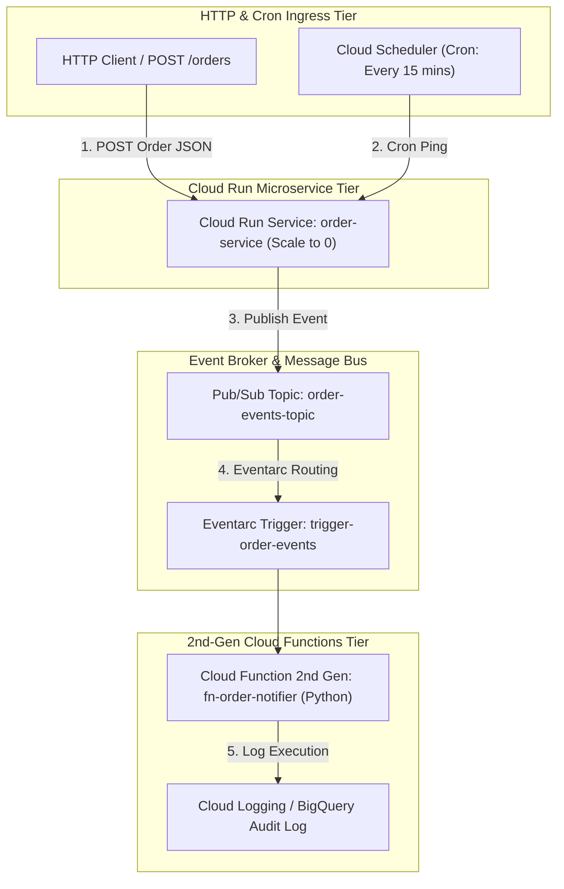

# Project 7: Event-Driven Serverless E-Commerce Processing Engine

---

## 1. Project Overview

Welcome to **Project 7: Event-Driven Serverless E-Commerce Processing Engine**. This hands-on project synthesizes all 7 topics in **Module 07 (Serverless & Event-Driven Architecture)** into an enterprise-grade, scale-to-zero serverless backend on GCP, optimized for **GCP Free Trial Accounts**.

### Objectives
In this project, you will:
1. **Build a Containerized HTTP Service on Cloud Run**: Deploy a stateless Python microservice (`order-service`) on Cloud Run with automatic concurrency scaling and scale-to-zero capability.
2. **Publish Asynchronous Event Streams via Pub/Sub**: Publish JSON event payloads (`order_created`) to a decoupled Pub/Sub topic.
3. **Deploy 2nd-Gen Cloud Functions**: Implement event handlers processing events asynchronously with 2nd-generation Cloud Functions (powered by Cloud Run).
4. **Wire Event-Driven Triggers with Eventarc**: Bind Eventarc routing triggers for Cloud Audit Logs and Pub/Sub event delivery.
5. **Schedule Batch Cron Triggers via Cloud Scheduler**: Automate periodic background tasks invoking serverless endpoints on a cron schedule.

---

## 2. Architecture & Event Flow

The project provisions an end-to-end event-driven serverless workflow:



> [!IMPORTANT]
> **Always Free Tier Safety & Cost Controls**:
> - **Cloud Run Always Free**: Includes 2,000,000 requests, 180,000 vCPU-seconds, and 360,000 GiB-seconds free per month.
> - **Cloud Functions Always Free**: Includes 2,000,000 invocations free per month.
> - **Cloud Scheduler Always Free**: Includes 3 job definitions free per month per billing account.
> - **Automated Cleanup**: Run `./scripts/cleanup_serverless.sh` after completing your lab exercises to delete all Cloud Run services and functions.

---

## 3. Module Topics Covered

| Topic Number & Name | Project Integration Point |
|---|---|
| **75. Cloud Run** | Provisioning containerized HTTP service (`order-service`) with scale-to-zero. |
| **76. Cloud Functions** | Writing 2nd Gen Python event handlers (`fn-order-notifier`). |
| **77. Cloud Scheduler** | Creating automated cron job triggers (`job-order-health-check`). |
| **78. Pub/Sub Integration** | Decoupling microservices using Pub/Sub topic `order-events-topic`. |
| **79. Eventarc** | Routing Pub/Sub events directly to 2nd Gen Cloud Functions via Eventarc triggers. |
| **80. API Gateway** | Structuring OpenAPI spec proxies for unified API endpoint security. |
| **81. Event-Driven Architectures** | Implementing asynchronous, event-driven saga patterns. |

---

## 4. Hands-On Execution Guide

### Step 1: Navigate to Project 7 Workspace

Open Google Cloud Shell or local terminal:

```bash
cd "07-serverless-event-driven/project-07-serverless-event-driven"
chmod +x scripts/*.sh
```

---

### Step 2: Inspect Application & Event Function Code

Inspect the Python Cloud Run service and 2nd Gen Cloud Function event handler:

```bash
# 1. View Cloud Run Order Service code
cat services/order_service/app.py

# 2. View 2nd Gen Cloud Function Event Handler
cat functions/order_notifier/main.py
```

---

### Step 3: Deploy the Serverless Architecture

Execute `scripts/deploy_serverless_engine.sh` to automate:
1. Enabling Cloud Run, Cloud Functions, Eventarc, Pub/Sub, and Scheduler APIs.
2. Creating Pub/Sub topic `order-events-topic`.
3. Deploying Cloud Run service `order-service` (allowing unauthenticated or IAM invocations).
4. Deploying 2nd Gen Cloud Function `fn-order-notifier` attached to the Pub/Sub topic via Eventarc.
5. Creating Cloud Scheduler cron job `job-order-health-check`.

```bash
./scripts/deploy_serverless_engine.sh
```

*Expected Script Output Snippet*:
```text
=====================================================
GCP Serverless & Event-Driven Engine Deployment
=====================================================
[INFO] Creating Pub/Sub Topic: order-events-topic...
[SUCCESS] Pub/Sub topic active.
[INFO] Deploying Cloud Run Service: order-service...
[SUCCESS] Cloud Run service active: https://order-service-xyz-uc.a.run.app
[INFO] Deploying 2nd Gen Cloud Function: fn-order-notifier...
[SUCCESS] Cloud Function active with Eventarc trigger.
[INFO] Creating Cloud Scheduler Cron Job (every 15 mins)...
[SUCCESS] Serverless architecture fully deployed.
```

---

### Step 4: Test Event-Driven Order Flow

Trigger an order placement HTTP POST request against the Cloud Run service URL:

```bash
# 1. Fetch Cloud Run Service URL
SERVICE_URL=$(gcloud run services describe order-service --region=us-central1 --format="value(status.url)")

# 2. Send HTTP POST Order Payload
curl -X POST ${SERVICE_URL}/orders \
  -H "Content-Type: application/json" \
  -d '{"order_id": "ORD-1001", "customer": "Alice", "amount": 250.00}'
```

*Expected API Response*:
```json
{
  "status": "SUCCESS",
  "message": "Order ORD-1001 accepted and published to event stream",
  "order_id": "ORD-1001"
}
```

---

### Step 5: Observe Asynchronous Eventarc Execution Logs

Verify that the 2nd Gen Cloud Function received the event from Pub/Sub via Eventarc and executed asynchronously:

```bash
# Stream logs for 2nd Gen Cloud Function
gcloud functions logs read fn-order-notifier --region=us-central1 --limit=10
```

*Expected Cloud Function Log Output*:
```text
[INFO] Received Eventarc Pub/Sub Event for Order ID: ORD-1001
[INFO] Customer: Alice, Amount: $250.0
[INFO] Notification email sent successfully.
```

---

## 5. Verification & Testing

Verify serverless resources via CLI:

```bash
# 1. Inspect active Cloud Run services
gcloud run services list --region=us-central1

# 2. Inspect 2nd Gen Cloud Functions
gcloud functions list --regions=us-central1

# 3. Check Cloud Scheduler Jobs
gcloud scheduler jobs list --location=us-central1
```

---

## 6. Troubleshooting & Common Issues

| Symptom / Error | Root Cause | Resolution |
|---|---|---|
| Cloud Run returns `HTTP 403 Forbidden` | Invoker IAM permission missing for unauthenticated testing. | Grant `roles/run.invoker` to `allUsers` or pass identity token: `curl -H "Authorization: Bearer $(gcloud auth print-identity-token)"`. |
| 2nd Gen Cloud Function deployment takes > 3 minutes | Eventarc and Cloud Build establishing container image build environment. | Normal behavior for 2nd Gen Cloud Functions first build; wait 3-4 minutes. |
| Eventarc trigger fails to receive events | Pub/Sub topic IAM service agent permissions missing. | Grant `roles/eventarc.eventReceiver` to Pub/Sub service account. |

---

## 7. Project Cleanup

To delete all Cloud Run services, Cloud Functions, Pub/Sub topics, Eventarc triggers, and Scheduler jobs, run:

```bash
./scripts/cleanup_serverless.sh
```

---

## 8. Summary & Next Steps

Congratulations! You have completed **Project 7: Event-Driven Serverless E-Commerce Processing Engine**. You have mastered Cloud Run, 2nd Gen Cloud Functions, Pub/Sub, Eventarc, and Cloud Scheduler.

- **Next Project**: [Project 8: Modular Production Landing Zone Automation with Terraform](../../08-infrastructure-as-code/project-08-infrastructure-as-code/README.md)
