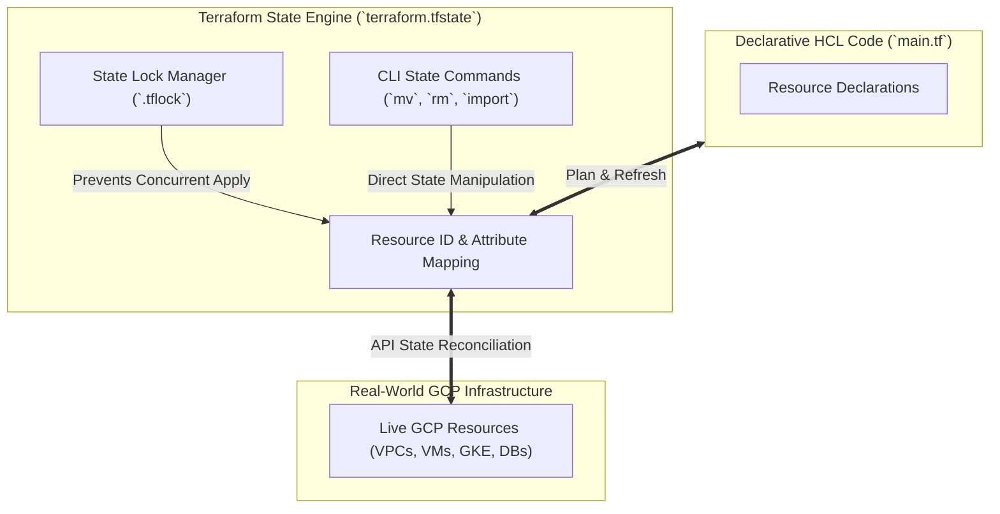

# Topic 86: State Management

---

## 1. What Is It?

**Terraform State Management** is the core operational architecture, state file mapping mechanism, and CLI command framework through which HashiCorp Terraform tracks, stores, synchronizes, locks, and manipulates the binding between declarative HCL code declarations and real-world Google Cloud Platform (GCP) infrastructure resources.

Terraform records metadata about managed resources in a JSON state file (`terraform.tfstate`). This state mapping serves three critical architectural functions:
1. **Real-World Resource Mapping**: Maps abstract HCL resource names (e.g., `google_compute_instance.web`) to unique GCP provider resource IDs (e.g., `projects/proj-1/zones/us-central1-a/instances/web-vm-88`).
2. **Performance Optimization**: Caches GCP resource metadata to avoid making thousands of expensive API calls during dependency graph construction and plan calculations.
3. **Drift Detection & Concurrency Lock**: Enables `terraform plan` to detect changes made out-of-band in the GCP Console and prevents concurrent multi-developer applies via state locking.

Key CLI state management operations include `terraform state list`, `terraform state show`, `terraform state mv`, `terraform state rm`, and `terraform import`.

### Real-World Analogy
Think of Terraform State Management like a central land deeds registry office for a city:
- **HCL Code (Urban Planning Blueprint)**: The master architectural map showing where 100 residential houses should be built.
- **Real-World GCP Resources (Physical Brick Houses)**: The actual physical houses constructed on plot land in the city.
- **Terraform State File (`terraform.tfstate` - Master Registry Ledger)**: The official ledger book recording: "Plot 101 corresponds to Property Deed #88492 owned by House A." If someone physically alters Plot 101 (Drift), the inspector checks the registry ledger (`terraform plan`) to identify the discrepancy. If an existing house was built without the city planner (Un-managed Resource), the registry officer imports the house into the ledger (`terraform import`).

---

## 2. Where Does It Fit?

State management acts as the single source of truth connecting HCL code, execution plans, and GCP REST API resources.



---

## 3. Core Concepts

| State Operation | CLI Command | Functional Description | Best Practice |
|---|---|---|---|
| **List Resources** | `terraform state list` | Lists all resource addresses tracked in state. | Use to inspect state contents quickly. |
| **Show Resource** | `terraform state show ADDR` | Displays detailed attribute values for 1 resource. | Inspect raw attributes stored in state. |
| **Import Resource** | `terraform import ADDR ID` | Brings an existing un-managed GCP resource into state. | Write HCL block first, then run `import`. |
| **Move Resource** | `terraform state mv SRC DST` | Refactors resource address without destroying GCP item. | Use when renaming HCL blocks or moving to modules. |
| **Remove Resource** | `terraform state rm ADDR` | Untracks resource from state without deleting GCP item. | Use when transferring ownership to another state file. |

---

## 4. How It Works

Refresh, plan diff calculation, and state manipulation operate deterministically:

```text
Engineer executes `terraform plan`
              ↓
Terraform reads `terraform.tfstate` -> Obtains GCP Resource IDs
              ↓
Executes GCP API `GET` calls (Refresh Step) -> Updates state in memory with live GCP attributes
              ↓
Compares Live Attributes vs HCL Code -> Detects Infrastructure Drift
              ↓
Generates execution diff plan -> Writes updated state file upon `terraform apply`!
```

1. **Refactoring without Destruction**: Renaming a resource block in HCL (e.g., `google_compute_network.old` to `google_compute_network.new`) without running `terraform state mv` causes Terraform to attempt to **destroy the old VPC and create a new one**.
2. **Import Workflow**: `terraform import` populates the state file but does NOT automatically write HCL code; developers must author matching HCL resource blocks.

---

## 5. Production Scenario

### Zero-Downtime Infrastructure Refactoring & Un-managed Resource Import

```text
Requirement: Import an existing production Cloud SQL database created manually in the GCP Console into Terraform state, and refactor an existing VPC resource into a child module without destroying live production databases or networks.
    ↓
Architecture: `terraform import` + `terraform state mv` + GCS Remote State.
    ↓
Step 1: Import un-managed Cloud SQL database into state:
  - Write matching HCL block in `main.tf`:
    ```hcl
    resource "google_sql_database_instance" "prod_db" {
      name             = "sql-prod-db"
      region           = "us-central1"
      database_version = "POSTGRES_15"
      settings {
        tier = "db-custom-4-16384"
      }
    }
    ```
  - Execute import command:
    `terraform import google_sql_database_instance.prod_db projects/prod-proj/instances/sql-prod-db`
    ↓
Step 2: Refactor VPC resource into a child module without destruction:
  - Execute state move command:
    `terraform state mv google_compute_network.vpc module.network.google_compute_network.vpc`
    ↓
Result: Brings manual database under IaC control and refactors network structure with ZERO production downtime or resource destruction.
```

*Why Selected*: Demonstrates essential real-world production state management commands (`import` and `state mv`) to safely refactor infrastructure without service disruption.

---

## 6. Hands-On Lab

### Prerequisites
- Active GCP Project with Compute Engine API enabled.
- Cloud Shell or local machine with `terraform` CLI installed.
- IAM permissions: `roles/viewer` or `roles/editor`.

### CLI Method
Create a network, use `terraform state` CLI commands to inspect and refactor state, and clean up:

```bash
# Set variables
PROJECT_ID="your-gcp-project-id"

# 1. Create working directory
mkdir state-demo && cd state-demo

# 2. Create main.tf
cat <<EOF > main.tf
terraform {
  required_providers {
    google = { source = "hashicorp/google", version = "~> 5.0" }
  }
}

provider "google" {
  project = "$PROJECT_ID"
  region  = "us-central1"
}

resource "google_compute_network" "vpc_old" {
  name                    = "vpc-state-demo"
  auto_create_subnetworks = false
}
EOF

# 3. Initialize and apply
terraform init
terraform apply -auto-approve

# 4. List resources in state
terraform state list

# 5. Show attributes of the tracked VPC resource
terraform state show google_compute_network.vpc_old

# 6. Refactor HCL block and move state address without destroying network
sed -i 's/vpc_old/vpc_new/g' main.tf
terraform state mv google_compute_network.vpc_old google_compute_network.vpc_new

# 7. Run plan to verify zero changes are required!
terraform plan
```

### Verification
*Expected Result*: `terraform plan` outputs `No changes. Your infrastructure matches the configuration.`, confirming the state refactor succeeded without modifying the GCP network.

### Cleanup
Destroy resource:

```bash
terraform destroy -auto-approve
cd .. && rm -rf state-demo
```

---

## 7. Security

### State File Security & Secret Handling
- **State Files Contain Plaintext Secrets**: The `terraform.tfstate` file stores all resource attributes in plain text, including Cloud SQL passwords, IAM private keys, and service account tokens.
- **Strict IAM Access Controls**: Restrict IAM access (`roles/storage.objectViewer`) on the GCS state bucket to authorized CI/CD Service Accounts and Lead SREs.
- **Enable GCS Encryption & CMEK**: Encrypt the Cloud Storage state bucket using Customer-Managed Encryption Keys (CMEK) via Cloud KMS.

```text
BAD PRACTICE:
Storing `terraform.tfstate` files on un-encrypted developer laptops or public Git repositories.
Risk: Exposes database root passwords, TLS private keys, and service account secrets to unauthorized users.

PRODUCTION PRACTICE:
Store state in a private **GCS Remote Backend** with **CMEK encryption** and strict IAM role bindings.
```

---

## 8. Scaling & High Availability

State File Segmentation & Blast Radius Reduction:

```text
Monolithic Global State File (`terraform.tfstate` containing 2,000 resources -> Slow `refresh` -> High risk of corruption)
   ↓ (State Segmentation Architecture)
Segmented State Files (`dev/state`, `prod/state`, `network/state`, `app/state` -> Fast 5s plan -> Zero cross-environment risk)
```

- **Segment State Files by Layer**: Separate state files into independent infrastructure layers (e.g., Core Network State, GKE Cluster State, Application Workload State) to minimize lock contention and blast radius.

---

## 9. Cost

### State Management Economics
- **State Commands**: All `terraform state` CLI commands execute locally against the state file for **$0 cost**.
- **GCP API Refresh Costs**: Refreshing state queries GCP APIs via GET calls, incurring $0 billing charges.

---

## 10. Monitoring & Troubleshooting

### Diagnostic Tools
- **`terraform state list`**: Instant inventory listing of all resources managed by the current state file.
- **`terraform force-unlock LOCK_ID`**: Releases a stale lock on a GCS remote backend if a previous pipeline run crashed unexpectedly.

### Troubleshooting Matrix

| Symptom | Possible Cause | What to Check | Fix |
|---|---|---|---|
| `terraform apply` attempts to destroy & recreate resource | HCL resource address renamed without state move | `terraform plan` diff output | Cancel apply; run `terraform state mv OLD_ADDR NEW_ADDR`. |
| `Error locking state` on GCS backend | Previous CI/CD job terminated mid-execution leaving `.tflock` | Cloud Storage bucket objects | Verify no job is running, then run `terraform force-unlock LOCK_ID`. |
| `Error: Resource already exists` | Attempting to create a GCP resource that exists un-managed | GCP Console resource listing | Import existing resource using `terraform import ADDR ID`. |

---

## 11. Common Mistakes

```text
Mistake: Manually editing the raw `terraform.tfstate` JSON file using a text editor to fix a state discrepancy.
Why: Attempting a quick manual fix.
Impact: Introduces JSON syntax errors or invalid serial counters, corrupting state completely.
Correct approach: Use official `terraform state` CLI commands (`mv`, `rm`, `import`) to modify state safely.

Mistake: Renaming HCL resource blocks in `main.tf` and running `terraform apply` directly without `terraform state mv`.
Why: Forgetting that Terraform tracks resources by their exact HCL address.
Impact: Terraform destroys the existing live GCP resource and provisions a brand-new resource, causing data loss or downtime.
Correct approach: Run `terraform state mv google_resource.old google_resource.new` before applying.
```

---

## 12. Production Best Practices

- [ ] Store state files in a private **GCS Remote Backend** with state locking enabled.
- [ ] NEVER edit raw `.tfstate` JSON files manually; use `terraform state` CLI tools.
- [ ] Use **`terraform state mv`** when refactoring HCL blocks or converting to modules.
- [ ] Use **`terraform import`** to bring existing un-managed GCP resources under IaC control.
- [ ] Segment large state files by environment and infrastructure layer to reduce blast radius.
- [ ] Add **`*.tfstate`** and **`*.tfstate.backup`** to `.gitignore`.

---

## 13. Hyperscaler / Enterprise Perspective

```text
Personal / Learning
  Local `.tfstate` File → Direct Editing → Un-segmented State → No Import Workflow
        ↓
Small Production
  GCS Remote State → Basic `terraform state mv` Refactoring → Basic Locks
        ↓
Enterprise Environment
  Segmented State Buckets → CMEK Encryption → Workload Identity State Access → Automated Drift Detection
        ↓
Hyperscaler Environment
  100% Policy-Governed State Access → Automated State Backup Archiving → Drift Remediation Pipelines
        ↓
```

In a hyperscaler environment, **State Management** is governed by strict **Access and Recovery Controls**. SRE teams enable **Object Versioning** on GCS state buckets to allow instant state rollback if corruption occurs. CI/CD pipelines run continuous scheduled **Drift Detection jobs** (`terraform plan -detailed-exitcode`), alerting platform teams immediately if manual changes occur in the GCP Console.

---

## 14. Real Project Questions

### Q1: What is the risk of renaming a resource block in HCL code without executing `terraform state mv`?
**Answer:** Terraform maps HCL code declarations to real-world GCP resource IDs using the exact resource block address (e.g., `google_compute_instance.web`). Renaming the block in HCL without updating state via `terraform state mv` causes Terraform to treat the old block as deleted and the new block as new, resulting in `terraform apply` attempting to **destroy the live GCP resource and recreate a new one**, causing severe downtime or data loss.

### Q2: What is the purpose of the `terraform import` command, and what manual step must follow it?
**Answer:** **`terraform import`** brings existing, un-managed GCP resources (created manually or via scripts) under Terraform state management without deleting or recreating them. Because `terraform import` only updates the `terraform.tfstate` file, developers MUST manually author matching HCL resource blocks in `main.tf` to ensure subsequent `terraform plan` executions report zero diffs.

### Q3: Why do Terraform state files require strict IAM security and encryption?
**Answer:** The `terraform.tfstate` file contains un-encrypted plaintext copies of all resource attributes managed by Terraform, including sensitive database passwords, TLS private keys, IAM service account keys, and secret tokens. Protecting state files with strict GCS IAM role bindings and CMEK encryption is mandatory to prevent credential exposure.

---

## 15. Quick Decision Guide

| Requirement | Recommended Approach | Reason |
|---|---|---|
| Refactoring HCL code to move a resource into a child module without destroying live GCP items | **`terraform state mv`** | Updates internal state mapping addresses cleanly without making GCP API modifications. |
| Bringing a manually created Cloud SQL database under Terraform IaC control | **`terraform import` + Author HCL block** | Binds the existing live GCP resource ID into state without deleting or recreating the database. |
| Removing a GCP resource from Terraform state control while leaving the real item running in GCP | **`terraform state rm`** | Untracks the resource address from state without calling GCP API deletion endpoints. |

### When should I use it?
- Essential Terraform operations framework for managing state bindings, refactoring code safely, importing legacy resources, and recovering from lock issues.

### When should I NOT use it?
- Do not run `terraform state` modification commands while active `terraform apply` CI/CD jobs are running.

---

## 16. Related Services

```text
               [86. State Management]
              /          |          \
     Cloud Storage   Cloud KMS       Cloud Build
     (State Backend) (CMEK State)    (Drift Detection)
          |              |                 |
     Stores State    Encrypts State   Runs Scheduled
     Files & Locks   Payloads         Drift Inspections
```

- **Cloud Storage**: Remote backend storage holding `terraform.tfstate` objects.
- **Cloud KMS**: CMEK key service encrypting sensitive state files at rest.
- **Cloud Build**: Execution engine running automated drift detection plans.

---

## 17. Cheat Sheet

### Core State Commands
- `terraform state list`: List all tracked resource addresses in state.
- `terraform state show ADDR`: Show detailed state attributes for a resource.
- `terraform state mv OLD_ADDR NEW_ADDR`: Refactor resource address without destruction.
- `terraform state rm ADDR`: Remove resource from state tracking without deleting in GCP.
- `terraform import ADDR GCP_RESOURCE_ID`: Import un-managed GCP item into state.
- `terraform force-unlock LOCK_ID`: Forcefully release a stuck GCS backend lock.

### Useful Command Examples
```bash
# Import an existing GCP VPC into state
terraform import google_compute_network.vpc projects/PROJ_ID/global/networks/vpc-name

# Move resource into a module address
terraform state mv google_compute_network.vpc module.network.google_compute_network.vpc
```

---

## 18. Learning Connection

- **Previous Topic**: [85. Modules](../85-modules/README.md)
- **Next Topic**: [87. Remote Backend](../87-remote-backend/README.md)
