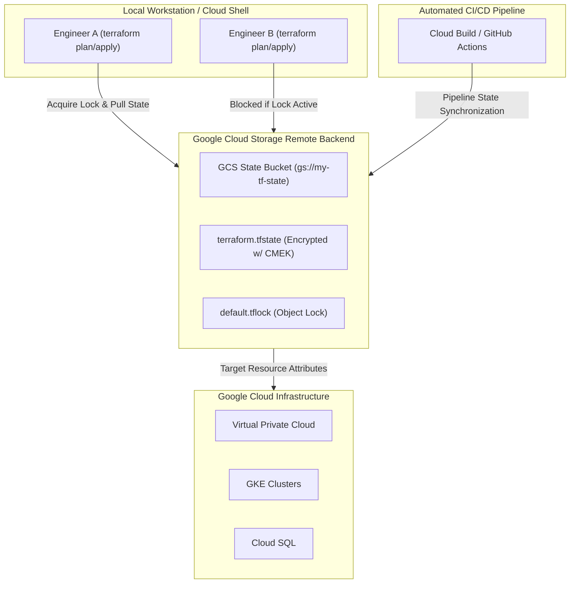

# Topic 87: Remote Backend

---

## 1. What Is It?

A **Terraform Remote Backend** on Google Cloud Platform is an operational configuration that instructs Terraform to store its state file (`terraform.tfstate`) centrally in a Cloud Storage (GCS) bucket rather than on a developer's local filesystem.

Storing state remotely in GCS unlocks three core operational capabilities:
1. **Concurrency Control & State Locking**: Prevents simultaneous deployments from corrupting state using GCS object locks (`.tflock`).
2. **Team Collaboration & Single Source of Truth**: Enables multiple engineers and CI/CD automation pipelines to operate against identical infrastructure definitions.
3. **Data Protection & Compliance**: Protects state file history using GCS versioning, Customer-Managed Encryption Keys (CMEK), and Identity and Access Management (IAM) access controls.

When using the `gcs` backend, Terraform automatically retrieves state prior to running execution plans and pushes updated state upon successfully applying changes.

### Real-World Analogy
Think of local state vs. remote GCS backend like keeping a shared company accounting ledger:
- **Local State**: Storing the only copy of company accounts on a paper notebook in an employee's desk drawer. If another accountant works on the accounts concurrently or the notebook is lost, financial chaos ensues.
- **Remote GCS Backend**: Storing the ledger in a secured digital bank vault equipped with biometric entry (IAM), automatic page snapshotting (Bucket Versioning), and an in-use sign (State Locking). Only one accountant can modify a page at a time.

---

## 2. Where Does It Fit?

The Remote Backend acts as the centralized synchronization hub between local developer workstations, CI/CD automation pipelines, and Google Cloud APIs.



---

## 3. Core Concepts

| Concept | Description | Production Rule |
|---|---|---|
| **`gcs` Backend Type** | Terraform's built-in backend driver designed specifically for Google Cloud Storage. | Always configure explicitly in `backend "gcs"` blocks. |
| **State Locking** | Automatic mechanism that locks state via GCS to prevent race conditions during `apply`. | Never disable state locking (`-lock=false`) in team environments. |
| **Bucket Versioning** | Retains historical copies of `terraform.tfstate` objects upon every modification. | Mandatory for disaster recovery and corruption rollback. |
| **CMEK Encryption** | Customer-Managed Encryption Keys (Cloud KMS) protecting state data at rest. | Required for enterprise regulatory compliance. |
| **Prefix Parameter** | Logical directory path within the GCS bucket isolating multi-environment state files. | Use unique prefixes (e.g., `prefix = "prod/vpc"`). |

---

## 4. How It Works

The lifecycle of a Terraform command utilizing a GCS remote backend follows a deterministic sequence:

```text
1. Engineer/CI executes `terraform apply`
               ↓
2. Query GCS Bucket -> Check for active `prefix/default.tflock` object
               ↓
3. Create lock object -> Block concurrent operations across team
               ↓
4. Download current `terraform.tfstate` into memory -> Run API refresh & plan diff
               ↓
5. Prompt for approval -> Execute GCP API resource modifications
               ↓
6. Write updated `terraform.tfstate` to GCS bucket -> Create new object version
               ↓
7. Delete `default.tflock` object -> Release backend for next pipeline execution
```

1. **State Bootstrapping**: The GCS bucket must exist *before* Terraform can initialize the GCS backend configuration via `terraform init`.
2. **State Migration**: Executing `terraform init` on an existing local state project automatically prompts to migrate local state records up to the remote GCS bucket.

---

## 5. Production Scenario

### Enterprise Multi-Environment Remote State Architecture

```text
Requirement: Establish a secure, centralized remote state repository for production and staging environments with zero risk of state file exposure or concurrent execution collisions.
    ↓
Architecture: Dedicated GCS State Bucket + GCS Object Versioning + KMS CMEK + IAM Uniform Bucket Access.
    ↓
Step 1: Provision GCS backend bucket with versioning and CMEK encryption:
  - Create KMS Key Ring & Key in Cloud KMS.
  - Create GCS bucket `proj-tfstate-prod` in `us-central1` with Uniform Bucket Access.
  - Enable bucket versioning and assign CMEK key.
    ↓
Step 2: Configure Terraform backend in HCL (`backend.tf`):
    terraform {
      backend "gcs" {
        bucket  = "proj-tfstate-prod"
        prefix  = "env/production"
      }
    }
    ↓
Step 3: Run `terraform init` to migrate existing state to GCS.
    ↓
Result: Centralized, version-controlled state storage protected by hardware keys and automated concurrency locks.
```

*Why Selected*: Illustrates standard enterprise patterns for isolating production state files and protecting raw state payload secrets.

---

## 6. Hands-On Lab

### Prerequisites
- GCP Project with billing enabled.
- Google Cloud SDK (`gcloud` CLI) installed and authenticated (`gcloud auth application-default login`).
- Terraform CLI installed.

### CLI Method

```bash
# 1. Set environment variables
export PROJECT_ID=$(gcloud config get-value project)
export BUCKET_NAME="tfstate-${PROJECT_ID}"
export REGION="us-central1"

# 2. Create GCS state bucket using gcloud
gcloud storage buckets create gs://${BUCKET_NAME} \
  --project=${PROJECT_ID} \
  --location=${REGION} \
  --uniform-bucket-level-access

# 3. Enable object versioning for state protection
gcloud storage buckets update gs://${BUCKET_NAME} --versioning

# 4. Create working directory and Terraform configuration
mkdir -p remote-backend-lab && cd remote-backend-lab

cat <<EOF > main.tf
terraform {
  required_version = ">= 1.5.0"
  required_providers {
    google = {
      source  = "hashicorp/google"
      version = "~> 5.0"
    }
  }
  backend "gcs" {
    bucket = "${BUCKET_NAME}"
    prefix = "lab/state-demo"
  }
}

provider "google" {
  project = "${PROJECT_ID}"
  region  = "${REGION}"
}

resource "google_compute_network" "lab_vpc" {
  name                    = "lab-remote-state-vpc"
  auto_create_subnetworks = false
}
EOF

# 5. Initialize backend and migrate state to GCS
terraform init

# 6. Apply configuration to verify remote state writing
terraform apply -auto-approve

# 7. Verify state object created in GCS
gcloud storage ls gs://${BUCKET_NAME}/lab/state-demo/
```

### Verification
Execute `gcloud storage ls gs://${BUCKET_NAME}/lab/state-demo/` and confirm `default.tfstate` exists inside the GCS bucket.

### Cleanup

```bash
# Destroy managed infrastructure
terraform destroy -auto-approve

# Remove local directory and delete GCS bucket
cd .. && rm -rf remote-backend-lab
gcloud storage rm --recursive gs://${BUCKET_NAME}
```

---

## 7. Security

### State File Security Controls
- **Plaintext Secret Hazard**: Terraform state files record all resource outputs in plain text (e.g., database passwords, IAM private keys). Direct read permissions grant access to all managed secrets.
- **Access Control via IAM**: Grant minimal permissions (`roles/storage.objectUser`) to deployment service accounts and restrict human read access to authorized SRE teams.
- **Enforce Uniform Bucket-Level Access**: Ensures legacy ACLs do not grant public access to state objects.

```text
BAD PRACTICE:
Storing backend state in a publicly accessible GCS bucket with ACL access controls and no KMS encryption.
Risk: Total exposure of infrastructure API tokens, private keys, and cloud architecture topology.

PRODUCTION PRACTICE:
Enforce Uniform Bucket Level Access, enable CMEK encryption via Cloud KMS, and grant least privilege via Cloud IAM roles.
```

---

## 8. Scaling & High Availability

Remote state scaling relies on state partitioning across distinct state files:

```text
Monolithic Single Bucket/State -> High Lock Contention & Broad Blast Radius
                      ↓ (State Partitioning)
Multi-Bucket / Multi-Prefix Topology:
├── gs://company-tfstate-network/ (VPC, Subnets, Routers)
├── gs://company-tfstate-iam/     (Roles, Service Accounts)
└── gs://company-tfstate-apps/    (Cloud Run, GKE Deployments)
```

- **Blast Radius Reduction**: Segmenting state prevents bad deployments in application layers from locking or corrupting core networking state files.
- **Performance Optimization**: Smaller state files reduce execution times for `terraform plan` by minimizing API refresh roundtrips.

---

## 9. Cost

### Pricing Breakdown

| Component | Cost Model | Estimated Monthly Spend |
|---|---|---|
| **GCS Storage Standard Class** | ~$0.02 per GB / month | < $0.05 / month for typical state files |
| **GCS Operation Class A (Write)** | $0.05 per 10,000 operations | Negligible (< $0.01 / month) |
| **Cloud KMS Key Usage (CMEK)** | ~$0.06 per key / month | ~$0.06 / month |

---

## 10. Monitoring & Troubleshooting

### Diagnostic Logging & Tools
- **Cloud Audit Logs**: Filter GCS logs (`resource.type="gcs_bucket"`) to audit who accessed or updated the state file.
- **`terraform force-unlock`**: CLI command to manually release a stuck lock ID if a CI pipeline crashes during execution.

### Troubleshooting Matrix

| Symptom | Cause | Resolution |
|---|---|---|
| `Error locking state: Error acquiring lock` | Stale lock object left by crashed job | Verify pipeline status, then execute `terraform force-unlock <LOCK_ID>`. |
| `Bucket NOT FOUND` | GCS bucket does not exist or typo in `backend.tf` | Pre-provision bucket using `gcloud storage buckets create` before `terraform init`. |
| `Access Denied 403` | Deployer Service Account lacks GCS Storage Object permissions | Grant `roles/storage.objectUser` on the state bucket. |

---

## 11. Common Mistakes

```text
Mistake: Committing `backend.tf` containing hardcoded project IDs or local paths into open source repos.
Why: Developers forget backend definitions are stored in source control.
Impact: Exposes GCS bucket names and architectural directory layouts.
Correct Approach: Use `terraform init -backend-config="bucket=..."` for dynamic variable injection in pipelines.

Mistake: Disabling GCS Bucket Versioning on state buckets.
Why: Cost saving assumptions.
Impact: Accidental state deletion or state corruption cannot be recovered, requiring complex manual infrastructure imports.
Correct Approach: Always enable bucket versioning on GCS remote state storage.
```

---

## 12. Production Best Practices

- [ ] Enable **GCS Object Versioning** on state storage buckets.
- [ ] Restrict access using **Uniform Bucket-Level Access** and Cloud IAM roles.
- [ ] Protect state payloads using **Customer-Managed Encryption Keys (CMEK)**.
- [ ] Partition state files by environment (`dev`, `stage`, `prod`) and layer (`network`, `compute`, `data`).
- [ ] Automate backend bucket provisioning in initial organization landing zone bootstrap scripts.
- [ ] Always add `.tfstate` and `.tfstate.backup` to `.gitignore`.

---

## 13. Hyperscaler / Enterprise Perspective

```text
Personal / Learning
  Local `.tfstate` File → Single Machine Execution → Manual Conflict Resolution
        ↓
Small Production
  Basic GCS Remote Backend → Single Bucket → Shared Developer Access
        ↓
Enterprise Environment
  Segmented State Buckets → CMEK Protection → Service Account Workload Identity Pipelines
        ↓
Hyperscaler Environment
  Landing Zone Automated Provisioning → Strict Organization Policy Guardrails → Automated State Backup Archiving
```

Enterprise hyperscalers mandate isolated GCS buckets for each workload tier combined with automated baseline policy compliance to prevent accidental state deletion across thousands of cloud projects.

---

## 14. Real Project Questions

### Q1: What happens if two developers run `terraform apply` simultaneously against the same GCS remote backend?
**Answer:** The first developer's execution creates a `default.tflock` file inside the GCS bucket prefix. The second developer's execution detects the lock file, halts execution, and displays an `Error locking state` message, preventing concurrent modifications and state corruption.

### Q2: Why must the GCS state bucket be created prior to executing `terraform init`?
**Answer:** Terraform requires an existing target GCS bucket to establish the API connection during the backend initialization phase. Terraform cannot auto-provision its own remote storage backend within the same configuration file that utilizes it.

### Q3: How do you recover from an accidental state file corruption when using a GCS remote backend?
**Answer:** Because GCS object versioning is enabled on the state bucket, you can inspect previous state versions using `gcloud storage ls --all-versions gs://<BUCKET>/<PREFIX>/default.tfstate` and restore the latest uncorrupted object version over the current state object.

---

## 15. Quick Decision Guide

| Operational Goal | Recommended Strategy | Key Benefit |
|---|---|---|
| Multi-developer IaC Collaboration | GCS Remote Backend + State Locking | Eliminates state race conditions and local file sync issues. |
| Cross-Layer Terraform Data Sharing | `terraform_remote_state` Data Source | Allows app configurations to read VPC outputs from network state. |
| Dynamic Multi-Environment Backend | `terraform init -backend-config` | Enables reusable backend definitions in CI/CD pipelines. |

### When to Use Remote Backends
- Mandatory for all team environments, production deployments, and CI/CD pipelines.

### When NOT to Use Remote Backends
- Sandbox throwaway testing on isolated individual local machines where state persistence is unnecessary.

---

## 16. Related Services

```text
                [87. Remote Backend]
               /          |         \
     Cloud Storage    Cloud KMS     Cloud IAM
    (State Storage)  (CMEK Keys)   (State Access)
          |               |              |
    Stores `.tfstate`  Encrypts     Grants Object User
    & `.tflock`        Payloads     Permissions
```

- **Cloud Storage**: Primary object storage engine for remote state files and locks.
- **Cloud KMS**: Provides cryptographic keys for state file CMEK encryption.
- **Cloud IAM**: Controls granular user and service account access permissions to state objects.

---

## 17. Cheat Sheet

### Essential CLI Commands

```bash
# Initialize and migrate local state to GCS remote backend
terraform init

# Force re-initialization with backend configuration parameters
terraform init -reconfigure -backend-config="bucket=my-tfstate-bucket"

# Force unlock a stuck state session (Use with caution)
terraform force-unlock <LOCK-ID>

# List all versions of a state object in GCS
gcloud storage ls --all-versions gs://my-tfstate-bucket/prefix/default.tfstate
```

---

## 18. Learning Connection

- **Previous Topic**: [86. State Management](../86-state-management/README.md)
- **Next Topic**: [88. CI/CD Concepts](../../09-cicd/88-cicd-concepts/README.md)
