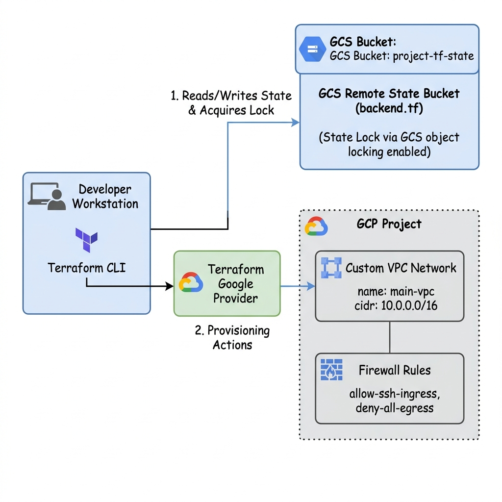
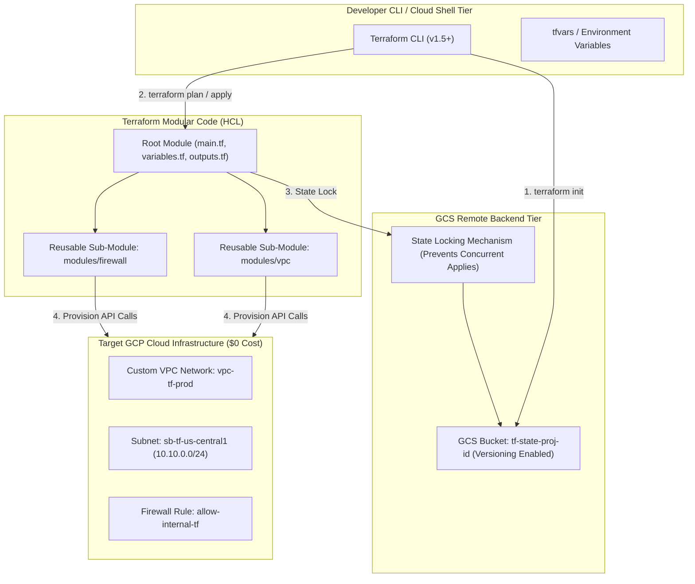

# Project 8: Modular Production Landing Zone Automation with Terraform & GCS Remote Backend

---

## 1. Project Overview

Welcome to **Project 8: Modular Production Landing Zone Automation**. This hands-on project synthesizes all 6 topics in **Module 08 (Infrastructure as Code)** into a production-grade Terraform IaC workflow with remote state management, optimized for **GCP Free Trial Accounts**.

### Objectives
In this project, you will:
1. **Bootstrap a GCS Remote Backend**: Create a resilient Cloud Storage bucket with object versioning to store Terraform state files (`default.tfstate`) securely with state locking.
2. **Structure Modular Terraform HCL**: Author modular HashiCorp Configuration Language (HCL) code separating root modules, input variables, outputs, and reusable sub-modules.
3. **Configure Google Provider & Version Pins**: Explicitly lock Google Provider versions (`hashicorp/google ~> 5.0`) for reproducible infrastructure deployments.
4. **Execute Terraform Lifecycle Workflows**: Execute `terraform init`, `terraform plan`, `terraform apply`, and inspect state using `terraform state list`.
5. **Enforce Zero-Leak Teardown**: Automatically destroy all provisioned cloud infrastructure using `terraform destroy`.

---

## 2. Architecture & IaC Workflow

The project establishes a modular Terraform IaC pipeline using GCS remote state storage:





> [!IMPORTANT]
> **Free Trial Safety & Cost Controls**:
> - **$0 Idle Infrastructure**: Custom VPCs, Subnets, Firewall Rules, and GCS State Buckets incur $0 in ongoing idle fees.
> - **State File Protection**: Enabling object versioning on the GCS state bucket allows rolling back state in the event of accidental corruption.
> - **Automated Cleanup**: Always execute `./scripts/cleanup_terraform.sh` to run `terraform destroy -auto-approve` after completing your lab exercises!

---

## 3. Module Topics Covered

| Topic Number & Name | Project Integration Point |
|---|---|
| **82. IaC Concepts** | Declarative vs imperative infrastructure management principles. |
| **83. Terraform Basics** | Writing HCL resource blocks, execution graphs, and lifecycle rules. |
| **84. Terraform Providers** | Configuring `hashicorp/google` provider requirements and project bindings. |
| **85. Variables & Outputs** | Parametrizing HCL with `variables.tf` and exposing IDs via `outputs.tf`. |
| **86. State Management** | Inspecting local vs remote state locking and `terraform refresh`. |
| **87. Remote Backend** | Provisioning GCS backend (`backend.tf`) for team state synchronization. |

---

## 4. Hands-On Execution Guide

### Step 1: Navigate to Project 8 Workspace

Open Google Cloud Shell or local terminal:

```bash
cd "08-infrastructure-as-code/project-08-infrastructure-as-code"
chmod +x scripts/*.sh
```

---

### Step 2: Inspect Terraform Modular Code

Inspect the root module and backend configuration:

```bash
# 1. View Remote Backend configuration
cat terraform/backend.tf

# 2. View Root Module main configuration
cat terraform/main.tf

# 3. View Sub-Module VPC definition
cat terraform/modules/vpc/main.tf
```

---

### Step 3: Run Terraform Landing Zone Deployment Script

Execute `scripts/deploy_terraform_landing_zone.sh` to automate:
1. Bootstrapping the GCS remote state bucket `tf-state-${PROJECT_ID}`.
2. Initializing Terraform (`terraform init`) with GCS backend.
3. Generating an execution plan (`terraform plan`).
4. Applying the plan (`terraform apply -auto-approve`).

```bash
./scripts/deploy_terraform_landing_zone.sh
```

*Expected Script Output Snippet*:
```text
=====================================================
GCP Terraform Landing Zone Deployment
=====================================================
[INFO] Bootstrapping GCS Remote Backend Bucket: tf-state-proj-fund-5283...
[SUCCESS] GCS State Bucket ready with Versioning.
[INFO] Initializing Terraform (terraform init)...
Successfully initialized!
[INFO] Applying Terraform Plan (terraform apply)...
module.vpc.google_compute_network.custom_vpc: Creating...
module.vpc.google_compute_subnetwork.subnet: Creating...
Apply complete! Resources: 3 added, 0 changed, 0 destroyed.
[SUCCESS] Terraform Landing Zone active.
```

---

### Step 4: Inspect Terraform State via CLI

Inspect the managed state resources directly using Terraform CLI:

```bash
cd terraform

# 1. List all resources tracked in GCS state
terraform state list

# 2. Inspect specific VPC resource attributes in state
terraform state show module.vpc.google_compute_network.custom_vpc

cd ..
```

---

## 5. Verification & Testing

Verify that Terraform correctly provisioned resources in your GCP project:

```bash
# 1. Verify VPC network created by Terraform
gcloud compute networks describe vpc-tf-prod

# 2. Check Subnet created by Terraform module
gcloud compute networks subnets describe sb-tf-us-central1 --region=us-central1
```

---

## 6. Troubleshooting & Common Issues

| Symptom / Error | Root Cause | Resolution |
|---|---|---|
| `Error locking state: Error acquiring the state lock` | Previous Terraform operation terminated abruptly, leaving lock active. | Run `terraform force-unlock LOCK_ID` (use with caution). |
| `Error 409: Resource already exists` | GCP resource created manually outside Terraform management. | Import existing resource using `terraform import module.vpc.google_compute_network.custom_vpc vpc-tf-prod`. |
| `GCS backend bucket does not exist` | GCS remote state bucket not created prior to `terraform init`. | Run `scripts/deploy_terraform_landing_zone.sh` which bootstraps the GCS state bucket automatically. |

---

## 7. Project Cleanup

To run `terraform destroy` and remove all provisioned GCP resources, run:

```bash
./scripts/cleanup_terraform.sh
```

---

## 8. Summary & Next Steps

Congratulations! You have completed **Project 8: Modular Production Landing Zone Automation with Terraform**. You have mastered GCS remote state backends, reusable HCL modules, state locking, and lifecycle workflows.

- **Next Project**: [Project 9: Automated GitOps Pipeline with Cloud Build & Cloud Deploy](../../09-cicd/project-09-cicd/README.md)
