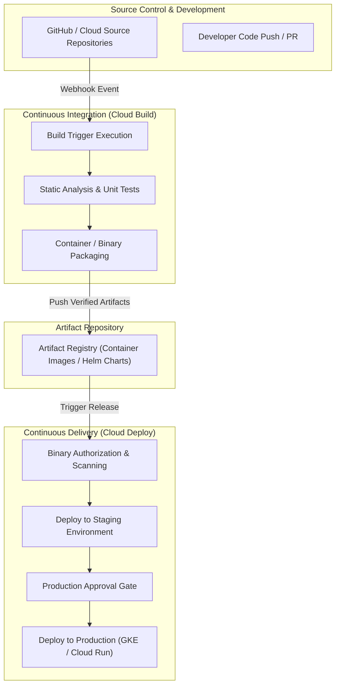

# Topic 88: CI/CD Concepts

---

## 1. What Is It?

**Continuous Integration and Continuous Delivery (CI/CD)** on Google Cloud Platform represents the architectural model, deployment philosophy, and automated toolchain integration designed to continuously validate, package, test, and release software and infrastructure changes into production environments.

CI/CD breaks down traditional monolithic release cycles into three automated stages:
1. **Continuous Integration (CI)**: Automatically building code artifacts, running unit/integration tests, and executing static analysis whenever code is committed to source control.
2. **Continuous Delivery (CD)**: Automatically preparing validated build artifacts for deployment to target staging or pre-production environments.
3. **Continuous Deployment**: Automatically pushing thoroughly tested code directly to production environments without human intervention upon passing all safety gates.

Native GCP tools like **Cloud Build**, **Artifact Registry**, **Cloud Deploy**, and **Binary Authorization** work together to create automated software supply chains.

### Real-World Analogy
Think of CI/CD like an automated car manufacturing assembly line:
- **Manual Development (Old Model)**: Mechanics build individual engine parts in isolation, drive them to a track, manually assemble them on-site, and test drive the vehicle. If a gear fails, the car breaks down on the track.
- **Automated CI/CD Assembly Line**: Every raw part (code commit) passes through laser inspection sensors (Unit Tests/Static Linting), automated robotic welding (Build & Packaging), paint quality checks (Vulnerability Scanning), and automated track simulation (Staging Deployment) before rolling onto the highway (Production).

---

## 2. Where Does It Fit?

CI/CD spans source control management through target runtime environments across Google Cloud Platform.



---

## 3. Core Concepts

| CI/CD Concept | Definition | Native GCP Implementation |
|---|---|---|
| **Pipeline Trigger** | Automated event listener executing builds upon Git pushes, pull requests, or Pub/Sub events. | Cloud Build Triggers |
| **Build Artifact** | Packaged software payload (Docker container, Helm chart, binary) produced during CI. | Artifact Registry |
| **Release Pipeline** | Orchestrated progression of steps deploying artifacts across multi-stage targets (`dev` -> `stage` -> `prod`). | Cloud Deploy |
| **Software Supply Chain Security** | Guardrails verifying image origin, vulnerabilities, and cryptographically signed attestations. | Binary Authorization / Artifact Analysis |
| **Progressive Delivery** | Deployment strategies (Canary, Blue/Green) minimizing deployment risk during rollouts. | Cloud Run Revision Splitting / GKE Service Mesh |

---

## 4. How It Works

A standard GCP CI/CD deployment execution flow proceeds through predictable lifecycle phases:

```text
Code Push / Pull Request Creation
               ↓
Git Webhook triggers Cloud Build Pipeline
               ↓
Step 1: Execute Linting & Unit Test Suites
               ↓
Step 2: Build Container Image & Scan Vulnerabilities (Artifact Analysis)
               ↓
Step 3: Push Sealed Image to Artifact Registry with Git Commit SHA Tag
               ↓
Step 4: Cloud Deploy creates Release -> Promotes to Staging Environment
               ↓
Step 5: Automated Integration Tests -> Human Approval Gate -> Production Promotion
```

1. **Immutable Artifact Rule**: Never rebuild container images between staging and production; promote the *identical image digest* across environments.
2. **GitOps Strategy**: Treat Git repositories as the definitive source of truth for application manifests and infrastructure state.

---

## 5. Production Scenario

### End-to-End Enterprise Microservice CI/CD Supply Chain

```text
Requirement: Establish a secure automated CI/CD pipeline that validates Python web app commits, scans for container vulnerabilities, and deploys to Cloud Run with automatic rollback capability.
    ↓
Architecture: GitHub + Cloud Build + Artifact Registry + Cloud Run + Cloud Monitoring.
    ↓
Step 1: Code Push to `main` branch triggers Cloud Build via Webhook.
Step 2: Cloud Build runs `pytest`, builds Docker image, and tags with `$SHORT_SHA`.
Step 3: Pushes image to Artifact Registry (`us-central1-docker.pkg.dev/proj/apps/myapp:v1.0`).
Step 4: Deploys new revision to Cloud Run using `gcloud run deploy --no-traffic`.
Step 5: Runs health checks against revision endpoint; shifts 100% traffic upon success.
    ↓
Result: Zero-downtime, fully automated release pipeline with instant rollback capability if health checks fail.
```

*Why Selected*: Illustrates standard enterprise patterns combining automated testing, vulnerability scanning, and safe revision rollouts.

---

## 6. Hands-On Lab

### Prerequisites
- Active GCP Project with Cloud Build, Artifact Registry, and Cloud Run APIs enabled.
- Cloud Shell or local machine with `gcloud` CLI installed.

### CLI Method

```bash
# 1. Environment configuration
export PROJECT_ID=$(gcloud config get-value project)
export REGION="us-central1"
export REPO_NAME="cicd-demo-repo"

# 2. Enable necessary GCP APIs
gcloud services enable cloudbuild.googleapis.com \
  artifactregistry.googleapis.com \
  run.googleapis.com

# 3. Create Artifact Registry repository
gcloud artifacts repositories create ${REPO_NAME} \
  --repository-format=docker \
  --location=${REGION} \
  --description="CI/CD Demo Docker Repository"

# 4. Create sample web application directory
mkdir -p cicd-demo && cd cicd-demo

# 5. Create simple Node.js web app
cat <<EOF > app.js
const http = require('http');
const port = process.env.PORT || 8080;

const server = http.createServer((req, res) => {
  res.statusCode = 200;
  res.setHeader('Content-Type', 'text/plain');
  res.end('Hello from GCP CI/CD Pipeline!\n');
});

server.listen(port, () => {
  console.log(\`Server running on port \${port}\`);
});
EOF

# 6. Create Dockerfile
cat <<EOF > Dockerfile
FROM node:18-alpine
WORKDIR /app
COPY app.js .
EXPOSE 8080
CMD ["node", "app.js"]
EOF

# 7. Create cloudbuild.yaml definition file
cat <<EOF > cloudbuild.yaml
steps:
# Step 1: Build Docker Image
- name: 'gcr.io/cloud-builders/docker'
  args: ['build', '-t', '${REGION}-docker.pkg.dev/$PROJECT_ID/${REPO_NAME}/hello-app:\$SHORT_SHA', '.']

# Step 2: Push Image to Artifact Registry
- name: 'gcr.io/cloud-builders/docker'
  args: ['push', '${REGION}-docker.pkg.dev/$PROJECT_ID/${REPO_NAME}/hello-app:\$SHORT_SHA']

# Step 3: Deploy to Cloud Run
- name: 'gcr.io/google.com/cloudsdktool/cloud-sdk'
  entrypoint: gcloud
  args:
  - 'run'
  - 'deploy'
  - 'cicd-hello-service'
  - '--image=${REGION}-docker.pkg.dev/$PROJECT_ID/${REPO_NAME}/hello-app:\$SHORT_SHA'
  - '--region=${REGION}'
  - '--platform=managed'
  - '--allow-unauthenticated'

images:
- '${REGION}-docker.pkg.dev/$PROJECT_ID/${REPO_NAME}/hello-app:\$SHORT_SHA'
EOF

# 8. Grant Cloud Build service account permissions to deploy to Cloud Run
PROJECT_NUMBER=$(gcloud projects describe $PROJECT_ID --format='value(projectNumber)')
gcloud projects add-iam-policy-binding $PROJECT_ID \
  --member="serviceAccount:${PROJECT_NUMBER}@cloudbuild.gserviceaccount.gserviceaccount.com" \
  --role="roles/run.admin"

gcloud iam service-accounts add-iam-policy-binding \
  "${PROJECT_NUMBER}-compute@developer.gserviceaccount.com" \
  --member="serviceAccount:${PROJECT_NUMBER}@cloudbuild.gserviceaccount.gserviceaccount.com" \
  --role="roles/iam.serviceAccountUser"

# 9. Submit Cloud Build manually
gcloud builds submit --config=cloudbuild.yaml .
```

### Verification
Retrieve the URL of the newly deployed Cloud Run service and test responses:

```bash
SERVICE_URL=$(gcloud run services describe cicd-hello-service --region=${REGION} --format='value(status.url)')
curl -s $SERVICE_URL
```
*Expected Output*: `Hello from GCP CI/CD Pipeline!`

### Cleanup

```bash
gcloud run services delete cicd-hello-service --region=${REGION} --quiet
gcloud artifacts repositories delete ${REPO_NAME} --location=${REGION} --quiet
cd .. && rm -rf cicd-demo
```

---

## 7. Security

### Supply Chain Security Principles
- **Least Privilege Build Accounts**: Restrict default Cloud Build service accounts; use dedicated user-managed Service Accounts with granular IAM roles.
- **Artifact Vulnerability Scanning**: Enable automated container scanning in Artifact Registry to catch critical CVEs before production deployments.
- **Signed Attestations**: Integrate Binary Authorization to cryptographically enforce that only approved images built by verified CI/CD triggers can run on GKE.

```text
BAD PRACTICE:
Using default Compute Engine service accounts with broad Editor roles for CI/CD pipelines and deploying raw un-scanned container images directly to production.

PRODUCTION PRACTICE:
Use granular user-managed service accounts, enforce Artifact Analysis vulnerability gates, and sign artifacts via Binary Authorization.
```

---

## 8. Scaling & High Availability

CI/CD pipeline scaling patterns:

```text
Shared Default Build Pool -> Slower Execution & Shared Network Limits
                       ↓ (Private Worker Pools)
Private Worker Pools (Cloud Build):
├── Isolated VPC Peering (Direct Access to Internal GKE / VPC Databases)
├── Custom Machine Types (High-CPU Parallel Build Workers)
└── Regional Execution (Data Residency Compliance)
```

- **Parallel Step Execution**: Configure parallel build steps in `cloudbuild.yaml` to execute unit tests, static code analysis, and integration suites simultaneously.

---

## 9. Cost

### Pricing Structure

| Component | Free Tier / Pricing Model | Estimated Cost |
|---|---|---|
| **Cloud Build** | 120 build-minutes per day free (n1-standard-1) | ~$0.003 / build-minute thereafter |
| **Artifact Registry** | 0.5 GB / month free storage | $0.10 per GB / month |
| **Cloud Deploy** | First 1 active delivery pipeline free | $15.00 per active delivery pipeline / month |

---

## 10. Monitoring & Troubleshooting

### Pipeline Visibility & Monitoring
- **Cloud Build Dashboard**: Track build duration, success/failure rates, and build queue latency.
- **Cloud Logging Sinks**: Stream `cloudbuild_gcp_build` logs to BigQuery for long-term engineering velocity metrics (DORA metrics).

### Troubleshooting Matrix

| Symptom | Cause | Resolution |
|---|---|---|
| `Permission denied` during Cloud Run deploy | Cloud Build Service Account missing `roles/run.admin` | Grant `roles/run.admin` to the Cloud Build service account. |
| `Docker build failed: No space left on device` | Massive image layers exceeding build VM disk limit | Optimize `Dockerfile` using multi-stage builds and clean cache layers. |
| `Artifact Registry Repository Not Found` | Typo in image path or region mismatch | Verify target Artifact Registry URL format: `<REGION>-docker.pkg.dev/<PROJECT_ID>/<REPO>/<IMAGE>`. |

---

## 11. Common Mistakes

```text
Mistake: Re-building container images separately for Staging and Production environments.
Why: Developers re-run the build command against `main` for each deployment target.
Impact: Inconsistencies or transient dependency updates can cause production images to differ from tested staging images.
Correct Approach: Build the image ONCE during CI, publish to Artifact Registry, and promote that exact image SHA digest across environments.

Mistake: Storing long-lived GCP API service account key JSON files inside GitHub Repository Secrets.
Why: Traditional approach for authenticating GitHub Actions pipelines to GCP.
Impact: Severe risk of key leak or credential misuse if secrets are exposed.
Correct Approach: Use Keyless Authentication via Workload Identity Federation.
```

---

## 12. Production Best Practices

- [ ] Build immutable container artifacts tagged with Git commit SHAs (`$SHORT_SHA`).
- [ ] Enforce automated unit testing and vulnerability scanning prior to image publishing.
- [ ] Use **Workload Identity Federation** instead of static JSON keys for external CI tools.
- [ ] Deploy dedicated **Cloud Build Private Pools** for workloads requiring internal VPC access.
- [ ] Implement Progressive Delivery (Canary/Blue-Green) to prevent catastrophic outage rollouts.
- [ ] Track enterprise **DORA Metrics** (Deployment Frequency, Lead Time for Changes, Change Failure Rate, Mean Time to Recovery).

---

## 13. Hyperscaler / Enterprise Perspective

```text
Personal / Learning
  Manual `gcloud builds submit` → Shared Service Account → Direct Prod Push
        ↓
Small Production
  GitHub Triggered Cloud Build → Docker Artifact Registry → Automated Cloud Run Release
        ↓
Enterprise Environment
  Cloud Build Private Pools → Artifact Analysis CVE Scanning → Cloud Deploy Multi-Target Pipelines
        ↓
Hyperscaler Environment
  Binary Authorization Image Signing → GitOps Configuration Sync → Continuous Automated DORA Telemetry
```

At hyperscale, enterprises treat the CI/CD pipeline itself as critical infrastructure, enforcing strict organizational policies, immutable build provenance (SLSA level 3+), and complete zero-trust access boundaries.

---

## 14. Real Project Questions

### Q1: Why is tagging container images with `latest` considered anti-pattern in production CI/CD pipelines?
**Answer:** The `latest` tag is mutable and non-deterministic. If multiple builds write to `latest`, Kubernetes or Cloud Run cannot determine which exact commit is deployed, breaking image caching, rollbacks, and auditability. Production pipelines must use immutable identifiers like Git commit SHAs (`$SHORT_SHA`) or semantic version tags.

### Q2: What is the core security advantage of using Workload Identity Federation over Service Account Keys in GitHub Actions pipelines?
**Answer:** Workload Identity Federation eliminates long-lived JSON service account key files entirely. Instead, GCP trusts OpenID Connect (OIDC) identity tokens issued short-term by GitHub, granting short-lived temporary GCP IAM tokens per build execution, completely eliminating credential leak risks.

### Q3: How does Cloud Deploy differ from Cloud Build in a GCP CI/CD ecosystem?
**Answer:** **Cloud Build** is an execution engine for CI tasks (building binaries, running tests, creating container images). **Cloud Deploy** is a managed continuous delivery service that orchestrates the promotion of those built artifacts sequentially through deployment targets (e.g., Dev -> Staging -> Prod) with explicit approval gates and automated rollback features.

---

## 15. Quick Decision Guide

| Requirement | Recommended Tool | Advantage |
|---|---|---|
| Container Image Building & Testing | Cloud Build | Fully serverless, native integration with GCP IAM and triggers. |
| Multi-Stage GKE / Cloud Run Promotion Pipelines | Cloud Deploy | Native release management, progressive rollouts, and audit history. |
| Keyless Third-Party Pipeline Authentication | Workload Identity Federation | Eliminates long-lived service account key security liabilities. |

### When to Use CI/CD
- Mandatory for all production software projects, microservice architectures, and IaC pipelines.

### When NOT to Use CI/CD
- Isolated temporary spike research scripts where code is discarded immediately.

---

## 16. Related Services

```text
                 [88. CI/CD Concepts]
               /          |          \
     Cloud Build   Artifact Registry  Cloud Deploy
    (Build & Test) (Artifact Storage) (Release Manager)
          |               |               |
    Executes Builds   Stores Signed   Promotes Releases
    & Runs Tests      Container Scans Across Envs
```

- **Cloud Build**: Native serverless CI build engine.
- **Artifact Registry**: Enterprise repository storing build binaries, container images, and Helm charts.
- **Cloud Deploy**: Managed delivery pipeline service for Cloud Run and GKE.

---

## 17. Cheat Sheet

### Useful gcloud & Pipeline Commands

```bash
# Submit a manual build to Cloud Build
gcloud builds submit --config=cloudbuild.yaml .

# List recent build executions in the project
gcloud builds list --limit=10

# Create a Cloud Build trigger for GitHub repository push events
gcloud builds triggers create github \
  --name="main-branch-trigger" \
  --repo-name="my-github-repo" \
  --repo-owner="my-org" \
  --branch-pattern="^main$" \
  --build-config="cloudbuild.yaml"
```

---

## 18. Learning Connection

- **Previous Topic**: [87. Remote Backend](../../08-infrastructure-as-code/87-remote-backend/README.md)
- **Next Topic**: [89. Cloud Build](../89-cloud-build/README.md)
