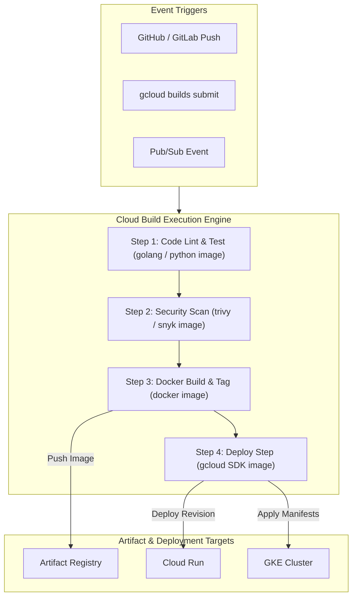

# Topic 89: Cloud Build

---

## 1. What Is It?

**Google Cloud Build** is a fully managed, serverless continuous integration (CI) and continuous delivery (CD) execution platform on Google Cloud. It executes build pipelines as a series of isolated, containerized build steps defined in a declarative configuration file (`cloudbuild.yaml` or `cloudbuild.json`).

Cloud Build provides four fundamental infrastructure capabilities:
1. **Serverless Execution Engine**: Automatically scales compute workers up and down on demand, eliminating the need to manage Jenkins master/worker clusters.
2. **Containerized Build Steps**: Executes each step within a dedicated Docker container environment, utilizing standard open-source or custom container images.
3. **Automated Event Triggers**: Listens to Git repository events (pushes, pull requests, tags) from GitHub, GitLab, Bitbucket, or Cloud Source Repositories.
4. **VPC & Security Isolation**: Offers default multi-tenant build environments or dedicated **Cloud Build Private Pools** for private network access and static IP egress.

### Real-World Analogy
Think of Cloud Build like a fully automated, on-demand commercial kitchen:
- **Jenkins (Traditional VM CI)**: Buying, leasing, and maintaining a kitchen 24/7, paying for electricity and rent even when no chefs are cooking.
- **Cloud Build**: Renting a ghost kitchen by the second. When an order arrives (Git Commit), specialized prep stations (Containerized Steps for chopping, grilling, plating) spin up instantly, prepare the meal, pack the order (Artifact Registry), and immediately shut down—billing only for the exact seconds spent cooking.

---

## 2. Where Does It Fit?

Cloud Build sits at the core of the GCP developer toolchain, transforming source code into deployed applications.



---

## 3. Core Concepts

| Concept | Description | Production Rule |
|---|---|---|
| **Build Step (`steps`)** | An individual task running inside a specified Docker container image. | Use lightweight, official container images for steps. |
| **Substitutions (`substitutions`)** | Built-in (e.g., `$PROJECT_ID`, `$SHORT_SHA`) and user-defined variables passed at runtime. | Standardize environment parameterization across builds. |
| **Build Artifacts (`images` / `artifacts`)** | Outputs generated during the build (container images, tarballs) uploaded to Artifact Registry or GCS. | Always declare build outputs explicitly in `images` or `artifacts`. |
| **Worker Pools** | Compute environments executing builds (Default shared pool vs. Dedicated Private Pools). | Use Private Pools for enterprise VPC peering and static IPs. |
| **Build Cache (`waitFor` / `volumes`)** | Mechanisms to share file states across build steps or cache dependencies. | Use Docker buildx layer caching or GCS cache buckets to accelerate pipelines. |

---

## 4. How It Works

A `cloudbuild.yaml` file defines sequential or parallel containerized execution steps:

```text
Git Trigger / CLI Submit
           ↓
Cloud Build provisions worker VM & clones repository into `/workspace` directory
           ↓
Step 1: Container A mounts `/workspace` -> Executes unit tests
           ↓
Step 2: Container B mounts `/workspace` -> Builds binary / Docker image
           ↓
Step 3: Container C mounts `/workspace` -> Pushes artifact to Artifact Registry
           ↓
Worker VM unmounts workspace -> Destroys build VM environment
```

1. **Shared Workspace Directory**: All build steps share a persistent working directory mounted at `/workspace`, enabling downstream steps to access files modified by upstream steps.
2. **Parallel Step Execution**: Steps using the `waitFor` attribute can run asynchronously in parallel to optimize execution duration.

---

## 5. Production Scenario

### Parallel Build & Vulnerability Scan Pipeline

```text
Requirement: Accelerate CI pipelines by running static security scanning and Docker builds in parallel, storing artifacts in Artifact Registry, and notifying Pub/Sub on failure.
    ↓
Architecture: `cloudbuild.yaml` with parallel `waitFor` steps + Artifact Registry + Pub/Sub notification.
    ↓
Step 1: Define `cloudbuild.yaml` with parallel execution steps:
    steps:
    # Step 1: Run unit tests
    - name: 'golang:1.21'
      id: 'unit-tests'
      args: ['go', 'test', './...']

    # Step 2: Run Security Scan in parallel after unit-tests
    - name: 'aquasec/trivy:latest'
      id: 'security-scan'
      waitFor: ['unit-tests']
      args: ['fs', '--security-checks', 'vuln', '.']

    # Step 3: Build Container Image in parallel after unit-tests
    - name: 'gcr.io/cloud-builders/docker'
      id: 'docker-build'
      waitFor: ['unit-tests']
      args: ['build', '-t', 'us-central1-docker.pkg.dev/$PROJECT_ID/app/web:$SHORT_SHA', '.']

    # Step 4: Push image after build & scan complete
    - name: 'gcr.io/cloud-builders/docker'
      id: 'docker-push'
      waitFor: ['security-scan', 'docker-build']
      args: ['push', 'us-central1-docker.pkg.dev/$PROJECT_ID/app/web:$SHORT_SHA']
    ↓
Result: Pipeline execution time reduced by ~40% through parallel step execution while guaranteeing vulnerability gates.
```

*Why Selected*: Demonstrates advanced Cloud Build step orchestration using `waitFor` to maximize pipeline concurrency and speed.

---

## 6. Hands-On Lab

### Prerequisites
- Active GCP Project with billing enabled.
- Cloud Shell or local machine with `gcloud` CLI installed.

### CLI Method

```bash
# 1. Set environment variables
export PROJECT_ID=$(gcloud config get-value project)
export REGION="us-central1"
export REPO_NAME="cb-lab-repo"

# 2. Enable Cloud Build & Artifact Registry APIs
gcloud services enable cloudbuild.googleapis.com artifactregistry.googleapis.com

# 3. Create Artifact Registry repository
gcloud artifacts repositories create ${REPO_NAME} \
  --repository-format=docker \
  --location=${REGION}

# 4. Create local project directory
mkdir -p cb-demo && cd cb-demo

# 5. Create simple Go app
cat <<EOF > main.go
package main
import (
	"fmt"
	"net/http"
)
func main() {
	http.HandleFunc("/", func(w http.ResponseWriter, r *http.Request) {
		fmt.Fprintf(w, "Cloud Build Automation Active!")
	})
	http.ListenAndServe(":8080", nil)
}
EOF

# 6. Create Dockerfile
cat <<EOF > Dockerfile
FROM golang:1.21-alpine AS builder
WORKDIR /app
COPY main.go .
RUN go build -o server main.go

FROM alpine:3.18
WORKDIR /app
COPY --from=builder /app/server .
EXPOSE 8080
CMD ["./server"]
EOF

# 7. Create advanced cloudbuild.yaml
cat <<EOF > cloudbuild.yaml
steps:
- name: 'gcr.io/cloud-builders/docker'
  id: 'Build Image'
  args:
  - 'build'
  - '-t'
  - '${REGION}-docker.pkg.dev/${PROJECT_ID}/${REPO_NAME}/go-app:\$SHORT_SHA'
  - '.'

- name: 'gcr.io/cloud-builders/docker'
  id: 'Push Image'
  args:
  - 'push'
  - '${REGION}-docker.pkg.dev/${PROJECT_ID}/${REPO_NAME}/go-app:\$SHORT_SHA'

substitutions:
  _ENVIRONMENT: 'development'

images:
- '${REGION}-docker.pkg.dev/${PROJECT_ID}/${REPO_NAME}/go-app:\$SHORT_SHA'

options:
  logging: CLOUD_LOGGING_ONLY
EOF

# 8. Submit build directly to Cloud Build
gcloud builds submit --config=cloudbuild.yaml .
```

### Verification
List container images stored in Artifact Registry to verify build success:

```bash
gcloud artifacts docker images list ${REGION}-docker.pkg.dev/${PROJECT_ID}/${REPO_NAME}
```

### Cleanup

```bash
gcloud artifacts repositories delete ${REPO_NAME} --location=${REGION} --quiet
cd .. && rm -rf cb-demo
```

---

## 7. Security

### Cloud Build Security Controls
- **Default Service Account Hardening**: By default, Cloud Build uses a project build service account (`[PROJECT_NUMBER]@cloudbuild.gserviceaccount.gserviceaccount.com`). Replace legacy roles with user-managed Service Accounts following least privilege principles.
- **Private Pools for Network Security**: Standard Cloud Build workers run on multi-tenant public Google networks. Enterprise workloads requiring access to internal VPC resources (databases, internal GKE control planes) MUST use **Cloud Build Private Pools**.
- **Secret Manager Integration**: Never hardcode API keys or credentials in `cloudbuild.yaml`. Inject secrets securely from Secret Manager at runtime.

```text
BAD PRACTICE:
Storing plain-text database credentials inside `cloudbuild.yaml` substitution variables.
Risk: Secrets exposed in Cloud Build logs and available to anyone with `cloudbuild.builds.get` IAM access.

PRODUCTION PRACTICE:
Fetch secrets dynamically during build execution using the native Secret Manager integration (`availableSecrets`).
```

---

## 8. Scaling & High Availability

Cloud Build infrastructure scaling model:

```text
Default Shared Pool (Public Internet Egress / Multi-tenant Worker VMs)
                      ↓ (Enterprise Private Network Integration)
Cloud Build Private Pool:
├── Dedicated Peer VPC Network (Access to Private GKE, Cloud SQL, On-Prem via VPN)
├── Configurable VM Sizes (e2-standard-2 up to e2-standard-32)
└── Custom Static Egress External IPs (Whitelisting Firewalls)
```

- **Concurrency Limits**: Default quota supports up to 10 concurrent builds per project, which can be increased via quota requests or by scaling Private Pools.

---

## 9. Cost

### Cloud Build Pricing Economics

| Worker Type | Machine Spec | Price per Build-Minute |
|---|---|---|
| **n1-standard-1 (Default)** | 1 vCPU, 3.75 GB RAM | First 120 min/day FREE, then $0.003 / min |
| **e2-highcpu-8** | 8 vCPU, 8 GB RAM | $0.016 / min |
| **Private Pools** | Custom Machine Sizes | Per-worker hourly fee + VM compute rate |

---

## 10. Monitoring & Troubleshooting

### Pipeline Logging & Metrics
- **Build Logs**: View real-time streaming logs directly in the Cloud Console or Cloud Logging.
- **Cloud Monitoring Metrics**: Monitor `cloudbuild.googleapis.com/builds/count` filtered by `status="FAILURE"`.

### Troubleshooting Matrix

| Symptom | Cause | Resolution |
|---|---|---|
| `BUILD FAILED: Step #X returned status 1` | Code compilation error or failing test suite | Check build step log output in Cloud Logging to identify failing command. |
| `Permission denied on Cloud Storage / Artifact Registry` | Cloud Build service account lacks IAM write permissions | Assign `roles/artifactregistry.writer` to the build service account. |
| `Timeout exceeded` | Build steps hanging or waiting for interactive input | Add `timeout: '1200s'` block to `cloudbuild.yaml` or fix interactive CLI prompts. |

---

## 11. Common Mistakes

```text
Mistake: Running single-threaded sequential build steps when independent tasks exist.
Why: Writing basic linear `cloudbuild.yaml` step lists.
Impact: Long pipeline execution times, increasing build costs and developer wait times.
Correct Approach: Use `waitFor: ['-']` or specify step dependencies explicitly to run non-dependent steps in parallel.

Mistake: Storing build artifacts in legacy Container Registry (`gcr.io`).
Why: Using legacy examples.
Impact: Deprecated API usage, missing granular IAM repository level permissions.
Correct Approach: Use Artifact Registry (`pkg.dev`) for all new Cloud Build pipelines.
```

---

## 12. Production Best Practices

- [ ] Store build steps in source control as `cloudbuild.yaml`.
- [ ] Use **Artifact Registry** for container images and package storage.
- [ ] Fetch sensitive API keys from **Secret Manager** (`availableSecrets`).
- [ ] Provision **Private Pools** for builds requiring VPC internal resource access.
- [ ] Optimize build speed using **parallel execution steps** (`waitFor`).
- [ ] Tag container images using **Git Commit SHAs** (`$SHORT_SHA`).

---

## 13. Hyperscaler / Enterprise Perspective

```text
Personal / Learning
  Default Shared Worker Pool → Manual CLI Submit → Basic Docker Image Build
        ↓
Small Production
  GitHub Event Triggers → Substitution Variables → Artifact Registry Push
        ↓
Enterprise Environment
  Cloud Build Private Pools → Secret Manager Integration → Custom User-Managed Service Accounts
        ↓
Hyperscaler Environment
  Software Supply Chain SLSA Level 3 Provenance → Automated CVE Vulnerability Blocking → Multi-Region Private Pools
```

Enterprise hyperscalers deploy Cloud Build Private Pools with static egress IPs, enforcing cryptographic provenance verification on all build artifacts before deployment to production environments.

---

## 14. Real Project Questions

### Q1: How do you access a private Cloud SQL instance or private GKE cluster from a Cloud Build step?
**Answer:** Standard Cloud Build runs on a public multi-tenant network and cannot access private IP addresses inside a VPC. To access private resources, you must provision a **Cloud Build Private Pool** and configure VPC Network Peering between the Private Pool network and your GCP VPC.

### Q2: What is the purpose of the `/workspace` directory in Cloud Build?
**Answer:** The `/workspace` directory is a persistent volume automatically created and mounted across all steps within a single build execution. It allows steps to share code files, compiled binaries, and output state sequentially.

### Q3: How do you pass secret environment variables securely into Cloud Build steps?
**Answer:** You reference secrets stored in Secret Manager using the `availableSecrets` block in `cloudbuild.yaml` and grant the Cloud Build Service Account the `roles/secretmanager.secretAccessor` IAM role, injecting the secret as an environment variable into specific steps.

---

## 15. Quick Decision Guide

| Operational Scenario | Recommended Cloud Build Configuration | Core Advantage |
|---|---|---|
| Standard Public Web Application Build | Default Shared Worker Pool | Zero infrastructure overhead, 120 free build minutes daily. |
| Enterprise Build Accessing Private VPC | Cloud Build Private Pool | Isolated VPC network peering, static IP egress. |
| High-Performance Heavy Compilation | High-CPU Custom Worker (e2-highcpu-32) | Accelerated build completion times for large codebases. |

### When to Use Cloud Build
- Serverless CI/CD builds on GCP, container image packaging, and native Cloud Deploy integration.

### When NOT to Use Cloud Build
- Complex multi-cloud legacy Jenkins pipeline migrations where re-writing pipelines to YAML is unviable short-term.

---

## 16. Related Services

```text
                   [89. Cloud Build]
                 /        |        \
      Secret Manager  Artifact Reg  Cloud Deploy
     (Build Secrets) (Image Target) (Release Target)
            |             |              |
      Injects API    Stores Built   Promotes Build
      Credentials    Docker Images  Artifacts to Envs
```

- **Secret Manager**: Secure store for build credentials and tokens.
- **Artifact Registry**: Storage repository for Cloud Build container outputs.
- **Cloud Deploy**: Delivery pipeline promoting Cloud Build artifacts.

---

## 17. Cheat Sheet

### Common cloudbuild.yaml Snippet & Commands

```yaml
steps:
# Example: Injecting Secret Manager Key
- name: 'gcr.io/cloud-builders/gcloud'
  entrypoint: 'bash'
  args: ['-c', 'echo $$MY_SECRET']
  secretEnv: ['MY_SECRET']

availableSecrets:
  secretManager:
  - versionName: projects/$PROJECT_ID/secrets/api-key/versions/latest
    env: 'MY_SECRET'
```

```bash
# List active Cloud Build builds
gcloud builds list --ongoing

# Cancel a stuck build
gcloud builds cancel <BUILD_ID>
```

---

## 18. Learning Connection

- **Previous Topic**: [88. CI/CD Concepts](../88-cicd-concepts/README.md)
- **Next Topic**: [90. Artifact Registry Integration](../90-artifact-registry-integration/README.md)
