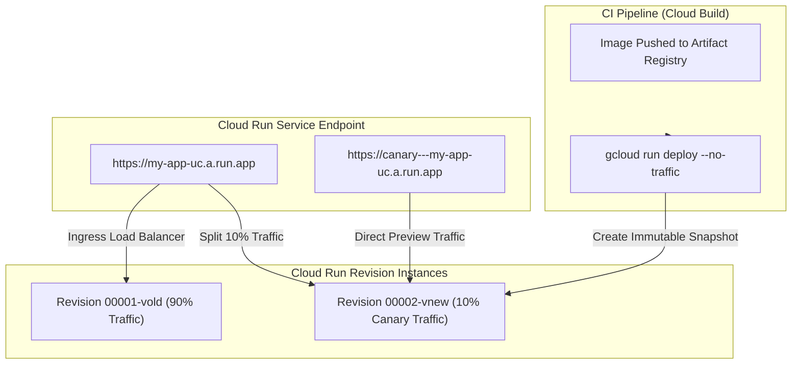

# Topic 91: Deploy to Cloud Run

---

## 1. What Is It?

**Deploy to Cloud Run** represents the automated continuous deployment methodology, revision management architecture, and traffic-shifting delivery models used to release containerized application updates onto Google Cloud's fully managed serverless platform.

Automating releases to Cloud Run centers around three core deployment primitives:
1. **Immutable Revisions**: Every code deployment or configuration modification creates a unique, immutable point-in-time snapshot (Revision) of the Cloud Run service.
2. **Traffic Management**: Native capability to split incoming HTTP request traffic granularly across multiple revisions (e.g., 90% to current revision, 10% to new canary revision).
3. **Automated Rollback & Tagging**: Dedicated revision URL tags allowing pre-release validation before assigning public production traffic.

Integrating Cloud Run with CI/CD tools (Cloud Build, Cloud Deploy, GitHub Actions) enables zero-downtime releases, canary deployments, and instant single-command rollbacks.

### Real-World Analogy
Think of Deploying to Cloud Run like managing a high-rise office building elevator system:
- **Traditional In-Place Update**: Shutting down all elevators in the building to replace motor cables, leaving workers stranded (Downtime).
- **Cloud Run Revision Deployment**: Installing a brand-new elevator shaft alongside the existing ones (New Revision). Maintenance engineers test the new shaft privately (Revision Tagged URL). Once verified, the building system seamlessly routes 5% of passengers to the new elevator (Canary Traffic Split), slowly scaling to 100% (Production Promotion). If an error occurs, passengers are routed back to the original shaft instantly (Rollback).

---

## 2. Where Does It Fit?

Cloud Run continuous deployment sits between container artifact storage and live user traffic management.



---

## 3. Core Concepts

| Deployment Concept | Definition | Production Best Practice |
|---|---|---|
| **Revision** | An immutable snapshot of code container image and environment configuration. | Never modify live revisions; deploy new revisions. |
| **Traffic Splitting** | Allocating specific percentages of incoming request traffic across active service revisions. | Use gradual canary splits (e.g., 5% -> 25% -> 100%). |
| **Revision Tagging** | Assigning custom URL prefixes to specific revisions for pre-traffic verification. | Use revision tags (`canary`, `staging`) for automated integration tests. |
| **Min Instances** | Pre-warmed container instances configured to eliminate cold starts. | Set `min-instances >= 1` for latency-critical APIs. |
| **Max Instances** | Scale ceiling limiting maximum concurrent container instances. | Always set `max-instances` guardrails to prevent budget runaways during DDoS attacks. |

---

## 4. How It Works

A canary deployment and progressive traffic promotion workflow follows a structured operational sequence:

```text
CI Step executes `gcloud run deploy --no-traffic --tag canary`
               ↓
Cloud Run provisions Revision 00002 -> Assigns private URL `canary---app.run.app`
               ↓
Run integration test suite against `canary---app.run.app` endpoint
               ↓
Tests Pass -> Execute `gcloud run services update-traffic --to-revisions=REV2=10,REV1=90`
               ↓
Monitor Cloud Logging error rates -> Promote traffic to 100%: `REV2=100`
               ↓
Tests Fail -> Execute rollback: `gcloud run services update-traffic --to-revisions=REV1=100`
```

1. **Atomic Environment Variables**: Updating environment variables or secret references automatically generates a new revision without modifying running containers.
2. **Concurrency Handling**: Each container instance handles up to `concurrency` simultaneous requests (default 80), scaling out horizontally as traffic increases.

---

## 5. Production Scenario

### Canary Revision Deployment with Automated Rollback Safety

```text
Requirement: Automate production deployments of a Python FastAPI microservice to Cloud Run with zero cold-start latency, a 10% canary traffic test, and automated rollback if error rates exceed 1%.
    ↓
Architecture: Cloud Build + Cloud Run Revision Splitting + Cloud Monitoring Alerting Policy.
    ↓
Step 1: Deploy new revision with no production traffic and assign tag `stage`:
    gcloud run deploy prod-api \
      --image=us-central1-docker.pkg.dev/proj/apps/api:v2.0 \
      --no-traffic \
      --tag=stage \
      --region=us-central1
    ↓
Step 2: Run automated end-to-end tests against `https://stage---prod-api-uc.a.run.app`.
    ↓
Step 3: Route 10% of production traffic to the new revision:
    gcloud run services update-traffic prod-api \
      --to-tags=stage=10 \
      --region=us-central1
    ↓
Step 4: Monitor HTTP 5xx error metrics for 5 minutes -> Shift 100% traffic to stage revision.
    ↓
Result: Zero-downtime deployment with automated safety validation preventing bad code from impacting 90% of user base.
```

*Why Selected*: Demonstrates native Cloud Run traffic management capabilities for progressive delivery.

---

## 6. Hands-On Lab

### Prerequisites
- GCP Project with Cloud Run and Artifact Registry APIs enabled.
- Cloud Shell or local machine with `gcloud` CLI installed.

### CLI Method

```bash
# 1. Environment configuration
export PROJECT_ID=$(gcloud config get-value project)
export REGION="us-central1"
export SERVICE_NAME="run-deploy-demo"

# 2. Enable APIs
gcloud services enable run.googleapis.com

# 3. Deploy Revision 1 (V1)
gcloud run deploy ${SERVICE_NAME} \
  --image="gcr.io/cloudrun/hello" \
  --region=${REGION} \
  --platform=managed \
  --allow-unauthenticated \
  --set-env-vars="VERSION=v1.0"

# 4. Save Revision 1 name
REV1=$(gcloud run services describe ${SERVICE_NAME} --region=${REGION} --format='value(status.latestReadyRevisionName)')
echo "Revision 1 Name: ${REV1}"

# 5. Deploy Revision 2 (V2) with NO production traffic and a custom tag
gcloud run deploy ${SERVICE_NAME} \
  --image="us-docker.pkg.dev/cloudrun/container/hello" \
  --region=${REGION} \
  --no-traffic \
  --tag="canary" \
  --set-env-vars="VERSION=v2.0"

# 6. Save Revision 2 name
REV2=$(gcloud run services describe ${SERVICE_NAME} --region=${REGION} --format='value(status.latestReadyRevisionName)')
echo "Revision 2 Name: ${REV2}"

# 7. Perform a split traffic allocation (80% to V1, 20% to V2)
gcloud run services update-traffic ${SERVICE_NAME} \
  --region=${REGION} \
  --to-revisions=${REV1}=80,${REV2}=20

# 8. Inspect active traffic split allocations
gcloud run services describe ${SERVICE_NAME} --region=${REGION} --format='yaml(status.traffic)'
```

### Verification
Execute requests against the service URL multiple times to observe traffic distribution across revisions:

```bash
SERVICE_URL=$(gcloud run services describe ${SERVICE_NAME} --region=${REGION} --format='value(status.url)')
for i in {1..10}; do curl -s $SERVICE_URL | grep -i "revision"; done
```

### Cleanup

```bash
gcloud run services delete ${SERVICE_NAME} --region=${REGION} --quiet
```

---

## 7. Security

### Cloud Run Production Security Controls
- **Ingress Traffic Restrictions**: Restrict ingress to `internal-and-cloud-load-balancing` to force traffic through Cloud Armor WAF and HTTPS Load Balancers.
- **IAM Authentication**: Enforce `require-authenticated` for internal microservices, requiring callers to present valid GCP OIDC tokens.
- **VPC Service Controls & Direct VPC Egress**: Route all outbound database queries securely through a Dedicated VPC Connector or Direct VPC Egress instead of public internet IPs.

```text
BAD PRACTICE:
Deploying production Cloud Run services with `--allow-unauthenticated` directly exposed to the public internet without DDoS or WAF protection.

PRODUCTION PRACTICE:
Set ingress to `internal-and-cloud-load-balancing`, attach Cloud Armor WAF security policies, and use Direct VPC Egress for internal backend communication.
```

---

## 8. Scaling & High Availability

Cloud Run instance scaling mechanics:

```text
Incoming Traffic Spike -> Load Balancer checks active instance concurrency limits
                        ↓
Current Instances saturated (Requests > Concurrency Limit * Active Instances)
                        ↓
Cloud Run automatically provisions new container instances (Up to max-instances)
                        ↓
Traffic drops -> Instances idle -> Scale down to min-instances (Can scale to 0)
```

- **Min Instances Tuning**: Set `min-instances = 1` for latency-critical production microservices to keep container runtimes warm, avoiding cold-start initialization delays.

---

## 9. Cost

### Cloud Run Billing Architecture

| Resource Metric | Free Tier Allocation | Pricing Rate |
|---|---|---|
| **vCPU Allocation** | 180,000 vCPU-seconds / month free | ~$0.00002400 per vCPU-second |
| **Memory Allocation** | 360,000 GiB-seconds / month free | ~$0.00000250 per GiB-second |
| **Requests Count** | 2 Million requests / month free | $0.40 per million requests |

- **CPU Allocation Models**: Choose between **CPU allocated during request processing** (Default serverless pay-per-request) or **CPU always allocated** (For background tasks and strict min-instance requirements).

---

## 10. Monitoring & Troubleshooting

### Metrics & Observability
- **Metrics Explorer**: Track `run.googleapis.com/request_count`, `run.googleapis.com/container/cpu/utilizations`, and `run.googleapis.com/container/startup_latencies`.
- **Cloud Trace**: Automatic distributed tracing of HTTP requests passing through Cloud Run revisions.

### Troubleshooting Matrix

| Symptom | Cause | Resolution |
|---|---|---|
| `HTTP 504 Gateway Timeout` | Request duration exceeded container execution timeout | Increase `--timeout` limit (Up to 60 min for HTTP services). |
| `HTTP 403 Forbidden` | Invoker lacks IAM `roles/run.invoker` permission | Grant `roles/run.invoker` to calling service account or user. |
| High startup latency (Cold Start) | Large container image or heavy framework initialization | Optimize container image size, use multi-stage builds, or set `--min-instances=1`. |

---

## 11. Common Mistakes

```text
Mistake: Updating Cloud Run container images using `latest` tag without triggering a new revision.
Why: Updating the container registry image without updating the Cloud Run service definition.
Impact: Cloud Run does not automatically pull new `latest` images unless a new revision is explicitly generated.
Correct Approach: Tag images with unique Git commit SHAs (`$SHORT_SHA`) and execute `gcloud run deploy` for every build.

Mistake: Leaving `max-instances` unset on high-concurrency Cloud Run services.
Why: Assuming default autoscaling safety.
Impact: Sudden traffic spikes or recursive loops can scale out thousands of instances, causing severe unexpected cloud costs.
Correct Approach: Always set explicit `--max-instances` guardrails on every production Cloud Run service.
```

---

## 12. Production Best Practices

- [ ] Tag container images with immutable **Git Commit SHAs** instead of `latest`.
- [ ] Implement **Canary Deployments** using native traffic splitting (`--to-revisions`).
- [ ] Set **`--max-instances` guardrails** to prevent cost runaways.
- [ ] Configure **`--min-instances=1`** for latency-sensitive customer-facing APIs.
- [ ] Restrict ingress to **`internal-and-cloud-load-balancing`** behind Cloud Armor.
- [ ] Route database outbound traffic securely via **Direct VPC Egress**.

---

## 13. Hyperscaler / Enterprise Perspective

```text
Personal / Learning
  Direct Public Deployment → `allow-unauthenticated` → Scale to 0 → `latest` Image Tag
        ↓
Small Production
  GitHub Actions CI/CD → Immutable Commit Tag → Manual Revision Split
        ↓
Enterprise Environment
  Cloud Deploy Pipelines → Internal Load Balancer Ingress → Direct VPC Egress Database Connectivity
        ↓
Hyperscaler Environment
  Automated Progressive Traffic Splitting → Cloud Armor WAF Protection → Multi-Region Active-Active Global Load Balancing
```

Enterprise hyperscalers deploy Cloud Run services across multiple GCP regions behind a **Global External HTTP(S) Load Balancer**, utilizing multi-region failover routing and automated continuous release verification pipelines.

---

## 14. Real Project Questions

### Q1: How does Cloud Run handle traffic splitting between different revisions without requiring a separate load balancer?
**Answer:** Cloud Run includes a native managed ingress proxy layer. The service configuration maintains a traffic mapping table that splits incoming HTTP request percentages directly at the proxy tier without requiring external load balancers or DNS changes.

### Q2: What is the difference between `--no-traffic` and `--tag` when deploying a Cloud Run revision?
**Answer:** **`--no-traffic`** creates a new revision without allocating any public service URL traffic to it. **`--tag=<TAG_NAME>`** assigns a dedicated direct URL (e.g., `https://TAG_NAME---service.a.run.app`) to that specific revision, allowing engineers to test the revision independently before shifting main traffic.

### Q3: How do you eliminate cold-start latency for Cloud Run applications?
**Answer:** Set `--min-instances` to 1 or greater. This ensures at least one container instance remains booted, warm, and ready in memory to process requests immediately without waiting for container spin-up initialization.

---

## 15. Quick Decision Guide

| Requirement | Recommended Cloud Run Parameter | Benefit |
|---|---|---|
| Pre-Traffic Integration Testing | `--no-traffic --tag=staging` | Generates isolated test URL without impacting live users. |
| Zero Cold-Start Latency | `--min-instances=1` | Keeps instances warm in memory permanently. |
| Prevent Runaway Billing | `--max-instances=50` | Sets hard limit on horizontal autoscaling. |

### When to Use Cloud Run
- Deploying stateless containerized web apps, APIs, microservices, and event-driven webhooks.

### When NOT to Use Cloud Run
- Stateful applications requiring local persistent disk storage or raw non-HTTP TCP/UDP protocols (use GKE or Compute Engine).

---

## 16. Related Services

```text
                [91. Deploy to Cloud Run]
               /            |            \
     Artifact Registry  Cloud Deploy   Cloud Armor
    (Image Source)    (Pipeline CD)    (WAF Protection)
          |                 |                 |
    Provides Sealed   Automates Revision Protects Public
    Container Image   Traffic Splits    Service Ingress
```

- **Artifact Registry**: Source storage repository for Cloud Run container images.
- **Cloud Deploy**: Managed delivery pipeline service automating revision promotion.
- **Cloud Armor**: Web Application Firewall protecting Cloud Run service ingress.

---

## 17. Cheat Sheet

### Common CLI Deployment Commands

```bash
# Deploy new revision with 100% traffic
gcloud run deploy my-service --image=us-central1-docker.pkg.dev/PROJ/REPO/img:v1.0 --region=us-central1

# Deploy new revision with NO traffic and a tag
gcloud run deploy my-service --image=us-central1-docker.pkg.dev/PROJ/REPO/img:v2.0 --no-traffic --tag=canary --region=us-central1

# Split traffic 90% to main, 10% to canary tag
gcloud run services update-traffic my-service --to-tags=canary=10 --region=us-central1

# Instant rollback: Send 100% traffic back to previous revision
gcloud run services update-traffic my-service --to-revisions=PREV_REV_NAME=100 --region=us-central1
```

---

## 18. Learning Connection

- **Previous Topic**: [90. Artifact Registry Integration](../90-artifact-registry-integration/README.md)
- **Next Topic**: [92. Deploy to GKE](../92-deploy-to-gke/README.md)
