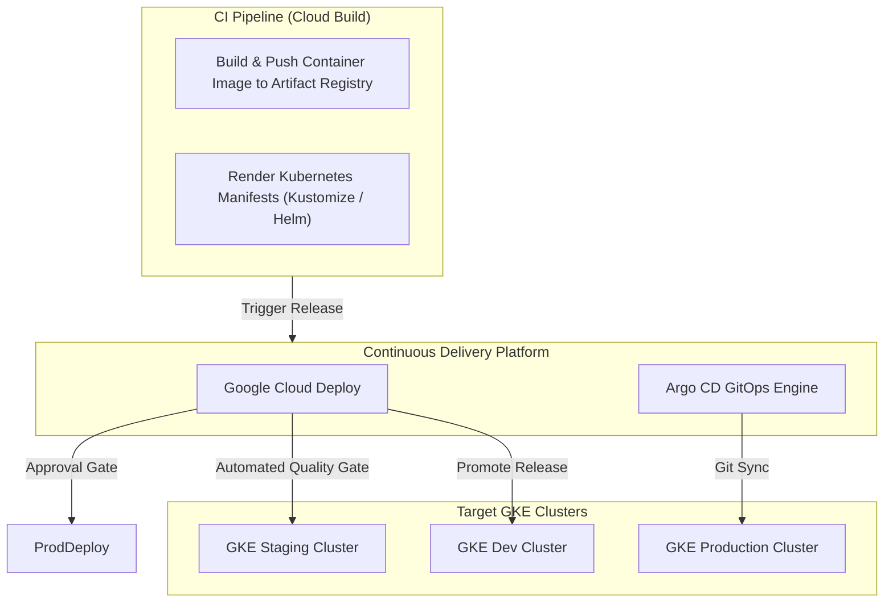

# Topic 92: Deploy to GKE

---

## 1. What Is It?

**Deploy to GKE** represents the automated continuous delivery framework, manifest management strategy, and progressive rollout architecture used to release containerized microservices onto Google Kubernetes Engine (GKE).

Automating Kubernetes deployments on GCP relies on four core deployment methodologies:
1. **Manifest Rendering Engines**: Standardizing Kubernetes YAML configurations across environments using **Kustomize** (overlay management) or **Helm** (template packaging).
2. **Managed Delivery Pipelines**: Using **Google Cloud Deploy** to automate artifact promotion sequentially across GKE target clusters (`dev` -> `staging` -> `prod`).
3. **GitOps Synchronization**: Operating declarative controllers like **Argo CD** or **Anthos Config Management** that continuously sync cluster state with Git repositories.
4. **Progressive Delivery**: Executing Canary and Blue/Green workload rollouts via GKE Gateway API, Service Mesh (ASM), or Flagger.

### Real-World Analogy
Think of Deploying to GKE like managing a multi-stage satellite launch operation:
- **Imperative Scripting (Old Method)**: Radioing astronauts line-by-line during launch to manually adjust thruster valves. If a message is lost, the rocket veers off course.
- **Declarative GKE Deployment Pipeline**: Writing a master flight blueprint (Kubernetes YAML via Kustomize). The automated flight computer (Cloud Deploy / Argo CD) constantly monitors telemetry (Kubernetes Control Plane), firing auto-correcting thrusters (Rolling Update Controller) until the satellite matches the exact designated orbital coordinates (Desired State).

---

## 2. Where Does It Fit?

GKE deployment automation connects build artifacts with Kubernetes cluster workloads.



---

## 3. Core Concepts

| Concept | Description | Production Best Practice |
|---|---|---|
| **Kustomize** | Template-free Kubernetes manifest customization engine built into `kubectl`. | Use Kustomize overlays to inject environment-specific variables without duplication. |
| **Helm** | Package manager for Kubernetes using templated charts and value overrides. | Store signed Helm charts in Artifact Registry OCI repositories. |
| **Cloud Deploy** | Native GCP managed continuous delivery platform for GKE and Cloud Run. | Mandatory for enterprise multi-cluster promotion and audit tracking. |
| **GitOps** | Continuous deployment pattern where Git repositories serve as the sole source of truth. | Use Argo CD or Anthos Config Management to eliminate direct `kubectl` access. |
| **RollingUpdate Strategy** | Default Kubernetes strategy replacing old Pods with new Pods incrementally. | Always set `maxSurge` and `maxUnavailable` parameters explicitly. |

---

## 4. How It Works

A Cloud Deploy release pipeline automating GKE deployments operates through structured execution targets:

```text
Developer pushes code -> Cloud Build creates image -> Triggers Cloud Deploy Release
                               ↓
Cloud Deploy renders `skaffold.yaml` & Kustomize manifests into release package
                               ↓
Stage 1: Apply manifests to `gke-dev` cluster -> Execute automated container health probes
                               ↓
Promote Release to Stage 2: Apply to `gke-staging` -> Execute integration test suite
                               ↓
Promote Release to Stage 3: Require explicit IAM Human Approval Gate
                               ↓
Stage 3: Apply manifests to `gke-prod` cluster via RollingUpdate strategy
```

1. **Declarative Manifest Hydration**: Raw source manifests are hydrated with specific image digests (`image@sha256:...`) before being applied to Kubernetes API endpoints.
2. **Automated Rollback Trigger**: If new Pods fail readiness probes during deployment, Cloud Deploy or Kubernetes controllers halt the rollout and restore previous healthy Pod replicas.

---

## 5. Production Scenario

### Enterprise Multi-Cluster Cloud Deploy Pipeline

```text
Requirement: Establish a secure multi-cluster deployment pipeline that promotes microservices from GKE Staging to GKE Production using Kustomize and Cloud Deploy with strict approval guardrails.
    ↓
Architecture: Cloud Build + Cloud Deploy + Kustomize Overlays + GKE Regional Clusters.
    ↓
Step 1: Define Cloud Deploy pipeline (`clouddeploy.yaml`):
    apiVersion: deploy.cloud.google.com/v1
    kind: DeliveryPipeline
    metadata:
      name: microservice-pipeline
    serialPipeline:
      stages:
      - targetId: gke-staging
      - targetId: gke-production
        profiles: [prod]
    ↓
Step 2: Create Kustomize overlays for `staging` and `prod`.
    ↓
Step 3: Trigger release from CI:
    gcloud deploy releases create rel-v1-0 \
      --delivery-pipeline=microservice-pipeline \
      --region=us-central1 \
      --source=./deploy
    ↓
Result: Centralized release management dashboard with automated staging deployment and mandatory IAM approval before production releases.
```

*Why Selected*: Illustrates native GCP enterprise continuous delivery standard for Kubernetes workloads.

---

## 6. Hands-On Lab

### Prerequisites
- Active GCP Project with GKE, Cloud Build, and Cloud Deploy APIs enabled.
- Existing GKE Cluster or Cloud Shell environment.

### CLI Method

```bash
# 1. Environment configuration
export PROJECT_ID=$(gcloud config get-value project)
export REGION="us-central1"
export CLUSTER_NAME="gke-deploy-demo"

# 2. Enable necessary APIs
gcloud services enable container.googleapis.com \
  clouddeploy.googleapis.com \
  cloudbuild.googleapis.com

# 3. Create a lightweight GKE Autopilot cluster
gcloud container clusters create-auto ${CLUSTER_NAME} \
  --region=${REGION}

# 4. Get cluster authentication credentials
gcloud container clusters get-credentials ${CLUSTER_NAME} --region=${REGION}

# 5. Create deployment working directory
mkdir -p gke-deploy-lab && cd gke-deploy-lab

# 6. Create Kubernetes Deployment manifest
cat <<EOF > deployment.yaml
apiVersion: apps/v1
kind: Deployment
metadata:
  name: web-app
  labels:
    app: web-app
spec:
  replicas: 3
  selector:
    matchLabels:
      app: web-app
  template:
    metadata:
      labels:
        app: web-app
    spec:
      containers:
      - name: nginx
        image: nginx:1.25-alpine
        ports:
        - containerPort: 80
        resources:
          requests:
            cpu: "100m"
            memory: "128Mi"
          limits:
            cpu: "200m"
            memory: "256Mi"
        readinessProbe:
          httpGet:
            path: /
            port: 80
          initialDelaySeconds: 5
          periodSeconds: 5
---
apiVersion: v1
kind: Service
metadata:
  name: web-app-service
spec:
  type: ClusterIP
  ports:
  - port: 80
    targetPort: 80
  selector:
    app: web-app
EOF

# 7. Apply Kubernetes manifest directly to cluster
kubectl apply -f deployment.yaml

# 8. Monitor pod rollout status
kubectl rollout status deployment/web-app
```

### Verification
Check running Pods and confirm all 3 replicas are in `Running` status:

```bash
kubectl get pods -l app=web-app
```

### Cleanup

```bash
kubectl delete -f deployment.yaml
gcloud container clusters delete ${CLUSTER_NAME} --region=${REGION} --quiet
cd .. && rm -rf gke-deploy-lab
```

---

## 7. Security

### GKE Deployment Security Controls
- **RBAC Least Privilege**: Avoid binding human users or deployment service accounts to `cluster-admin`. Restrict deployment service accounts to specific namespaces using RoleBindings.
- **Binary Authorization Gate**: Enforce Binary Authorization on GKE to block deployment of images that lack valid cryptographic signatures from Cloud Build attestors.
- **Security Context Hardening**: Configure Pod `securityContext` to enforce non-root container execution (`runAsNonRoot: true`), read-only root filesystems, and drop Linux capabilities.

```text
BAD PRACTICE:
Granting `cluster-admin` privileges to generic CI service accounts and deploying Pods with `privileged: true` and root permissions.

PRODUCTION PRACTICE:
Enforce namespace-scoped RBAC, enforce Binary Authorization signature verification, and enforce Pod Security Standards (Restricted Profile).
```

---

## 8. Scaling & High Availability

Deployment scaling and zero-downtime availability strategies:

```text
Kubernetes RollingUpdate Deployment:
[Pod V1] [Pod V1] [Pod V1]
      ↓ (Deploy New Replica)
[Pod V2 (Initializing)] [Pod V1] [Pod V1] [Pod V1] (Surge +1)
      ↓ (Readiness Probe Passes)
[Pod V2 (Ready)] [Pod V1] [Pod V1] (Terminate -1 Old Pod)
      ↓ (Repeat until migration complete)
[Pod V2] [Pod V2] [Pod V2]
```

- **Pod Disruption Budgets (PDB)**: Define PDBs (`minAvailable: 80%`) to guarantee high availability during cluster node maintenance upgrades or autoscaling events.

---

## 9. Cost

### GKE Deployment Cost Factors

| Component | Cost Model | Cost Reduction Technique |
|---|---|---|
| **GKE Control Plane** | $0.10 / hour per cluster ($73 / month) | Utilize single Autopilot or regional cluster shared across namespaces. |
| **Worker Node Compute** | Standard Compute Engine VM rates | Use Spot Pods for non-production namespaces. |
| **Cloud Deploy Pipeline** | First active pipeline free, then $15 / month | Share deployment pipelines across microservices. |

---

## 10. Monitoring & Troubleshooting

### Deployment Visibility & Debugging
- **`kubectl rollout history`**: Inspect previous deployment revisions and undo failed releases (`kubectl rollout undo`).
- **GKE Workload Dashboard**: Monitor Pod restart counts, CPU throttle rates, and crash loop events in Cloud Console.

### Troubleshooting Matrix

| Symptom | Cause | Resolution |
|---|---|---|
| `ImagePullBackOff` | Invalid image path, missing tag, or GKE node lacks Artifact Registry access | Verify image path and grant `roles/artifactregistry.reader` to node service account. |
| `CrashLoopBackOff` | Container application crashing on boot | Inspect logs: `kubectl logs -l app=web-app --previous`. |
| `CreateContainerConfigError` | Missing ConfigMap or Secret referenced in pod spec | Verify referenced ConfigMap/Secret exists in target namespace. |

---

## 11. Common Mistakes

```text
Mistake: Omitting `readinessProbe` and `livenessProbe` from Kubernetes Deployment specs.
Why: Keeping specs minimal during initial development.
Impact: Kubernetes routes user traffic to booting container Pods before the application is ready, causing HTTP 502/503 errors.
Correct Approach: Always define HTTP or TCP readiness and liveness probes in Pod templates.

Mistake: Performing manual `kubectl edit` modifications directly on production clusters.
Why: Attempting quick hotfixes during incidents.
Impact: Creates configuration drift; manual edits are overwritten upon the next automated pipeline execution.
Correct Approach: Update manifests in Git source repositories and execute changes through the CI/CD pipeline.
```

---

## 12. Production Best Practices

- [ ] Use **Kustomize** or **Helm** to parameterize environment manifests.
- [ ] Implement **Google Cloud Deploy** for multi-target cluster promotion.
- [ ] Define **Readiness and Liveness Probes** for every container.
- [ ] Configure **Pod Disruption Budgets (PDB)** to protect availability during maintenance.
- [ ] Enforce **Binary Authorization** signature checks prior to cluster scheduling.
- [ ] Restrict pipeline service accounts using **Namespace-Scoped Kubernetes RBAC**.

---

## 13. Hyperscaler / Enterprise Perspective

```text
Personal / Learning
  Direct `kubectl apply` → Imperative Scripts → No Health Probes
        ↓
Small Production
  Cloud Build Pipeline → Helm Release → Basic Rolling Update Strategy
        ↓
Enterprise Environment
  Google Cloud Deploy Pipelines → Kustomize Overlays → Binary Authorization Gates
        ↓
Hyperscaler Environment
  GitOps Engine (Argo CD) → Service Mesh Traffic Splitting (Canary) → Automated SLI-Based Continuous Rollbacks
```

Hyperscaler enterprises adopt **GitOps** using Argo CD or Anthos Config Management combined with Service Mesh progressive delivery, eliminating human operator access to production Kubernetes API servers.

---

## 14. Real Project Questions

### Q1: Why is Kustomize preferred over Helm for simple Kubernetes manifest customization in GitOps pipelines?
**Answer:** Kustomize is a template-free configuration engine built natively into `kubectl`. It uses pure YAML overlays without complex templating syntax, making manifests easier to validate, audit, and maintain in declarative GitOps repositories.

### Q2: How does Cloud Deploy handle deployment rollbacks on GKE?
**Answer:** Cloud Deploy maintains a complete history of all releases. If a release fails or experiences issues in production, engineers can execute `gcloud deploy targets rollback` to automatically re-apply the exact manifest and image payload from the previous successful release.

### Q3: What is the purpose of Kubernetes Pod Readiness Probes during a rolling update deployment?
**Answer:** Readiness probes inform Kubernetes when a newly created container pod is fully initialized and capable of serving user traffic. Kubernetes delays routing traffic to the new Pod—and delays terminating the old Pod—until the readiness probe succeeds, guaranteeing zero-downtime deployments.

---

## 15. Quick Decision Guide

| Deployment Requirement | Recommended Framework | Advantage |
|---|---|---|
| Enterprise GCP Multi-Cluster CD | Google Cloud Deploy | Native GCP IAM, audit logging, and promotion UI. |
| Pure GitOps Declarative Sync | Argo CD / Anthos Config Sync | Automates cluster state reconciliation with Git. |
| Third-Party Application Packaging | Helm Charts | Standardized community chart repository format. |

### When to Use GKE Deployments
- Complex containerized microservice architectures requiring granular Pod orchestration and auto-healing.

### When NOT to Use GKE Deployments
- Simple stateless HTTP services that fit serverless paradigms (use Cloud Run for reduced operational overhead).

---

## 16. Related Services

```text
                  [92. Deploy to GKE]
                 /         |         \
       Cloud Build    Cloud Deploy   Artifact Registry
      (Renders Manifests) (Promotes) (Image Source)
            |              |              |
      Prepares Deploy  Orchestrates  Provides Container
      Payloads         Multi-Cluster Images to Pods
```

- **Cloud Build**: CI engine rendering manifests and building images.
- **Cloud Deploy**: Delivery pipeline promoting releases across GKE clusters.
- **Artifact Registry**: Image repository storing Pod container images.

---

## 17. Cheat Sheet

### Common GKE Deployment Commands

```bash
# Apply a Kustomize overlay directory to cluster
kubectl apply -k overlays/production

# View rollout status of a deployment
kubectl rollout status deployment/my-app -n production

# Undo last deployment and rollback to previous revision
kubectl rollout undo deployment/my-app -n production

# View deployment rollout history
kubectl rollout history deployment/my-app -n production

# Create a Cloud Deploy release targeting GKE
gcloud deploy releases create release-v1 --delivery-pipeline=gke-pipeline --region=us-central1 --source=./deploy
```

---

## 18. Learning Connection

- **Previous Topic**: [91. Deploy to Cloud Run](../91-deploy-to-cloud-run/README.md)
- **Next Topic**: [93. Cloud Monitoring](../../10-observability/93-cloud-monitoring/README.md)
