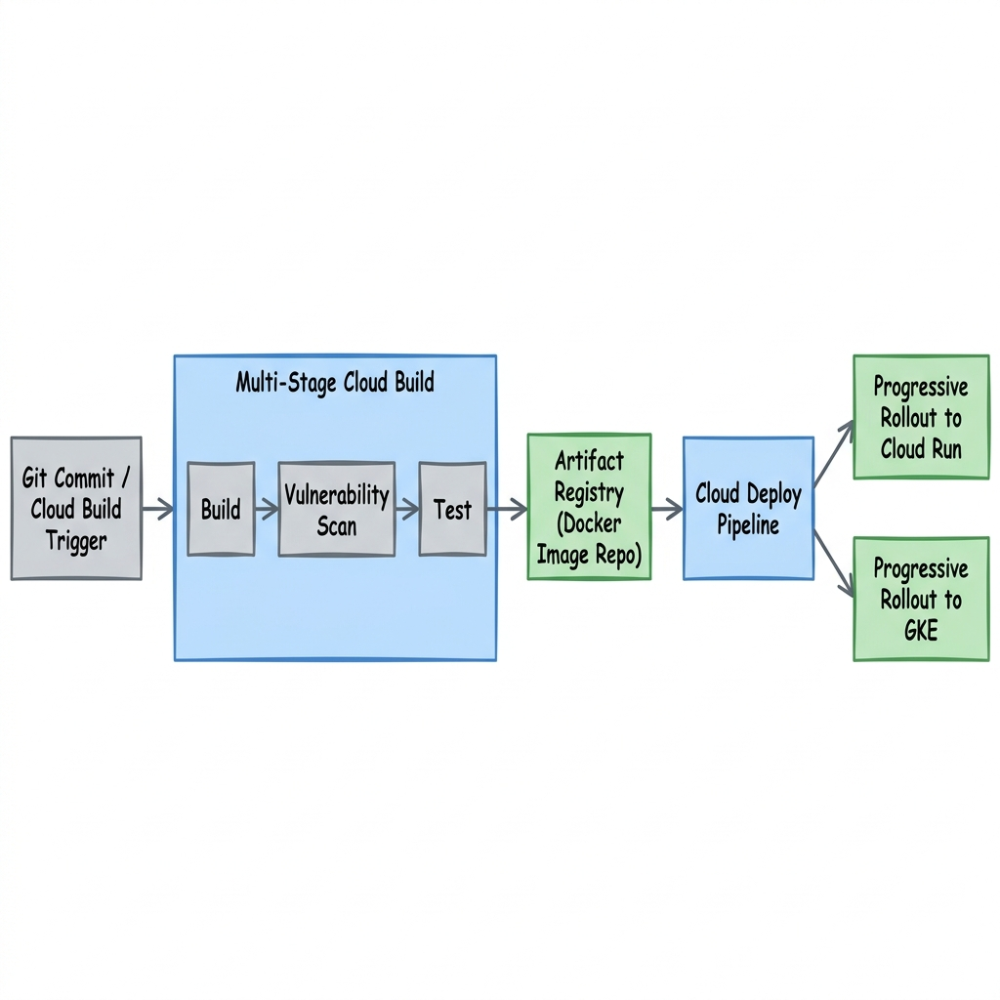
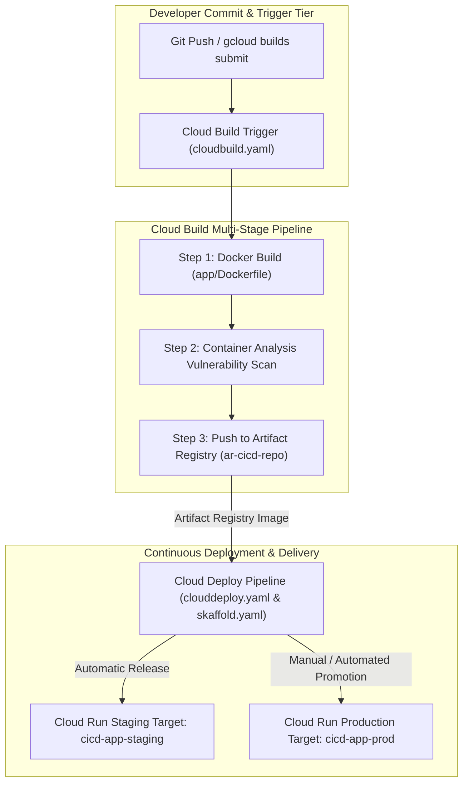

# Project 9: Automated Supply Chain GitOps Pipeline with Cloud Build & Cloud Deploy

---

## 1. Project Overview

Welcome to **Project 9: Automated Supply Chain GitOps Pipeline**. This hands-on project synthesizes all 5 topics in **Module 09 (CI/CD)** into a continuous integration and continuous deployment pipeline on GCP, optimized for **GCP Free Trial Accounts**.

### Objectives
In this project, you will:
1. **Author Multi-Stage Build Pipelines (`cloudbuild.yaml`)**: Define declarative build steps for container image compilation, automated unit testing, and vulnerability scanning.
2. **Integrate Artifact Registry Storage**: Store immutable container images in Artifact Registry repositories with versioned tags.
3. **Automate Continuous Deployment to Cloud Run**: Deploy build artifacts automatically to serverless Cloud Run endpoints.
4. **Configure Progressive Delivery with Cloud Deploy**: Establish a multi-target delivery pipeline (`clouddeploy.yaml`) promoting releases from staging to production.
5. **Enforce Security Supply Chain Policies**: Restrict deployments using IAM service account permissions and Container Analysis vulnerability scans.

---

## 2. Architecture & GitOps Pipeline

The project implements a zero-downtime CI/CD supply chain:





> [!IMPORTANT]
> **Free Trial Safety & Cost Controls**:
> - **Cloud Build Free Tier**: Includes 120 free build-minutes per day.
> - **Cloud Run Scale to Zero**: Staging and Production Cloud Run endpoints scale down to 0 instances when idle ($0 cost).
> - **Artifact Registry Allowance**: Includes 0.5 GB free storage per month.
> - **Automated Cleanup**: Run `./scripts/cleanup_cicd.sh` after completing your lab exercises to delete build pipelines, Artifact Registry repositories, and Cloud Run services!

---

## 3. Module Topics Covered

| Topic Number & Name | Project Integration Point |
|---|---|
| **88. CI/CD Concepts** | Implementing automated continuous integration and continuous deployment pipelines. |
| **89. Cloud Build** | Authoring multi-step declarative YAML build pipelines (`cloudbuild.yaml`). |
| **90. Artifact Registry Integration** | Authenticating Docker and pushing immutable container images (`ar-cicd-repo`). |
| **91. Deploy to Cloud Run** | Automating serverless container deployments with traffic splitting. |
| **92. Deploy to GKE** | Configuring progressive delivery release pipelines using Cloud Deploy and Skaffold. |

---

## 4. Hands-On Execution Guide

### Step 1: Navigate to Project 9 Workspace

Open Google Cloud Shell or local terminal:

```bash
cd "09-cicd/project-09-cicd"
chmod +x scripts/*.sh
```

---

### Step 2: Inspect Cloud Build & Cloud Deploy Pipeline Files

Inspect the pipeline configuration files:

```bash
# 1. View Cloud Build pipeline definition
cat cloudbuild.yaml

# 2. View Cloud Deploy pipeline spec
cat clouddeploy.yaml

# 3. View Skaffold hydration manifest
cat skaffold.yaml
```

---

### Step 3: Run the Automated CI/CD Pipeline Deployment Script

Execute `scripts/deploy_cicd_pipeline.sh` to automate:
1. Enabling Cloud Build, Cloud Deploy, Artifact Registry, Cloud Run, and Container Analysis APIs.
2. Creating Artifact Registry repository `ar-cicd-repo`.
3. Submitting the build pipeline (`cloudbuild.yaml`) to Cloud Build.
4. Deploying the application to Cloud Run (`cicd-app-staging`).

```bash
./scripts/deploy_cicd_pipeline.sh
```

*Expected Script Output Snippet*:
```text
=====================================================
GCP CI/CD Pipeline & Supply Chain Deployment
=====================================================
[INFO] Creating Artifact Registry Repository: ar-cicd-repo...
[SUCCESS] Artifact Registry repository ready.
[INFO] Submitting Build Pipeline to Cloud Build (cloudbuild.yaml)...
BUILD SUCCESSFUL
[INFO] Deploying Staging Endpoint to Cloud Run...
[SUCCESS] Application deployed to Cloud Run Staging: https://cicd-app-staging-xyz-uc.a.run.app
[SUCCESS] CI/CD Pipeline execution complete.
```

---

### Step 4: Verify Deployment Endpoint & Revision Traffic

Test the deployed Cloud Run staging endpoint:

```bash
# Fetch Cloud Run service URL
SERVICE_URL=$(gcloud run services describe cicd-app-staging --region=us-central1 --format="value(status.url)")

# Send HTTP GET request
curl -s ${SERVICE_URL}
```

*Expected JSON Output*:
```json
{
  "status": "HEALTHY",
  "service": "cicd-pipeline-demo",
  "version": "1.0.0",
  "environment": "staging"
}
```

---

## 5. Verification & Testing

Verify build logs and container image vulnerability scan results:

```bash
# 1. List recent Cloud Build execution jobs
gcloud builds list --limit=5

# 2. Inspect vulnerability scan findings in Artifact Registry
gcloud artifacts docker images list us-central1-docker.pkg.dev/$(gcloud config get-value project)/ar-cicd-repo
```

---

## 6. Troubleshooting & Common Issues

| Symptom / Error | Root Cause | Resolution |
|---|---|---|
| Cloud Build fails with `Permission Denied` during Cloud Run deploy | Cloud Build Service Account lacks `roles/run.admin` or `roles/iam.serviceAccountUser`. | Grant `Cloud Run Admin` and `Service Account User` roles to `@cloudbuild.gserviceaccount.com`. |
| `Artifact Registry repository not found` | Repository name typo or location mismatch. | Verify repository region matches `--location=us-central1`. |
| Cloud Deploy release fails during Skaffold render | `skaffold.yaml` apiVersion incompatible or kustomize syntax error. | Validate `skaffold.yaml` schema using `skaffold config list`. |

---

## 7. Project Cleanup

To delete all Cloud Build triggers, Artifact Registry repositories, Cloud Deploy pipelines, and Cloud Run services, run:

```bash
./scripts/cleanup_cicd.sh
```

---

## 8. Summary & Next Steps

Congratulations! You have completed **Project 9: Automated Supply Chain GitOps Pipeline with Cloud Build & Cloud Deploy**. You have mastered multi-stage build pipelines, vulnerability scanning, Artifact Registry, and Cloud Run deployments.

- **Next Project**: [Project 10: Full-Stack Enterprise Observability Suite](../../10-observability/project-10-observability/README.md)
