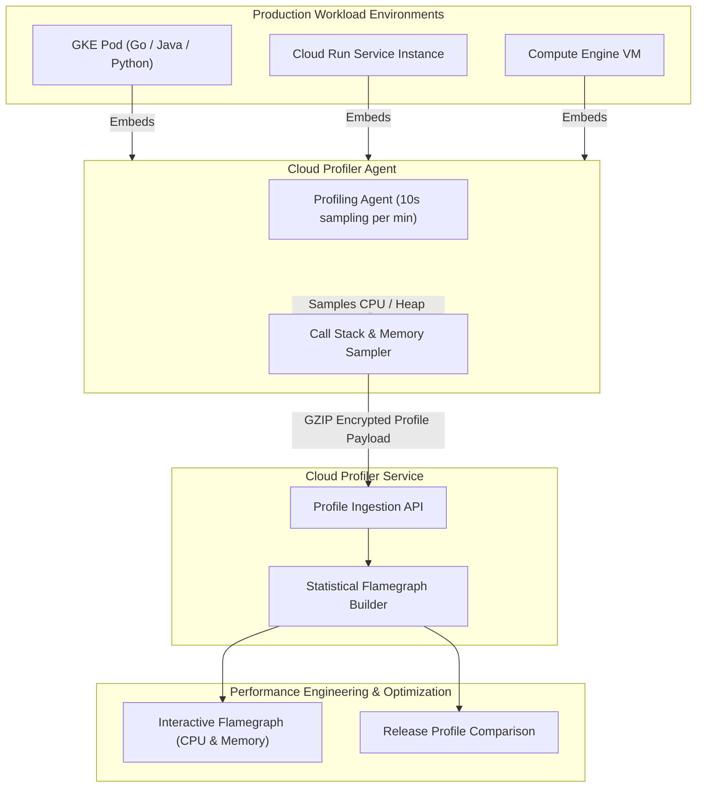

# Topic 100: Cloud Profiler

---

## 1. What Is It?

**Google Cloud Profiler** is a continuous, low-overhead statistical profiling service on Google Cloud Platform that collects, analyzes, and visualizes CPU utilization, memory allocation, wall-clock execution time, and lock contention across production application code running in GKE, Cloud Run, Compute Engine, or hybrid environments.

Cloud Profiler provides four core code optimization capabilities:
1. **Low-Overhead Production Profiling**: Uses statistical sampling (typically 0.5% to 1% CPU overhead) to continuously profile live production workloads safely without degrading application response times.
2. **Interactive Flamegraph Visualization**: Renders interactive hierarchical Flamegraphs displaying exact function call stacks and their proportional CPU or memory consumption.
3. **Historical Profile Comparison**: Compares code performance across different software releases or time windows to quantify optimization gains or identify performance regressions.
4. **Multi-Language Runtime Support**: Native agent libraries for Go, Java, Python, Node.js, and C++.

### Real-World Analogy
Think of Cloud Profiler like an automated medical MRI scanner operating continuously inside a high-performance athlete:
- **Cloud Monitoring (Heart Rate Monitor)**: Reports that the athlete's heart rate spiked to 180 BPM (High CPU utilization alert). It tells you *that* something is burning resources, but cannot tell you *why*.
- **Cloud Profiler (X-Ray Flamegraph)**: Zooms into the athlete's body while running, pinpointing the exact muscle group or artery (Specific Function / Code Line `#142`) consuming 85% of the oxygen—allowing surgeons to fix the exact code line causing performance degradation.

---

## 2. Where Does It Fit?

Cloud Profiler operates inside application runtime environments, capturing call-stack profiling data and streaming samples to the Cloud Profiler backend.



---

## 3. Core Concepts

| Concept | Description | Production Best Practice |
|---|---|---|
| **Flamegraph** | Hierarchical visualization where the X-axis represents function call proportions and the Y-axis represents call stack depth. | Look for wide horizontal bars at the top of the flamegraph to spot CPU hogs. |
| **CPU Time Profile** | Measures CPU execution time spent by functions. | Use to optimize CPU-heavy algorithms and reduce VM instance counts. |
| **Heap Memory Profile** | Measures allocated objects currently residing in heap memory. | Use to detect memory leaks and garbage collection pressure. |
| **Allocated Memory Profile** | Measures total cumulative memory allocated during a time period (including freed objects). | Use to reduce garbage collection churn and memory allocation frequency. |
| **Statistical Sampling** | Capturing profiling data periodically (e.g., 10 seconds every minute) rather than tracing every instruction. | Guarantees <1% CPU overhead in production. |

---

## 4. How It Works

Statistical sampling and flamegraph generation follow a low-overhead continuous loop:

```text
Application starts -> Initializes Cloud Profiler Agent background thread
                               ↓
Agent sleeps for ~50 seconds -> Wakes up & captures call stacks for 10 seconds
                               ↓
Collects CPU / Heap allocation samples -> Compresses profile data into GZIP
                               ↓
Streams payload to Cloud Profiler API -> Rendered as Flamegraph in Console UI
```

1. **Continuous Background Profiling**: The agent continuously collects profiles in the background across all running instances without requiring developer intervention during incidents.
2. **Aggregated Instance Sampling**: Across a fleet of 100 GKE Pods, Cloud Profiler automatically load-balances profiling tasks so only a tiny fraction of pods are sampled at any single moment.

---

## 5. Production Scenario

### Optimizing High-Memory Microservice Garbage Collection

```text
Requirement: Identify the exact function responsible for memory allocation spikes and high Garbage Collection (GC) CPU pause times in a production Go service running on Cloud Run.
    ↓
Architecture: Go Application + `cloud.google.com/go/profiler` SDK + Cloud Profiler UI.
    ↓
Step 1: Initialize Profiler in `main.go`:
    import "cloud.google.com/go/profiler"
    func main() {
        cfg := profiler.Config{
            Service:        "payment-service",
            ServiceVersion: "v1.2.0",
        }
        if err := profiler.Start(cfg); err != nil {
            log.Fatalf("failed to start profiler: %v", err)
        }
        // Application code...
    }
    ↓
Step 2: Deploy to Cloud Run -> Open Cloud Profiler Console.
    ↓
Step 3: Inspect "Allocated Memory" Flamegraph -> Identify `json.Unmarshal` creating millions of temporary byte buffers on line 84.
    ↓
Step 4: Refactor code to reuse buffer pools (`sync.Pool`).
    ↓
Result: Reduces heap allocations by 65%, decreasing Cloud Run container memory sizing and cutting compute costs by 30%.
```

*Why Selected*: Demonstrates real-world application optimization that directly reduces cloud infrastructure costs.

---

## 6. Hands-On Lab

### Prerequisites
- Active GCP Project with Cloud Profiler API enabled.
- Cloud Shell or local machine with `gcloud` CLI installed.

### CLI Method

```bash
# 1. Environment configuration
export PROJECT_ID=$(gcloud config get-value project)

# 2. Enable Cloud Profiler API
gcloud services enable cloudprofiler.googleapis.com

# 3. Check IAM permissions for Cloud Profiler Agent role
gcloud projects get-iam-policy ${PROJECT_ID} \
  --flatten="bindings[].members" \
  --format='table(bindings.role)' \
  --filter="bindings.role:roles/cloudprofiler.agent"

# 4. Create sample Go application using Cloud Profiler
mkdir -p profiler-demo && cd profiler-demo

cat <<EOF > main.go
package main

import (
	"log"
	"time"
	"cloud.google.com/go/profiler"
)

func main() {
	cfg := profiler.Config{
		Service:        "demo-profiler-service",
		ServiceVersion: "1.0.0",
	}
	if err := profiler.Start(cfg); err != nil {
		log.Printf("Profiler start failed: %v", err)
	} else {
		log.Println("Cloud Profiler initialized successfully!")
	}

	// Simulate work loop
	for i := 0; i < 5; i++ {
		busyWork()
		time.Sleep(1 * time.Second)
	}
}

func busyWork() {
	for i := 0; i < 1000000; i++ {
		_ = i * i
	}
}
EOF

# 5. Build Go binary to verify compilation
go mod init profiler-demo
go get cloud.google.com/go/profiler
go build -o app main.go
```

### Verification
Execute `./app` in Cloud Shell. Verify the console outputs `"Cloud Profiler initialized successfully!"`.

### Cleanup

```bash
cd .. && rm -rf profiler-demo
```

---

## 7. Security

### Cloud Profiler IAM Security
- **Agent IAM Role**: Applications running the profiler agent require `roles/cloudprofiler.agent` to upload profiling data to GCP.
- **Flamegraph Viewer Role**: Viewing flamegraphs in the Cloud Console requires `roles/cloudprofiler.user` or `roles/viewer`.

```text
BAD PRACTICE:
Granting `roles/editor` or `roles/owner` to application service accounts just to enable Cloud Profiler ingestion.

PRODUCTION PRACTICE:
Grant strictly `roles/cloudprofiler.agent` to the application Service Account via IAM role bindings.
```

---

## 8. Scaling & High Availability

Fleet-wide profiling scaling mechanics:

```text
Fleet of 500 Production GKE Pods
               ↓
Cloud Profiler Backend orchestrates distributed sampling schedule
               ↓
At any given moment, only 1 or 2 pods are actively sampling (0.5% Fleet Overhead)
               ↓
Profiles aggregated centrally -> Single Flamegraph representing entire fleet
```

- **Fleet-Wide Sampling Aggregation**: Cloud Profiler automatically manages sampling frequency across massive cluster fleets so overall application overhead remains imperceptible (<1%).

---

## 9. Cost

### Cloud Profiler Pricing Structure

| Component | Ingestion & Storage Fee | Note |
|---|---|---|
| **Cloud Profiler Agent & Storage** | 100% FREE | Cloud Profiler is completely free of charge on GCP. |
| **Flamegraph Visualizations** | 100% FREE | No charges for profile views or version comparisons. |

---

## 10. Monitoring & Troubleshooting

### Profiler Debugging & Flamegraph Tips
- **Reading Flamegraphs**: The width of a function box on the X-axis indicates the percentage of total CPU/Memory consumed by that function and its children. Wide boxes at top levels identify major performance bottlenecks.
- **Diff Mode**: Select "Compare" in the Cloud Console to compare Release V1 vs. Release V2 side-by-side, displaying performance increases in blue and regressions in red.

### Troubleshooting Matrix

| Symptom | Cause | Resolution |
|---|---|---|
| No profiles visible in Cloud Console | Agent service account missing `roles/cloudprofiler.agent` | Grant `roles/cloudprofiler.agent` to the application service account. |
| Flamegraph shows `[unknown]` function names | Application binary compiled without symbol tables (stripped symbols) | Recompile Go or C++ binaries retaining debug symbol tables (`-g`). |
| High CPU overhead from agent | Profiler configured to sample continuously instead of statistically | Ensure default Cloud Profiler SDK settings are used. |

---

## 11. Common Mistakes

```text
Mistake: Stripping debug symbols (`-s -w` flags in Go or `strip` in C++) from production binaries.
Why: Trying to minimize container image sizes.
Impact: Cloud Profiler cannot resolve memory addresses to human-readable function names, rendering flamegraphs containing only `[unknown]` blocks.
Correct Approach: Retain symbol tables in production binaries to enable clear Flamegraph function resolution.

Mistake: Installing third-party heavy APM profiling agents that run 100% continuous profiling.
Why: Expecting deeper data.
Impact: Degrades production application throughput by 5-15% and increases compute bill.
Correct Approach: Use GCP's native Cloud Profiler, which uses statistical sampling for <1% overhead.
```

---

## 12. Production Best Practices

- [ ] Initialize Cloud Profiler SDKs at application startup in all microservices.
- [ ] Retain **Debug Symbol Tables** in compiled production binaries.
- [ ] Grant **`roles/cloudprofiler.agent`** to application service accounts.
- [ ] Compare performance across releases using **Profile Comparison (Diff Mode)**.
- [ ] Focus optimization efforts on wide horizontal bars at top levels of **Heap Allocations**.
- [ ] Label deployments with explicit `ServiceVersion` tags for accurate historical tracking.

---

## 13. Hyperscaler / Enterprise Perspective

```text
Personal / Learning
  No Profiling → Ad-hoc Local pprof Debugging → Manual Memory Inspection
        ↓
Small Production
  Cloud Profiler SDK Integration → Manual Flamegraph Inspection → CPU Optimization
        ↓
Enterprise Environment
  Terraform IAM Deployment → CI/CD Version Tagging → Continuous Heap Allocation Audits
        ↓
Hyperscaler Environment
  Automated Performance Regression Gates in CI/CD → Fleet-Wide Profiling Across 10,000+ Pods → FinOps Compute Sizing Optimization
```

Enterprise hyperscalers integrate Cloud Profiler into their **FinOps Rightsizing** workflows, using heap allocation flamegraphs to downsize overprovisioned GKE node pools and reduce cloud compute spend by millions annually.

---

## 14. Real Project Questions

### Q1: What is the main difference between Cloud Trace and Cloud Profiler?
**Answer:** **Cloud Trace** measures distributed latency and request timelines *between* microservices across a network. **Cloud Profiler** measures line-by-line code execution performance *inside* a single application process (CPU usage, memory allocation, function stack depth) to optimize code algorithms and memory usage.

### Q2: How does Cloud Profiler achieve <1% performance overhead in live production environments?
**Answer:** Cloud Profiler uses **Statistical Sampling**. Rather than profiling every single request continuously, the agent sleeps for long intervals (~50 seconds) and collects stack trace samples for only 10 seconds per minute across a small fraction of fleet instances, producing statistically accurate flamegraphs with zero noticeable impact on user traffic.

### Q3: Why is the Flamegraph visualization uniquely effective for software optimization?
**Answer:** A Flamegraph visualizes function call stacks hierarchically where horizontal box width represents the percentage of total CPU or memory consumed. Engineers can instantly spot wide horizontal boxes ("hotspots") to identify the exact functions consuming disproportionate resources without reading thousands of log lines.

---

## 15. Quick Decision Guide

| Performance Engineering Goal | Recommended Tool | Advantage |
|---|---|---|
| Pinpointing Memory Leaks & Code Hotspots | Cloud Profiler | Renders interactive Flamegraphs with zero overhead. |
| Tracking Network Hop Latency | Cloud Trace | Renders multi-service RPC waterfall timelines. |
| Monitoring Overall CPU & Memory Metrics | Cloud Monitoring | High-level time-series line charts and alerts. |

### When to Use Cloud Profiler
- Essential for continuous code optimization, memory leak debugging, garbage collection tuning, and FinOps compute rightsizing.

### When NOT to Use Cloud Profiler
- Tracking network latency across microservices (use Cloud Trace).

---

## 16. Related Services

```text
                  [100. Cloud Profiler]
                 /          |          \
      Cloud Trace   Cloud Monitoring   Compute / GKE
     (RPC Latency)  (CPU Metrics)      (App Runtime)
          |                 |                |
      Traces Between    Alerts On High   Runs Profiler
      Microservices     Resource Usage   Agent Threads
```

- **Cloud Trace**: Complementary distributed tracing tool measuring RPC latency between services.
- **Cloud Monitoring**: Metrics engine alerting when overall system CPU/Memory spikes occur.
- **Compute Engine / GKE**: Target runtime platforms hosting profiled applications.

---

## 17. Cheat Sheet

### Common SDK Initialization Code Snippets

```go
// Go Cloud Profiler Initialization
import "cloud.google.com/go/profiler"

func main() {
    profiler.Start(profiler.Config{
        Service:        "my-service",
        ServiceVersion: "1.0.0",
    })
}
```

```python
# Python Cloud Profiler Initialization
import googlecloudprofiler

googlecloudprofiler.start(
    service='my-service',
    service_version='1.0.0',
)
```

---

## 18. Learning Connection

- **Previous Topic**: [99. Cloud Trace](../99-cloud-trace/README.md)
- **Next Topic**: [101. OpenTelemetry](../101-opentelemetry/README.md)
