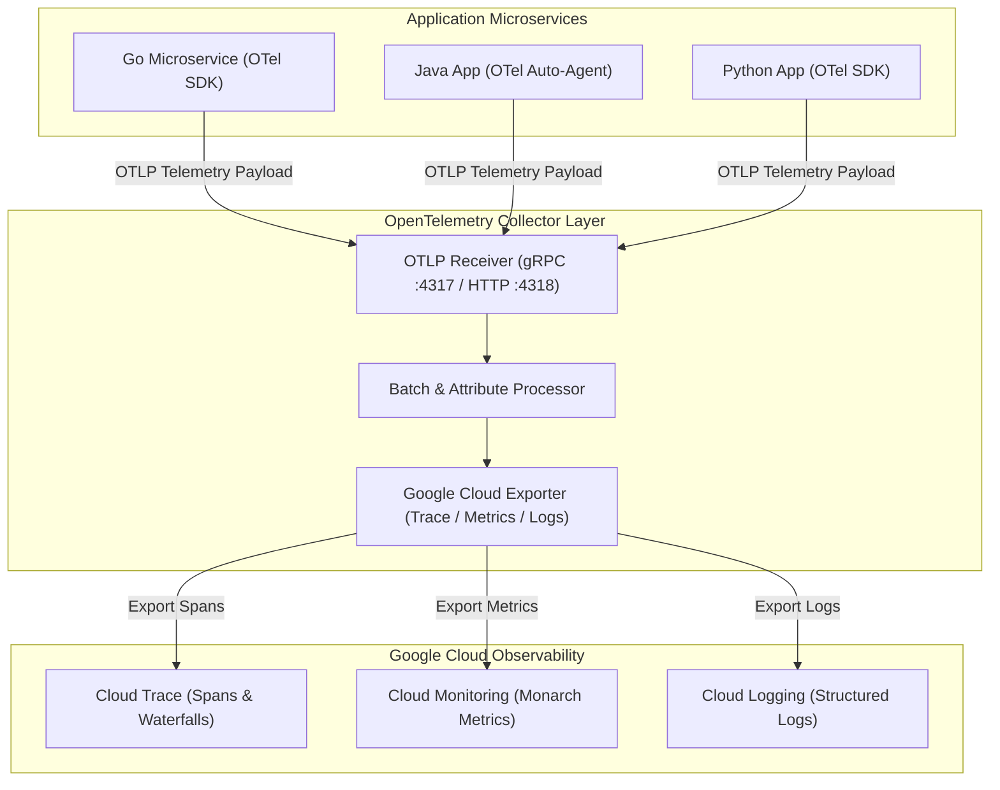

# Topic 101: OpenTelemetry

---

## 1. What Is It?

**OpenTelemetry (OTel)** on Google Cloud Platform is the vendor-neutral, open-source CNCF observability framework and telemetry data collection standard used to instrument, generate, collect, transform, and export traces, metrics, and logs from application workloads into Google Cloud Observability (Cloud Monitoring, Cloud Logging, Cloud Trace) or third-party observability platforms (Datadog, Dynatrace, New Relic).

OpenTelemetry on GCP delivers four primary architecture capabilities:
1. **Vendor-Neutral Instrumentation API/SDK**: Single standardized telemetry API allowing developers to instrument application code once without vendor lock-in.
2. **OpenTelemetry Collector**: High-performance proxy agent and gateway that receives telemetry over OTLP (OpenTelemetry Protocol), applies filtering/sampling transforms, and exports metrics and traces to Cloud Operations APIs.
3. **Automatic Context Propagation**: Enforces W3C Trace Context standards (`traceparent`, `tracestate`) across HTTP and gRPC microservice boundaries.
4. **Google Cloud OpenTelemetry Exporters**: Native GCP exporter plugins seamlessly translating OTLP telemetry formats into Monarch metrics and Cloud Trace spans.

### Real-World Analogy
Think of OpenTelemetry like universal power adapters and electrical converters for international travelers:
- **Proprietary Monitoring Agents (Old Model)**: Buying a custom hairdryer, phone charger, and laptop cord for every country you visit. Switching cloud vendors requires ripping out and rewriting all application logging and metric SDK code.
- **OpenTelemetry**: Standardizing all electronic devices on a single universal USB-C plug standard (OTLP API). Travelers plug devices into a lightweight universal power adapter (OTel Collector), which seamlessly regulates voltage and routes power into US 110V outlets (GCP Cloud Monitoring) or European 230V outlets (Datadog) without changing any personal electronic devices.

---

## 2. Where Does It Fit?

OpenTelemetry sits between multi-language application microservices and backend cloud observability storage engines.



---

## 3. Core Concepts

| Concept | Description | Production Best Practice |
|---|---|---|
| **OTLP Protocol** | Standardized gRPC/HTTP protocol (`opentelemetry.proto`) for transmitting telemetry payloads. | Use gRPC (Port 4317) for high-throughput OTLP transmission. |
| **OTel Collector DaemonSet / Deployment** | Proxy service containing Receivers, Processors, and Exporters. | Deploy OTel Collector as a DaemonSet on GKE nodes for local agent collection. |
| **GCP OTel Exporter** | Official Google Cloud exporter package (`googlecloud`) writing OTLP data to GCP APIs. | Enable batch processing in collector pipelines to optimize GCP API calls. |
| **W3C Traceparent Header** | Standard HTTP header format (`00-traceid-spanid-flags`) propagating context. | Enable W3C propagation middlewares across all microservice routers. |
| **Auto-Instrumentation** | Zero-code instrumentation agents (e.g., Java Agent) attaching to runtimes automatically. | Use Java/Node.js auto-instrumentation agents to jumpstart observability without code edits. |

---

## 4. How It Works

Telemetry ingestion and export via the OpenTelemetry Collector follow a 3-stage pipeline:

```text
Application OTel SDK emits metrics/traces via OTLP (gRPC :4317)
                               ↓
1. Receiver Stage: OTel Collector receives raw OTLP payload
                               ↓
2. Processor Stage: Applies batching, attribute filtering, and PII redaction
                               ↓
3. Exporter Stage: GCP Exporter translates OTLP -> Calls Cloud Trace / Monitoring APIs
```

1. **Decoupled Architecture**: Applications send telemetry to `localhost:4317` without storing GCP API keys or endpoint definitions in app code.
2. **Dual-Routing**: The OTel Collector can simultaneously export the *same* telemetry stream to GCP Cloud Monitoring AND an external vendor (e.g., Splunk or Datadog) without multiplying application overhead.

---

## 5. Production Scenario

### GKE OpenTelemetry Collector Deployment with Dual Export to GCP and Datadog

```text
Requirement: Deploy an OpenTelemetry Collector DaemonSet on GKE that collects OTLP metrics and traces from 200 microservices, redacting PII before exporting traces to Cloud Trace and metrics to Cloud Monitoring.
    ↓
Architecture: GKE Autopilot + OTel Collector DaemonSet + `googlecloud` Exporter + Workload Identity.
    ↓
Step 1: Configure OTel Collector (`config.yaml`):
    receivers:
      otlp:
        protocols:
          grpc: { endpoint: "0.0.0.0:4317" }
    processors:
      batch:
        send_batch_size: 8192
        timeout: 5s
      attributes:
        actions:
          - key: user.email
            action: delete
    exporters:
      googlecloud:
        project: "prod-gcp-project"
    service:
      pipelines:
        traces:
          receivers: [otlp]
          processors: [batch, attributes]
          exporters: [googlecloud]
    ↓
Step 2: Deploy Collector via Helm / Kubernetes manifests.
    ↓
Result: Centralized, zero-lock-in telemetry collection pipeline with automated PII redaction and native GCP Cloud Trace visualization.
```

*Why Selected*: Demonstrates modern enterprise architecture standards for vendor-neutral observability pipelines.

---

## 6. Hands-On Lab

### Prerequisites
- Active GCP Project with Cloud Trace and Cloud Monitoring APIs enabled.
- Cloud Shell or local machine with `gcloud` CLI installed.

### CLI Method

```bash
# 1. Environment configuration
export PROJECT_ID=$(gcloud config get-value project)

# 2. Enable APIs
gcloud services enable cloudtrace.googleapis.com monitoring.googleapis.com

# 3. Create local working directory for OTel Collector test
mkdir -p otel-lab && cd otel-lab

# 4. Create OpenTelemetry Collector configuration file
cat <<EOF > otel-collector-config.yaml
receivers:
  otlp:
    protocols:
      grpc:
        endpoint: 0.0.0.0:4317
      http:
        endpoint: 0.0.0.0:4318

processors:
  batch:
    timeout: 1s
    send_batch_size: 1024

exporters:
  googlecloud:
    project: "${PROJECT_ID}"

service:
  pipelines:
    traces:
      receivers: [otlp]
      processors: [batch]
      exporters: [googlecloud]
    metrics:
      receivers: [otlp]
      processors: [batch]
      exporters: [googlecloud]
EOF

# 5. Inspect configuration for validity
cat otel-collector-config.yaml
```

### Verification
Inspect `otel-collector-config.yaml` and confirm the `exporters.googlecloud` block contains your current `$PROJECT_ID`.

### Cleanup

```bash
cd .. && rm -rf otel-lab
```

---

## 7. Security

### OpenTelemetry Security Controls
- **Workload Identity Binding**: Bind the Kubernetes Service Account running the OTel Collector to a GCP IAM Service Account possessing `roles/cloudtrace.agent` and `roles/monitoring.metricWriter`.
- **Collector Attribute Redaction**: Use the OTel Collector `attributes` processor to strip or hash sensitive headers, auth tokens, and PII prior to exporting.

```text
BAD PRACTICE:
Embedding long-lived GCP service account JSON key files inside OTel Collector container images or Kubernetes ConfigMaps.

PRODUCTION PRACTICE:
Use GKE Workload Identity for keyless authentication and use OTel Collector attribute processors for automated PII redaction.
```

---

## 8. Scaling & High Availability

Collector deployment topologies:

```text
Container Pods (Local OTLP Export to localhost:4317)
                       ↓
DaemonSet Collector (Node-local agent handles fast memory buffering)
                       ↓
Central Gateway Collector Pool (Autoscaled StatefulSet handles heavy batching & GCP Export)
```

- **Two-Tier Collector Topology**: Deploy lightweight OTel Agents as DaemonSets on nodes for local collection, routing data to a centralized autoscaled OTel Gateway pool for enterprise batching and export.

---

## 9. Cost

### OpenTelemetry Cost Breakdown

| Component | Software License | GCP API Ingestion Charge |
|---|---|---|
| **OpenTelemetry SDK & Collector** | 100% Free Open Source (Apache 2.0) | $0.00 |
| **Cloud Trace Ingestion via Exporter** | Standard GCP rates | $0.20 per million spans beyond free tier |
| **Cloud Monitoring Metric Ingestion** | Standard GCP rates | $0.2580 per MB for custom metrics beyond free tier |

---

## 10. Monitoring & Troubleshooting

### Collector Observability & Logs
- **Internal Collector Metrics**: OTel Collector exposes internal self-observability metrics on `:8888/metrics` (e.g., `otelcol_processor_dropped_spans`).
- **Health Check Endpoint**: Configure `:13133/` endpoint for Kubernetes liveness and readiness probes.

### Troubleshooting Matrix

| Symptom | Cause | Resolution |
|---|---|---|
| `otelcol_processor_dropped_spans` increasing | Collector overloaded or network bottleneck to GCP APIs | Increase `send_batch_size` or scale OTel Collector memory/CPU limits. |
| Exporter returns `PermissionDenied` (403) | OTel Collector service account lacks IAM writer roles | Grant `roles/cloudtrace.agent` and `roles/monitoring.metricWriter`. |
| Metrics missing in Cloud Monitoring | OTel metric type translation mismatch | Ensure OTel metric names follow GCP metric descriptor conventions. |

---

## 11. Common Mistakes

```text
Mistake: Instrumenting applications with legacy vendor-specific SDKs (e.g., direct Stackdriver SDKs).
Why: Using older code tutorials.
Impact: Creates hard vendor lock-in; migrating to another cloud or monitoring vendor requires complete code rewrites.
Correct Approach: Use OpenTelemetry SDKs exclusively for application instrumentation.

Mistake: Running the OTel Collector without a `batch` processor configured.
Why: Keeping minimal default collector config.
Impact: Sends individual HTTP/gRPC API requests to GCP for every single trace span, causing severe network latency and API throttling.
Correct Approach: Always include the `batch` processor in OTel Collector pipelines.
```

---

## 12. Production Best Practices

- [ ] Instrument application microservices using **OpenTelemetry (OTel) SDKs**.
- [ ] Deploy the **OpenTelemetry Collector** as a DaemonSet or central gateway.
- [ ] Use the official **`googlecloud` Exporter** plugin to write to GCP APIs.
- [ ] Authenticate collector Pods securely using **GKE Workload Identity**.
- [ ] Configure the **`batch` processor** to optimize network throughput and API usage.
- [ ] Strip sensitive user PII using the OTel **`attributes` processor**.

---

## 13. Hyperscaler / Enterprise Perspective

```text
Personal / Learning
  Direct App-to-GCP SDK → Local In-Memory Export → Basic Tracing
        ↓
Small Production
  OTel SDK in Code → Single OTel Collector Deployment → GCP Cloud Trace Exporter
        ↓
Enterprise Environment
  Two-Tier Collector Topology (DaemonSet + Central Gateway) → PII Attribute Filtering → Dual Export to GCP + Datadog
        ↓
Hyperscaler Environment
  100% Policy-Enforced OTel Standardization → Service Mesh Auto-Instrumentation → Automated SLI/SLO Data Pipelines
```

Enterprise hyperscalers mandate OpenTelemetry across all engineering teams, enabling central SRE teams to switch or multi-home telemetry backends globally via simple collector configuration edits without modifying thousands of microservice codebases.

---

## 14. Real Project Questions

### Q1: What is the primary architectural advantage of using OpenTelemetry over native cloud provider SDKs?
**Answer:** OpenTelemetry provides vendor neutrality. By instrumenting applications once with OTel standard APIs, organizations avoid vendor lock-in. Telemetry can be routed dynamically to GCP Cloud Monitoring, AWS CloudWatch, Datadog, or Splunk simply by modifying the OTel Collector configuration without editing application code.

### Q2: What are the three core stages of an OpenTelemetry Collector pipeline?
**Answer:** The three stages are:
1. **Receivers**: Ingest telemetry data in various formats (OTLP, Prometheus, Jaeger, Zipkin).
2. **Processors**: Transform, filter, batch, memory-limit, or redact PII from telemetry data.
3. **Exporters**: Translate processed telemetry into target destination formats (`googlecloud`, Datadog, Prometheus) and transmit payloads downstream.

### Q3: How does the OpenTelemetry `googlecloud` exporter handle authentication on GKE?
**Answer:** The `googlecloud` exporter automatically discovers GCP credentials from the environment. On GKE, it uses **Workload Identity** to securely assume the IAM role assigned to the Kubernetes Service Account, obtaining temporary OAuth tokens without storing static JSON key files.

---

## 15. Quick Decision Guide

| Telemetry Strategy | Recommended Architecture | Benefit |
|---|---|---|
| Universal Zero-Lock-In Application Telemetry | OTel SDK + OTel Collector + GCP Exporter | Complete vendor neutrality and flexible routing. |
| Quick Zero-Code Java/Node.js Instrumentation | OTel Auto-Instrumentation Agent | Instant tracing and metrics without code changes. |
| Native VM OS & Infrastructure Telemetry | Google Cloud Ops Agent | Pre-configured Telegraf/FluentBit agent for VM OS metrics. |

### When to Use OpenTelemetry
- Mandatory standard for modern microservice architectures, multi-cloud deployments, and enterprise observability pipelines.

### When NOT to Use OpenTelemetry
- Basic VM-only OS system metric monitoring (use Google Cloud Ops Agent instead).

---

## 16. Related Services

```text
                   [101. OpenTelemetry]
                  /         |          \
       Cloud Trace   Cloud Monitoring   GKE Workload Identity
      (Span Target)  (Metric Target)    (Collector Auth)
            |               |                   |
       Receives OTLP   Receives OTLP     Grants Keyless IAM
       Trace Spans     Metrics Data      API Access
```

- **Cloud Trace**: Target destination for OTLP trace spans exported by OTel.
- **Cloud Monitoring**: Target destination for OTLP metrics exported by OTel.
- **GKE Workload Identity**: Security mechanism granting IAM permissions to OTel Collector pods.

---

## 17. Cheat Sheet

### Common OTel Collector Config Snippet

```yaml
# OTel Collector Pipeline Configuration
receivers:
  otlp:
    protocols:
      grpc:
      http:

processors:
  batch:
    timeout: 1s
    send_batch_size: 1024

exporters:
  googlecloud:
    project: "my-gcp-project"

service:
  pipelines:
    traces:
      receivers: [otlp]
      processors: [batch]
      exporters: [googlecloud]
    metrics:
      receivers: [otlp]
      processors: [batch]
      exporters: [googlecloud]
```

---

## 18. Learning Connection

- **Previous Topic**: [100. Cloud Profiler](../100-cloud-profiler/README.md)
- **Next Topic**: [102. Secret Manager](../../11-security/102-secret-manager/README.md)
