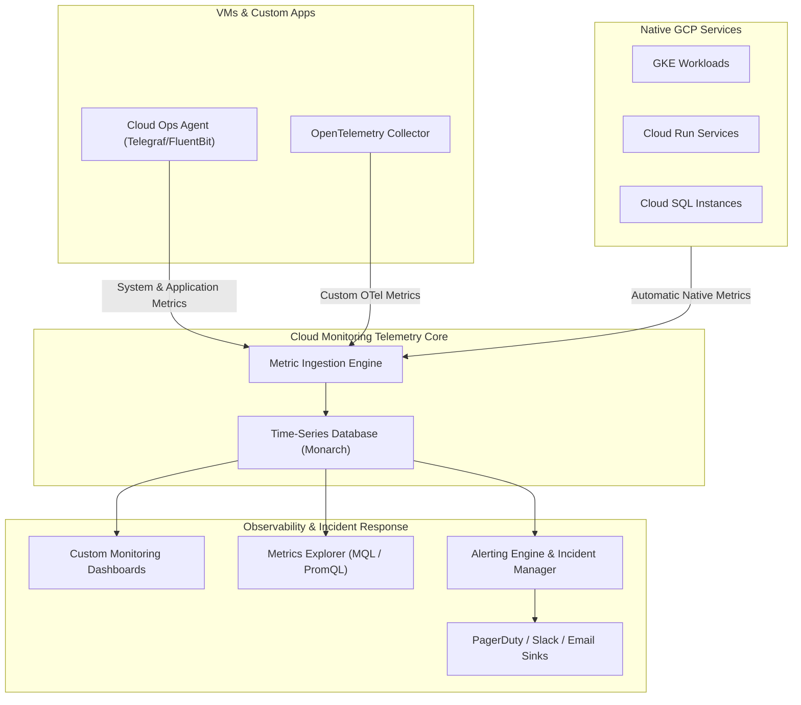

# Topic 93: Cloud Monitoring

---

## 1. What Is It?

**Google Cloud Monitoring** (formerly Stackdriver Monitoring) is the core observability platform on Google Cloud Platform that collects, ingests, analyzes, visualizes, and alerts on performance metrics, uptime health, and system telemetry across cloud infrastructure, managed services, and custom application workloads.

Cloud Monitoring delivers four essential operational capabilities:
1. **Full-Stack Telemetry Collection**: Ingests out-of-the-box system metrics automatically from all GCP services (Compute Engine, GKE, Cloud Run, Cloud SQL) without agent installation.
2. **Ops Agent Telemetry**: Collects deep guest-OS system metrics (memory utilization, disk I/O, process counts) and application logs via the unified **Google Cloud Ops Agent**.
3. **Multi-Project Scoping**: Consolidates telemetry across hundreds of GCP projects into unified **Metrics Scopes** for centralized enterprise visibility.
4. **SLO & Incident Integration**: Native support for defining Service Level Objectives (SLOs) and triggering automated incident notifications via email, Slack, PagerDuty, or Pub/Sub.

### Real-World Analogy
Think of Cloud Monitoring like the centralized flight control center of an international airport:
- **Un-monitored Infrastructure**: Pilots flying blindly through clouds without radar or instruments, unaware of engine temperature spikes or low fuel until a catastrophic failure occurs.
- **Cloud Monitoring**: A continuous real-time telemetry control room receiving automatic telemetry streams from every aircraft (GCP Services), runway sensor (Uptime Checks), and cabin pressure gauge (Custom Application Metrics), immediately alerting flight controllers (Alerting Policies) the moment an engine parameter drifts outside safe operating margins.

---

## 2. Where Does It Fit?

Cloud Monitoring serves as the central metric aggregation engine across GCP environments, hybrid clouds, and third-party systems.



---

## 3. Core Concepts

| Concept | Description | Production Rule |
|---|---|---|
| **Metric Descriptor** | Schema defining a metric's type, value type, labels, and unit. | Use standardized labels (e.g., `environment`, `service`) across custom metrics. |
| **Time Series** | A sequence of numeric data points collected over time associated with a metric type and resource labels. | Optimize cardinality to avoid high metric costs. |
| **Metrics Scope** | Multi-project workspace aggregating telemetry from multiple GCP projects. | Establish a dedicated Scoping Project for enterprise SRE teams. |
| **Cloud Ops Agent** | Single unified agent for VM system metrics (collectd) and logging (FluentBit). | Deploy Ops Agent on all Compute Engine instances via automated OS policies. |
| **Monarch** | Google's globally distributed, low-latency time-series database powering Cloud Monitoring. | Underpins high-performance querying across billions of data points. |

---

## 4. How It Works

Metric ingestion, storage, and visualization proceed deterministically:

```text
GCP Resource / Cloud Ops Agent generates metric data point
               ↓
Metric Ingest Endpoint validates schema & ingests into Monarch DB
               ↓
Data points aggregated into time-series buckets (Aligner & Reducer)
               ↓
Evaluated by Alerting Engine (Triggers incident if threshold violated)
               ↓
Rendered on Dashboards & Metrics Explorer via PromQL / MQL queries
```

1. **Automatic GCP Service Ingestion**: Every GCP service automatically streams system metrics into Cloud Monitoring with zero customer configuration.
2. **Metric Retention**: Cloud Monitoring retains performance metrics for **6 weeks (42 days)** by default. Long-term metric retention requires exporting metrics to BigQuery via Log Router sinks.

---

## 5. Production Scenario

### Enterprise Multi-Project SRE Observability Workspace

```text
Requirement: Establish a centralized Observability workspace aggregating metrics across 50 production projects with automated high-memory alerts on Cloud SQL instances.
    ↓
Architecture: Centralized Metrics Scoping Project + Cloud Monitoring Alerting Policy + Ops Agent.
    ↓
Step 1: Designate `proj-ops-monitoring` as the Central Metrics Scoping Project.
    ↓
Step 2: Add 50 production projects into the Metrics Scope:
    gcloud alpha monitoring views create \
      --scope=projects/proj-ops-monitoring \
      --project=proj-prod-app1
    ↓
Step 3: Create Alerting Policy monitoring Cloud SQL memory utilization (>85% for 5 mins):
    Filter: `resource.type="cloudsql_database" AND metric.type="cloudsql.googleapis.com/database/memory/utilization"`
    Condition: Threshold > 0.85 for 300s.
    Notification Channel: PagerDuty SRE On-Call Integration.
    ↓
Result: Single pane of glass for multi-project infrastructure with automated incident dispatch before database OOM crashes occur.
```

*Why Selected*: Demonstrates central enterprise SRE workspace setup and proactive incident alerting.

---

## 6. Hands-On Lab

### Prerequisites
- Active GCP Project with Compute Engine API enabled.
- Cloud Shell or local machine with `gcloud` CLI installed.

### CLI Method

```bash
# 1. Environment configuration
export PROJECT_ID=$(gcloud config get-value project)
export REGION="us-central1"
export VM_NAME="monitoring-lab-vm"

# 2. Enable Monitoring & Compute Engine APIs
gcloud services enable monitoring.googleapis.com compute.googleapis.com

# 3. Provision Compute Engine VM instance
gcloud compute instances create ${VM_NAME} \
  --zone=${REGION}-a \
  --machine-type=e2-micro \
  --scopes=cloud-platform

# 4. Install Cloud Ops Agent on the VM via SSH simulation script
gcloud compute ssh ${VM_NAME} --zone=${REGION}-a --command="curl -sSO https://dl.google.com/cloudagents/add-google-cloud-ops-agent-repo.sh && sudo bash add-google-cloud-ops-agent-repo.sh --also-install"

# 5. Create an Notification Channel (Email)
gcloud alpha monitoring channels create \
  --display-name="SRE Admin Email" \
  --type="email" \
  --channel-labels="email_address=admin@example.com"

# 6. Verify Ops Agent service status on the VM
gcloud compute ssh ${VM_NAME} --zone=${REGION}-a --command="sudo systemctl status google-cloud-ops-agent"
```

### Verification
Execute `gcloud compute ssh ${VM_NAME} --zone=${REGION}-a --command="sudo systemctl is-active google-cloud-ops-agent"` and verify the output returns `active`.

### Cleanup

```bash
gcloud compute instances delete ${VM_NAME} --zone=${REGION}-a --quiet
```

---

## 7. Security

### Monitoring IAM & Data Privacy Controls
- **Granular Monitoring Roles**: Restrict access using `roles/monitoring.viewer` for read-only dashboard access, `roles/monitoring.editor` for dashboard creators, and `roles/monitoring.admin` for workspace administrators.
- **Metric Security & Privacy**: Metric labels should NEVER contain PII (Personally Identifiable Information), passwords, or raw auth tokens, as metric payload data is stored in time-series indexes.

```text
BAD PRACTICE:
Adding customer credit card numbers or raw authorization JWT tokens as custom metric labels (`custom.googleapis.com/auth_token`).

PRODUCTION PRACTICE:
Use obfuscated hash IDs or low-cardinality metadata tags for metric labels, restricting access via fine-grained Cloud IAM roles.
```

---

## 8. Scaling & High Availability

Cloud Monitoring ingestion scaling and cardinality optimization:

```text
High Cardinality Metric (User ID label -> Millions of unique time-series -> Slow & Expensive)
                       ↓ (Cardinality Optimization)
Optimized Metric (Service & Region labels -> Thousands of aggregated time-series -> Low Latency)
```

- **Metrics Scope Topology**: Enterprise SRE teams use a single Scoping Project to view up to 375 monitored projects without deploying additional monitoring infrastructure.

---

## 9. Cost

### Cloud Monitoring Pricing Structure

| Component | Free Monthly Ingestion | Paid Ingestion Rate |
|---|---|---|
| **GCP System Metrics** | 100% FREE | $0.00 (All native GCP metrics are free) |
| **Custom Metrics Ingestion** | First 150 MB / month FREE | $0.2580 per MB |
| **Workload / Ops Agent Metrics** | First 150 MB / month FREE | $0.2580 per MB |
| **API Read Calls (`Get/List`)** | 1 Million API executions free | $0.01 per 1,000 executions |

---

## 10. Monitoring & Troubleshooting

### Operational Telemetry & Troubleshooting
- **Service Health Dashboard**: View global GCP platform incident status at `status.cloud.google.com`.
- **Metrics Explorer Debugging**: Test MQL and PromQL queries directly in Metrics Explorer to validate metric presence before creating alerting policies.

### Troubleshooting Matrix

| Symptom | Cause | Resolution |
|---|---|---|
| Ops Agent metrics missing in Console | Ops Agent service crashed or missing IAM permissions | Verify VM Service Account has `roles/monitoring.metricWriter`. |
| Custom metric data points dropped | Ingest rate exceeded 1 point per 10 seconds per time-series | Rate-limit metric reporting to 1 sample per 60 seconds per time-series. |
| High monthly observability bill | Excessive custom metric cardinality (e.g., UUID labels) | Remove high-cardinality labels from custom metric code. |

---

## 11. Common Mistakes

```text
Mistake: Adding dynamic UUIDs, IP addresses, or timestamps as custom metric label keys.
Why: Developers treat metric labels like log fields.
Impact: Explodes time-series cardinality, generating thousands of short-lived metric streams and causing massive billing spikes.
Correct Approach: Use high-cardinality values in Cloud Logging, reserving Cloud Metric labels for fixed enumerated categories (`environment`, `region`, `status_code`).

Mistake: Assuming native GCP metrics are retained indefinitely in Cloud Monitoring.
Why: Expecting long-term historical analytics out of the box.
Impact: Metrics older than 42 days are permanently purged from Monarch DB.
Correct Approach: Export metrics to BigQuery via Log Router sinks for multi-year compliance archiving.
```

---

## 12. Production Best Practices

- [ ] Install the **Google Cloud Ops Agent** on all Compute Engine instances.
- [ ] Establish a **Centralized Metrics Scoping Project** for multi-project enterprise visibility.
- [ ] Avoid high-cardinality labels (UUIDs, User IDs) in custom metric descriptors.
- [ ] Export metrics to **BigQuery** for long-term historical retention beyond 42 days.
- [ ] Define **Alerting Policies** with re-notification intervals to prevent alert fatigue.
- [ ] Grant `roles/monitoring.viewer` for read-only developer dashboard access.

---

## 13. Hyperscaler / Enterprise Perspective

```text
Personal / Learning
  Basic GCP Web Console → Default System Metrics → Email Alerting
        ↓
Small Production
  Single Project → Ops Agent System Metrics → Slack Webhook Alerts
        ↓
Enterprise Environment
  Centralized Metrics Scoping Project → Custom OpenTelemetry Collector → PagerDuty Integration
        ↓
Hyperscaler Environment
  Automated Terraform Dashboard Deployment → PromQL Managed Prometheus → Sloth/MQL Automated SLO Error Budget Tracking
```

Enterprise hyperscalers deploy **Managed Service for Prometheus** to query metrics natively using PromQL across hybrid cloud and multi-cluster GKE environments.

---

## 14. Real Project Questions

### Q1: How long does Cloud Monitoring retain time-series metric data by default?
**Answer:** Cloud Monitoring retains metric data points for **42 days (6 weeks)**. To retain metric history longer for multi-year compliance or capacity planning, metrics must be continuously exported to BigQuery or Cloud Storage.

### Q2: What is the primary difference between GCP System Metrics and Custom Metrics regarding cost?
**Answer:** **GCP System Metrics** generated automatically by GCP managed services (Compute Engine CPU, Cloud SQL memory, Cloud Run requests) are **100% free of charge**. **Custom Metrics** generated by application code or third-party Ops Agent plugins incur ingestion costs ($0.2580 per MB beyond the 150 MB free monthly tier).

### Q3: Why should you deploy the Google Cloud Ops Agent on Compute Engine VMs?
**Answer:** Standard GCP hypervisor metrics can only monitor external VM metrics (CPU utilization, network bytes, disk I/O ops). The Ops Agent runs inside the guest OS, providing visibility into internal OS telemetry like memory utilization, swap usage, disk space percentage, process tables, and system logs.

---

## 15. Quick Decision Guide

| Observability Goal | Recommended Tool | Advantage |
|---|---|---|
| VM Guest OS Memory & Disk Space | Cloud Ops Agent | Ingests internal OS metrics and logs smoothly. |
| Global Multi-Project Telemetry View | Metrics Scope Workspace | Aggregates up to 375 projects into a single pane of glass. |
| Native Prometheus Metric Querying | Managed Service for Prometheus | PromQL compatible metric ingestion scaling to millions of pods. |

### When to Use Cloud Monitoring
- Mandatory for real-time operational dashboarding, alert routing, SLO tracking, and system performance analytics across GCP.

### When NOT to Use Cloud Monitoring
- Long-term multi-year raw metric analytics (use BigQuery metric export instead).

---

## 16. Related Services

```text
                 [93. Cloud Monitoring]
                /          |           \
     Cloud Logging   Cloud Trace   Cloud Security
    (Log Sinks)     (Latency)     (IAM Access)
          |                |              |
    Logs to Metric   Traces Request  Restricts Viewer
    Conversion       Bottlenecks     Permissions
```

- **Cloud Logging**: Sister observability service storing structured and unstructured event logs.
- **Cloud Trace**: Distributed tracing tool analyzing microservice latency bottlenecks.
- **Cloud Security**: Manages IAM roles governing access to monitoring dashboards.

---

## 17. Cheat Sheet

### Common gcloud Monitoring Commands

```bash
# List active alerting policies
gcloud alpha monitoring policies list

# Create a notification channel (Email)
gcloud alpha monitoring channels create --display-name="OnCall Email" --type="email" --channel-labels="email_address=sre@company.com"

# Read metric data via gcloud CLI
gcloud monitoring time-series list "metric.type=\"compute.googleapis.com/instance/cpu/utilization\"" --limit=5
```

---

## 18. Learning Connection

- **Previous Topic**: [92. Deploy to GKE](../../09-cicd/92-deploy-to-gke/README.md)
- **Next Topic**: [94. Cloud Logging](../94-cloud-logging/README.md)
