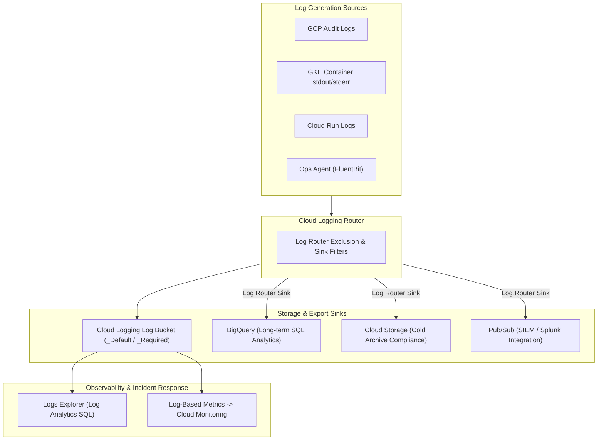

# Topic 94: Cloud Logging

---

## 1. What Is It?

**Google Cloud Logging** (formerly Stackdriver Logging) is a fully managed, real-time log management, ingestion, storage, and analytical query engine on Google Cloud. It automatically ingests audit logs, system events, and application stdout/stderr streams from across GCP services, GKE containers, and hybrid VMs.

Cloud Logging delivers four core enterprise architecture features:
1. **Unified Central Ingestion**: Real-time log capture across all GCP infrastructure, Google Cloud Audit Logs, and custom application loggers.
2. **Log Router Architecture**: High-performance streaming engine that routes incoming log entries to custom storage destinations (Cloud Storage, BigQuery, Pub/Sub, Log Buckets) based on filter rules.
3. **Structured JSON Logging**: Native support for JSON-formatted log entries enabling deep field filtering, query indexing, and metric extraction.
4. **Log-Based Metrics & Alerts**: Real-time conversion of matching log text occurrences into numerical time-series metrics in Cloud Monitoring.

### Real-World Analogy
Think of Cloud Logging like a city-wide security black box recorder system:
- **Un-aggregated Logging**: Every bus, train, and police car keeping paper logbooks under their seats. Searching for an incident requires visiting hundreds of physical parking garages.
- **Cloud Logging**: Every vehicle streams encrypted dashcam telemetry and GPS records to a central dispatch center (Log Router). Dispatchers filter events by vehicle type, timestamp, or event severity instantly (Logs Explorer SQL), forwarding traffic incident clips to city planners (BigQuery Export) and setting off station alarms when accidents are recorded (Log-Based Alerts).

---

## 2. Where Does It Fit?

Cloud Logging sits between log generators and long-term analytical sinks or incident response platforms.



---

## 3. Core Concepts

| Concept | Description | Production Best Practice |
|---|---|---|
| **Log Entry** | Structured JSON object containing metadata (`severity`, `timestamp`, `resource`, `labels`) and payload (`textPayload` or `jsonPayload`). | Format application logs as JSON strings for automatic parsing. |
| **Log Router Sink** | Rule exporting matching log entries continuously to external targets (BigQuery, GCS, Pub/Sub). | Use BigQuery sinks for security audit trails and long-term analytics. |
| **Log Bucket** | Dedicated storage container within Cloud Logging storing logs for defined retention periods (Default 30 days). | Extend retention on custom log buckets to 365+ days for regulatory compliance. |
| **Exclusion Filter** | Router rule discarding unneeded high-volume logs prior to storage ingestion. | Exclude verbose HTTP 200 health check logs to reduce ingestion costs. |
| **Log-Based Metric** | Time-series metric calculated from matching log occurrence counts or extracted numeric fields. | Create log-based metrics for application error rates (`severity>=ERROR`). |

---

## 4. How It Works

Log ingestion, routing, and processing follow a high-throughput streaming workflow:

```text
Resource / Container writes log to stdout/stderr
               ↓
Cloud Logging Agent / Platform Collector packages entry into standard JSON schema
               ↓
Ingestion Pipeline applies Log Router Sinks & Exclusion Filters
               ↓
Matching Sinks export logs to BigQuery / GCS / Pub/Sub concurrently
               ↓
Non-excluded logs stored in Log Bucket -> Available in Logs Explorer SQL
```

1. **Automatic Parsing**: Cloud Logging automatically extracts `severity`, `timestamp`, and `trace` correlation IDs from JSON payloads.
2. **Immutable Audit Logs**: Admin Activity audit logs are stored in `_Required` buckets and CANNOT be disabled or deleted by any IAM user.

---

## 5. Production Scenario

### Enterprise Security Audit Sink & Health Check Cost Exclusion

```text
Requirement: Filter out millions of HTTP 200 health check logs to reduce logging costs by 70%, while exporting all IAM security audit logs to BigQuery for multi-year compliance analysis.
    ↓
Architecture: Cloud Logging Router + Exclusion Filter + BigQuery Sink.
    ↓
Step 1: Create Log Router Exclusion Filter on `_Default` bucket:
    Filter: `resource.type="cloud_run_revision" AND httpRequest.status=200 AND httpRequest.requestUrl=~"/healthz"`
    ↓
Step 2: Provision BigQuery dataset `sec_audit_logs` in `us-central1`.
    ↓
Step 3: Create Log Router Sink exporting IAM audit logs to BigQuery:
    gcloud logging sinks create bq-iam-audit-sink \
      bigquery.googleapis.com/projects/sec-proj/datasets/sec_audit_logs \
      --log-filter='protoPayload.@type="type.googleapis.com/google.cloud.audit.AuditLog" AND protoPayload.serviceName="iam.googleapis.com"'
    ↓
Result: Eliminates wasteful health check storage costs while ensuring immutable SIEM security logs are queryable via SQL in BigQuery.
```

*Why Selected*: Demonstrates essential FinOps cost management and enterprise security compliance patterns.

---

## 6. Hands-On Lab

### Prerequisites
- GCP Project with Cloud Logging API enabled.
- Cloud Shell or local machine with `gcloud` CLI installed.

### CLI Method

```bash
# 1. Environment configuration
export PROJECT_ID=$(gcloud config get-value project)
export DATASET_NAME="logging_lab_dataset"

# 2. Enable BigQuery and Logging APIs
gcloud services enable logging.googleapis.com bigquery.googleapis.com

# 3. Create BigQuery dataset for log export
gcloud alpha bq datasets create ${DATASET_NAME} --location=us-central1

# 4. Create Log Router Sink exporting ERROR severity logs to BigQuery
gcloud logging sinks create error-logs-bq-sink \
  bigquery.googleapis.com/projects/${PROJECT_ID}/datasets/${DATASET_NAME} \
  --log-filter="severity>=ERROR"

# 5. Grant Log Router Writer identity permissions on BigQuery dataset
SINK_SERVICE_ACCT=$(gcloud logging sinks describe error-logs-bq-sink --format='value(writerIdentity)')
gcloud projects add-iam-policy-binding ${PROJECT_ID} \
  --member="${SINK_SERVICE_ACCT}" \
  --role="roles/bigquery.dataEditor"

# 6. Write a custom structured test log using gcloud
gcloud logging write my-test-log '{"message": "Critical application error test", "status_code": 500}' --severity=ERROR

# 7. Query logs via Logs Explorer CLI
gcloud logging read "logName=projects/${PROJECT_ID}/logs/my-test-log AND severity=ERROR" --limit=5 --format=json
```

### Verification
Inspect the JSON output returned by `gcloud logging read` to confirm your custom structured log entry was ingested correctly with `severity: "ERROR"`.

### Cleanup

```bash
gcloud logging sinks delete error-logs-bq-sink --quiet
gcloud alpha bq datasets delete ${DATASET_NAME} --delete-contents --quiet
```

---

## 7. Security

### Log Security & Privacy Controls
- **Audit Logs Protection**: Cloud Audit Logs (`Admin Activity`, `Data Access`, `System Event`) record all GCP API calls. Admin Activity logs are mandatory and retained for 400 days free.
- **Log Views & Access Isolation**: Create custom **Log Views** to grant developers access only to logs from specific namespaces or applications (`roles/logging.fieldAccessor`).
- **Data Redaction**: Mask credit card numbers, passwords, and PII in application loggers prior to transmitting logs to Cloud Logging.

```text
BAD PRACTICE:
Logging raw user credentials or PII in plain text (`logger.info(f"Login failed for user {email} password {password}")`).

PRODUCTION PRACTICE:
Enforce application-level PII redaction rules, enforce structured JSON logging, and restrict access using granular Cloud Logging Log Views.
```

---

## 8. Scaling & High Availability

Log Router scaling and regional routing architecture:

```text
Log Generators (100,000 logs / sec) -> Cloud Logging Global Ingestion Frontends
                                                ↓ (Log Router Processing)
Distribution Targets:
├── Log Bucket (Regional Storage - Fast Logs Explorer Searching)
├── BigQuery (Distributed Parallel SQL Analytics Engine)
└── Pub/Sub Topic (Streaming to External SIEM / Splunk Clusters)
```

- **Log Analytics**: Upgrade Log Buckets to use **Log Analytics** to query logs directly using standard ANSI SQL powered by BigQuery.

---

## 9. Cost

### Cloud Logging Cost Economics

| Component | Free Monthly Ingestion | Rate Beyond Free Tier |
|---|---|---|
| **Cloud Audit Logs (Admin Activity)** | 100% FREE (Retained 400 days) | $0.00 |
| **First 50 GB / Project / Month** | 50 GB FREE | $0.00 |
| **Log Ingestion & Storage** | First 50 GB free | $0.50 per GB |
| **Log Export Sinks** | Free to export | Destination pricing applies (BigQuery/GCS/PubSub) |

---

## 10. Monitoring & Troubleshooting

### Log Debugging & Search Tools
- **Logs Explorer**: Real-time log querying UI supporting regex, field matching, and time ranges.
- **Log Analytics**: SQL query interface executing complex aggregations directly on log bucket data.

### Troubleshooting Matrix

| Symptom | Cause | Resolution |
|---|---|---|
| Logs missing in BigQuery sink | Sink Service Account lacks BigQuery Data Editor permission | Grant `roles/bigquery.dataEditor` to sink `writerIdentity`. |
| Unstructured single-line log text | Application logging in plain text instead of JSON | Update app logger to output structured JSON strings (`{"severity": "INFO", ...}`). |
| Unexpected high monthly logging bill | High-frequency HTTP health check or debug logs ingested | Add Log Exclusion Filters to drop HTTP 200 health check logs. |

---

## 11. Common Mistakes

```text
Mistake: Printing unstructured multi-line stack traces to stdout in application containers.
Why: Standard stack trace printing in Java or Python.
Impact: Cloud Logging splits each line of the stack trace into separate log entries, corrupting search indexes and making debugging impossible.
Correct Approach: Format stack traces as single JSON objects containing `jsonPayload.stack_trace`.

Mistake: Forgetting to grant IAM write permissions to the auto-generated Log Router Sink Service Account identity.
Why: Assuming sink creation automatically configures permissions on the destination bucket/dataset.
Impact: Logs are dropped silently without being exported to BigQuery or Cloud Storage.
Correct Approach: Copy `writerIdentity` from sink creation output and grant proper destination IAM roles.
```

---

## 12. Production Best Practices

- [ ] Output application logs as **structured JSON** to stdout/stderr.
- [ ] Add **Log Exclusion Filters** to drop verbose HTTP 200 health checks.
- [ ] Export security audit logs to **BigQuery** for long-term SQL compliance searches.
- [ ] Create **Log-Based Metrics** for application errors to trigger Cloud Monitoring alerts.
- [ ] Use **Log Views** to enforce least-privilege log access across developer teams.
- [ ] Enable **Log Analytics** on custom log buckets to run ANSI SQL queries on log payloads.

---

## 13. Hyperscaler / Enterprise Perspective

```text
Personal / Learning
  Plain Text `console.log()` → Default Log Bucket → Web Console Searching
        ↓
Small Production
  Structured JSON Logging → Log Exclusion Filters → Slack Log-Based Metric Alerts
        ↓
Enterprise Environment
  Log Router Sinks → BigQuery Security Dataset → Log Views Access Control
        ↓
Hyperscaler Environment
  Automated SIEM Pub/Sub Streaming → KMS CMEK Encrypted Log Buckets → 365-Day Retained Audit Logging
```

Enterprise hyperscalers deploy Pub/Sub Log Router Sinks to stream security logs directly into enterprise SIEM platforms (Splunk, Datadog, Chronicle) while maintaining CMEK-encrypted long-term archives in Cloud Storage.

---

## 14. Real Project Questions

### Q1: What is the purpose of Cloud Logging Log Router Sinks?
**Answer:** Log Router Sinks continuously stream incoming log entries from GCP services to external storage destinations (BigQuery, Cloud Storage, Pub/Sub, or other Log Buckets) based on custom SQL-like filter criteria, enabling long-term compliance storage, SIEM integration, and analytics.

### Q2: How do Log Exclusion Filters save money in Cloud Logging?
**Answer:** Exclusion filters discard non-essential, high-volume log entries (such as routine HTTP 200 health checks or debug statements) at the Log Router tier *before* they are ingested into Log Buckets, avoiding the $0.50/GB log ingestion fee.

### Q3: What is a Log-Based Metric and when should you use one?
**Answer:** A Log-Based Metric converts matching log occurrences or numeric values inside log payloads into Cloud Monitoring time-series metrics. You use them to count specific application error codes or trace patterns when native system metrics do not exist.

---

## 15. Quick Decision Guide

| Logging Requirement | Recommended Feature | Advantage |
|---|---|---|
| Long-Term Security & Compliance Audit SQL | Log Router Sink to BigQuery | Fast multi-year SQL queries and immutable log tables. |
| Streaming Telemetry to Splunk / Datadog | Log Router Sink to Pub/Sub | Low-latency streaming integration with external SIEMs. |
| Reducing Ingestion Storage Bills | Log Exclusion Filters | Drops health check noise before ingestion billing. |

### When to Use Cloud Logging
- Mandatory for operational debugging, security auditing, application error tracking, and compliance archiving across GCP.

### When NOT to Use Cloud Logging
- Storing transactional database records or binary files (use Cloud SQL or Cloud Storage).

---

## 16. Related Services

```text
                   [94. Cloud Logging]
                  /         |         \
      Cloud Monitoring   BigQuery   Pub/Sub
     (Log Metrics)      (SQL Sinks) (SIEM Streaming)
            |               |            |
      Converts Logs to   Long-term   Streams Logs to
      Time-Series        Analytics   External Systems
```

- **Cloud Monitoring**: Receives log-based metrics generated by Cloud Logging.
- **BigQuery**: Analytical database target for log storage and SQL queries.
- **Pub/Sub**: Asynchronous messaging middleware streaming logs to third-party SIEM platforms.

---

## 17. Cheat Sheet

### Common Logs Explorer Queries & CLI Commands

```bash
# Read error logs from a Cloud Run service
gcloud logging read 'resource.type="cloud_run_revision" AND severity>=ERROR' --limit=10

# Create a Log-Based Counter Metric for 500 errors
gcloud logging metrics create app-500-errors \
  --description="Counts HTTP 500 application errors" \
  --log-filter='resource.type="cloud_run_revision" AND httpRequest.status=500'

# Create a Log Router Sink to Cloud Storage
gcloud logging sinks create gcs-audit-sink storage.googleapis.com/my-audit-bucket --log-filter='cloudaudit.googleapis.com/activity'
```

---

## 18. Learning Connection

- **Previous Topic**: [93. Cloud Monitoring](../93-cloud-monitoring/README.md)
- **Next Topic**: [95. Metrics Explorer](../95-metrics-explorer/README.md)
