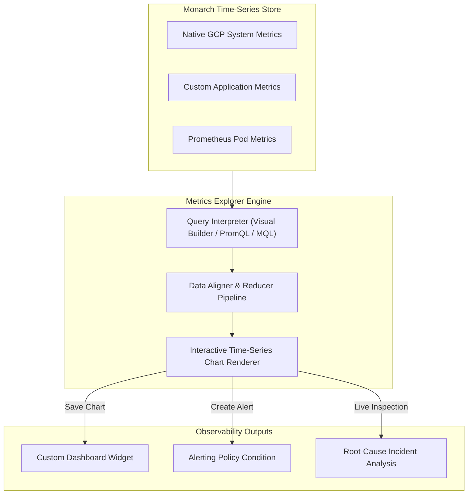

# Topic 95: Metrics Explorer

---

## 1. What Is It?

**Metrics Explorer** is the interactive metric querying, data visualization, and time-series analytical engine within Google Cloud Monitoring. It enables engineers and SREs to inspect, aggregate, filter, correlate, and graph real-time and historical performance metrics collected across GCP infrastructure and custom workloads.

Metrics Explorer delivers four key analytical capabilities:
1. **Multi-Language Querying**: Supports native visual query builder menus, **PromQL** (Prometheus Query Language), and **MQL** (Monitoring Query Language).
2. **Flexible Time-Series Aggregation**: Groups, aligns, and reduces raw time-series data using mathematical functions (rate, mean, 99th percentile, sum, count).
3. **Chart-to-Dashboard Persistence**: Saves ad-hoc metric exploration charts directly onto permanent Cloud Monitoring Dashboards or Alerting Policies with one click.
4. **Cross-Resource Correlation**: Visualizes metrics from diverse GCP components (e.g., GKE CPU alongside Cloud SQL IOPS) on a single temporal axis.

### Real-World Analogy
Think of Metrics Explorer like a high-end medical diagnostic suite in an emergency room:
- **Default Dashboards**: Standard heart rate monitors mounted on the wall displaying basic pulse rates.
- **Metrics Explorer**: An interactive diagnostic CT scanner where doctors can isolate specific organ systems (Filtering by Label), overlay blood pressure against oxygen saturation levels across time (Cross-Metric Correlation), zoom into a specific 5-minute anomaly window (Temporal Alignment), and save the diagnostic graph directly into the patient's medical file (Dashboard Save).

---

## 2. Where Does It Fit?

Metrics Explorer sits between Monarch time-series data stores and operational observability artifacts (Dashboards & Alerting Policies).



---

## 3. Core Concepts

| Concept | Description | Production Rule |
|---|---|---|
| **Alignment Period** | Time bucket (e.g., 1 min, 5 min) over which raw metric points are aggregated into a single value. | Match alignment periods to metric sampling intervals (e.g., 60s). |
| **Aligner Function** | Math operation (`ALIGN_RATE`, `ALIGN_MEAN`, `ALIGN_DELTA`, `ALIGN_PERCENTILE_99`) applied within each alignment period. | Use `ALIGN_RATE` for cumulative counters and `ALIGN_MEAN` for gauges. |
| **Reducer Function** | Math operation (`REDUCE_SUM`, `REDUCE_MEAN`) combining multiple time-series into a single stream. | Use `REDUCE_SUM` to measure total traffic volume across instances. |
| **PromQL Support** | Native execution of Prometheus query language statements against Cloud Monitoring. | Use PromQL when migrating Grafana dashboards to Cloud Monitoring. |
| **MQL Support** | GCP's native functional query language supporting complex multi-metric math operations. | Use MQL for advanced metric ratio math (e.g., Error Rate = Errors / Total Requests). |

---

## 4. How It Works

Processing a metric query in Metrics Explorer follows a multi-stage data transformation pipeline:

```text
User enters query (Visual Builder / PromQL / MQL)
               ↓
Query Engine fetches matching raw time-series from Monarch DB
               ↓
Aligner Step: Groups points into fixed time intervals (e.g., 60s) -> Applies Aligner function
               ↓
Group By & Reducer Step: Aggregates across instance labels -> Applies Reducer function
               ↓
Renders high-performance interactive chart on screen
```

1. **Cumulative vs. Gauge Metrics**: Cumulative metrics (increasing counters like total request counts) MUST be aligned using rate or delta functions before aggregation. Gauge metrics (current memory utilization) can be averaged directly.
2. **Cardinality Safety**: Grouping by high-cardinality labels displays individual time-series streams; grouping by low-cardinality labels consolidates lines into clean trends.

---

## 5. Production Scenario

### Calculating API Availability Error Rate Ratios using PromQL

```text
Requirement: Calculate the real-time HTTP 5xx error percentage ratio for a Cloud Run microservice in Metrics Explorer and convert it into a 99.9% SLO Alert.
    ↓
Architecture: Metrics Explorer + PromQL Ratio Query + Alerting Policy Generator.
    ↓
Step 1: Open Metrics Explorer and switch query language to PromQL.
    ↓
Step 2: Enter PromQL ratio query calculating 5xx errors divided by total requests:
    sum(rate(run_googleapis_com:request_count{response_code_class="5xx"}[5m]))
    /
    sum(rate(run_googleapis_com:request_count[5m])) * 100
    ↓
Step 3: Analyze real-time spike graph across the past 24 hours.
    ↓
Step 4: Click "Save as Alerting Policy" -> Set condition threshold > 0.1% for 5 mins.
    ↓
Result: Precise SLO availability tracking based on mathematical metric ratio calculations rather than raw counts.
```

*Why Selected*: Illustrates advanced metric ratio math and seamless conversion from ad-hoc analysis to active alerting.

---

## 6. Hands-On Lab

### Prerequisites
- Active GCP Project with Compute Engine API enabled.
- Cloud Shell or local machine with `gcloud` CLI installed.

### CLI Method

```bash
# 1. Environment configuration
export PROJECT_ID=$(gcloud config get-value project)

# 2. Enable Monitoring API
gcloud services enable monitoring.googleapis.com

# 3. Query Compute Engine CPU utilization metrics via gcloud MQL simulation
gcloud monitoring time-series list \
  "metric.type=\"compute.googleapis.com/instance/cpu/utilization\"" \
  --interval-start-time=$(date -u -d '1 hour ago' +%Y-%m-%dT%H:%M:%SZ) \
  --format="table(metric.labels.instance_name, points[0].value.doubleValue)"

# 4. Write a custom metric to explore in Metrics Explorer UI
gcloud logging write custom-metric-log '{"event": "login_failure", "user": "test"}'

# 5. Inspect Cloud Monitoring API metric descriptors list
gcloud monitoring metric-descriptors list --filter="metric.type=starts_with(\"compute.googleapis.com\")" --limit=5
```

### Verification
Execute `gcloud monitoring metric-descriptors list` and verify metric descriptors for Compute Engine are returned successfully.

### Cleanup
No persistent infrastructure created; no cleanup required.

---

## 7. Security

### Metrics Explorer IAM Security
- **Data Access Permissions**: Reading metric time-series in Metrics Explorer requires `roles/monitoring.viewer` or `roles/monitoring.editor`.
- **Cross-Project Scope Isolation**: Metrics Explorer respects Metrics Scope boundaries; engineers can only query projects attached to their authorized scope.

```text
BAD PRACTICE:
Granting broad `roles/monitoring.admin` permissions to developers just to allow them to query metrics in Metrics Explorer.

PRODUCTION PRACTICE:
Grant `roles/monitoring.viewer` for metric exploration and restrict workspace administrative changes to dedicated SRE teams.
```

---

## 8. Scaling & High Availability

Query execution performance scaling:

```text
Raw High-Density Time Series Data (Millions of raw data points over 30 days)
                      ↓ (Temporal Downsampling & Alignment)
Pre-Aggregated Time Windows (Aligned to 1-hour buckets -> Fast 50ms Chart Render)
```

- **Downsampling Engine**: Metrics Explorer automatically applies temporal downsampling when viewing long time ranges (e.g., 30 days) to maintain fast rendering performance without crashing browser tabs.

---

## 9. Cost

### Pricing Impact

| Metric Action | Cost Impact | Note |
|---|---|---|
| **Querying in Metrics Explorer** | 100% FREE | Interactive queries in the GCP Console incur zero charges. |
| **API Queries (`projects.timeSeries.list`)** | $0.01 per 1,000 API calls | External scripts or Grafana plugins querying the API incur minor charges. |

---

## 10. Monitoring & Troubleshooting

### Query Troubleshooting & Validation
- **Visual Builder Fallback**: If a PromQL or MQL query fails to parse, switch back to the Visual Builder mode to verify exact metric descriptor names.
- **Metric Absence Warning**: If a chart shows "No data points available", verify that the monitored resource actively emitted data within the selected time window.

### Troubleshooting Matrix

| Symptom | Cause | Resolution |
|---|---|---|
| Chart shows jagged spikes down to zero | Incorrect alignment function selected for cumulative metric | Change Aligner to `ALIGN_RATE` or `ALIGN_DELTA`. |
| `Unknown metric descriptor` error | Typo in metric name or service API disabled | Search for exact descriptor in the Visual Builder drop-down. |
| PromQL query returns syntax error | Prometheus metric name translation mismatch | Replace dots with underscores in GCP metric names (e.g., `compute_googleapis_com:instance_cpu_utilization`). |

---

## 11. Common Mistakes

```text
Mistake: Applying `ALIGN_MEAN` to cumulative counter metrics (e.g., total HTTP requests count).
Why: Selecting default gauge alignment functions.
Impact: Produces meaningless flat line averages instead of request rates per second.
Correct Approach: Always use `ALIGN_RATE` or `ALIGN_DELTA` when querying cumulative counter metrics.

Mistake: Querying raw un-aggregated time-series across thousands of GKE Pods simultaneously.
Why: Forgetting to apply a Group By reducer.
Impact: Renders a chaotic "spaghetti chart" of thousands of lines, slowing browser performance.
Correct Approach: Apply a Reducer function (`REDUCE_SUM` or `REDUCE_MEAN`) and Group By `namespace` or `cluster`.
```

---

## 12. Production Best Practices

- [ ] Use **PromQL** for teams migrating from Grafana or Prometheus environments.
- [ ] Align cumulative counter metrics using **`ALIGN_RATE`** prior to aggregation.
- [ ] Group time-series by logical environment tags (`environment`, `region`) to keep charts readable.
- [ ] Save frequently used diagnostic queries directly onto **Custom Dashboards**.
- [ ] Use **MQL** when computing multi-metric ratios (e.g., Error Rate / Total Volume).
- [ ] Grant **`roles/monitoring.viewer`** for read-only metric analytical access.

---

## 13. Hyperscaler / Enterprise Perspective

```text
Personal / Learning
  Basic Web UI Visual Builder → Single Metric Selection → 1-Hour Time Window
        ↓
Small Production
  Custom Metric Selection → Group By Instance Filtering → Save to Dashboard
        ↓
Enterprise Environment
  PromQL Ratio Queries → Multi-Project Scope Filtering → Saved Incident Playbook Links
        ↓
Hyperscaler Environment
  Managed Service for Prometheus PromQL → Automated MQL SLO Error Budget Calculations → Grafana Enterprise API Integration
```

Enterprise hyperscalers integrate Metrics Explorer queries directly into Grafana enterprise instances using the native Cloud Monitoring data source plugin, enabling SREs to visualize GCP and on-prem metrics side-by-side.

---

## 14. Real Project Questions

### Q1: What is the key functional difference between a Gauge metric and a Cumulative metric in Metrics Explorer?
**Answer:** A **Gauge** metric measures a single instantaneous value at a specific point in time (e.g., current CPU utilization or memory usage). A **Cumulative** metric measures a continuously accumulating total count over time (e.g., total bytes transferred or total HTTP requests received) and must be aligned using rate or delta functions to calculate meaningful per-second rates.

### Q2: Why would an engineer choose MQL over PromQL in Cloud Monitoring?
**Answer:** While PromQL is great for Prometheus users, **MQL** (Monitoring Query Language) natively supports advanced multi-table outer joins, complex mathematical transformations across distinct GCP metric types, and pipeline-style data manipulation steps natively optimized for Monarch DB.

### Q3: How do you save a query created in Metrics Explorer for team reuse?
**Answer:** Click the **"Save to Dashboard"** button on the upper-right corner of the Metrics Explorer interface to attach the chart widget directly to an existing or new Custom Dashboard, or click **"Save as Alerting Policy"** to monitor the query threshold continuously.

---

## 15. Quick Decision Guide

| Query Scenario | Recommended Interface / Mode | Advantage |
|---|---|---|
| Fast Ad-hoc System Health Checking | Visual Builder Mode | No query syntax learning curve required. |
| Migrating Existing Grafana Dashboards | PromQL Mode | Direct copy-paste compatibility for Prometheus statements. |
| Complex Multi-Metric Ratio Calculations | MQL Mode | Powerful pipeline joins and mathematical transformations. |

### When to Use Metrics Explorer
- Essential tool for ad-hoc debugging, incident root-cause analysis, metric ratio testing, and custom dashboard widget creation.

### When NOT to Use Metrics Explorer
- Multi-year raw metric trend analysis (export to BigQuery instead).

---

## 16. Related Services

```text
                 [95. Metrics Explorer]
                /          |          \
      Cloud Monitoring  Dashboards   Alerting Policies
     (Monarch DB)      (Widget Target)(Alert Condition)
          |                |               |
      Queries Raw      Saves Query     Converts Query
      Time-Series      as Visual Widget to Active Alert
```

- **Cloud Monitoring**: Underlying telemetry store hosting Monarch DB time-series data.
- **Dashboards**: Target destination for saving Metrics Explorer charts.
- **Alerting Policies**: Target destination for converting metric queries into automated incident alerts.

---

## 17. Cheat Sheet

### Essential Query Examples

```text
# PromQL Example: CPU Utilization per Instance
avg(rate(compute_googleapis_com:instance_cpu_utilization[5m])) by (instance_name)

# MQL Example: Memory Usage Rate Ratio
fetch gce_instance
| metric 'compute.googleapis.com/instance/memory/balloon/ram_used'
| group_by 1m, [value_ram_used_mean: mean(value_ram_used)]
| every 1m
```

```bash
# List metric descriptors matching a keyword
gcloud monitoring metric-descriptors list --filter="metric.type=has_substring(\"cpu\")"
```

---

## 18. Learning Connection

- **Previous Topic**: [94. Cloud Logging](../94-cloud-logging/README.md)
- **Next Topic**: [96. Dashboards](../96-dashboards/README.md)
