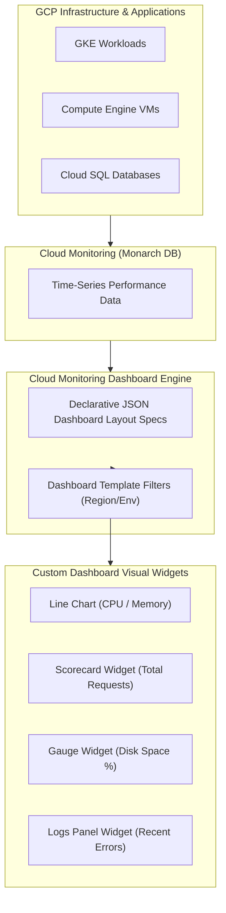

# Topic 96: Dashboards

---

## 1. What Is It?

**Google Cloud Monitoring Dashboards** provide customizable, real-time visual control panels that aggregate, format, and display system performance metrics, log-based metrics, application health indicators, and operational status widgets across GCP infrastructure and workloads.

Dashboards deliver four primary operational capabilities:
1. **Multi-Widget Visual Layouts**: Supports diverse visualization formats including line charts, stacked area graphs, bar charts, scorecards (single stats), gauges, text notes, and log tail widgets.
2. **Declarative Dashboard-as-Code**: Full JSON API representation allowing dashboards to be authored, versioned in Git repositories, and provisioned automatically via Terraform.
3. **Template Variables (Dashboard Filters)**: Interactive drop-down controls enabling SREs to filter entire multi-chart dashboards dynamically by environment, region, cluster, or instance group.
4. **Auto-Generated Infrastructure Dashboards**: Out-of-the-box pre-configured dashboards automatically created for every GCP service (GKE, Cloud Run, Cloud SQL, Compute Engine).

### Real-World Analogy
Think of Cloud Monitoring Dashboards like the cockpit instrument panel of a commercial airliner:
- **Raw Metrics (Engine Data Stream)**: Thousands of raw electrical impulses emitted by turbine sensors every second.
- **Cloud Monitoring Dashboards**: The organized cockpit display layout where pilots view altitude scorecards, fuel level gauges, radar sweeps, and engine temperature line charts in a single, high-contrast visual panel, allowing them to assess flight health at a glance.

---

## 2. Where Does It Fit?

Dashboards act as the primary operational visualization tier presenting underlying Monarch time-series data to engineering teams.



---

## 3. Core Concepts

| Concept | Description | Production Best Practice |
|---|---|---|
| **Scorecard Widget** | Single numerical value display (e.g., total active connections or current error rate). | Use scorecards at the top of dashboards for instant health assessments. |
| **Line / Stacked Area Chart** | Time-series trend visualization across time ranges. | Use line charts for rates and stacked area charts for resource allocations. |
| **Dashboard Filters** | Dynamic drop-down variables parameterizing queries across all widgets on a page. | Add standardized `project_id` and `zone` template variables. |
| **Dashboard JSON API** | Complete schema defining grid position, chart type, and query configuration. | Manage production dashboards as code in Git using Terraform. |
| **Mosaic Layout** | Flexible grid layout system supporting responsive widget positioning and sizing. | Group related widgets into collapsible sections (e.g., Compute, Storage, Networking). |

---

## 4. How It Works

Dashboard rendering and dynamic filtering operate deterministically:

```text
User opens Dashboard -> Dashboard Engine reads JSON Layout Spec
               ↓
User selects drop-down filter (e.g., region = "us-central1")
               ↓
Dashboard Engine injects filter values into all widget metric queries
               ↓
Executes parallel queries against Monarch DB -> Renders time-series charts in grid layout
```

1. **Auto-Refresh**: Dashboards continuously poll Cloud Monitoring APIs for fresh metric points, refreshing automatically every 1 to 5 minutes.
2. **Time Window Synchronization**: Changing the global time picker (e.g., "Last 1 Hour" to "Last 7 Days") instantly updates all charts on the dashboard simultaneously.

---

## 5. Production Scenario

### Terraform-Provisioned Golden Signals Microservice Dashboard

```text
Requirement: Provision a standardized "Four Golden Signals" (Latency, Traffic, Errors, Saturation) dashboard for a production GKE microservice using Terraform and JSON definitions.
    ↓
Architecture: Terraform `google_monitoring_dashboard` resource + JSON layout specification.
    ↓
Step 1: Create `dashboard.json` definition with Mosaic layout:
  - Top Row: 4 Scorecards (Avg Latency, Total Requests, 5xx Error Rate, Memory Usage %).
  - Middle Row: Line Chart (HTTP Requests per second grouped by response code).
  - Bottom Row: Line Chart (99th percentile request latency).
    ↓
Step 2: Declare Terraform resource (`main.tf`):
    resource "google_monitoring_dashboard" "app_dashboard" {
      dashboard_json = file("${path.module}/dashboard.json")
    }
    ↓
Step 3: Execute `terraform apply`.
    ↓
Result: Standardized, version-controlled observability dashboard deployed automatically alongside microservice infrastructure.
```

*Why Selected*: Demonstrates enterprise GitOps best practice of managing dashboards as code via IaC.

---

## 6. Hands-On Lab

### Prerequisites
- Active GCP Project with Cloud Monitoring API enabled.
- Cloud Shell or local machine with `gcloud` CLI installed.

### CLI Method

```bash
# 1. Environment configuration
export PROJECT_ID=$(gcloud config get-value project)

# 2. Enable Monitoring API
gcloud services enable monitoring.googleapis.com

# 3. Create dashboard JSON definition file
cat <<EOF > sample-dashboard.json
{
  "displayName": "GCE Infrastructure Health Overview",
  "gridLayout": {
    "columns": 2,
    "widgets": [
      {
        "title": "VM CPU Utilization (Mean)",
        "xyChart": {
          "dataSets": [
            {
              "timeSeriesQuery": {
                "timeSeriesFilter": {
                  "filter": "metric.type=\"compute.googleapis.com/instance/cpu/utilization\" resource.type=\"gce_instance\"",
                  "aggregation": {
                    "alignmentPeriod": "60s",
                    "perSeriesAligner": "ALIGN_MEAN"
                  }
                }
              }
            }
          ]
        }
      },
      {
        "title": "Active Disk Read Bytes",
        "xyChart": {
          "dataSets": [
            {
              "timeSeriesQuery": {
                "timeSeriesFilter": {
                  "filter": "metric.type=\"compute.googleapis.com/instance/disk/read_bytes_count\" resource.type=\"gce_instance\"",
                  "aggregation": {
                    "alignmentPeriod": "60s",
                    "perSeriesAligner": "ALIGN_RATE"
                  }
                }
              }
            }
          ]
        }
      }
    ]
  }
}
EOF

# 4. Deploy dashboard using gcloud CLI
gcloud monitoring dashboards create --config-from-file=sample-dashboard.json

# 5. List custom dashboards in the project
gcloud monitoring dashboards list
```

### Verification
Execute `gcloud monitoring dashboards list` and confirm `"GCE Infrastructure Health Overview"` is listed in the output.

### Cleanup

```bash
# Extract dashboard ID and delete
DASHBOARD_ID=$(gcloud monitoring dashboards list --format='value(name)' --filter='displayName="GCE Infrastructure Health Overview"')
gcloud monitoring dashboards delete ${DASHBOARD_ID} --quiet
rm -f sample-dashboard.json
```

---

## 7. Security

### Dashboard Access Controls
- **IAM Permission Boundaries**: Viewing dashboards requires `roles/monitoring.viewer`. Creating or editing dashboards requires `roles/monitoring.editor` or `roles/monitoring.admin`.
- **Public Dashboard Exposure Risk**: Cloud Monitoring Dashboards CANNOT be made publicly accessible without authentication. All viewers must possess valid GCP Identity credentials and IAM roles.

```text
BAD PRACTICE:
Sharing administrative GCP console login credentials to allow external vendors to view performance dashboards.

PRODUCTION PRACTICE:
Grant dedicated user accounts `roles/monitoring.viewer` restricted to the central Metrics Scoping project.
```

---

## 8. Scaling & High Availability

Dashboard performance scaling rules:

```text
Overcrowded Dashboard (50+ Complex PromQL Widgets -> High API Throttle -> Slow Browser Rendering)
                       ↓ (Dashboard Modularization)
Modular Layered Dashboards:
├── Executive Summary Dashboard (High-level Scorecards & System Status)
├── Service Deep-Dive Dashboard (SRE Operational Line Charts)
└── Troubleshooting Dashboard (Detailed Log Panels & Sub-system Spikes)
```

- **Widget Limit**: Limit individual dashboards to 20-30 widgets to maintain fast page load times and avoid browser memory degradation.

---

## 9. Cost

### Pricing Structure

| Feature | Cost Model | Note |
|---|---|---|
| **Dashboard Creation & Viewing** | 100% FREE | Creating, customizing, and viewing dashboards incurs zero charges. |
| **API Queries Executed by Widgets** | Free | Interactive dashboard auto-refresh queries are included free. |

---

## 10. Monitoring & Troubleshooting

### Visual Debugging & Layout Maintenance
- **Dashboard Preview**: Use the GCP Console visual drag-and-drop editor to construct initial layouts, then export the raw JSON for IaC code storage.
- **Log Panel Association**: Embed Logs Panel widgets directly onto dashboards to inspect matching error logs alongside metric latency spikes.

### Troubleshooting Matrix

| Symptom | Cause | Resolution |
|---|---|---|
| Widgets show "No data available" | Filter scope excludes active instances or region mismatch | Check global dashboard filter drop-downs for incorrect values. |
| Dashboard creation fails via Terraform | JSON schema syntax error or invalid metric filter string | Validate JSON file using `gcloud monitoring dashboards create --config-from-file` locally. |
| Slow dashboard rendering | Excessive number of complex PromQL queries on a single page | Split large dashboards into smaller modular dashboards. |

---

## 11. Common Mistakes

```text
Mistake: Manually creating and editing production dashboards exclusively through the GCP Console web interface.
Why: Quick drag-and-drop visual editing.
Impact: Creates configuration drift; accidental deletions or modifications cannot be rolled back without version control.
Correct Approach: Author and store dashboard definitions as JSON files in Git and deploy via Terraform.

Mistake: Placing dozens of un-grouped, un-filtered charts on a single massive dashboard page.
Why: Attempting to monitor all infrastructure components in one place.
Impact: Overwhelms engineers during outages and causes browser rendering lag.
Correct Approach: Use Collapsible Groups and Template Filters to organize widgets cleanly.
```

---

## 12. Production Best Practices

- [ ] Manage production dashboards as **JSON code in Git** using Terraform.
- [ ] Align dashboard layouts to SRE **"Four Golden Signals"** (Latency, Traffic, Errors, Saturation).
- [ ] Place high-level **Scorecard Widgets** at the top of the dashboard for instant health status.
- [ ] Implement **Template Variables** (Filters) for multi-environment drop-down switching.
- [ ] Group related widgets into **Collapsible Sections**.
- [ ] Embed **Logs Panels** alongside metric charts for rapid root-cause analysis.

---

## 13. Hyperscaler / Enterprise Perspective

```text
Personal / Learning
  Console Drag-and-Drop → Single Chart Page → Default System Metrics
        ↓
Small Production
  Custom Metric Widgets → Scorecards + Line Charts → Manual Export JSON
        ↓
Enterprise Environment
  Terraform Provisioned Dashboards → Template Filter Variables → Four Golden Signals Architecture
        ↓
Hyperscaler Environment
  Automated CI/CD Dashboard Deployment Pipelines → Cross-Cloud Grafana Enterprise Dashboards → Automated Incident Response Playbook Links
```

Enterprise hyperscalers embed direct hyperlinks into dashboard text widgets pointing directly to automated **Incident Runbooks** and PagerDuty escalations, accelerating Mean Time to Resolution (MTTR) during critical outages.

---

## 14. Real Project Questions

### Q1: What is the primary benefit of managing Cloud Monitoring Dashboards using Terraform rather than the GCP Console UI?
**Answer:** Managing dashboards as code (`google_monitoring_dashboard`) using Terraform enables version control in Git, code reviews, automated CI/CD deployment, zero configuration drift, and instant duplication of standardized observability dashboards across multiple GCP projects.

### Q2: What are the SRE "Four Golden Signals" and how should they be arranged on a dashboard?
**Answer:** The Four Golden Signals are **Latency**, **Traffic**, **Errors**, and **Saturation**. Production dashboards should place high-level Scorecards and error/latency summary charts at the very top for instant status checking, followed by detailed traffic and saturation breakdown charts below.

### Q3: How do Dashboard Template Variables improve SRE incident response workflows?
**Answer:** Template Variables add dynamic drop-down filters (e.g., `environment`, `cluster_name`, `region`) at the top of a dashboard. Selecting a value dynamically updates the queries of all widgets on the page, allowing engineers to isolate performance anomalies in a specific cluster or region instantly without editing code.

---

## 15. Quick Decision Guide

| Visual Requirement | Recommended Widget Type | Advantage |
|---|---|---|
| Single Number Health Metric (e.g., Current 5xx Rate) | Scorecard Widget | Instant visual callout with optional threshold color coding. |
| Time-Series Performance Over Time | Line Chart / Stacked Area | Clear visual trend analysis and rate calculation. |
| Real-time Incident Error Logs | Logs Panel Widget | Streams live error logs alongside performance metrics. |

### When to Use Dashboards
- Essential for operational NOC rooms, SRE service health monitoring, executive status summaries, and post-mortem investigations.

### When NOT to Use Dashboards
- Triggering automated real-time alerts or PagerDuty pages (use Alerting Policies instead).

---

## 16. Related Services

```text
                    [96. Dashboards]
                   /        |        \
        Metrics Explorer  Terraform   Cloud Logging
        (Query Source)   (IaC Engine) (Logs Widget)
               |            |              |
         Provides Chart   Deploys JSON   Streams Logs
         Definitions      Layouts        to Dashboards
```

- **Metrics Explorer**: Query builder used to generate chart definitions for dashboards.
- **Terraform**: Infrastructure-as-Code tool provisioning dashboard JSON files.
- **Cloud Logging**: Source engine powering embedded Logs Panel widgets.

---

## 17. Cheat Sheet

### Common gcloud Dashboard Commands

```bash
# List all dashboards in the current project
gcloud monitoring dashboards list

# Describe a specific dashboard configuration in JSON
gcloud monitoring dashboards describe DASHBOARD_ID --format=json

# Create a dashboard from a JSON file
gcloud monitoring dashboards create --config-from-file=my-dashboard.json

# Delete a dashboard
gcloud monitoring dashboards delete DASHBOARD_ID
```

---

## 18. Learning Connection

- **Previous Topic**: [95. Metrics Explorer](../95-metrics-explorer/README.md)
- **Next Topic**: [97. Alerting Policies](../97-alerting-policies/README.md)
