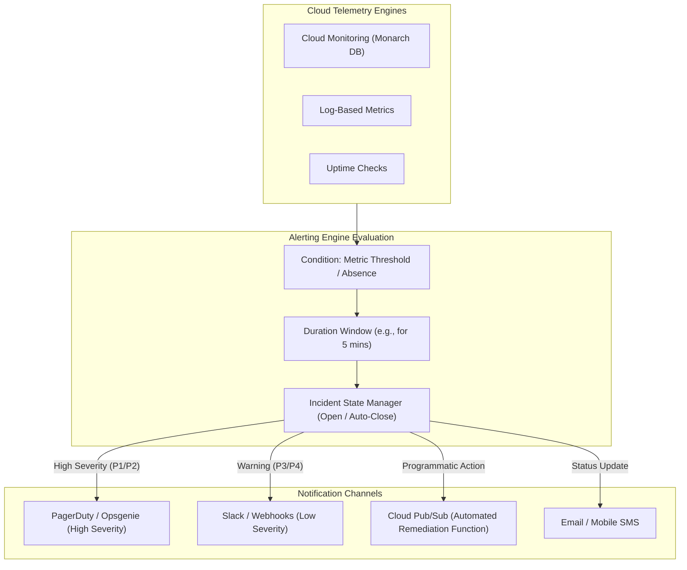

# Topic 97: Alerting Policies

---

## 1. What Is It?

**Google Cloud Monitoring Alerting Policies** provide the automated incident detection, threshold evaluation, and multi-channel notification engine on Google Cloud Platform. They continuously monitor metric streams, log occurrences, uptime checks, and synthetic probes, automatically triggering operational incidents when system performance violates defined health boundaries.

Alerting Policies deliver four core operational features:
1. **Declarative Condition Triggers**: Flexible rules evaluating threshold breaches (e.g., CPU > 85%), metric absence (e.g., missing heartbeats), or forecast rate breaches.
2. **Multi-Channel Notification Sinks**: Automated alert dispatch to PagerDuty, Slack, Webhooks, Cloud Pub/Sub, Email, and the Google Cloud Mobile App.
3. **Incident Management Lifecycle**: Automatic incident state management (Open, Acknowledged, Closed) with built-in auto-close timers to resolve transient spikes.
4. **Documentation & Runbook Linking**: Embeds markdown-formatted instructions, diagnostic links, and emergency playbook procedures directly into incident payloads.

### Real-World Analogy
Think of Alerting Policies like a automated fire suppression and alarm system in a high-rise building:
- **Metrics (Smoke & Heat Sensors)**: Temperature sensors installed throughout every floor continuously reporting temperature readings.
- **Alerting Policy (Central Control Unit)**: Evaluates sensor readings against safety rules: "If smoke density exceeds 10 ppm for longer than 30 seconds (Condition), trip the alarm."
- **Notification Channels (Strobe Lights, Sirens & Dispatch)**: Automatically rings local alarm bells (Slack), dials the city fire department (PagerDuty), and sends an automated SMS alert to the building manager (Email) with precise floor instructions (Runbook Documentation).

---

## 2. Where Does It Fit?

Alerting Policies act as the automated bridge between real-time metric streams and engineering incident response teams.



---

## 3. Core Concepts

| Concept | Description | Production Best Practice |
|---|---|---|
| **Condition** | The metric, filter, threshold value, and aggregation function defining an unhealthy state. | Avoid zero-duration thresholds; use 3-5 minute alignment windows to smooth transient spikes. |
| **Duration (`for`)** | Time window that a condition must continuously remain violated before triggering an alert. | Set `for >= 5m` for CPU/Memory to prevent alert fatigue from transient spikes. |
| **Notification Channel** | Configured communication endpoint (PagerDuty, Slack, Email, Pub/Sub) receiving alert payloads. | Separate notification channels by severity (PagerDuty for P1, Slack for P3). |
| **Auto-Close Period** | Time duration after which an unacknowledged incident automatically closes if the metric recovers. | Set auto-close to 7 days for persistent visibility. |
| **Alert Strategy / Snooze** | Features allowing temporary suppression of alerts during scheduled maintenance windows. | Create Snooze schedules during planned deployment maintenance windows. |

---

## 4. How It Works

Incident evaluation and notification execution proceed through a deterministic lifecycle:

```text
Monarch DB ingests performance metric stream
               ↓
Alerting Engine evaluates condition (e.g., CPU > 90% for 5 mins)
               ↓
Threshold violated continuously for 5 mins -> Incident State = OPEN
               ↓
Dispatches payload with Runbook Markdown to PagerDuty & Slack
               ↓
Metric drops below threshold (CPU < 90%) -> Incident State = CLOSED -> Dispatches Recovery Notice
```

1. **Re-notification Frequency**: Configure optional re-notification intervals (e.g., every 30 minutes) for un-acknowledged critical P1 incidents.
2. **Programmatic Remediation**: Routing alert notifications to a **Cloud Pub/Sub** topic enables Cloud Functions or Cloud Run to execute automated self-healing scripts (e.g., restarting frozen instances or clearing temp caches).

---

## 5. Production Scenario

### PagerDuty P1 Alerting Policy for High Cloud SQL Memory & Automated Slack Warnings

```text
Requirement: Establish an enterprise alerting policy that pages the On-Call SRE team via PagerDuty when Cloud SQL memory exceeds 90% for 5 minutes, while routing warnings (>75%) to Slack.
    ↓
Architecture: Terraform + Cloud Monitoring Alerting Policy + PagerDuty / Slack Channels.
    ↓
Step 1: Configure PagerDuty & Slack Notification Channels in Terraform.
Step 2: Create Warning Alerting Policy (Slack):
    Condition: `cloudsql.googleapis.com/database/memory/utilization > 0.75` for 300s.
    Target Channel: `#gcp-alerts-warning` (Slack).
    ↓
Step 3: Create Critical Alerting Policy (PagerDuty):
    Condition: `cloudsql.googleapis.com/database/memory/utilization > 0.90` for 300s.
    Target Channel: `PagerDuty-SRE-Service`.
    Documentation: "CRITICAL: Database near OOM. Follow runbook: https://wiki.co/db-oom".
    ↓
Result: Eliminates PagerDuty alert fatigue for minor warnings while guaranteeing instant escalation for impending database crashes.
```

*Why Selected*: Illustrates multi-tiered severity alerting and operational runbook linking.

---

## 6. Hands-On Lab

### Prerequisites
- Active GCP Project with Cloud Monitoring API enabled.
- Cloud Shell or local machine with `gcloud` CLI installed.

### CLI Method

```bash
# 1. Environment configuration
export PROJECT_ID=$(gcloud config get-value project)

# 2. Enable Monitoring API
gcloud services enable monitoring.googleapis.com

# 3. Create an Email Notification Channel
CHANNEL_ID=$(gcloud alpha monitoring channels create \
  --display-name="SRE On-Call Email" \
  --type="email" \
  --channel-labels="email_address=sre-team@example.com" \
  --format='value(name)')

echo "Created Notification Channel: ${CHANNEL_ID}"

# 4. Create Alerting Policy JSON definition
cat <<EOF > high-cpu-policy.json
{
  "displayName": "High CPU Utilization Alert (>80%)",
  "documentation": {
    "content": "VM CPU utilization has exceeded 80% for 5 minutes. Check active processes using SSH.",
    "mimeType": "text/markdown"
  },
  "userLabels": {
    "severity": "warning"
  },
  "conditions": [
    {
      "displayName": "VM Instance CPU > 80%",
      "conditionThreshold": {
        "filter": "metric.type=\"compute.googleapis.com/instance/cpu/utilization\" AND resource.type=\"gce_instance\"",
        "comparison": "COMPARISON_GT",
        "thresholdValue": 0.8,
        "duration": "300s",
        "aggregations": [
          {
            "alignmentPeriod": "60s",
            "perSeriesAligner": "ALIGN_MEAN"
          }
        ]
      }
    }
  ],
  "notificationChannels": [
    "${CHANNEL_ID}"
  ],
  "combiner": "OR",
  "enabled": true
}
EOF

# 5. Deploy Alerting Policy using gcloud
gcloud alpha monitoring policies create --policy-from-file=high-cpu-policy.json

# 6. List active policies in the project
gcloud alpha monitoring policies list
```

### Verification
Execute `gcloud alpha monitoring policies list` and verify `"High CPU Utilization Alert (>80%)"` is listed as enabled.

### Cleanup

```bash
POLICY_ID=$(gcloud alpha monitoring policies list --filter='displayName="High CPU Utilization Alert (>80%)"' --format='value(name)')
gcloud alpha monitoring policies delete ${POLICY_ID} --quiet
gcloud alpha monitoring channels delete ${CHANNEL_ID} --quiet
rm -f high-cpu-policy.json
```

---

## 7. Security

### Alerting Policy IAM Security
- **Channel Access Restrictions**: Notification channels containing sensitive webhooks or emails should be managed exclusively by SRE administrators (`roles/monitoring.admin`).
- **Webhook Authentication**: When alerting to custom external webhooks, use secret tokens or basic auth credentials stored in Secret Manager to prevent malicious fake alert injection.

```text
BAD PRACTICE:
Exposing un-authenticated public HTTP webhooks as alerting notification targets.

PRODUCTION PRACTICE:
Secure webhook channels using HTTPS endpoints with bearer token authentication, managed via Terraform and Secret Manager.
```

---

## 8. Scaling & High Availability

Alerting Policy optimization and alert noise reduction:

```text
Flapping Metric (Bounces around 80% threshold -> Fires 50 alerts in 1 hour -> Alert Fatigue)
                      ↓ (Alert Smoothing Architecture)
Smoothed Alert Condition:
├── Duration Window: Require metric to stay > 80% continuously for 5 minutes
├── Evaluation Missing Data: MUTE_ALARM (Prevents false positives on node reboots)
└── Re-notification Interval: Suppress repeat alerts for 60 minutes
```

- **Mute Alerts during Deployments**: Use the Cloud Monitoring **Snooze API** to automatically suppress alerts during scheduled maintenance windows or CI/CD deployment jobs.

---

## 9. Cost

### Pricing Structure

| Alerting Feature | Cost Model | Note |
|---|---|---|
| **Alerting Policies & Evaluation** | 100% FREE | Evaluating conditions and firing alerts incurs zero charges. |
| **Notification Dispatches** | FREE | Email, PagerDuty, Slack, and Pub/Sub notifications are free. |

---

## 10. Monitoring & Troubleshooting

### Incident Debugging & Logs
- **Incident History View**: Review historical incident event logs in Cloud Console to inspect exact trigger timestamps and metric values.
- **Snooze Verification**: Check active Snooze schedules if expected alerts fail to fire during testing.

### Troubleshooting Matrix

| Symptom | Cause | Resolution |
|---|---|---|
| Alert fires constantly on transient spikes | Duration (`for`) window set to 0 seconds | Increase condition duration window to `300s` (5 minutes). |
| Notification email not received | Notification channel unconfirmed or spam filtered | Verify email address and confirm channel in Cloud Console UI. |
| False alerts when VMs shut down | Missing data interpreted as threshold breach | Set "Evaluation of missing data" setting to `NEVER_FIRE` or `MUTE`. |

---

## 11. Common Mistakes

```text
Mistake: Setting alerting durations to `0s` (Instant trigger).
Why: Wanting immediate notification of any spike.
Impact: Creates severe "alert fatigue", spamming engineers with hundreds of false alarms caused by brief 2-second CPU bursts.
Correct Approach: Always set a reasonable duration window (e.g., 3-5 minutes) for metric threshold conditions.

Mistake: Omitting documentation and runbook URLs from alerting policy payloads.
Why: Keeping alerting policy definitions minimal.
Impact: Engineers woken up at 3:00 AM spend precious minutes searching for troubleshooting steps.
Correct Approach: Include clear markdown documentation and explicit links to incident runbooks in every alerting policy.
```

---

## 12. Production Best Practices

- [ ] Manage Alerting Policies as code using **Terraform**.
- [ ] Differentiate notification channels by **Severity** (PagerDuty for P1/Critical, Slack for P3/Warning).
- [ ] Set condition duration windows to at least **3-5 minutes** to eliminate false positive spikes.
- [ ] Include detailed **Markdown Runbook Instructions** in alerting policy documentation fields.
- [ ] Configure **Auto-Close Durations** to resolve transient incidents automatically.
- [ ] Utilize **Snooze Schedules** to suppress notifications during planned maintenance.

---

## 13. Hyperscaler / Enterprise Perspective

```text
Personal / Learning
  Console Web UI → Single Metric > 90% → Email Notification
        ↓
Small Production
  Terraform Policies → PagerDuty Integration → 5-Minute Duration Windows
        ↓
Enterprise Environment
  Multi-Tier Severity Routing → Markdown Runbook Embeds → Pub/Sub Automated Self-Healing
        ↓
Hyperscaler Environment
  SLO Burn Rate Alerting Policies → Sloth/PromQL Error Budget Tracking → Automated Snooze CI/CD Maintenance Integrations
```

Enterprise hyperscalers deploy **SLO Burn Rate Alerting Policies**, calculating how fast a service is consuming its monthly Error Budget rather than alerting on raw static thresholds.

---

## 14. Real Project Questions

### Q1: What is "Alert Fatigue" and how do you design Alerting Policies to prevent it?
**Answer:** Alert Fatigue occurs when engineers are flooded with non-actionable or false-positive alarms, causing them to ignore critical incidents. It is prevented by enforcing duration windows (e.g., requiring a threshold breach to persist for 5+ minutes), using Snooze schedules during deployments, and routing low-severity warnings to Slack while reserving PagerDuty strictly for actionable P1 outages.

### Q2: How can Cloud Monitoring Alerting Policies trigger automated self-healing scripts?
**Answer:** By configuring a **Cloud Pub/Sub Notification Channel**. When an alerting policy fires, it publishes an incident JSON payload to a Pub/Sub topic. A Cloud Function or Cloud Run service subscribed to that topic parses the incident payload and executes automated remediation actions (e.g., restarting an instance group or flushing caches).

### Q3: Why is SLO Burn Rate alerting superior to static threshold alerting for enterprise applications?
**Answer:** Static threshold alerts (e.g., CPU > 80%) fire regardless of whether customer experience is impacted. **SLO Burn Rate Alerting** calculates the consumption rate of a service's Error Budget. It only alerts SREs if an outage is consuming the error budget so rapidly that the service will violate its monthly SLA commitment, focusing strictly on user-impacting availability.

---

## 15. Quick Decision Guide

| Operational Incident Type | Recommended Notification Channel | Advantage |
|---|---|---|
| Critical Production Outage (P1) | PagerDuty / Opsgenie | Direct phone/SMS escalation to on-call SRE. |
| Non-Urgent Resource Warning (P3) | Slack / Microsoft Teams | High visibility for team review without waking engineers. |
| Automated Infrastructure Remediation | Cloud Pub/Sub Topic | Programmatic execution of Cloud Functions self-healing scripts. |

### When to Use Alerting Policies
- Mandatory for real-time automated incident detection, SLA monitoring, and operational paging.

### When NOT to Use Alerting Policies
- One-off metric exploration or visual trend analysis (use Metrics Explorer or Dashboards).

---

## 16. Related Services

```text
               [97. Alerting Policies]
              /           |           \
     Cloud Monitoring  PagerDuty    Cloud Pub/Sub
    (Evaluates Rules) (SRE Paging)  (Auto-Healing)
          |               |               |
     Detects Threshold  Alerts On-Call  Triggers Cloud Run
     Breaches           Engineers       Remediation Scripts
```

- **Cloud Monitoring**: Underlying time-series engine evaluating alert conditions.
- **PagerDuty**: Third-party incident response platform receiving critical alert pages.
- **Cloud Pub/Sub**: Message bus receiving alert payloads for programmatic automation.

---

## 17. Cheat Sheet

### Useful gcloud Alerting Commands

```bash
# List active alerting policies
gcloud alpha monitoring policies list

# Disable an alerting policy temporarily
gcloud alpha monitoring policies update POLICY_ID --no-enabled

# List notification channels
gcloud alpha monitoring channels list

# Create a Snooze window suppressing alerts for 2 hours
gcloud alpha monitoring snoozes create \
  --display-name="Deploy Maintenance Window" \
  --filter='resource.type="gce_instance"' \
  --start-time=$(date -u +%Y-%m-%dT%H:%M:%SZ) \
  --end-time=$(date -u -d '2 hours' +%Y-%m-%dT%H:%M:%SZ)
```

---

## 18. Learning Connection

- **Previous Topic**: [96. Dashboards](../96-dashboards/README.md)
- **Next Topic**: [98. Uptime Checks](../98-uptime-checks/README.md)
